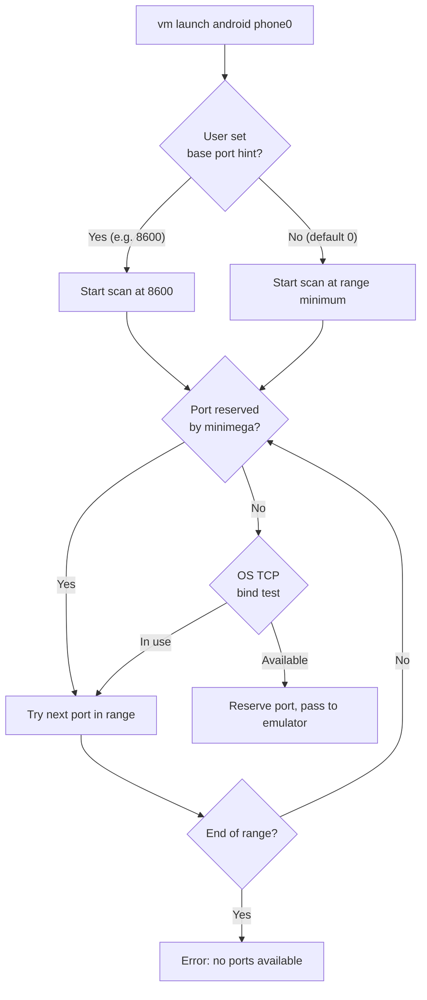
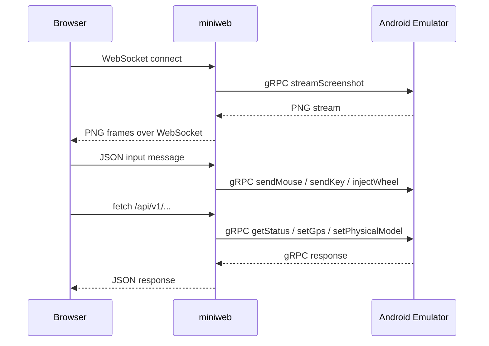

# Android VMs

minimega supports launching Android Emulator instances as first-class virtual
machines alongside KVM and container VMs. Android VMs run the official Android
Emulator under QEMU/KVM and integrate with minimega's networking, lifecycle
management, and web console infrastructure.

The emulator's gRPC interface provides display streaming, input injection
(mouse, keyboard, scroll), hardware button control, GPS simulation,
orientation changes, and screenshot capture — all accessible through miniweb
without any additional gateway or proxy services.

## Prerequisites

Android VMs require the following on each minimega host:

- **KVM** — the `kvm` kernel module must be loaded
- **Android SDK** — a local Android SDK installation containing the emulator
  and platform tools
- **Android Emulator** — the `emulator` binary (typically at
  `<sdk>/emulator/emulator`)
- **ADB** — the `adb` binary (typically at `<sdk>/platform-tools/adb`)
- **AVD** — a pre-created Android Virtual Device (AVD) image; create one with
  `avdmanager` or Android Studio

## Configuration

Android VMs are configured using `vm config` parameters prefixed with
`android-`. See the [minimega API](../reference/minimega.md) for full
documentation on each parameter.

### Required configuration

- `android-avd` — the AVD name to boot (must match an AVD directory entry)

### Optional configuration

- `android-sdk` — path to the Android SDK root directory on the host
- `android-emulator` — path or name of the emulator binary (default: `emulator`
  on `PATH`)
- `android-adb` — path or name of the adb binary (default: `adb` on `PATH`)
- `android-avd-dir` — directory containing AVD data
  (`<avd-dir>/<avd-name>.avd`)
- `android-no-window` — suppress the local emulator GUI window (default: true)
- `android-console-base-port` — preferred starting console port; must be an
  even port in the range 5554–5680, or 0 to auto-assign (default: 0)
- `android-extra-args` — additional raw arguments for the emulator command line
- `android-writable-system` — enable writable system partition (default: false)
- `android-grpc-base-port` — preferred starting gRPC port for emulator
  communication; must be a port in the range 8554–8617, or 0 to auto-assign
  (default: 0)

## Launching Android VMs

Configure the VM and launch it with `vm launch android`:

```minimega
vm config android-sdk /opt/android-sdk
vm config android-avd Pixel_9a
vm config networks 100
vm launch android phone0
vm start phone0
```

The emulator boots in the background. minimega manages the emulator process
lifecycle, monitors its state via QMP, and exposes the console and ADB ports
through `vm info`:

```minimega
minimega$ .columns name,state,type,android_avd,android_console_port,android_adb_port,android_serial,android_grpc_port vm info
host  | name   | state    | type    | android_avd | android_console_port | android_adb_port | android_serial  | android_grpc_port
node0 | phone0 | RUNNING  | android | Pixel_9a    | 5554                 | 5555              | emulator-5554   | 8554
```

Each Android VM consumes one console/ADB port pair from the range 5554–5681
and one gRPC port from the range 8554–8617.
A single minimega host can run up to 64 Android VMs concurrently.

### Port auto-assignment

Both the console/ADB ports and the gRPC port are auto-assigned at launch time
using a hint-based system. The `android-console-base-port` and
`android-grpc-base-port` parameters let you suggest a preferred starting port;
if the requested port is unavailable, minimega scans forward through the range
until it finds a free one.



Each candidate port is checked against an in-memory reservation map (to avoid
conflicts with other minimega Android VMs) and an OS-level TCP bind test (to
avoid conflicts with non-minimega processes). The assigned ports are visible in
`vm info` and are released when the VM exits or is killed.

| Port type | Range | Step | Config hint parameter |
|---|---|---|---|
| Console/ADB pair | 5554–5681 (even/odd) | 2 | `android-console-base-port` |
| gRPC | 8554–8617 | 1 | `android-grpc-base-port` |

`host androidvms` reports how many Android VMs a host is currently running
against its 64-VM limit.

## Networking

Interfaces come from `vm config networks` like any other VM, but the Android
emulator's QEMU backend does not support minimega's default `e1000` NIC, so
minimega attaches each tap with the `virtio-net-pci` driver instead. The guest
sees every tap as an additional interface (`eth1` for the first one) with no
address configured: minimega only creates the host-side tap, bridge, and VLAN
plumbing, and does not configure guest IP addresses, policy routing, or
firewall rules. Set those inside the guest, for example over `adb shell`, or
from your orchestration layer.

`vm net connect` and `vm net disconnect` move or detach the host-side tap
without touching the guest. `vm net add` creates the tap and hot-adds the QEMU
device, but the Android guest may not enumerate the new PCI device on its own;
run `echo 1 > /sys/bus/pci/rescan` as root in the guest and then configure the
new interface.

## Web console (miniweb)

miniweb serves a browser-based console for Android VMs at
`/vm/<name>/connect/`. The console provides:

- **Live display** — PNG frames streamed from the emulator via gRPC
  `streamScreenshot`, delivered to the browser over a WebSocket
- **Mouse input** — click and drag mapped to emulator pointer events
- **Keyboard input** — key events forwarded when the display area is focused
- **Scroll/wheel** — mouse wheel and trackpad gestures sent via gRPC
  `injectWheel`
- **Hardware buttons** — Back, Home, Recents, Power, Volume Up/Down
- **Landscape toggle** — rotates the emulator orientation via gRPC
  `setPhysicalModel(ROTATION)`
- **GPS** — set coordinates from presets or custom lat/lng values

The console is a single static HTML page (`web/android.html`) with vanilla
JavaScript — no build toolchain, no React, no Node.js runtime dependency.

### Architecture



All browser traffic flows through miniweb's VM-scoped routes. The browser never
connects directly to the emulator gRPC port.

## Screenshots

Android VM screenshots are available through miniweb at
`/vm/<name>/screenshot.png`, which the tile view uses. They are fetched
directly from the emulator via gRPC `getScreenshot` and returned as PNG. The
`vm screenshot` command does not support Android VMs yet and returns an
error.

The optional `size` query parameter controls the maximum dimension (width or
height) of the returned image:

```text
/vm/phone0/screenshot.png?size=300
```

## API routes

All routes are scoped under `/vm/<name>/`:

| Route | Method | Description |
|---|---|---|
| `connect/` | GET | Serves the Android console HTML page |
| `android/display/ws` | WebSocket | Live display streaming and input |
| `android/api/v1/emulator/status` | GET | Emulator status (version, uptime, booted, resolution) |
| `android/api/v1/emulator/gps` | POST | Set GPS coordinates (`{latitude, longitude, altitude}`) |
| `android/api/v1/emulator/rotation` | POST | Set orientation (`{landscape: true\|false}`) |
| `screenshot.png` | GET | Single PNG screenshot (optional `?size=N`) |

## Limitations

- **No save** — `vm save` is not supported for Android VMs, and `ns save`
  records their configuration only; emulator runtime state, AVD data changes,
  and guest network configuration are not captured. See
  [Saving and restoring experiments](save-restore.md)
- **No audio** — the emulator's audio output is not streamed to the browser
- **No touch input** — browser touch events (e.g. on tablets or touchscreens)
  are not yet wired to the emulator; use mouse and keyboard instead
- **No clipboard** — copy/paste between host and emulator is not available
  through the web console
- **No multi-display** — only the primary display is streamed
- **Frame rate** — display updates depend on gRPC streaming throughput; expect
  approximately 10–30 FPS depending on resolution and network conditions

## Troubleshooting

**Console shows "Connecting..." indefinitely**

- Verify `vm info` shows a non-empty `android_grpc_port` column (the port is
  auto-assigned at launch)
- Verify the emulator has fully booted (`vm info` state should be `RUNNING`)
- Check that the gRPC port is reachable from the miniweb host (firewalls,
  network segmentation)

**Screenshot returns 404**

- The emulator must be running and have a gRPC port assigned
- Check miniweb logs for gRPC connection errors

**Input not responding**

- Click the display area to focus it (keyboard input requires focus)
- Ensure the emulator is in the `RUNNING` state and has finished booting

**Emulator fails to start**

- Verify KVM is available: `lsmod | grep kvm`
- Verify the AVD exists: check that `<avd-dir>/<avd-name>.avd/` is present
- Check `android-emulator.log` in the VM instance directory for detailed
  errors

## See also

- [Virtual machine types](vmtypes.md)
- [VM lifecycle](vm-lifecycle.md)
- [VM configuration reference](vm-config-reference.md#android) for every
  `android-` field
- [miniweb](miniweb.md)
- Reference: [`vm launch`](../reference/minimega.md#vm-launch),
  [`vm net`](../reference/minimega.md#vm-net),
  [`vm config android-avd`](../reference/minimega.md#vm-config-android-avd)
