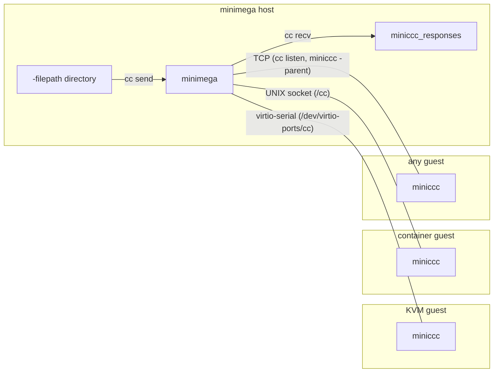

# Command and control

The command and control (cc) API lets you run programs on VMs, move files in
and out of them, open TCP tunnels through them, and mount their filesystems on
the host, all from the minimega prompt and without any experiment network in
place. It has two halves: the `cc` commands in minimega and the miniccc agent
that runs inside each guest.

This page assumes a running minimega and at least one VM whose image contains
miniccc. The stock vmbetter configs (`miniccc.conf`,
`miniccc_container.conf`) build such images; see
[Building images with vmbetter](vmbetter.md). Windows guests need extra
setup, covered in [Windows guests](windows.md).

## How it works

Every VM with `vm config backchannel true` (the default) gets a dedicated
channel to the minimega instance running it. KVM VMs get a virtio-serial port
named `cc`; containers get a UNIX domain socket. miniccc opens that channel
from inside the guest and speaks a small gob-encoded protocol over it. The
guest needs no IP address for any of this to work, which is what makes cc
useful for bootstrapping an experiment.



Commands are queued in minimega and delivered to clients in creation order,
so you can chain "send a file, run it, fetch its output" and know the steps
happen in sequence. A command stays queued until you delete it: a client that
reboots, or a VM launched later, receives every command that matches its
filter. Use `exec-once` and `background-once` for commands that must run on
each client only once. Clients report a heartbeat every five seconds; minimega
marks a client that has been silent for 30 seconds inactive, which is what the
`cc_active` column of `vm info` shows.

The connection is namespace aware. Each namespace has its own cc server,
command list, filter, prefix and response directory, and `cc` commands run
against the active namespace across every host in it.

## Running miniccc

miniccc is a single static binary with the same flags on Linux and Windows,
plus `-tag` on Linux and `-install` on Windows:

| Flag | Meaning |
|---|---|
| `-serial <device>` | Connect over the virtio-serial port instead of TCP. |
| `-parent <host or path>` | Host running minimega (TCP) or socket path (`-family unix`). |
| `-port <n>` | TCP port to connect to (default 9002). |
| `-family tcp\|unix` | Dial family for `-parent` (default `tcp`). |
| `-path <dir>` | Where miniccc keeps its state, received files and PID file (default `/tmp/miniccc`). |
| `-uuid <uuid>` | Override the UUID the client reports. |
| `-pipe <name>` | Attach standard input and output to a minimega named pipe, then exit. |
| `-tag <key> <value>` | Set a VM tag through a running miniccc, then exit (Linux only). |
| `-level`, `-logfile`, `-v` | Logging, as for every minimega tool. |
| `-version` | Print the version and exit. |

### Serial (KVM guests)

On Linux the port appears as `/dev/virtio-ports/cc`; on Windows it is
`\\.\Global\cc`. The stock miniccc image starts the agent from its init
script:

```bash
/miniccc -v=false -serial /dev/virtio-ports/cc -logfile /miniccc.log &
```

miniccc reads the VM's UUID from `/sys/devices/virtual/dmi/id/product_uuid`.
A serial client that cannot read a UUID is bound to the VM that owns the port,
because minimega knows which VM it dialled. If you name one of your own
`vm config virtio-ports` ports `cc` it collides with the backchannel: minimega
only logs a warning, but QEMU is handed two ports named `cc` and refuses to
start the VM.

If the guest loses the host, for example because minimega restarted, miniccc
closes the port and dials again every 15 seconds for up to two hours before
giving up. On the host side minimega re-dials the port as long as the VM
exists, so a restarted agent reconnects on its own.

### UNIX socket (containers)

minimega listens on a socket inside every container's filesystem, and the
container image's init runs:

```bash
miniccc -family unix -parent /cc -logfile /miniccc.log
```

### TCP (any guest)

TCP mode is for guests that cannot use the serial device, such as bare-metal
nodes or images you do not control at the device level. The guest has to
reach the minimega host over some routable path, typically a `tap` with an IP
on the experiment VLAN (see [Host networking](networking.md)). minimega does
not listen for TCP clients until you ask it to, once per namespace:

```minimega
minimega$ cc listen 9002
```

Then in the guest:

```bash
miniccc -parent 10.0.0.1
```

A TCP client must present a UUID that matches a VM in the namespace or the
handshake is rejected with `unregistered client`. Guests without a DMI UUID
must pass `-uuid` with the VM's UUID from `vm info`.

!!! warning "TCP mode is not authenticated"
    The serial and UNIX socket transports are host-only and cannot be reached
    from the experiment network. A TCP listener accepts any client that knows
    a valid VM UUID. See [Security considerations](security.md).

### Windows service

`miniccc.exe -install auto-start` (or `manual-start`) registers a Windows
service named `miniccc`, display name "minimega Agent", that runs
`miniccc.exe -serial \\.\Global\cc` with whatever `-logfile` and `-level`
you passed at install time, and configures the service to restart five
seconds after a failure. That restart is how Windows guests reconnect: on
losing the host the agent exits instead of re-dialling, because Windows
refuses to reopen the virtual serial port from the same process. If you run
`miniccc.exe` interactively instead, you restart it by hand. The full guest
setup, including the virtio drivers the port depends on, is in
[Windows guests](windows.md).

!!! warning "Keep miniccc and minimega at the same version"
    The cc protocol is not stable across releases. When a client's build
    differs from the server's, minimega logs
    `mismatched miniccc version on <hostname>: <revision>` at handshake and
    carries on, but commands may be dropped or misreported. Clients built
    before the current heartbeat protocol are refused with
    `miniccc client too old -- please update`. Rebuild your images with the
    miniccc from the release you run.

## Clients

Clients report their UUID, hostname, OS, architecture, IPs and MACs on every
heartbeat, so an address change shows up within seconds.

```minimega title="clients.mm"
--8<-- "articles/cc/clients.mm"
```

[Download this example](cc/clients.mm){ download="clients.mm" }

`cc` on its own prints the number of connected clients.

## Executing commands

`cc exec` queues a command for every client that matches the current filter.
Quote arguments that contain spaces or characters minimega would otherwise
interpret. The response is not printed; it is written under the response
directory and read back with `cc responses`.

```minimega title="exec.mm"
--8<-- "articles/cc/exec.mm"
```

[Download this example](cc/exec.mm){ download="exec.mm" }

`cc commands` lists every queued command with its id, prefix, how many clients
have responded, whether it is backgrounded or once-only, the files it sends and
receives, and the filter it was created under. Command ids are the handle for
everything else: responses, exit codes and deletion.

A command name that is not on the guest's `PATH` is also looked up in
miniccc's `files` directory, so a script sent with `cc send` can be executed by
name if it is executable.

### Background commands

`cc background` starts the program and moves on to the next command without
waiting for it to exit. Use it for daemons, traffic generators and anything
else that does not return. Background commands record no exit code, and
their output goes to the miniccc log rather than a response.

### Once-only commands

`cc exec-once` and `cc background-once` are sent once, to the matching
clients connected when you issue them, and never again: a client that
connects or reconnects later does not receive them. A plain command is
re-sent to a client that reconnects, which is rarely what you want for
`shutdown -r now`:

```minimega
minimega$ cc exec-once shutdown -r now
```

### Process control

Processes started with `cc background` are tracked by PID and can be listed
and killed. `killall` matches a substring of the command line.

```minimega title="process.mm"
--8<-- "articles/cc/process.mm"
```

[Download this example](cc/process.mm){ download="process.mm" }

### Testing connectivity

`cc test-conn` asks the guest to connect to a TCP or UDP endpoint, retrying
until the wait expires. The verdict is written to the command's stdout as
`<host>:<port> | pass` or `| fail`. UDP tests need a base64-encoded probe
packet that will provoke a reply.

```minimega
minimega$ cc test-conn tcp 10.0.0.68 443 wait 10s
```

## Responses and exit codes

Each response is stored under minimega's file directory:

```text
<filepath>/[<namespace>/]miniccc_responses/<command id>/<client uuid>/
```

with files `stdout` and `stderr` (only when non-empty) and, for foreground
commands, `exitcode`. The default `<filepath>` is `/tmp/minimega/files`.

`cc responses <id>` prints every file for that command except `exitcode`,
prefixed with its path relative to the responses directory; add `raw` to
print only the contents. You can also give a prefix (see below) or `all`.

`cc exitcode <id> <vm>` prints the exit status of a foreground command on one
client, by VM name, hostname or UUID. A status of `-1` means the program could
not be started at all, for example because it was not found.

Responses accumulate until you remove them:

```minimega
minimega$ cc delete response 3
minimega$ cc delete command all
minimega$ clear cc responses
```

`cc delete command|response` accepts an id, a prefix or `all`. `clear cc`
resets everything in the namespace: commands, responses, filter, prefix and
mounts.

## File transfer

### Sending files

Files sent with `cc send` must live under minimega's `-filepath` directory,
`/tmp/minimega/files` by default. Inside a namespace, minimega looks in the
namespace subdirectory first and then in the top level. Globs work. Put a
script `foo.bash` there:

```bash
#!/bin/bash
echo "hello cc!"
```

then send and run it. Clients fetch files before running any later command.

```minimega title="send.mm"
--8<-- "articles/cc/send.mm"
```

[Download this example](cc/send.mm){ download="send.mm" }

On the guest, files land in `<path>/files/`, `/tmp/miniccc/files` by default,
under the same relative path they had on the host. A file that already exists
there is skipped, not overwritten; send it under a new name if you need to
replace it.

### Receiving files

`cc recv` takes any path on the guest, globs included, and stores what it
finds in the command's response directory under the full guest path. This
script, `bar.bash`, writes a file we then fetch:

```bash
#!/bin/bash
mkdir /foo
echo "hello cc!" >> /foo/bar.out
```

```minimega title="recv.mm"
--8<-- "articles/cc/recv.mm"
```

[Download this example](cc/recv.mm){ download="recv.mm" }

The received file is at
`<filepath>/miniccc_responses/3/<uuid>/foo/bar.out`.

### Mounting a guest filesystem

`cc mount <vm> <path>` mounts a VM's root filesystem on the host over the cc
connection, using a 9p server built into miniccc. It works from any host in
the namespace: minimega finds the host running the VM and forwards the mount.
The mount point must already exist, and minimega must be running as root to
perform the mount. Windows guests are served read/write from the system
drive.

```minimega title="mounts.mm"
--8<-- "articles/cc/mounts.mm"
```

[Download this example](cc/mounts.mm){ download="mounts.mm" }

`cc mount` with no arguments lists mounts. `clear cc mount` takes a VM name,
UUID or mount path, or nothing to unmount everything. Unmount before you kill
or stop the VM; `clear namespace` does this for you.

## Prefixes

A prefix groups the commands issued after it under a name you can use in
place of an id with `cc responses` and `cc delete`. `cc prefix` alone shows
the current prefix; `clear cc prefix` removes it.

```minimega title="prefix.mm"
--8<-- "articles/cc/prefix.mm"
```

[Download this example](cc/prefix.mm){ download="prefix.mm" }

## Filtering clients

Without a filter every client runs every command. `cc filter` sets
`key=value` pairs that a client must match for commands issued afterwards;
the filter is recorded on each command, so changing it later does not affect
commands already queued.

```minimega title="filter.mm"
--8<-- "articles/cc/filter.mm"
```

[Download this example](cc/filter.mm){ download="filter.mm" }

The keys `uuid`, `hostname`, `arch`, `os`, `ip` and `mac` match what the
client reports; `ip` accepts a single address or CIDR notation and matches
any of the client's addresses. Any other key is looked up first as a column of
`vm info` (`name`, `vlan`, `state` and so on) and then as a VM tag, with the
`vm info` column winning when both exist. `tag=key:value` names a tag
explicitly. Several pairs combine with AND:

```minimega
minimega$ cc filter os=windows ip=10.0.0.0/24
minimega$ cc filter vlan=DMZ
minimega$ cc filter tag=role:server
```

`cc filter` with no arguments prints the current filter; `clear cc filter`
removes it.

## Tags

A guest can push key/value tags up to minimega through a running miniccc. On
Linux, `miniccc -tag <key> <value>` connects to the agent's socket in
`-path`, hands over the pair and exits; the agent sends it on the next
heartbeat and it appears in the `tags` column of `vm info`, where filters and
`vm tag` can use it.

```bash
miniccc -tag role webserver
```

If the agent runs with a non-default `-path`, pass the same `-path` to the
tagging invocation.

## TCP tunnels

`cc tunnel` is the equivalent of `ssh -L`: a listening port on the cluster
host running the VM, forwarded through the guest to a host and port the guest
can reach. That includes `127.0.0.1` inside the guest itself, which gives you
a way into a VM that has no network at all. The command set also lists
`cc rtunnel`, the `ssh -R` counterpart, but it does not currently work.

```minimega title="tunnels.mm"
--8<-- "articles/cc/tunnels.mm"
```

[Download this example](cc/tunnels.mm){ download="tunnels.mm" }

`cc tunnel list <vm>` (or `all`) shows the forward tunnels with their ids;
`cc tunnel close <vm> <id>` tears one down.

## Plumbing

Foreground and background commands can have their standard streams attached
to minimega named pipes by prefixing the command with `stdin=`, `stdout=`
and `stderr=` pairs. Inside the guest, `miniccc -pipe <name>` connects a shell
pipeline to the same pipe. This is how you feed a program on one VM from a
program on another, or stream a guest log into a pipeline on the host.

```minimega title="plumber.mm"
--8<-- "articles/cc/plumber.mm"
```

[Download this example](cc/plumber.mm){ download="plumber.mm" }

Pipes, delivery modes and pipelines are described in [Plumbing](plumbing.md).

## Client logging

`cc log level <debug|info|warn|error|fatal>` changes the log level of every
client matching the current filter at runtime. Logs go wherever the agent's
`-logfile` points.

## See also

- [Plumbing](plumbing.md) for pipes and pipelines used with `cc exec`.
- [Windows guests](windows.md) for installing the agent as a service.
- [File management](file.md) for the `-filepath` directory that `cc send`
  reads from and where responses are written.
- [Security considerations](security.md) for what the agent trusts.
- [Troubleshooting](troubleshooting.md) for clients that never connect.
- Reference: [`cc`](../reference/minimega.md#cc),
  [`cc mount`](../reference/minimega.md#cc-mount),
  [`clear cc`](../reference/minimega.md#clear-cc),
  [`vm config backchannel`](../reference/minimega.md#vm-config-backchannel).
