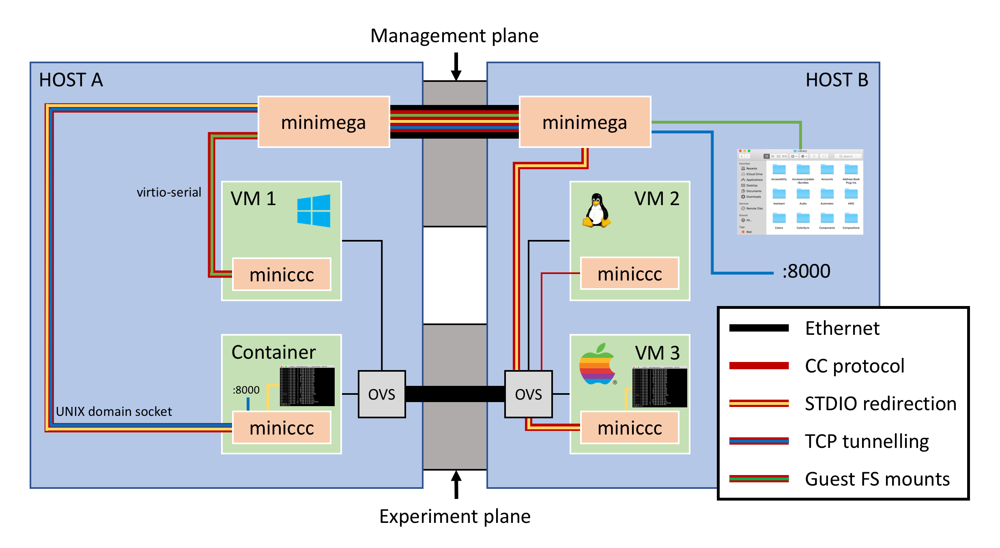

# minimega command and control


<a id="TOC_1."></a>

## Overview

Command and control with minimega

- First class feature in minimega via the `cc` API
- Works on Windows, Linux, FreeBSD guests
- TCP or virtio-serial connection
- Scales
- File I/O
- Process control
- TCP tunnelling (including reverse tunnels)
- Guest filesystem mounts (including NTFS with read/write)
- Cluster-wide STDIO redirection (including *into* other VMs)

<a id="TOC_2."></a>

## Overview

{ height="550" }

<a id="TOC_3."></a>

## Experimentation

An experiment is (from the perspective of the operator)

- minimega

    -  Topology definition
    -  Endpoint descriptions
    -  Services (OSPF, BGP, ...)
    -  Data capture

- cc

    -  Endpoint behavior (process control, ...)
    -  Endpoint data capture (file i/o, ...)
    -  Backchannel communication
    -  Connecting non-IT ephemera

<a id="TOC_4."></a>

## Feature walkthrough

<a id="TOC_5."></a>

## Commands, File I/O

The `cc` API provides a complete file and process control framework

- Send and receive files
- Execute/background commands
- Filter on **any** field
- Read/group responses
- Track/kill processes

<a id="TOC_6."></a>

## Commands, File I/O

```minimega title="process.mm"
--8<-- "articles/cc_content/process.mm"
```

[Download this example](cc_content/process.mm){ download="process.mm" }

<a id="TOC_7."></a>

## TCP tunnels

Support for forward and reverse TCP tunnels (ie `ssh -L` and `ssh -R` style tunnels).

```minimega title="tunnels.mm"
--8<-- "articles/cc_content/tunnels.mm"
```

[Download this example](cc_content/tunnels.mm){ download="tunnels.mm" }

<a id="TOC_8."></a>

## Remote mountpoints

Support for guest filesystem mounts - **including read/write support with windows guests**.

```minimega title="mounts.mm"
--8<-- "articles/cc_content/mounts.mm"
```

[Download this example](cc_content/mounts.mm){ download="mounts.mm" }

<a id="TOC_9."></a>

## Standard I/O Redirection

Support for standard I/O redirection *anywhere*, including inside other guests.

```minimega title="plumber.mm"
--8<-- "articles/cc_content/plumber.mm"
```

[Download this example](cc_content/plumber.mm){ download="plumber.mm" }

<a id="TOC_10."></a>

## Summary

The `cc` API provides a first class command and control layer for minimega experiments.

{ height="500" }
