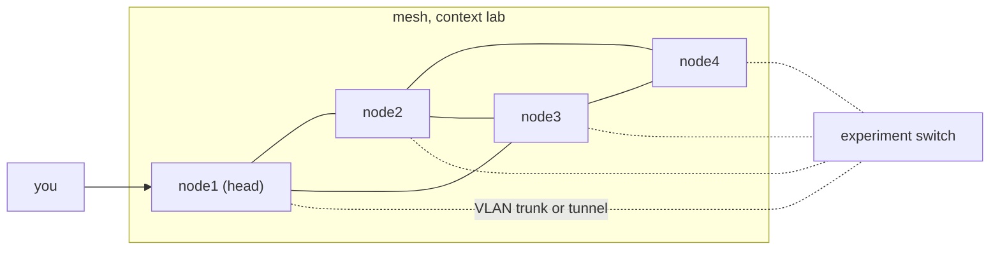

# Cluster setup

A single host runs out of memory and cores long before a realistic experiment runs out of VMs. minimega scales by running one instance per host and joining them into a mesh, so that a namespace can place VMs across every host while you keep typing at one prompt. This page covers preparing the hosts, carrying experiment VLANs between them, starting the mesh by hand, with `deploy`, under systemd or in Docker, checking it, and the handful of things that change once more than one host is involved.

It assumes you have [installed](installing.md) minimega on every host and know how to [run it](running.md) on one. VLANs, trunks and tunnels are explained in [Host networking](networking.md); how a namespace decides where a VM runs is in [Namespaces](namespaces.md).

## How a cluster works

Every minimega instance is a node in a mesh built by meshage, minimega's message-passing layer. Nodes find each other by UDP broadcast, hold TCP connections to a few peers, and route messages to any node through the mesh, so no host needs a connection to every other host. There is no server: any node can send a command to any other, and the "head node" is simply the host you happen to type on and, usually, the one that holds the images. Three settings define a mesh:

- `-context` is a label; only nodes with the same context connect to each other during discovery, so several clusters can share a network.
- `-degree` is how many peers a node tries to keep. `0`, the default, disables discovery; `3` or `4` is plenty for any size of cluster.
- `-port` is the TCP port for peer connections and the UDP port for discovery, `9000` by default. `-broadcast` sets the discovery address, `255.255.255.255` by default, and `-msa` the period in seconds of the mesh state announcements that detect lost peers, `10` by default.

Do not confuse a context with a namespace. The context is fixed when minimega starts and decides which hosts form one mesh; namespaces are created at runtime inside that mesh and decide which of its hosts an experiment uses.



## Preparing the hosts

Install the same version of minimega, with the same external tools (QEMU, Open vSwitch, dnsmasq), on every host; mesh commands are ordinary minimega commands executed remotely, so a version skew shows up as unknown commands or missing fields.

Every host needs a hostname that is unique in the cluster and resolvable from every other host; minimega identifies nodes by hostname, and `deploy`, `mesh dial` and file transfer all connect by it. Predictable names with a common prefix and a number (`node1`, `node2`, ...) are worth it because every command that takes hosts accepts ranges: `node[1-10]`, `node[1-3],node7`. Put every host in every host's `/etc/hosts` if you have no DNS:

```bash
$ for i in $(seq 1 10); do echo "192.168.1.$((100 + i)) node$i"; done | sudo tee -a /etc/hosts
$ sudo hostnamectl set-hostname node1      # on each host, its own name
```

Open TCP and UDP port 9000 (or your `-port`) between the hosts. If a host firewall or the network drops UDP broadcast, discovery will not work and you will join nodes by hand with `mesh dial` instead.

For `deploy` you also need SSH from the head node to every other host as a user that can run minimega, without a password. An SSH key is the sane way; `ssh-copy-id` does the copying, and a short loop does it for the whole cluster:

```bash
$ ssh-keygen -t ed25519
$ for i in $(seq 2 10); do ssh-copy-id admin@node$i; done
```

The user does not have to be root: `deploy launch` can use `sudo` on the remote side, as long as the account is allowed to run it without a password prompt.

## Carrying experiment traffic between hosts

A VM on `node1` and a VM on `node2` that both name the VLAN `dmz` get the same tag, because alias assignments are shared across the mesh. For them to actually exchange frames, each host's bridge has to be connected to the others. The two options are the same as on one host, just on every host.

### A trunked NIC

The normal cluster design has two networks: a management network the hosts use to talk to each other and to you, and an experiment network of one dedicated NIC per host plugged into a switch whose ports accept 802.1q tags. Add that NIC to the bridge on each host:

```minimega
mesh send all bridge trunk mega_bridge eth1
bridge trunk mega_bridge eth1
```

The switch does the rest: tagged frames from VLAN 101 on one host reach VLAN 101 on every other host and nothing else, exactly as if the VMs shared one switch. A trunk set this way lasts until minimega exits; put the command in the file you `read` at startup, or make the port a permanent part of a bridge that exists before minimega starts (see [Running minimega](running.md) for startup files).

If a host has only one NIC, the same interface has to carry management traffic and the trunk. That works, but the bridge, not the NIC, must then hold the host's address, and the change must be made from the console because the host drops off the network while the address moves. Define the bridge with your distribution's network configuration (netplan or NetworkManager on Ubuntu, NetworkManager on RHEL-family systems; both can create an Open vSwitch bridge with a physical port) so it comes up at boot and is `preexisting` when minimega starts. minimega adopts an existing `mega_bridge` and never deletes it, so `nuke` and `bridge destroy` leave the uplink alone. A bridge that minimega created, with your only NIC added by `bridge trunk`, is destroyed by `nuke` together with your connectivity.

### Tunnels

When the hosts are separated by routers, sit inside a cloud provider's VLAN, or the switch cannot trunk, connect the bridges over IP instead:

```minimega
bridge tunnel vxlan mega_bridge 192.168.1.102
```

on each host, toward each other host, or let a namespace build the full mesh of tunnels between its hosts in one command:

```minimega
ns bridge mega_bridge vxlan
```

Tunnels cost MTU: budget for the encapsulation on the physical path or lower the MTU in the guests.

## Starting the mesh

Whichever way you start the instances, they all need the same `-context` and `-port`, a `-degree` above zero, and a `-broadcast` address that reaches the others.

### As a service

The packages install a systemd unit that reads `/etc/minimega/minimega.conf`, where every flag has an `MM_` variable (see [Running minimega](running.md)). On each host set the mesh values and restart the service:

```text
MM_CONTEXT="lab"
MM_DEGREE=3
MM_PORT=9000
MM_BROADCAST="255.255.255.255"
MM_MSA=10
```

The instances discover each other as they come up; nothing has to run on the head node first. Because the file is per host, `MM_CONTEXT` is the one value you must get identical everywhere.

### With deploy

If you started minimega by hand on the head node, `deploy` copies that very binary to the other hosts with `scp` and starts it there with `ssh`:

```minimega
minimega$ deploy launch node[2-10]
minimega$ deploy launch node[2-10] admin sudo
```

The first form logs in as the user minimega runs as; the second as `admin` and prefixes the remote command with `sudo`. The remote instances get the flags the head node was started with, plus `-nostdin=true` so they can run in the background and `-headnode=<this host>` so they send their logs here and fetch files from here. To change what they get, set `deploy flags` before launching; `deploy flags` alone prints what would be sent, and `clear deploy flags` goes back to the default:

```minimega
minimega$ deploy flags -context=lab -degree=3 -level=info -logfile=/var/log/minimega.log
minimega$ deploy stdout /var/log/minimega.out
minimega$ deploy stderr /var/log/minimega.err
```

`deploy stdout` and `deploy stderr` redirect the remote process output, which otherwise goes to `/dev/null`. The binary lands in the remote temporary directory as `minimega_deploy_<timestamp>`, so repeated deploys never overwrite a running instance. The head node itself must have been started with the mesh flags, typically `minimega -nostdin -context lab -degree 3` plus whatever else you need, and attached to with `minimega -attach`.

The same thing without `deploy` is a loop, which is also how you would do it from a host that is not itself a mesh node:

```bash
$ for i in $(seq 2 10); do
    scp /usr/bin/minimega admin@node$i:/tmp/minimega
    ssh admin@node$i 'sudo nohup /tmp/minimega -nostdin -context lab -degree 3 >/dev/null 2>&1 &'
  done
```

### In Docker

Each host runs the container from [Running in Docker](docker.md) with the mesh values in its environment or in the file bound to `/etc/default/minimega`: `MM_CONTEXT`, `MM_DEGREE`, `MM_PORT`, `MM_BROADCAST`, and anything else through `MM_APPEND`, for example `MM_APPEND="-headnode=node1 -hashfiles"`. The container has to use the host's network (or publish `9000/udp` and `9000/tcp`) for discovery to work, and the start script can add a physical NIC to the bridge for you with `OVS_HOST_IFACE=mega_bridge:eth1` instead of running `bridge trunk` afterwards. To use `deploy launch` from inside a container, mount the SSH key it should use, for example `-v /root/.ssh:/root/.ssh:ro`. See `docker/README.md` in the source tree for the full variable list.

## Checking the mesh

Give discovery a few seconds, then ask any node:

```minimega
minimega$ mesh status
size | degree | peers | context | port
10   | 3      | 4     | lab     | 9000
minimega$ mesh list
node1
 |--node2
 |--node5
 |--node8
 |--node9
node2
 |--node1
 |--node3
 |--node7
...
```

`size` is the number of nodes in the mesh, and it is the number to watch: when it equals your host count, everyone is in. `peers` is this node's own connection count, which can exceed `degree` because nodes accept connections from anyone who asks. `mesh list` prints the adjacency list, `mesh list all` just the hostnames and `mesh list peers` the hostnames minus the local one, and `mesh dot <file>` writes the topology as a Graphviz file.

The rest of the `mesh` commands are for running the mesh:

- `mesh degree [n]` reads or changes the degree at runtime.
- `mesh dial <host>` connects to a node directly, which is how you join hosts that cannot hear each other's broadcasts; contexts are ignored on a dialed connection, so it can also splice two meshes together.
- `mesh hangup <host>` drops a connection.
- `mesh timeout [seconds]` is how long a command sent over the mesh waits for its responses; `0`, the default, waits forever, which is what you want unless you script against unreliable hosts.
- `mesh send <hosts> <command>` runs a command on other nodes and prints their responses here. Hosts can be a name, a range, a list, or `all` for every node but this one. Commands that only make sense locally, such as `read` and another `mesh send`, are refused.

```minimega
minimega$ mesh send node[2-4] host
host  | cpus | load           | memused | memtotal | rx  | tx  | vms | vmlimit | androidvms | cpucommit | memcommit | netcommit | uptime
node2 | 32   | 0.12 0.10 0.08 | 1204    | 128000   | 0.0 | 0.0 | 3   | -1      | 0          | 6         | 6144      | 3         | 2h14m10s
node3 | 32   | 0.08 0.07 0.05 | 980     | 128000   | 0.0 | 0.0 | 2   | -1      | 0          | 4         | 4096      | 2         | 2h14m8s
node4 | 32   | 0.31 0.28 0.24 | 4410    | 128000   | 0.0 | 0.0 | 9   | -1      | 0          | 18        | 18432     | 9         | 2h13m55s
minimega$ mesh send all vm info
```

The `host` column is not part of `host`'s own output; minicli adds it to any table whose rows came from other nodes.

You rarely need `mesh send` for experiment work, because namespaces do the fan-out for you. It is the tool for host administration: checking `host` on every node, reading a file everywhere, or fixing one host's bridge.

## Using the cluster

Everything else about a cluster is a namespace. The default namespace contains only the local host, so VMs launched there stay put. A new namespace contains every host in the mesh except the one you created it on, which is normally the head node you want to keep free; `ns hosts` shows them and `ns add-hosts` and `ns del-hosts` adjust the list. Within a namespace `vm launch` places each VM on the least loaded host, `vm info` reports VMs from every host (with the `host` column minicli adds to remote rows), and every VM command addresses VMs wherever they are. `vm config schedule`, `coschedule` and `colocate` steer placement when it matters. [Namespaces](namespaces.md) covers all of it.

Images have to be where the VMs are. Any path that is relative or prefixed with `file:` is looked up in the iomeshage files directory, and a host that does not have the file fetches it from one that does before launching; `-headnode` makes every node ask the head node first, and `-hashfiles` makes them verify what they got. [File management](file.md) explains the transfer layer and `file get`, `file list` and `file status`. Files that a VM produces on a remote host, such as PCAPs from [capture](capture.md), come back the same way. VLAN aliases, as noted above, are mesh-wide; host taps, bridges and captures on bridges are per host.

## When hosts do not join

Compare `mesh status` on the missing host with a good one: `context` and `port` must match exactly. If they do, the host is not hearing broadcasts (a different subnet, a filtered UDP port, `-broadcast` pointing elsewhere) and `mesh dial <host>` from a member will bring it in. If `mesh dial` fails, check name resolution and the TCP port with the usual tools. A node that is in the mesh but never receives VMs is not in the namespace: `ns hosts`. Two hosts with the same hostname behave as one node, with confusing results; fix the names. And if one host's `mesh status` shows a `size` of 1 while everyone else agrees on 10, that instance was probably started with a different context or before its network was up; restart it.

## See also

- [Running minimega](running.md): flags, `MM_*` variables and the systemd unit.
- [Running in Docker](docker.md): the container's configuration.
- [Namespaces](namespaces.md): placing VMs across the hosts.
- [File management](file.md): moving images and results between hosts.
- [Host networking](networking.md): trunks and tunnels.
- Reference: [`mesh status`](../reference/minimega.md#mesh-status), [`mesh send`](../reference/minimega.md#mesh-send), [`mesh dial`](../reference/minimega.md#mesh-dial), [`deploy`](../reference/minimega.md#deploy), [`ns`](../reference/minimega.md#ns).
