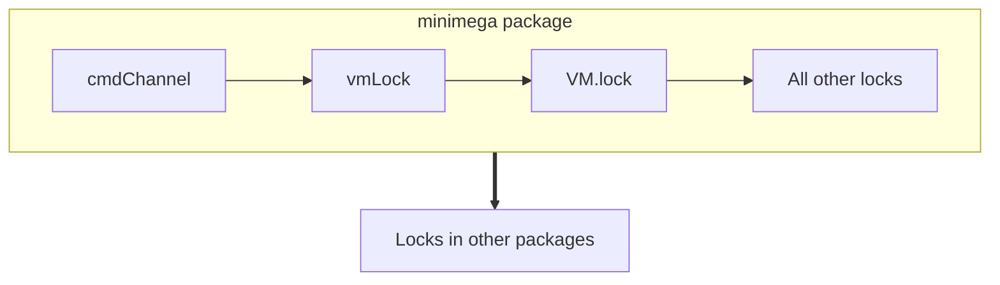

# Locking


<a id="TOC_1."></a>

## Introduction

minimega is highly concurrent and uses many locks in order to avoid data races.
This leads to many potential deadlocks which this article aims to prevent.

<a id="TOC_1.1."></a>

### Locking conventions

In general, locks should only be used in the file where they are defined. Files
typically include a type definition and some number of functions that operate
on those types. Therefore, if a file defines a lock, most of the functions that
are semantically related to the lock should be defined in the same file.

We are in the process of moving towards a naming convention within minimega --
if both an `exported` and `internal` function exist, the exported function
acquires any necessary locks and then invokes the internal function. For
example:

```golang
// FindVM finds a VM in the active namespace based on its ID, name, or UUID.
func (vms VMs) FindVM(s string) VM {
    vmLock.Lock()
    defer vmLock.Unlock()

    return vms.findVM(s)
}

// findVM assumes vmLock is held.
func (vms VMs) findVM(s string) VM {
```

Developers should read the function description to determine if the call site
already holds the requisite locks. If the requisite locks are held, the
developer should annotate the call sites with `// LOCK: ...` to make it clear
that calling the internal function is indeed correct.

<a id="TOC_1.2."></a>

### Locks in minimega

<a id="TOC_1.2.1."></a>

#### `cmdChannel`

`cmdChannel` is a channel that acts as a lock to serialize all commands from the
CLI, meshage, domain socket, and other sources. All `cli*` handlers assume this
channel is used for synchronization when they are invoked. `runCommands`, which
wraps `minicli.ProcessCommand`, adds commands to the `cmdChannel` and should be
used for all asynchronous tasks (e.g. handling meshage requests).
`minicli.ProcessCommand` should only be called by `runCommands`.

This channel greatly reduces the overall locking in minimega.

<a id="TOC_1.2.2."></a>

#### `vmLock`

`vmLock` synchronizes all access to the global `VMs` map. All exported functions
on the `VMs` type handle locking automatically. Developers should not range over
the `VMs` map or access a VM by key -- these functionalities should only be
performed by the exported functions.

<a id="TOC_1.2.3."></a>

#### `VM.lock`

`VM.lock` synchronizes all access to a single VM including performing lifecycle
operations, updating attributes, and accessing tags.

Note: newly created VMs are returned in the `locked` state. This ensures that
the only valid operation on a new VM is `Launch`.

<a id="TOC_1.2.4."></a>

#### `meshageCommandLock`

`meshageCommandLock` ensures that only one `meshageSend` operation can occur at
a time. The lock is released once all the responses are read from the returned
channel.

<a id="TOC_1.2.5."></a>

#### `containerInitLock`

`containerInitLock` ensures that we only initialize the container environment
for minimega once, when we try to launch the first container.

<a id="TOC_1.2.6."></a>

#### `namespaceLock`

`namespaceLock` synchronizes all operations regarding namespaces including
getting and setting the active namespace and creating a new namespace. The
exported `*Namespace` functions acquire this lock automatically. We currently
do not use this lock to synchronize access to the underlying Namespace structs
-- these should be synchronized via the `cmdChannel` used by `runCommands`.

<a id="TOC_1.3."></a>

### Hierarchy of locks

One way to prevent deadlocks in programs with multiple locks is to ensure that
threads always acquire locks in the same order. We attempt to follow this idea
and have defined the following hierarchy:



Developers must ensure that any blocking operations on channels do not
implicitly pass locks to threads in violation with the hierarchy.

<a id="TOC_1.4."></a>

### Locking in other packages

Other packages may contain their own locking mechanisms. We need to be careful
about other packages using callbacks from minimega (or sending via goroutine)
to ensure that we do not create a deadlock. Below we detail the packages where
this may occur.

<a id="TOC_1.4.1."></a>

#### ipmac

We (incorrectly) allow a data race (but avoid a deadlock!).

Note: this **should** be fixed... (see #549).

<a id="TOC_1.4.2."></a>

#### ron

We register VMs with ron so that it can query a VM's tags, namespace, and set
that CC is active. These operations all acquire the VM lock. In order to avoid
a potential deadlock, VMs should not call any ron operations while holding
their own lock (with the exception of `ron.Server.RegisterVM` -- the VM is not
registered so it cannot cause a deadlock).
