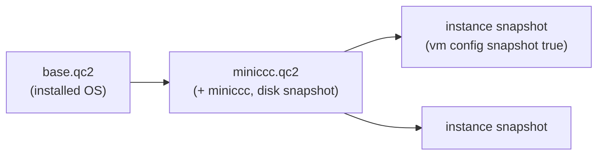

# Disk images and the disk API

minimega's `disk` API wraps `qemu-img` and `qemu-nbd` so that you can create,
inspect, layer, resize, and edit disk images without leaving the minimega
prompt. This page covers every `disk` subcommand, how qcow2 backing chains
work and how `vm config snapshot` builds on them, the `qemu-img` recipes for
converting and shrinking images, mounting an image by hand, and the cases
where injection does not work.

You need it whenever you build a base image (see
[Creating VMs from install media](newvm.md) and
[Building images with vmbetter](vmbetter.md)), want to add files to an image
without booting it, or need to understand what happens to a disk when a VM
runs in snapshot mode. Commands are shown at the minimega prompt; the same
strings work through `-e`, a command file, or the Python bindings.

## Where images live

Every `disk` command resolves a relative image path against minimega's files
directory (`-filepath`, `/tmp/minimega/files` by default). Absolute paths are
accepted too, but keeping images in the files directory is what makes them
reachable from other nodes with the `file:` prefix (see
[File management](file.md)), and `disk snapshot` always writes there. `disk`
commands run on the node where you issue them; use `mesh send` to run one
elsewhere.

## Creating and inspecting images

`disk create` makes an empty image in either format. Sizes take `k`, `M`,
`G`, or `T` suffixes. A qcow2 file starts near zero bytes and grows as the
guest writes; a raw image is a plain byte-for-byte disk, created sparse:

```minimega
minimega$ disk create qcow2 base.qc2 20G
minimega$ disk create raw scratch.img 512M
```

`disk info` reports what `qemu-img info` knows plus whether any process
currently holds a lock on the file, which is how you tell that a VM has it
open. Add `recursive` to walk the backing chain:

```minimega
minimega$ disk info miniccc.qc2 recursive
host | image                           | format | virtualsize | disksize | backingfile | inuse
mm1  | /tmp/minimega/files/miniccc.qc2 | qcow2  | 20.0 GiB    | 1.2 GiB  | base.qc2    | false
mm1  | /tmp/minimega/files/base.qc2    | qcow2  | 20.0 GiB    | 3.4 GiB  |             | false
```

`virtualsize` is what the guest sees; `disksize` is the space the file uses on
the host.

## Backing chains

A qcow2 image can name a *backing file*. Reads of clusters the image has not
written fall through to the backing file; writes stay in the image. The
backing file is never modified, so one base can support any number of
overlays, and each overlay costs only the blocks it changes.



`disk snapshot` creates an overlay. If you omit the destination, minimega
picks a random name in the files directory:

```minimega
minimega$ disk snapshot base.qc2 miniccc.qc2
```

The new image records its backing file as a path *relative* to itself, so a
files directory can be copied or served to another node as a unit and the
chain still resolves. When a node fetches an image with `file:`, minimega
fetches its backing file the same way. If you would rather record absolute
paths, start minimega with `-abssnapshot` (or `MM_ABSSNAPSHOT=true`); the
help text for `disk snapshot` and `disk rebase` then says `absolute` instead
of `relative`.

Three commands change a chain after the fact:

- `disk rebase <image> [backing]` moves `image` onto a different backing file,
  copying whatever differs between the old and new backing files into `image`
  so that its contents do not change. With no backing file, everything is
  copied in and the image becomes standalone.
- `disk set-backing <image> [backing]` only rewrites the pointer
  (`qemu-img rebase -u`). Use it when the backing file was renamed or moved
  but its content is identical; pointing at a different image corrupts the
  overlay.
- `disk commit <image>` pushes the overlay's changes down into its backing
  file. The overlay is left as it is; delete it or keep using it on top of the
  updated base.

Never modify a base image while overlays depend on it, whether by booting it
with `snapshot false` or by committing a different overlay into it, unless
you mean to change what every overlay sees.

`disk resize <image> <size>` changes the virtual size, either absolutely
(`50G`) or relatively (`+512M`). The partition table and filesystem inside
are the guest's problem: grow them from inside after enlarging, and shrink
them from inside *before* shrinking, because minimega passes `--shrink` and
`qemu-img` will happily cut off data.

## How vm config snapshot uses backing files

`vm config snapshot` defaults to `true`. In that mode minimega does not touch
the image you named: QEMU writes to a temporary overlay in the VM's instance
directory, and that overlay is thrown away at `vm flush`. This is what lets
one image back hundreds of VMs at once. In snapshot mode the drive's cache
mode is `unsafe`, so the temporary overlay may be missing data even after a
clean guest shutdown; if you intend to keep it, set a different cache mode
with `vm config disks image.qc2,ide,writeback`.

With `snapshot false`, QEMU writes into the image itself, exactly one VM can
have it open, and `disk info` shows it `inuse`. That is the mode for
installing an operating system or updating a base. The usual workflow is:

1. Install into `base.qc2` with `snapshot false`, shut down cleanly, and
   leave it alone from then on.
2. `disk snapshot base.qc2 role.qc2`, boot `role.qc2` with
   `snapshot false`, customise, shut down.
3. Launch experiments from `role.qc2` with the default `snapshot true`.

On a cluster, name the image with `file:` and every node fetches the overlay
and its chain before launching.

## Injecting files

`disk inject` attaches the image to an NBD device, mounts one partition, copies
files in or deletes them, flushes, and detaches. The VM must not be running.
Each `files` argument is `source:destination`; the source is a path on the
host, the destination is relative to the root of the mounted partition, and
neither may contain a colon. Parent directories are created and existing
files are overwritten:

```minimega
minimega$ disk inject role.qc2 files /opt/minimega/bin/miniccc:/usr/local/bin/miniccc /tmp/minimega/files/miniccc.service:/etc/systemd/system/miniccc.service
```

Partition selection follows the image name:

- No suffix: partition 1, but only if it is the only partition. An image with
  several partitions produces `please specify a partition; multiple found`.
- `image.qc2:2`: partition 2. Windows images normally need this; see
  [Windows guests](windows.md).
- `image.qc2:none`: the image has no partition table and the filesystem
  starts at byte 0, as with a USB stick made by `mkfs.vfat usb.img`.

Mounting tries the kernel's own drivers first (`mount -w`) and falls back to
`ntfs-3g` for NTFS. `options "<args>"` replaces the mount arguments entirely,
which you need for filesystems `mount` cannot detect or for an offset inside
a partition; note that with `options` only a single `source:destination` pair
is accepted:

```minimega
minimega$ disk inject scratch.img:none options "-t vfat" files /tmp/minimega/files/miniccc.exe:miniccc.exe
```

`delete` removes files or directories, listed comma-separated:

```minimega
minimega$ disk inject role.qc2 delete files "etc/ssh/ssh_host_rsa_key,var/log/miniccc.log"
```

Injection loads the `nbd` kernel module with `max_part=10` and picks a free
`/dev/nbdN`. If `nbd` was already loaded without `max_part`, partitions never
appear and minimega logs a warning; unload the module and let minimega load it
again.

## Converting and shrinking with qemu-img

minimega does not wrap `qemu-img convert`, but you will want it for two jobs.
The first is changing format, for instance to import a VMware disk:

```bash
$ qemu-img convert -f vmdk -O qcow2 appliance.vmdk appliance.qc2
```

`convert` always writes a standalone image, so it is also a way to flatten a
backing chain, and `-c` compresses the output at the cost of speed.

The second job is reclaiming space. A qcow2 file never shrinks on its own: a
guest that writes and then deletes 10 GB leaves 10 GB of allocated clusters
behind, and `disk resize` changes only the virtual size. To get the space
back, overwrite the free space with zeros from inside the guest, shut down,
and convert:

```bash
# in a Linux guest
dd if=/dev/zero of=/zero bs=1M; rm -f /zero
```

```text
REM in a Windows guest (size in bytes; pick something close to the free space)
fsutil file createnew C:\zero 100000000000
del C:\zero
```

```bash
$ mv base.qc2 base.qc2.orig
$ qemu-img convert -O qcow2 base.qc2.orig base.qc2
```

If overlays depend on the image, remember that its name is recorded in each
of them; converting in place under the same name, as above, keeps the chain
intact.

## Mounting an image by hand

Everything `disk inject` does you can do from a root shell, which is the way to
look around an image or to handle layouts injection does not support:

```bash
$ sudo modprobe nbd max_part=10
$ sudo qemu-nbd -c /dev/nbd0 /tmp/minimega/files/base.qc2
$ sudo fdisk -l /dev/nbd0
$ sudo mount /dev/nbd0p1 /mnt
$ sudo cp miniccc /mnt/usr/local/bin/
$ sudo umount /mnt
$ sudo qemu-nbd -d /dev/nbd0
```

Do this only while no VM has the image open. minimega chooses NBD devices by
checking for `/var/lock/qemu-nbd-nbdN` and `/sys/block/nbdN/pid`, so a device
you connect with `qemu-nbd -c` is skipped by concurrent `disk inject`
commands, but always disconnect when you are done.

For a guest whose root is on LVM, the partition holds a physical volume rather
than a filesystem and `disk inject` cannot mount it. By hand, run
`vgchange -ay` after connecting the NBD device, mount the logical volume from
`/dev/mapper/`, and run `vgchange -an` before disconnecting.

## Caveats

- **LVM and encrypted guests.** `disk inject` mounts one partition as a
  filesystem; it cannot activate LVM or open LUKS. Use the manual method
  above for LVM, or add files through `cc` once the guest is running.
- **Windows.** Choose the system partition explicitly (`:2` on BIOS/MBR
  installs, usually `:3` on UEFI/GPT), make sure `ntfs-3g` is installed on
  the host, and shut Windows down fully so the volume is not marked dirty.
  Details are in [Windows guests](windows.md).
- **Interface names.** A Linux guest using systemd's predictable names sees
  `ens3` on one `vm config` and `enp0s4` on another because the name follows
  the PCI slot minimega assigned. Add `net.ifnames=0` to the guest's kernel
  command line (`vm config append` for kernel and initrd boots, the boot
  loader configuration for disk images) to keep `eth0`; see systemd's
  [naming scheme](https://www.freedesktop.org/software/systemd/man/latest/systemd.net-naming-scheme.html).
- **Base images in use.** Modifying a base while overlays reference it, or
  taking a snapshot of an image that a `snapshot false` VM currently has open,
  gives inconsistent results. Check `disk info` for `inuse` first.
- **`unsafe` cache mode.** Instance overlays of snapshot-mode VMs may be
  incomplete; do not copy them out expecting a clean filesystem unless you
  set the cache mode.

## See also

- [Creating VMs from install media](newvm.md)
- [Building images with vmbetter](vmbetter.md)
- [Windows guests](windows.md)
- [File management](file.md) for the `file:` prefix and the files directory
- [Running minimega](running.md) for `-filepath` and `-abssnapshot`
- Reference: [`disk`](../reference/minimega.md#disk),
  [`disk create`](../reference/minimega.md#disk-create),
  [`disk info`](../reference/minimega.md#disk-info),
  [`disk snapshot`](../reference/minimega.md#disk-snapshot),
  [`disk commit`](../reference/minimega.md#disk-commit),
  [`disk resize`](../reference/minimega.md#disk-resize),
  [`vm config disks`](../reference/minimega.md#vm-config-disks),
  [`vm config snapshot`](../reference/minimega.md#vm-config-snapshot)
- [qemu-img](https://www.qemu.org/docs/master/tools/qemu-img.html) and
  [qemu-nbd](https://www.qemu.org/docs/master/tools/qemu-nbd.html) manuals
