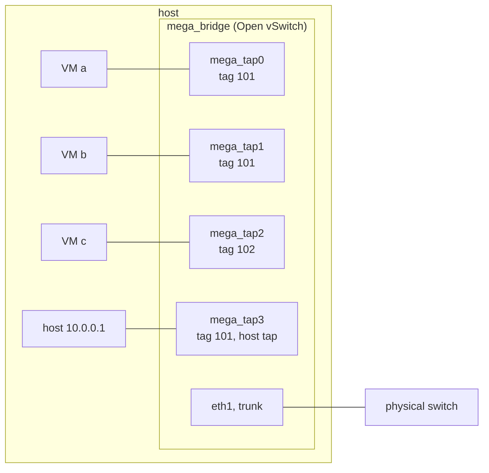

# Host networking

This page explains how minimega connects virtual machines to each other and to the host: the Open vSwitch bridge and 802.1q VLAN underneath every VM interface, the `vm config networks` netspec, VLAN aliases and ranges, host taps, DHCP and DNS served from the host with dnsmasq, bridge trunks and tunnels, per-interface quality of service, and the two ways to give an experiment a path to the outside world. You need it as soon as an experiment has more than one VM, or a VM has to reach something that is not another VM.

It assumes you can already launch a VM (see [VM lifecycle](vm-lifecycle.md) or the [quickstart](quickstart.md)). Routing inside the experiment is covered in [Routing with minirouter](router.md), packet capture and mirroring in [Capture and instrumentation](capture.md), and spanning several hosts in [Cluster setup](cluster.md).

## How minimega wires VMs together

Every VM interface is a Linux tap device (`mega_tap0`, `mega_tap1`, ...) that minimega adds as a port on an Open vSwitch bridge, `mega_bridge` unless you say otherwise. The port carries an 802.1q VLAN tag, and that tag is the whole story: two interfaces with the same tag on the same bridge share a layer-2 network, interfaces with different tags cannot see each other, and nothing else is needed to keep experiments apart. A host tap is the same kind of port with the host's network stack on the other end instead of a VM. A trunk port passes every tag to a physical NIC so that the same VLANs can exist on other hosts.



Open vSwitch shows the same picture:

```bash
$ sudo ovs-vsctl show
```

```text
    Bridge mega_bridge
        Port mega_tap0
            tag: 101
            Interface mega_tap0
        Port mega_tap2
            tag: 102
            Interface mega_tap2
        Port mega_bridge
            Interface mega_bridge
                type: internal
```

If `mega_bridge` already exists when minimega starts, minimega adopts it rather than creating a new one, and it never destroys a bridge it did not create. That distinction matters as soon as a physical interface is on the bridge; see [Bridges, trunks and tunnels](#bridges-trunks-and-tunnels).

!!! tip "Keep management traffic off the experiment bridge"
    A host that only runs single-node experiments can leave its management NIC alone. As soon as you trunk a NIC into `mega_bridge`, to reach other hosts or to bridge VMs onto a real LAN, use a second NIC for it. Experiment traffic then cannot saturate the interface you administer the host through, and a mistake in the bridge configuration cannot lock you out.

## Configuring VM interfaces

`vm config networks` (alias `vm config net`) takes one netspec per interface, in the order the guest will see them:

```text
[bridge,]vlan[,mac][,driver][,qinq]
```

Only the VLAN is required. The other fields are optional but must keep that order, and minimega tells them apart by content: a field that parses as a MAC address is the MAC, a field that names a QEMU network device is the driver, the literal `qinq` is the QinQ flag, and in a two-field spec anything else in front of the VLAN is the bridge. The defaults are `mega_bridge`, a random MAC and the `e1000` driver.

```minimega
# two interfaces on the VLAN aliases "dmz" and "core"
vm config networks dmz core

# a fixed MAC on the first interface
vm config networks dmz,00:11:22:33:44:55 core

# a different bridge for the second interface
vm config networks dmz other_bridge,core

# a different QEMU device model
vm config networks dmz,virtio-net-pci

# an interface in dot1q-tunnel (QinQ) mode with "dmz" as the outer tag
vm config networks dmz,qinq
```

The driver must be a network device QEMU knows about (`-device help` lists them); containers ignore it, and Android VMs always use `virtio-net-pci`. QinQ puts the OVS port in `dot1q-tunnel` mode so that the guest's own 802.1q tags travel inside the minimega VLAN. `vm config net` with no argument prints the current list.

`vm info` has one column per interface property: `vlan`, `bridge`, `tap`, `mac`, `ip`, `ip6`, `qos`, `qinq` and `bond`. The address columns are filled in by snooping ARP and IPv6 neighbor solicitation traffic on the bridge, so they trail the guest by a moment.

```minimega
minimega$ .columns name,vlan,tap,ip vm info
name | vlan                    | tap                    | ip
r0   | [dmz (101), core (102)] | [mega_tap0, mega_tap1] | [10.0.0.1, 10.0.1.1]
```

### Changing interfaces on a running VM

`vm net` edits the interfaces of running VMs and accepts the same VM targets as `vm start`. Interfaces are addressed by their zero-based position in `vm config networks`:

```minimega
# add an interface, same netspec syntax as vm config networks
vm net add r0 mgmt,00:00:00:00:00:01

# move interface 1 to another VLAN, and optionally another bridge
vm net connect r0 1 core2
vm net connect r0 1 core2 other_bridge

# unplug interface 0; it stays on the VM, disconnected
vm net disconnect r0 0
```

A disconnected interface shows as `disconnected` in the `vlan` column and can be plugged back in with `vm net connect`.

### Bonds

`vm config bonds` bonds two or more of a VM's interfaces into one OVS bond, by index:

```text
<interface indexes>,<bond mode>[,<lacp mode>][,no-lacp-fallback][,qinq][,<bond name>]
```

Bond modes are `active-backup`, `balance-slb` and `balance-tcp`; LACP modes are `active` (the default), `passive` and `off`. `no-lacp-fallback` disables the bond when LACP negotiation fails instead of falling back to `active-backup`, and requires an explicit LACP mode. A bond is QinQ if you say `qinq` or if any member interface is.

```minimega
vm config networks uplink uplink
vm config bonds 0,1,balance-tcp,active,no-lacp-fallback,uplink
```

On a running VM the same thing is `vm net bond <vm> <indexes> <mode> <lacp> [no-lacp-fallback] [name <name>] [qinq]`, for example `vm net bond r0 1,2 active-backup active`, and `clear vm net bond <vm> [name]` removes bonds again. Bonds appear in the `bond` column of `vm info` and in the `bridge` listing.

## VLAN aliases and ranges

You rarely pick VLAN numbers yourself. Any netspec VLAN that is not an integer is an alias: the first time minimega sees it, it allocates the next free tag from the VLAN range and remembers the mapping. `vlans` lists the mappings of the active namespace:

```minimega
minimega$ vm config networks dmz core
minimega$ vm launch kvm a
minimega$ vlans
alias | vlan
core  | 102
dmz   | 101
```

The range comes from the `-vlanrange` flag (`MM_VLANRANGE` under systemd or Docker), `101-4096` by default, so aliases start at 101 and tags 1 through 100 are left for you. Ranges are half-open: the upper bound itself is never allocated.

Aliases are namespace-scoped. `dmz` in namespace `foo` and `dmz` in namespace `bar` are different VLANs, which is what lets you run the same script in several namespaces without the experiments touching. Internally an alias is stored as `namespace//alias`, and you can write that form yourself to deliberately join a VLAN that belongs to another namespace:

```minimega
minimega[bar]$ vm config networks foo//dmz
```

Alias assignments are broadcast to the other hosts in the mesh, so a VM on any host that names `dmz` lands on the same tag.

`vlans add <alias> <vlan>` pins an alias to a specific tag, for example to meet a device on the trunk that expects VLAN 500. `vlans range <min> <max>` restricts the range that new aliases in the current namespace are allocated from; set it before launching VMs. In the default namespace it changes the global range instead, and a namespace's range may not overlap another namespace's. `vlans range` alone prints the range in force and the next tag to be handed out:

```minimega
minimega[foo]$ vlans range 1500 1600
minimega[foo]$ vlans range
min  | max  | next
1500 | 1600 | 1500
```

Any VLAN you give as a plain integer is blacklisted: minimega logs `Blacklisting manually specified VLAN 500` and never allocates that tag to an alias, on the assumption that you are using it for something specific. `vlans blacklist <vlan>` does the same by hand and `vlans blacklist` lists the reserved tags. Valid tags are 0 through 4095; `0` means untagged (see [Bridging VMs onto a real LAN](#bridging-vms-onto-a-real-lan)).

`clear vlans` forgets the aliases of the current namespace (and, for a namespace other than the default, its range), `clear vlans <prefix>` only those starting with the prefix, and `clear vlans all` wipes every alias, range and blacklist entry in every namespace. Kill the VMs first; clearing an alias that VMs still use just makes its tag available for an unrelated second allocation.

## Host taps

A host tap is a port on the bridge that ends in the host's network stack instead of in a VM. Create one on the VLAN you want to reach, give it an address, and the host is on that network:

```minimega
minimega$ .columns name,ip,vlan vm info
name | ip           | vlan
web  | [10.0.0.234] | [dmz (101)]
minimega$ tap create dmz ip 10.0.0.1/24
mega_tap3
minimega$ tap
bridge      | tap       | vlan
mega_bridge | mega_tap3 | dmz (101)
```

`tap create` prints the name of the interface it made. From here `ping 10.0.0.234`, `ssh`, a browser pointed at the VM, or a service listening on `10.0.0.1` all work. The forms are:

```minimega
tap create <vlan>                          # no address; configure it yourself
tap create <vlan> name <tap name>
tap create <vlan> ip <address/prefix> [tap name]
tap create <vlan> dhcp [tap name]          # runs dhclient on the new tap
tap create <vlan> bridge <bridge> ...      # same options on another bridge
tap delete <tap name>
tap delete all
```

`dhcp` needs a DHCP server already on that VLAN: a VM, a minirouter, or dnsmasq as described next. `clear tap` deletes every host tap of the current namespace together with any mirrors, and only ever touches the local host.

Taps are namespace-aware: a tap created while a namespace is active belongs to it, is listed only there, and can only be deleted from there. Tap names must be unique on the host, so unlike VLAN aliases you cannot reuse a name in two namespaces.

!!! warning "A host tap joins the host to the experiment"
    Anything on the tapped VLAN can now reach the host at the tap's address, and the host's routes and services are exposed to it. Taps are ideal for bootstrapping and debugging; for a long-running experiment, serve DHCP and DNS from a router VM instead and delete the tap when you no longer need it. See [Security considerations](security.md).

## DHCP and DNS from the host

`dnsmasq start` runs an instance of [dnsmasq](https://dnsmasq.org/doc.html) on the host, bound to a host tap's address, to hand out leases and answer DNS for a VLAN. It is the quickest way to get a handful of VMs addressed:

```minimega title="dnsmasq.mm"
--8<-- "articles/networking/dnsmasq.mm"
```

[Download this example](networking/dnsmasq.mm){ download="dnsmasq.mm" }

`dnsmasq` alone lists the running instances, and `dnsmasq kill <id>` or `dnsmasq kill all` stops them:

```minimega
minimega$ dnsmasq
id | address  | min      | max        | path                            | pid
0  | 10.0.0.1 | 10.0.0.2 | 10.0.0.254 | /tmp/minimega/dnsmasq_460796406 | 47997
```

Each instance gets a directory under the base directory holding its pid file, its leases and the fragments that `dnsmasq configure` writes. You can pass a dnsmasq configuration file of your own as a fourth argument (an absolute path), or run an instance purely from a file with `dnsmasq start <config>`.

`dnsmasq configure <id> ...` changes a running instance without restarting it; `all` in place of the id applies the change to every instance:

```minimega
# a fixed address for a MAC
dnsmasq configure 0 ip 00:11:22:33:44:55 10.0.0.50

# a name that resolves
dnsmasq configure 0 dns 10.0.0.50 db.lan

# where to forward everything else
dnsmasq configure 0 dns upstream server 192.168.1.1

# any DHCP option, in dnsmasq's --dhcp-option syntax
dnsmasq configure 0 options option:ntp-server,10.0.0.1
```

Each form without its trailing arguments (`dnsmasq configure 0 ip`, `... dns`, `... dns upstream`, `... options`) prints what is currently set. Until you add an upstream server the instance only answers the names you add with `dns` and those in the host's `/etc/hosts`.

A DHCP server on the host is fine on a lab bench, but it keeps the host inside the experiment and outside the saved state. For anything larger, or anything you intend to save and replay, run DHCP and DNS from a [minirouter](router.md) VM; the whole configuration then lives in the experiment.

## Bridges, trunks and tunnels

`bridge` lists the bridges minimega manages, the VLANs in use on each, and any trunk ports, tunnels and bonds:

```minimega
minimega$ bridge
bridge      | preexisting | vlans                 | trunks | tunnels | bonds | config
mega_bridge | false       | [core (102) dmz (101)] | []     | []      | []    | {}
```

You normally only have `mega_bridge`, created on demand the first time something needs it. Naming another bridge in a netspec or in `tap create ... bridge` creates it the same way, and `bridge destroy <bridge>` removes one. A bridge that already existed when minimega started is `preexisting`: minimega uses it but never deletes it, not even on `nuke`, which makes a pre-created bridge the right home for a physical uplink (see [Cluster setup](cluster.md)). `bridge` is not namespace-aware; every namespace sees every bridge.

A trunk connects a bridge to a physical interface so that VLAN-tagged frames leave the host:

```minimega
bridge trunk mega_bridge eth1
bridge notrunk mega_bridge eth1
```

With `eth1` cabled to a switch port that accepts 802.1q tags, a VM on VLAN 101 on this host and a VM on VLAN 101 on another host trunked into the same switch share a network. That is how a minimega cluster carries experiment traffic; [Cluster setup](cluster.md) covers it, including the case where the NIC is also the host's management interface.

A tunnel does the same over IP when there is no VLAN-capable switch between the hosts, or when the hosts are themselves VMs or cloud instances that already sit inside a VLAN:

```minimega
bridge tunnel vxlan mega_bridge 192.168.1.20
bridge tunnel gre mega_bridge 192.168.1.20 42     # with an optional key
bridge notunnel mega_bridge mega_tap5             # the name from the tunnels column
```

Each tunnel is a port that encapsulates every tagged frame on the bridge in VXLAN or GRE toward the remote address; create the matching tunnel on the other host. Encapsulation lowers the effective MTU, so if large transfers stall while small pings work, raise the MTU on the physical path or lower it in the guests. `ns bridge <bridge> [vxlan,gre]` builds a full mesh of such tunnels between all hosts of a namespace in one step.

For anything the `bridge` API does not expose, `ovs-vsctl` and `ovs-appctl` work directly on the same bridge: `ovs-vsctl show` for the port and tag layout, `ovs-appctl fdb/show mega_bridge` for the MAC learning table, `ovs-ofctl show mega_bridge` for port numbers. See the [Open vSwitch documentation](https://docs.openvswitch.org/en/latest/).

## Quality of service

`qos add` shapes traffic on one VM interface with Linux `tc` on the host side of the tap, and accepts the same VM targets as `vm start`:

```minimega
qos add client[1-3] 0 loss 5          # drop 5% of packets
qos add client[1-3] 0 delay 100ms     # add 100 ms of latency (no unit means ms)
qos add wan 1 rate 10 mbit            # cap at 10 Mbit/s; kbit, mbit or gbit
clear qos wan 1                       # one interface
clear qos client[1-3] all             # every interface of the VM
```

`loss` and `delay` are both netem parameters and combine: adding a delay to an interface that already drops packets keeps the loss. Adding the same kind again replaces the previous value. `rate` uses a separate token-bucket queue and cannot coexist with loss or delay, so adding a rate removes any loss and delay on that interface and vice versa; minimega logs a warning when it does. Whatever is in force shows in the `qos` column of `vm info`.

Shaping applies to the egress of the host tap, which is the traffic the VM receives. Traffic the VM sends is not shaped. To slow both directions of a link, shape the interface at each end.

## Reaching the outside world

An experiment network is isolated by design. When VMs need to install packages or talk to a real service, there are two patterns.

### NAT through the host

Create a host tap on the experiment VLAN, let the host forward and masquerade, and point the VMs at the tap's address as their gateway. `eth0` below is whichever host interface has the route out:

```minimega title="nat.mm"
--8<-- "articles/networking/nat.mm"
```

[Download this example](networking/nat.mm){ download="nat.mm" }

If the host runs a firewall manager such as ufw, firewalld or a distribution nftables policy, add the equivalent forward and masquerade rules there instead, and make the `ip_forward` sysctl persistent if the setup must survive a reboot. Guests that do not use DHCP need a static address in `10.0.0.0/24`, `10.0.0.1` as default gateway and a resolver they can reach.

A minirouter in front of the VMs works the same way with the tap on the router's outside interface: give the router `gw 10.0.0.1` and `upstream 10.0.0.1`, and only the router ever touches the host. To undo the NAT, delete the tap (`tap delete nat0`) and remove the iptables rules you added.

### Bridging VMs onto a real LAN

Trunking a physical NIC into the bridge and putting VMs on VLAN `0` connects them to that NIC's LAN as if they were plugged into the same switch. VLAN 0 means the OVS port gets no tag at all, so the VMs' frames leave the trunk untagged and they get addresses from whatever DHCP server the LAN has:

```minimega
bridge trunk mega_bridge eth1
vm config networks 0
vm launch kvm bridged[1-3]
```

Only do this with a dedicated NIC unless you have console access to the host.

!!! warning "Bridging the management NIC"
    Adding the interface that carries the host's own address to a bridge takes the host off the network until the bridge itself has that address. If you must use the only NIC, do it from the console, in one step that adds the port, releases the address on the NIC and requests it on the bridge, and make the change persistent with the tool your distribution uses (netplan or NetworkManager on Ubuntu, NetworkManager on RHEL-family systems; both can define an Open vSwitch bridge). Create the bridge before starting minimega so that it is `preexisting`: `nuke` destroys every bridge minimega created, and destroying the bridge takes the uplink with it. To back the change out, remove the port with `bridge notrunk` (or delete the bridge) and put the address back on the NIC.

## When VMs cannot talk

Work down the layers. `vm info` tells you whether two VMs are on the same `vlan` and `bridge` and whether their `ip` column has been populated at all; `ovs-vsctl show` confirms the tags on the taps; `bridge` shows whether the trunk you expect is there. A guest that is up but silent is often waiting on DHCP that nobody is serving, or has its own firewall. Across hosts, check that the switch port really trunks the tag, and for tunnels check the MTU. [Troubleshooting](troubleshooting.md) has the longer checklist, and [Capture and instrumentation](capture.md) shows how to see the packets themselves.

## See also

- [Routing with minirouter](router.md): DHCP, DNS and routing from inside the experiment.
- [Capture and instrumentation](capture.md): packet capture, netflow and mirrors.
- [Cluster setup](cluster.md): trunks and tunnels between hosts.
- [Namespaces](namespaces.md): how VLANs, taps and captures are scoped.
- [VM configuration reference](vm-config-reference.md): every `vm config` field.
- Reference: [`vm config networks`](../reference/minimega.md#vm-config-networks), [`vm config bonds`](../reference/minimega.md#vm-config-bonds), [`vm net`](../reference/minimega.md#vm-net), [`vlans`](../reference/minimega.md#vlans), [`tap`](../reference/minimega.md#tap), [`dnsmasq`](../reference/minimega.md#dnsmasq), [`dnsmasq configure`](../reference/minimega.md#dnsmasq-configure), [`bridge`](../reference/minimega.md#bridge), [`qos`](../reference/minimega.md#qos).
