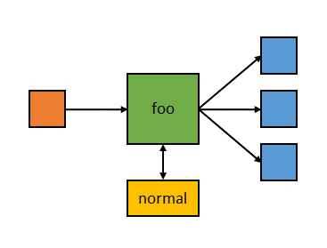

# Plumbing

Plumbing is minimega's facility for moving line-oriented data between VMs,
processes on guests or hosts, and minimega instances. It is a distributed
cousin of UNIX pipes: named pipes that any number of readers and writers can
attach to from anywhere in the cluster, and pipelines that connect pipes
through external programs. Use it when one program's output needs to drive
another, whether both are in VMs, both on the host, or one of each.

You need a running minimega, and miniccc in any guest that should take part;
see [Command and control](cc.md) for the guest side.

## Pipes

A pipe is a named I/O point. Unlike a UNIX pipe it carries newline-delimited
messages rather than a byte stream, which is what lets it have any number of
readers and writers at once. A write is delivered to whichever readers
the pipe's mode selects; if there are no readers the message is discarded.
Nothing is buffered: a write blocks until every selected reader has consumed
the message, so a slow reader slows every writer to the pipe.

Each message is at most 1 MiB. `minimega -pipe` and `miniccc -pipe` exit with
an error if a single input line exceeds that.

Pipes belong to the namespace they are created in, so the same name can be
reused safely between experiments. To reach a pipe in another namespace, use
`<namespace>//<pipe>`; the fully qualified name is what `pipe` displays.

You can attach to a pipe from four places:

- the minimega CLI, with `pipe <name> <data>` to write;
- the host shell, with `minimega -pipe <name>`, which connects standard input
  and output to the pipe until standard input closes; a bare name means a
  pipe in the default `minimega` namespace, so use `<namespace>//<name>` for
  any other namespace;
- a guest shell, with `miniccc -pipe <name>`, which does the same through the
  cc connection;
- a program started with `cc exec` or `cc background`, by prefixing the
  command with `stdin=`, `stdout=` or `stderr=` pairs.

Start a reader on the host:

```bash
$ minimega -pipe foo
```

Write from another shell and from the minimega prompt:

```bash
$ echo "Hallo von minimega!" | minimega -pipe foo
```

```minimega
minimega$ pipe foo "Or would you rather use English?"
```

The reader prints both lines. Exactly the same commands work from a VM with
`miniccc -pipe foo`, and from any other minimega instance in the mesh.

Attaching a guest program's streams directly:

```minimega
minimega$ cc exec stdin=foo my_program
minimega$ cc background stdin=foo stdout=bar my_program
```

### The pipe API

A pipe comes into existence on its first read, write, mode change or via.
`pipe` with no arguments lists the pipes in the current namespace:

```text
minimega$ pipe
host | name          | mode        | readers | writers | count | via | previous
mm1  | minimega//bar | all         | 1       | 1       | 3     |     | a message!
mm1  | minimega//foo | round-robin | 2       | 2       | 12    |     | hello
```

`count` is the number of messages the pipe has carried and `previous` is the
last one. `clear pipe <name>` deletes a pipe and closes its readers, which
receive an end of file; `clear pipe` alone deletes every pipe.

### Delivery modes

By default a message goes to every reader (`all`). The other two modes deliver
each message to exactly one reader, including readers on other hosts, which
turns a pipe into a work queue:

```minimega
minimega$ pipe foo mode round-robin
minimega$ pipe foo mode random
minimega$ clear pipe foo mode
```

`clear pipe <name> mode` returns the pipe to `all`.

### Logging a pipe

To see what flows through a pipe without attaching a reader, turn on logging.
Every message is then written to minimega's log at the `debug` level as
`pipe <name>: <message>`:

```minimega
minimega$ log level debug
minimega$ pipe foo log true
minimega$ clear pipe foo log
```

### Vias

A via is an external program run once for every reader on every write, with
the message on its standard input and its output delivered to that reader in
place of the original. Vias are for values that should differ per reader: for
example, each reader on `foo` gets its own normally distributed sample around
whatever mean was written.



```minimega
minimega$ pipe foo via normal -stddev 5.0
```

Here `normal` is a program that reads a mean from standard input and prints one
sample. Writing `1.5` to `foo` now gives every reader a different value:

```bash
$ echo "1.5" | minimega -pipe foo

# on node A
$ minimega -pipe foo
2.35

# on node B
$ minimega -pipe foo
3.44
```

`clear pipe <name> via` removes the via. The program runs on the host where
you issued `pipe <name> via` and must be on that host's `PATH`; writes made
on other hosts are forwarded there first.

## Pipelines

`plumb` builds a pipeline from pipes and external programs, in the same order
you would write a shell pipeline. Each argument that is not an executable on
the host's `PATH` is taken to be a pipe. Programs run on the host where you
issue `plumb`; the pipes at either end are distributed as usual, so readers
anywhere in the experiment see the result.

```text
minimega$ plumb foo "sed -u s/foo/moo/" bar
minimega$ plumb
host | pipeline
mm1  | minimega//foo sed -u s/foo/moo/ minimega//bar

minimega$ pipe foo "the cow says foo"
minimega$ pipe
host | name          | mode | readers | writers | count | via | previous
mm1  | minimega//bar | all  | 0       | 1       | 1     |     | the cow says moo
mm1  | minimega//foo | all  | 1       | 0       | 1     |     | the cow says foo
```

Use `-u` (unbuffered) with `sed` and the equivalent for other filters, or the
program will hold output until its buffer fills.

Because pipes accept multiple readers and writers, several linear pipelines
compose into trees and fan-in:

```minimega
minimega$ plumb a b
minimega$ plumb a c
```

A pipeline runs until one of its stages closes. Stop it by clearing the first
pipe, which sends end of file down the chain, or remove pipelines directly:

```minimega
minimega$ clear pipe foo
minimega$ clear plumb minimega//foo sed -u s/foo/moo/ minimega//bar
minimega$ clear plumb
```

`clear plumb` with a pipeline, written exactly as `plumb` lists it, removes
that one; with no arguments it removes them all.

!!! warning "Unguarded loops"
    A pipeline whose output reaches its own input, such as `plumb foo cat foo`
    or two pipelines that form a cycle, forwards the same message forever and
    burns a CPU on every host involved. Feed loops through a stage that stops
    on its own (`head -n 100`, `grep -m 1`) or write to a different pipe.

## Copying a file between VMs

Because both ends can be guests, a pipe is a quick way to move a text file
between two VMs that share no network. On the receiver:

```bash
miniccc -pipe transfer > copy.txt
```

Then on the sender:

```bash
miniccc -pipe transfer < original.txt
```

The receiver does not exit on its own when the sender finishes: closing the
sender's standard input only closes its writer, and `miniccc -pipe` exits when
its own standard input closes, so end the receiver with Ctrl-D once the copy
is complete. This is a
line-oriented copy: each line is one message, so lines longer than 1 MiB
abort the transfer, and the pipe adds a trailing newline to the final line if
the original lacked one. For binary data or large files, use `cc send` and
`cc recv` instead (see [Command and control](cc.md)).

## See also

- [Command and control](cc.md) for `cc exec` stream redirection and
  `miniccc -pipe`.
- [Command line and scripting](cli.md) for `minimega -pipe` and the command
  socket.
- Reference: [`pipe`](../reference/minimega.md#pipe),
  [`plumb`](../reference/minimega.md#plumb),
  [`clear pipe`](../reference/minimega.md#clear-pipe),
  [`clear plumb`](../reference/minimega.md#clear-plumb).
