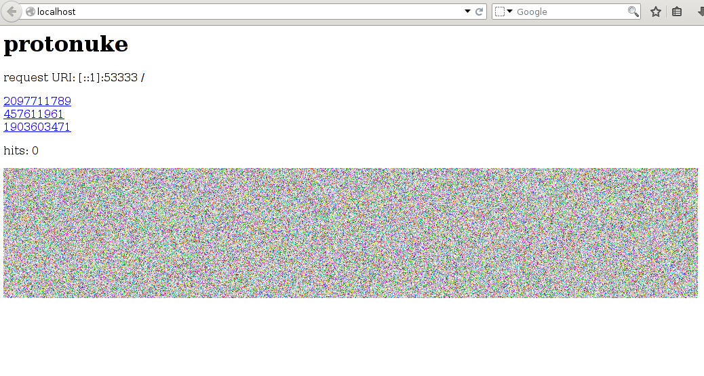

# protonuke

protonuke is a standalone, configuration-free traffic generator for IP
networks. One binary acts as a client for HTTP, HTTPS, SSH, SMTP, IRC, FTP,
FTPS, and DNS, or, with `-serve`, as a server for the same protocols, so you
can fill an experiment with plausible background traffic without installing
web servers or mail systems in your guests. This page explains how protonuke
picks targets and paces itself, lists every flag, and describes what each
protocol does on the client and on the server side.

The packages install it as `/opt/minimega/bin/protonuke` with a symlink at
`/usr/bin/protonuke`, the Docker image has it in `/opt/minimega/bin`, and a
source build produces `bin/protonuke` plus a Windows
build, `bin/protonuke.exe`. The usual place to run it is inside guests, so it
is a natural addition to a [vmbetter](vmbetter.md) image; the
[cc](cc.md) API can also push the binary into VMs and start it.

## How it works

Every flag that names a protocol enables that service. Without `-serve`,
protonuke is a client and the remaining arguments are its targets; with
`-serve` it starts a server for each enabled protocol and the targets are
optional. protonuke servers work with any client, and protonuke clients work
with any server that speaks the protocol.

Targets are hostnames, IP addresses, or CIDR subnets, combined with commas:

```bash
$ protonuke -http 10.0.0.0/24,mail.example.com,2001:db8::10
```

A subnet expands to every address in it except the network and broadcast
addresses, so a `/24` contributes 254 targets. Each enabled client protocol
runs its own loop. Before every action the loop sleeps for a random interval
drawn from a normal distribution with mean `-u` and standard deviation `-s`,
clamped to `[-min, -max]`, then picks one target at random from the expanded
list and performs one action: an HTTP page load, one email, one DNS query, and
so on. protonuke does not contact all targets at once; a large subnet simply
spreads the same rate of actions across more addresses. To go faster, lower
`-u`; `-u 0` makes each loop act as fast as the network allows.

Every `-report` interval (10 seconds by default) protonuke prints a table of
totals and per-minute rates for each enabled protocol; `-report 0` turns the
reports off. `-level info` additionally logs every transaction with its
duration.

TLS-enabled servers (HTTPS, FTPS, SMTP) use a self-signed certificate that
protonuke generates at startup, valid for a year and written to temporary
files, unless you supply `-httptlscert` and `-httptlskey` (both are required
together). Clients do not verify server certificates.

## Flags

General:

| Flag | Default | Purpose |
|---|---|---|
| `-serve` | `false` | Run servers for the enabled protocols instead of clients. |
| `-u` | `1s` | Mean time between actions, per protocol. |
| `-s` | `0` | Standard deviation of the time between actions. |
| `-min` | `0` | Shortest allowed interval. |
| `-max` | `1m` | Longest allowed interval. |
| `-report` | `10s` | Time between statistics reports; `0` disables them. |
| `-ipv4` | `true` | Use IPv4. |
| `-ipv6` | `true` | Use IPv6. Disable one of the two to force the other; at least one must stay enabled. |
| `-tlsversion` | | Highest TLS version the HTTPS and FTPS clients will negotiate: `tls1.0`, `tls1.1`, or `tls1.2`. |
| `-level`, `-logfile`, `-v` | `error`, none, `true` | Logging. |

HTTP and HTTPS:

| Flag | Default | Purpose |
|---|---|---|
| `-http` | `false` | Enable HTTP (port 80). |
| `-https` | `false` | Enable HTTPS (port 443). |
| `-httproot <dir>` | | Server: serve this directory instead of the generated page. |
| `-httpimagesize <size>` | `3MB` | Server: size of the generated `image.png`. Accepts a `B`, `KB`, or `MB` suffix; a bare number means megabytes. |
| `-httpgzip` | `false` | Server: gzip the generated image. |
| `-httpcookies` | `false` | Client: keep a cookie jar across requests. |
| `-http-user-agent <string>` | | Client: send this `User-Agent` header. |
| `-httptlscert <file>`, `-httptlskey <file>` | | Server: PEM certificate and key for HTTPS, also used by the FTPS and SMTP servers. |

SSH:

| Flag | Default | Purpose |
|---|---|---|
| `-ssh` | `false` | Enable SSH (port 22). |

SMTP:

| Flag | Default | Purpose |
|---|---|---|
| `-smtp` | `false` | Enable SMTP (port 25). |
| `-smtptls` | `true` | Client: attempt `STARTTLS` on each connection; fall back to plaintext if it fails. |
| `-smtpmail <file>` | | Client: JSON file of messages to send instead of the built-in corpus. |
| `-smtpuser <user>` | | Accepted for compatibility; the current code does not use it. |

IRC:

| Flag | Default | Purpose |
|---|---|---|
| `-irc` | `false` | Enable IRC. |
| `-ircport <port>` | `6667` | Port for the IRC client and server. |
| `-channels <list>` | `#general,#random` | Comma-separated channels the client may join. |
| `-messages <file>` | | Client: text file, one message per line, used instead of the built-in lorem ipsum lines. |
| `-markov` | `true` | Client: generate chat with a Markov chain trained on the messages; `-markov=false` sends the lines verbatim. |

FTP and FTPS:

| Flag | Default | Purpose |
|---|---|---|
| `-ftp` | `false` | Enable FTP (port 21). |
| `-ftps` | `false` | Enable explicit FTPS (`AUTH TLS` on port 21). |
| `-ftpfilesize <size>` | `500KB` | Server: size of the generated file that clients download. Same suffixes as `-httpimagesize`. |

DNS:

| Flag | Default | Purpose |
|---|---|---|
| `-dns` | `false` | Enable DNS (UDP port 53). |
| `-dnsv4` | `false` | Enable DNS; the client only asks for `A` records. |
| `-dnsv6` | `false` | Enable DNS; the client only asks for `AAAA` records. |
| `-random-hosts` | `false` | Server: answer `A` and `AAAA` queries with random addresses when no target of that family was given. |

## Protocols

### HTTP and HTTPS

The client requests `http://<target>/` (or `https://`), reads the body, and
fetches every `src=` reference it finds (images, scripts, style sheets). Every
`href=` link is added to a cache of up to 128 URLs, and the next request picks
a random entry from that cache, so the client wanders through a site instead
of reloading its front page. Connections use a 30-second dial timeout;
`-httpcookies` adds a cookie jar, `-http-user-agent` sets the header, and the
HTTPS client accepts any certificate.

The server listens on port 80 and 443. Without `-httproot`, every `GET`
returns a generated page with a heading, the request URI, three random links
back to the same host, a hit counter, and ``; `image.png`
is random noise of `-httpimagesize` bytes, and a client can ask for another
size with `image.png?size=1MB`. A `POST` gets `202 Accepted`. Responses carry a
`Server: protonuke/<revision>` header, and keep-alive is disabled so each
request is a new connection. With `-httproot` the directory is served as is.



### SSH

The client connects to `<target>:22` as user `protonuke` with password
`password` and opens a shell. On each tick it opens a session if it has none;
otherwise it opens another with 10% probability, closes a random session with
10% probability, and the rest of the time types a random base64 string of up
to 172 characters into a random session and waits for the echo, like a user at
a prompt.
The report counts bytes typed.

The server listens on port 22 with a fixed host key, accepts only
`protonuke`/`password`, and presents a `> ` prompt that echoes each line
back. It does not run commands.

### SMTP

The client connects to `<target>:25`, picks a random message, and sends it.
Messages come from a built-in corpus or from a `-smtpmail` JSON file:

```json
[
	{
		"To": "accounting@mail.com",
		"From": "helpdesk@mail.com",
		"Subject": "Scheduled maintenance",
		"Msg": "benign message"
	},
	{
		"To": "victim@mail.com",
		"From": "evil@example.com",
		"Subject": "Invoice attached",
		"Msg": "CONFIDENTIAL",
		"File": "invoice.pdf"
	}
]
```

An empty `To` becomes a random user at the target host and an empty `From` a
random user at `protonuke.org`. `File` names a file to attach, base64-encoded
in a MIME part; if it is a directory, a random file inside it is chosen for
each message. With `-smtptls` (the default) the client tries `STARTTLS` and
continues in plaintext, with a warning, if the server declines.

The server listens on port 25, greets with
`220 protonuke: Less for outcasts, more for weirdos.`, offers `STARTTLS`, and
accepts mail without relaying it. Its status codes follow the RFC but the text
after them is protonuke's own, which makes it easy to tell from a real mail
server.

### IRC

The client connects to one random target on `-ircport`, picks a nickname from
a built-in list (appending a random number on collision), joins a random
subset of `-channels`, and greets each channel with `yo`. With the default
`-markov`, when another protonuke client in the channel answers, the two pair
up and take turns talking, one message per tick, with text from a Markov chain
trained on the built-in lorem ipsum lines or on the lines of `-messages`. With
`-markov=false` there is no conversation: every tick the client sends one of
those lines, unchanged, to a random channel it has joined. Private messages
that mention the nickname get a greeting back.

The server is a plain IRC daemon on `-ircport` that relays traffic between
clients and serves no content of its own.

### FTP and FTPS

The client connects to `<target>:21` and logs in as `anonymous` with password
`anonymous` in plaintext; with `-ftps` it issues `AUTH TLS` only after that
login (honouring `-tlsversion`), so the credentials are never protected. It then performs one random action per tick: `PWD`, `SYST`,
`SIZE` and `LIST`, a `RETR` of `/tmp/ftpimage` whose content is discarded, or
`QUIT`, after which the next tick reconnects.

The server listens on port 21 and accepts any credentials. Every path it is
asked for resolves to one generated PNG of `-ftpfilesize` bytes, uploads are
accepted and dropped, and passive-mode transfers advertise the last
non-loopback IPv4 address the host enumerates. `-ftps` enables explicit FTPS with the
generated or supplied certificate.

### DNS

The client sends one UDP query per tick to `<target>:53` for a random domain
from a built-in list. The record type is chosen at random from `A`, `AAAA`,
`CNAME`, `MX`, `NS`, and `SOA` unless `-dnsv4` (always `A`) or `-dnsv6`
(always `AAAA`) is set.

The server answers authoritatively on UDP port 53 with a TTL of 59 seconds. An
`A` or `AAAA` query is answered with one random entry from the target list, so
`protonuke -serve -dns 10.0.0.0/24` hands out addresses in that subnet. The
pick is not retried: if the chosen entry is not an address of the right family
the answer is `NXDOMAIN` (or a random address when `-random-hosts` is set), so
a mixed IPv4 and IPv6 target list produces intermittent `NXDOMAIN` replies. `CNAME`, `MX`,
and `SOA` queries get synthesized records (`cname.<name>`, `mx.<name>`,
`ns.<name>`); other types get an empty answer.

## Examples

Serve every protocol with debug logging:

```bash
$ protonuke -serve -http -https -ssh -smtp -irc -ftp -dns -level debug
```

Serve HTTP and HTTPS with your own content, here a single large image behind a
minimal `index.html`:

```bash
$ mkdir www
$ dd if=/dev/urandom of=www/bigfile.png count=1024 bs=1M
$ echo "" > www/index.html
$ protonuke -serve -http -https -httproot www
```

Generate traffic on every protocol towards one host:

```bash
$ protonuke -http -https -smtp -ssh -irc -ftp -dns server.example.com
```

Load a subnet plus one named host over HTTP as fast as possible:

```bash
$ protonuke -u 0 -http 10.0.0.0/24,www.example.com
```

Send a curated set of emails, with attachments drawn from a directory, once
every thirty seconds on average:

```bash
$ protonuke -smtp -smtpmail mail.json -u 30s -s 10s mail.example.com
```

## See also

- [Command and control](cc.md) for pushing protonuke into VMs and starting it
- [Building images with vmbetter](vmbetter.md)
- [Capture and instrumentation](capture.md) for recording the traffic
- [Tools overview](../tools.md)
