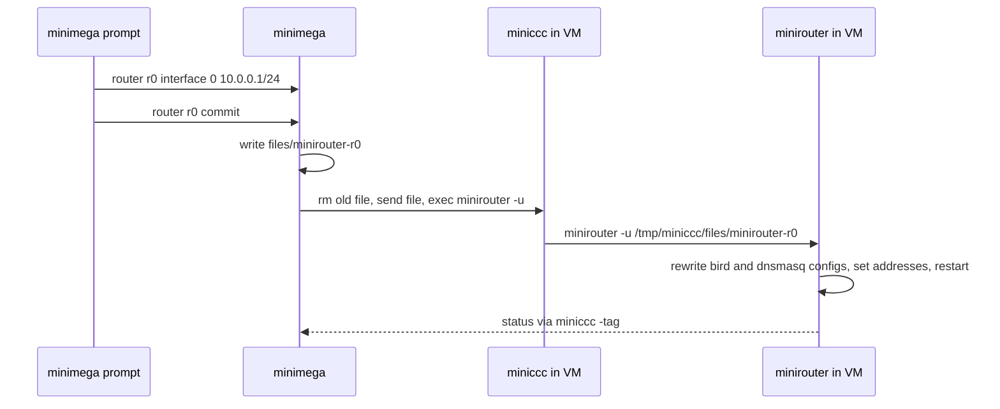
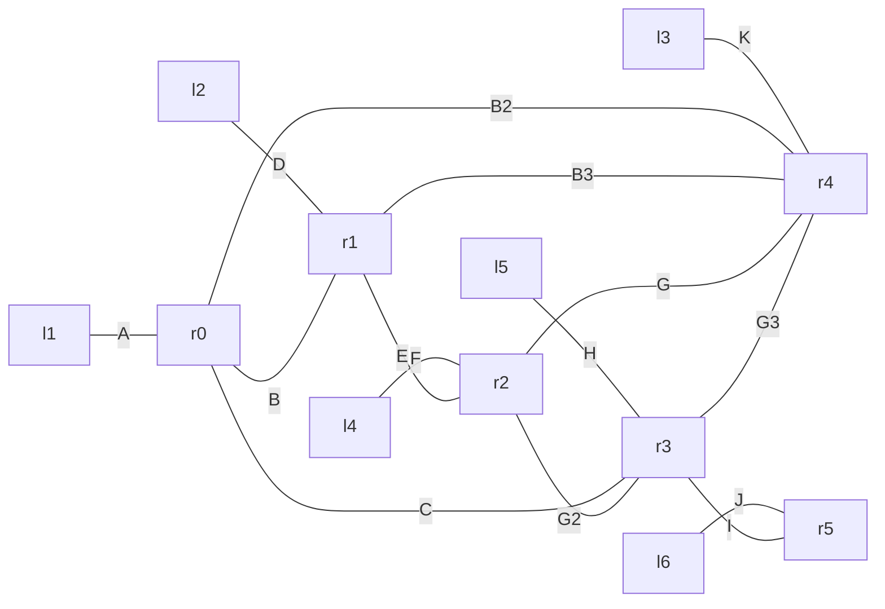

# Routing with minirouter

minirouter is a small daemon that runs inside a VM and turns it into a router you configure from the minimega prompt: interface addresses, DHCP, DNS, IPv6 router advertisements, static routes, OSPF, BGP and a basic firewall. minimega reaches it over the [command and control](cc.md) channel, so a router VM needs no management network and its whole configuration is part of the experiment. This page covers how the pieces fit together, where to get a minirouter image, the `router` API, and three worked topologies.

You need miniccc working first, because that is how configuration reaches the VM, and you should know how [VLANs and taps](networking.md) work, since a router is only useful between two of them.

## How it works

A minirouter VM runs two of minimega's agents: miniccc, which provides the back-channel, and minirouter, which listens on a Unix socket (`/tmp/minirouter/minirouter` by default) for configuration. Each `router <vm> ...` command only edits a description held by minimega. `router <vm> commit` writes that description to a file named `minirouter-<vm>` in the iomeshage files directory (under the namespace's subdirectory when a namespace is active) and queues three cc commands for the VM: remove any earlier copy under `/tmp/miniccc/files/`, send the new file, and run `minirouter -u /tmp/miniccc/files/minirouter-<vm>`. The `-u` invocation feeds the file into the running daemon's socket; the daemon then rewrites the configuration of the programs it drives and restarts them, and reports back through VM tags.



| Function | Program minirouter drives |
|---|---|
| Interface addresses, loopbacks | `ip`, `dhclient` |
| Default gateway | `route` |
| DHCP, DNS, router advertisements | `dnsmasq` |
| Static routes, OSPF, BGP | `bird` and `bird6` ([BIRD 1.x](https://bird.network.cz/?get_doc&v=16&f=bird.html)) |
| Firewall | `iptables` |

Because delivery is asynchronous, the VM must be running with miniccc connected before the commit does anything, and changes take a few seconds to land. `router <vm>` with no subcommand prints the description minimega holds together with the log lines the router has sent back, and `vm info` shows the router's addresses once they are configured.

minirouter itself takes a few flags, all with sensible defaults: `-path` for its socket directory, `-miniccc` for the miniccc binary it calls to send logs and tags back (`/miniccc`), `-force` to start even if a stale socket exists, `-u <file>` to push a configuration file into a running instance, and `-cli` to print its command grammar. The [minirouter reference](../reference/minirouter.md) lists that grammar; you never type it yourself, but it is what a committed file contains.

## Getting a minirouter image

minirouter runs as a container, as a KVM guest, or on any Linux system that has miniccc plus `ip`, `dhclient`, `dnsmasq`, `bird`, `bird6` and `iptables` installed and not already running. Containers are the usual choice: they start instantly and route at line rate, well beyond what an emulated NIC in a KVM guest manages.

### Container root filesystem

`misc/uminirouter/build.bash` in the source tree builds a minimal busybox-based root filesystem. Run it on a Debian or Ubuntu host that has `bird`, `dnsmasq` and `isc-dhcp-client` installed and a built `bin/minirouter` and `bin/miniccc` in the checkout:

```bash
$ cd misc/uminirouter
$ ./build.bash
```

It produces `uminirouterfs/` and `uminirouterfs.tar.gz`. The directory's `init` starts miniccc and minirouter. Its `preinit` turns on IPv4 and IPv6 forwarding and has to be given to minimega separately, because a container's `/proc` is read-only once it is running and forwarding can only be switched on during setup, which is what `vm config preinit` is for:

```minimega
vm config filesystem /root/uminirouterfs
vm config preinit /root/uminirouterfs/preinit
vm launch container r0
```

`vm config filesystem tar:uminirouterfs.tar.gz` unpacks the tarball from the iomeshage directory on whichever host launches the container, which is convenient on a cluster. The Debian-based alternative is `misc/vmbetter_configs/minirouter_container.conf`, built with `vmbetter -rootfs`; it installs `bird` and `dnsmasq` from packages, adds sshd and a full userland, and uses the same kind of init.

### KVM image

`misc/vmbetter_configs/minirouter.conf` builds a kernel and initrd pair whose init enables forwarding and starts sshd, miniccc on the virtio serial port and minirouter:

```bash
$ vmbetter misc/vmbetter_configs/minirouter.conf
```

The overlay only contains the init script, so copy `bin/miniccc` and `bin/minirouter` into `misc/vmbetter_configs/minirouter_overlay/` before building. Boot the result with `vm config kernel minirouter.kernel` and `vm config initrd minirouter.initrd`, and give the VM enough memory for a full Debian userland. [Building images with vmbetter](vmbetter.md) covers the tool.

## Configuring a router

The pattern is always the same: describe, then commit.

```minimega
router r0 interface 0 10.0.0.1/24
router r0 dhcp 10.0.0.0 range 10.0.0.100 10.0.0.200
router r0 commit
```

You can commit as often as you like; each commit sends the complete description, so a change to a running router is just another commit. `router r0 log level debug` raises the router's own log level before the next commit if you need to see what it is doing, and `router r0 rid 10.0.0.1` sets the 32-bit router ID used by OSPF and BGP.

### Interfaces

Interfaces are numbered by their position in the router VM's `vm config networks`. Give an interface a static IPv4 or IPv6 address, or let it ask for one with DHCP, and add as many addresses to it as you need:

```minimega
vm config networks wan lan
# ...
router r0 interface 0 dhcp
router r0 interface 1 192.168.1.1/24
router r0 interface 1 2001:db8:1::1/64
```

A loopback address is often wanted for routing protocols; the `lo` keyword puts it on the loopback interface instead, and the index is then only a label:

```minimega
router r0 interface 2 10.255.0.1/32 lo
```

`router r0 gw <ip>` sets a default gateway and `router r0 upstream <ip>` the DNS server that the router's own resolver forwards to.

### DHCP

Each DHCP server on a router is identified by the network it serves, which is also the tag dnsmasq groups its options under. Add a range, static leases, and the gateway and DNS server to advertise:

```minimega
router r0 dhcp 192.168.1.0 range 192.168.1.100 192.168.1.200
router r0 dhcp 192.168.1.0 static 00:11:22:33:44:55 192.168.1.10
router r0 dhcp 192.168.1.0 router 192.168.1.1
router r0 dhcp 192.168.1.0 dns 192.168.1.1
```

A router can serve several networks; use a different network for each interface it should serve. A server with static entries but no range hands out only the static leases.

### DNS and router advertisements

`router r0 dns <ip> <hostname>` adds an A or AAAA record served by the router's dnsmasq, and `router r0 ra <prefix>` enables IPv6 router advertisements for a /64 so hosts can configure themselves with SLAAC:

```minimega
router r0 dns 192.168.1.10 fileserver.lan
router r0 dns 2001:db8:1::10 fileserver.lan
router r0 ra 2001:db8:1::
```

### Static routes

A static route is a destination and a next hop, IPv4 or IPv6:

```minimega
router r0 route static 192.168.2.0/24 10.0.0.2
router r0 route static 0.0.0.0/0 10.0.0.254
router r0 route static 2001:db8:2::/64 2001:db8::2
```

A third argument names the route. Named routes are what OSPF and BGP export filters refer to, and the pattern `router r0 route static 10.0.0.0/24 0 lan-routes`, with `0` as the next hop, is the documented way to define a named prefix purely to advertise it.

### OSPF

OSPF (and OSPFv3 for IPv6, enabled together) is configured per area and per interface index. Every network on a listed interface takes part:

```minimega
vm config networks a b c
# ...
router r0 route ospf 0 0      # interface a into area 0
router r0 route ospf 0 2      # interface c into area 0
```

To advertise a prefix without running OSPF on the interface that carries it, or to advertise a named static route, use `export` with the area:

```minimega
router r0 route ospf 0 export 10.0.0.0/24
router r0 route static 0.0.0.0/0 10.0.0.254 default-route
router r0 route ospf 0 export default-route
```

#### Link cost and other interface options

OSPF picks paths by summed interface cost, and BIRD's default cost for every interface is 10. Any interface option BIRD accepts can be set with a fifth and sixth argument; the option and value are copied verbatim into the interface block of the generated configuration:

```minimega
router routerA route ospf 0 1 cost 20
router routerA commit
```

Costs are the usual way to steer traffic in a test network; `hello`, `dead`, `priority` and the other options in BIRD's OSPF interface section work the same way. [OSPF and link cost](#ospf-and-link-cost) below walks through a triangle where changing one cost moves the path.

### BGP

A BGP session is a named process with a local address and AS, a neighbor address and AS, and an export policy. `export all all` advertises everything the router knows; `export filter <name>` advertises only a named static route. `rrclient` marks the neighbor as a route-reflector client:

```minimega
router r1 route static 10.0.0.0/24 0 r1-lan
router r1 route bgp to-r2 local 10.0.0.1 100
router r1 route bgp to-r2 neighbor 10.0.1.1 200
router r1 route bgp to-r2 export filter r1-lan

router r2 route bgp to-r1 local 10.0.1.1 200
router r2 route bgp to-r1 neighbor 10.0.0.1 100
router r2 route bgp to-r1 export all all
router r2 route bgp to-r1 rrclient
```

!!! note "`export all` takes a trailing token"
    The command pattern is `export <all,filter> <filtername>`, so a third word
    is mandatory even for `all`. It is ignored in that case, which is why the
    example writes `export all all`; `export all` on its own matches no pattern
    and is rejected.

### Firewall

The `fw` subcommands generate iptables rules on the router. They only work on KVM routers; minimega refuses them for container VMs before anything reaches the router, because a container cannot load netfilter modules of its own. The stock `misc/vmbetter_configs/minirouter.conf` installs `dnsmasq` and `bird` but not `iptables`, so add `iptables` to its `packages` line and rebuild the image before using `fw`; on an image without it, every `fw` rule fails when the router applies the commit. Set the default policy for forwarded traffic, then allow or deny flows per interface. `in` and `out` are relative to the interface at the given index, so a rule for traffic toward a host on interface 0's network is an `out` rule on interface 0. The endpoint is an address with an optional `:port`, and the source may be omitted:

```minimega
router fw0 fw default drop
router fw0 fw accept out 0 192.168.0.5:80 tcp
router fw0 fw accept in 1 192.168.0.0/24 0.0.0.0/0 udp
```

Chains group rules so they can be applied to more than one interface:

```minimega
router fw0 fw chain allow-http default action drop
router fw0 fw chain allow-http action accept 192.168.0.5:80 tcp
router fw0 fw chain allow-http apply out 0
```

### Removing configuration

Every subcommand has a `clear router <vm> ...` counterpart that removes that piece of the description: `clear router r0 dhcp 192.168.1.0`, `clear router r0 route ospf 0`, `clear router r0 interface 1`, `clear router r0 fw`, and so on down to single entries such as `clear router r0 dhcp 192.168.1.0 static 00:11:22:33:44:55`. `clear router r0` empties the whole description and `clear router` forgets every router in the namespace. Clearing only edits the description; commit to make the router match.

## A first router

One container between an outside network and a client LAN, with DHCP, a static lease and a name:

```minimega title="router-basic.mm"
--8<-- "articles/router/router-basic.mm"
```

[Download this example](router/router-basic.mm){ download="router-basic.mm" }

Launch a client on `lan` with DHCP and it gets an address in the range, `192.168.1.1` as its gateway and resolver, and can resolve `fileserver.lan`. With a host tap at `10.0.0.1` on `wan` and NAT as shown in [Host networking](networking.md), the client also reaches the outside world through the router.

## Two routers with static routes

Two routers share a transit link and each serves a LAN; a static route on each points at the other's LAN:

```minimega title="router-static.mm"
--8<-- "articles/router/router-static.mm"
```

[Download this example](router/router-static.mm){ download="router-static.mm" }

The client VMs boot with DHCP from their own router, and `a1` can reach `b1` through both routers. Replacing the two `route static` lines with `route ospf 0 0` and `route ospf 0 1` on each router gives the same result and keeps working as you add links.

## OSPF and link cost

Three routers form a triangle with every interface in area 0:

```minimega title="router-ospf.mm"
--8<-- "articles/router/router-ospf.mm"
```

[Download this example](router/router-ospf.mm){ download="router-ospf.mm" }

From `routerA` there are two equal-cost ways to reach `10.0.2.1`, routerB's address on the `bc` link: straight to B over `ab`, or through C. A traceroute from routerA's console, opened through [miniweb](miniweb.md), shows which one OSPF chose in this run:

```text
/ # traceroute 10.0.2.1
traceroute to 10.0.2.1 (10.0.2.1), 30 hops max, 46 byte packets
 1  10.0.1.2 (10.0.1.2)  0.009 ms  0.005 ms  0.005 ms
 2  10.0.2.1 (10.0.2.1)  0.005 ms  0.005 ms  0.005 ms
```

Raise the cost of A's interface 1, the `ac` link, from the default 10 to 20 and commit:

```minimega
router routerA route ospf 0 1 cost 20
router routerA commit
```

After OSPF reconverges, a few seconds later, the path through C costs 30 against 20 straight to B, and the traceroute shows a single hop:

```text
/ # traceroute 10.0.2.1
traceroute to 10.0.2.1 (10.0.2.1), 30 hops max, 46 byte packets
 1  10.0.2.1 (10.0.2.1)  0.009 ms  0.005 ms  0.006 ms
```

## Appendix: a larger OSPF network

Six routers, nine transit links and six client LANs, all in area 0. The script pins the VLAN range so that the aliases land on predictable tags:



```minimega title="router-ospf-large.mm"
--8<-- "articles/router/router-ospf-large.mm"
```

[Download this example](router/router-ospf-large.mm){ download="router-ospf-large.mm" }

Once every router has committed, `vm info` shows the layout, and every client can reach every other client. If a router or a link goes down, OSPF reroutes around it without further commits:

| VM | VLANs | Addresses |
|---|---|---|
| r0 | A (1500), B (1501), B2 (1502), C (1503) | 10.1.0.1, 10.21.0.1, 10.22.0.1, 10.3.0.1 |
| r1 | D (1504), B (1501), B3 (1505), E (1506) | 10.4.0.1, 10.21.0.2, 10.23.0.1, 10.5.0.1 |
| r2 | E (1506), G (1507), G2 (1508), F (1509) | 10.5.0.2, 10.71.0.1, 10.72.0.1, 10.6.0.1 |
| r3 | C (1503), G3 (1510), G2 (1508), H (1511), I (1512) | 10.3.0.2, 10.73.0.1, 10.72.0.2, 10.8.0.1, 10.9.0.1 |
| r4 | B3 (1505), K (1513), G (1507), G3 (1510), B2 (1502) | 10.23.0.2, 10.11.0.1, 10.71.0.2, 10.73.0.2, 10.22.0.2 |
| r5 | I (1512), J (1514) | 10.9.0.2, 10.10.0.1 |
| l1 to l6 | A, D, K, F, H, J | one DHCP lease each from the local router |

## When the router does not respond

`vm info` must show `cc_active` true for the router VM before a commit can be delivered; if it is not, the image is not starting miniccc or the serial channel is missing (see [Command and control](cc.md)). `router <vm>` prints the router's log lines once it has reported in; `router <vm> log level debug` followed by a commit makes them verbose. A router that accepts addresses but does not forward has forwarding turned off: for the busybox container that means the `preinit` was not passed, for a KVM image that the init did not set `net.ipv4.ip_forward`. If routes never appear, check that `bird` and `bird6` exist in the image and that no other instance of them or of dnsmasq was already running when minirouter started.

## See also

- [Host networking](networking.md): VLANs, host taps, NAT from the host.
- [Command and control](cc.md): the channel the router is configured over.
- [Building images with vmbetter](vmbetter.md): building the KVM and container images.
- [Virtual machine types](vmtypes.md): container versus KVM behaviour.
- Reference: [`router`](../reference/minimega.md#router), [`clear router`](../reference/minimega.md#clear-router), [minirouter API](../reference/minirouter.md).
