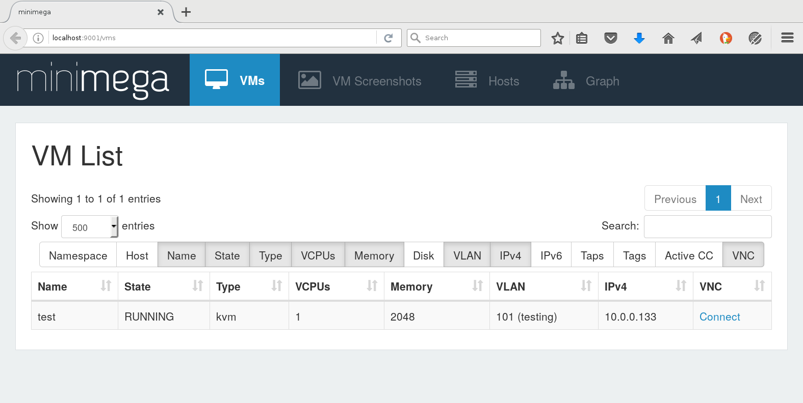

# minimega Quickstart


<a id="TOC_1."></a>

## Introduction

This quickstart will show you how to get bare-minimum Linux VMs running in
minimega. It assumes that you have already followed the steps in
[the build guide](../installing.md) to compile minimega; if your
copy of the repository has a bin/ directory with programs inside, you should be
ready to go!

To properly use minimega, you need sudo access. The minimega tools will warn
you at startup if a particular program they expect (e.g. dnsmasq) doesn't seem
to be installed.

<a id="TOC_2."></a>

## Step One: Make a VM image with vmbetter

We assume that you're starting from a completely blank slate and don't have any
particular VM that you want to run. We'll build a disk image for a basic Linux
system and use that to start with. If you have another hard disk image (QCOW2
format), you can skip ahead.

The tool to build a VM is called "vmbetter". It should already have been
compiled along with minimega, so all we have to do is point it at one of the
provided config files:

```text
sudo ./bin/vmbetter -level info misc/vmbetter_configs/miniccc.conf
```

This will grind for a while as it fetches a bunch of Debian packages and
creates an image. We added `-level info` to the flags so we can see more
information as it works.

Eventually, vmbetter should finish and leave you with a kernel/initrd pair
called `miniccc.kernel` and `miniccc.initrd`, respectively.

<a id="TOC_3."></a>

## Step Two: Run minimega and set up the VM

You can just launch minimega from the repository root; for our purposes, it
doesn't need any arguments:

```text
sudo ./bin/minimega
```

You should get a copyright notice followed by a prompt. If it printed any
warning messages, you may need to install missing programs. This can be
confirmed by running the command `check`.

<a id="TOC_3.1."></a>

### Configure the VM itself

The very first thing we can do is check the default configuration:

```text
minimega$ vm config
```

```text
VM configuration:
Memory:           2048
VCPUs:            1
Networks:         []
Snapshot:         true
UUID:
Schedule host:
Coschedule limit: -1
Backchannel:      true
Tags:             {}

KVM configuration:
Migrate Path:
Disk Paths:         []
CDROM Path:
Kernel Path:
Initrd Path:
Kernel Append:      []
QEMU Path:          kvm
QEMU Append:        []
SerialPorts:        0
Virtio-SerialPorts: 0
Machine:
CPU:                host
Cores:              1

Container configuration:
Filesystem Path:
Hostname:
Init:            [/init]
Pre-init:
FIFOs:           0
Volumes:
```

By default, very little is configured beyond the memory size and number of
CPUs. Note the "Snapshot: true" parameter--this indicates that by default,
changes will not be written to the virtual disk file, meaning you can launch
multiple copies of the same VM using the same disk. If you wanted to make
permanent changes to the disk, you would set "snapshot" to false. The snapshot
parameter only applies to disk images, not the initrd used in this example.

For this tutorial, we just need to tell it to use the kernel/initrd pair that
we just created:

```text
minimega$ vm config kernel /path/to/miniccc.kernel
minimega$ vm config initrd /path/to/miniccc.initrd
```

Note that, by default, minimega expects files to be relative to the files
directory (typically /tmp/minimega/files) so you should specify absolute paths
if you do not copy the files to that directory first.

<a id="TOC_3.2."></a>

### Configure the network

minimega can do a lot of complex things with the network. For this quickstart,
we'll do the following:

- Put the VM onto a virtual network called "LAN"
- Connect the host to that same virtual network
- Start a DHCP server on the host

First, we'll configure the VM to use virtual network "LAN":

```text
minimega$ vm config net LAN
```

Then, we'll create a tap interface on the host, also on the "LAN" virtual
network, and specify an IP for the host:

```text
minimega$ tap create LAN ip 10.0.0.1/24
```

Now, when the VM is launched, it will be able to communicate with the host via
the virtual network.

Finally, we need to start dnsmasq on the virtual interface so the client can
get an IP:

```text
minimega$ dnsmasq start 10.0.0.1 10.0.0.2 10.0.0.254
```

If this fails, it's possible that you don't have dnsmasq installed, or that
dnsmasq is already running. You don't **need** dnsmasq, but without it you'll
have to access the VM through VNC, since SSH won't work.

<a id="TOC_4."></a>

## Step 3: Launch and start the VM

Although we've configured the VM parameters, we have not actually started any
virtual machines yet. We'll use the "vm launch" command to start a single
KVM-based VM named "test":

```text
minimega$ vm launch kvm test
```

This creates the VM, but leaves it in an inactive state until we explicitly
start it. If we run "vm info", we see a single VM named "test" in the
"BUILDING" state:

```text
minimega$ .annotate false .columns name,state vm info
name | state
test | BUILDING
```

Let's go ahead and let the VM start running:

```text
minimega$ vm start test
```

Our "test" VM should now be booting!

<a id="TOC_5."></a>

## Step 4: Connect to the VM

Although we've started the VM, it would be nice to be able to interact with it.
minimega provides VNC access to the VM's console, either directly or through
the web interface.

Note that most vmbetter configurations provided with minimega will set up
passwordless login for the root user.

<a id="TOC_5.1."></a>

### Web interface

The web interface is the friendliest way to see VMs. Start
[miniweb](../miniweb.md) and then point your web browser to
[localhost:9001](http://localhost:9001) and scroll down to the section "VM Screenshots". You
should see something like this:



Click on "Connect" to open a VNC session to the VM.

<a id="TOC_5.2."></a>

### SSH

If all goes well, your VM should have picked up an IP. If you run "vm info" and
look for the "ip" column, you'll see the address that dnsmasq assigned to the
VM. You can then SSH to that IP; be sure to specify the root user!

<a id="TOC_6."></a>

## Starting more VMs

If you want to start more VMs, you can just use "vm launch". It will use the
same configuration as before, unless you change something. You don't have to
give each VM a name, you can instead just tell minimega how many VMs you want
and let it pick names for you. Then, "vm start all" will specify that all VMs
should start running:

```text
minimega$ vm launch kvm 5
minimega$ vm start all
minimega$ .annotate false .columns name,state vm info
```

```text
name | state
vm-0 | BUILDING
vm-1 | BUILDING
vm-2 | BUILDING
vm-3 | BUILDING
vm-4 | BUILDING
```

<a id="TOC_7."></a>

## Shutting down

When you're done working with minimega, simply type "quit". When it exits,
minimega does its best to clean up after itself, by killing all VMs, stopping
dnsmasq and any other processes it started, and removing any host taps you may
have created.

<a id="TOC_8."></a>

## Further reading

The [Usage Guide](../usage.md) contains more details on running
minimega, including information on how to distribute minimega across a cluster.
