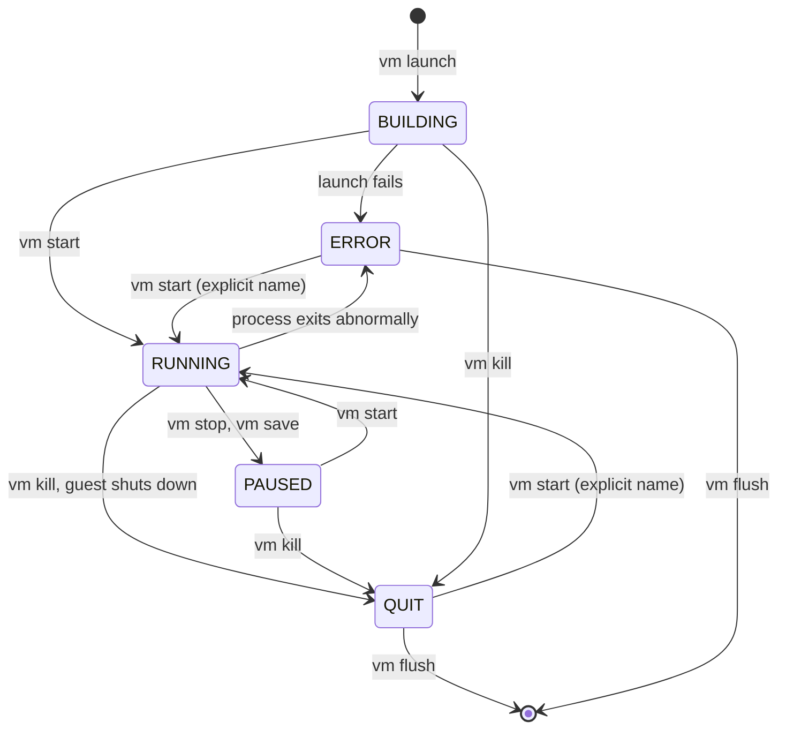

# VM lifecycle

This guide explains how minimega turns a description of a virtual machine into
a running VM, and how you start, stop, inspect, and remove VMs afterwards. It
applies to all three VM types (`kvm`, `container`, and `android`). The
type-specific details live in [Virtual machine types](vmtypes.md), and every
`vm config` field is listed in the [VM configuration reference](vm-config-reference.md).

You need a running minimega (see [Running minimega](running.md)) and something
to boot: a disk image, a container filesystem, or an Android AVD. The examples
use the interactive prompt; everything shown also works in a command file or
through `minimega -e` (see [Command line and scripting](cli.md)).

## Configure, launch, start

minimega separates describing a VM from creating it and from running it:

1. `vm config ...` sets fields in the *current VM configuration*. Nothing is
   created yet.
2. `vm launch <type> <name or count>` copies the current configuration into one
   or more new VMs. Each VM is created in the `BUILDING` state: its instance
   directory, network taps, and (for KVM) the QEMU process exist, but the guest
   is not executing.
3. `vm start <target>` starts the guest and moves it to `RUNNING`.

The current configuration is a template that persists between launches. Once a
VM has been launched, later `vm config` changes do not affect it, and the same
template can launch any number of VMs. Each namespace keeps its own current
configuration and its own saved configurations (see [Namespaces](namespaces.md)).

```minimega
minimega$ vm config disks /images/ubuntu.qc2
minimega$ vm config memory 4096
minimega$ vm config vcpus 2
minimega$ vm config networks LAN
minimega$ vm launch kvm web[1-3]
minimega$ vm start all
```

## Describing a VM with `vm config`

Run `vm config` with no arguments to print the current template. The output has
one block per VM type: `VM configuration:` (fields shared by every type),
`KVM configuration:`, `Container configuration:`, and `Android configuration:`.

Every field is a subcommand. `vm config memory` prints the current value and
`vm config memory 4096` sets it. Fields that do not apply to the type you launch
are ignored, so a leftover `vm config disks` does no harm when you launch a
container. Relative image paths are resolved under the files directory
(`-filepath`); use an absolute path for anything stored elsewhere, or a `file:`
prefix to fetch the file from another host in the cluster (see
[File management](file.md)).

To reset the template, use `clear`:

```minimega
minimega$ clear vm config disks      # reset one field to its default
minimega$ clear vm config            # reset every field
```

`clear vm config` does not remove configurations saved with `vm config save`.
The list of clearable fields and their defaults is in the
[reference](../reference/minimega.md#clear-vm-config) and in the
[VM configuration reference](vm-config-reference.md).

## Saved configurations

The template can be saved under a name and restored later, which is the easiest
way to keep several VM classes in one script:

```minimega
minimega$ vm config disks /images/router.qc2
minimega$ vm config memory 512
minimega$ vm config save router

minimega$ vm config disks /images/ubuntu.qc2
minimega$ vm config memory 4096
minimega$ vm config save endpoint

minimega$ vm config restore router
minimega$ vm launch kvm rtr
minimega$ vm launch kvm 5 endpoint
```

- `vm config save <name>` stores a copy of the current template.
- `vm config restore <name>` replaces the current template with a saved copy;
  `vm config restore` with no name lists the saved names.
- `vm launch <type> <name or count> <config>` launches from a saved
  configuration without touching the current template.
- `vm config clone <vm name>` copies the configuration of an already-launched
  VM into the template. Clone clears the UUID and reparses the network
  specification; a VM that was launched with a static MAC address produces a
  template that cannot be launched until you change the MAC.

Saved configurations are held in memory per namespace. To keep a
configuration across restarts, put the `vm config` commands in a command file
(see [Command line and scripting](cli.md)).

## Launching VMs

```text
vm launch <kvm,container,android> <name or count> [config]
```

The second argument is either a count or a name expression:

- A count (`vm launch kvm 5`) launches that many VMs named `vm-<id>`, where
  `<id>` is the per-host VM ID.
- A single name (`vm launch kvm web`), a comma-separated list
  (`vm launch kvm a,b,c`), a range (`vm launch kvm web[1-10]`), or a mix of
  the two (`vm launch kvm test[1-3],a[10-12]`).

Names may contain letters, digits, hyphens, underscores, and dots. A name
cannot be an integer, cannot be the reserved word `all`, cannot appear twice in
one launch, and must be unique within the namespace across every host. When
`vm config uuid` is set, only one VM can be launched at a time.

`vm launch` returns once the VMs exist. If a VM cannot be created, for example
because the disk image is missing or QEMU fails to start, the VM is put in the
`ERROR` state and the reason is recorded in its `error` tag (see
[Tags](#tags)). Sharing a disk image or container filesystem between VMs
requires snapshot mode (`vm config snapshot true`, the default); minimega
refuses to launch a second VM on the same image otherwise.

When queueing is enabled in the namespace (`ns queueing true`), `vm launch`
only queues the VMs; a bare `vm launch` hands the queue to the scheduler. See
[Namespaces](namespaces.md).

## Starting, stopping, killing, and flushing

The four lifecycle commands take a *VM target*:

```text
vm start <vm target>
vm stop <vm target>
vm kill <vm target>
vm flush [vm target]
```

A target is a VM name or ID, a comma-separated list, a range expression such
as `web[1-3,7]`, or the wildcard `all`. A list that includes `all` behaves as
`all`. Prefer names to IDs in a cluster: IDs are only unique per host.

Each command only applies to VMs in the states it makes sense for, and `all`
is more conservative than an explicit name:

| Command | Explicit target acts on | `all` acts on | Resulting state |
|---|---|---|---|
| `vm start` | `BUILDING`, `PAUSED`, `QUIT`, `ERROR` | `BUILDING`, `PAUSED` | `RUNNING` |
| `vm stop` | `RUNNING` | `RUNNING` | `PAUSED` |
| `vm kill` | `BUILDING`, `RUNNING`, `PAUSED` | same | `QUIT` |
| `vm flush` | `QUIT`, `ERROR` | `QUIT`, `ERROR` (no target means `all`) | removed |

Some consequences of that table:

- `vm start all` never restarts a VM that has quit or failed. After
  `vm kill a[10-12]`, `vm start all` leaves them in `QUIT`; name them instead:
  `vm start a[10-12]`. Starting a `QUIT` or `ERROR` VM relaunches it from its
  original configuration.
- `vm start web1` on a VM that is already running is an error; `vm start all`
  silently skips running VMs.
- `vm stop` pauses the guest (KVM and Android VMs stop executing, containers
  are frozen). Memory is kept, and `vm start` resumes exactly where it left
  off.
- `vm kill` is the equivalent of pulling the power cord: it terminates the
  process and blocks until it is gone. Shut the guest down from inside if you
  need a clean stop; a guest that halts itself also ends in `QUIT`.
- `vm flush` removes `QUIT` and `ERROR` VMs from `vm info`, deletes their
  instance directories, and frees their names for reuse.

The usual way to tear an experiment down is therefore:

```minimega
minimega$ vm kill all
minimega$ vm flush
```

## VM states

`vm info` reports one of five states per VM. The transitions are:



- `BUILDING`: created but never started. The process exists (QEMU, the
  container shim, or the Android emulator) and is waiting for `vm start`.
- `RUNNING`: the guest is executing.
- `PAUSED`: stopped by `vm stop` or by `vm save`; memory is retained.
- `QUIT`: the process has exited, either because of `vm kill` or because the
  guest shut down.
- `ERROR`: launch failed or the process exited abnormally. The `error` tag
  holds the message.

`vm kill` works on any of `BUILDING`, `RUNNING`, and `PAUSED`.

## Inspecting VMs

### `vm info`

`vm info` prints one row per VM in the namespace, from every host. The full
table is wide; use the `.columns` and `.filter` prefixes to trim it:

```minimega
minimega$ .columns name,state,type,vlan vm info
host  | name | state    | type | vlan
node1 | web1 | RUNNING  | kvm  | [LAN (101)]
node1 | web2 | RUNNING  | kvm  | [LAN (101)]
node1 | web3 | BUILDING | kvm  | [LAN (101)]
```

The leading `host` column is added by the `.annotate` builtin (on by default)
and is not a `vm info` column. `vm info summary` shows only the key columns
(`id`, `name`, `state`, `type`, `uuid`, `cc_active`, `vlan`). The complete
column list is in the [VM configuration reference](vm-config-reference.md#vm-info-columns).

`.filter` matches a column value; `=` and `!=` compare whole values (case
insensitive) and `~` and `!~` match substrings, which is handy for names:

```minimega
minimega$ .filter state!=running .columns name,state vm info
minimega$ .filter name~web .columns name,state vm info
minimega$ .columns id,name .filter state=quit .csv true vm info
```

Filters and column selections can be stacked, and `.csv true` or `.json true`
change the output format for scripts (see [Command line and scripting](cli.md)).
The innermost builtin runs first, so put `.columns` to the left of `.filter`
whenever the filter names a column that `.columns` drops; the other order
fails because the column is gone by the time the filter sees the table.

### `vm top`

`vm top [duration]` samples host-side resource usage for each VM over the given
number of seconds (default one) and reports `virt`, `res`, and `shr` memory in
MB, host `cpu` and guest `vcpu` percentages, total CPU `time`, the number of
`procs` inspected, and `rx`/`tx` rates in MB/s. The figures are measured from
the host and can differ from what the guest reports.

### Tags

Tags are free-form key/value pairs attached to a VM. minimega uses them for
its own bookkeeping (the `error` tag), and you can use them to record groups,
roles, or anything else a script or visualization needs:

```minimega
minimega$ vm tag web[1-3] role frontend
minimega$ vm tag web1                 # show all tags of web1
minimega$ vm tag all role             # show one tag for every VM
minimega$ clear vm tag web1 role
```

`vm config tags <key> <value>` puts a tag in the template so every VM launched
afterwards carries it; `clear vm config tag <key>` removes it from the
template. Tags appear in the `tags` column of `vm info`.

## Changing a running VM

A handful of commands act on VMs after launch. They are covered in detail
elsewhere; this list is here so you know they exist:

- `vm net add|connect|disconnect|bond` adds, moves, or removes network
  interfaces. See [Host networking](networking.md).
- `vm cdrom eject|change <target> ...` swaps the CD-ROM image of a KVM VM.
- `vm hotplug add <target> <file> [1.1|2.0|3.0]` attaches a disk image as a USB
  drive to a KVM VM (USB 3.0 needs `vm config usb-use-xhci true`, the
  default); `vm hotplug` lists attached drives and `vm hotplug remove <target>
  <id or all>` detaches them.
- `vm screenshot <name> [max dimension]` writes `screenshot.png` to the VM's
  instance directory; `vm screenshot <name> file <path>` writes it elsewhere.
- `vm qmp <name> '<json>'` sends a raw QMP command to a KVM VM, and
  `vm serial <name> [port] [milliseconds] [bytes]` reads a bounded snapshot
  from one of its serial sockets. See [Virtual machine types](vmtypes.md).
- `vm save <name> [filename]` writes the memory state and disk of a KVM VM to
  files. See [Saving and restoring experiments](save-restore.md).

## The instance directory

Every VM owns a directory under the base path (`-base`, by default
`/tmp/minimega`), named after its ID: `/tmp/minimega/<id>/`. minimega writes
the following there:

- `config`: the `vm config` commands that recreate the VM, in the same form
  that `ns save` records in its `launch.mm`. It is rewritten when `vm net`
  changes the VM's interfaces or bonds.
- `state`: the current state name, updated on every transition.
- `taps` and `bonds`: the host-side interface names.
- `disk-<n>.qc2`: the per-VM snapshot overlay for each disk when snapshot
  mode is on (KVM and Android).
- `serial<n>` and `virtio-serial<n>`: Unix sockets for the serial and
  virtio-serial ports of a KVM VM.
- `fifo<n>`: named pipes shared with a container.
- `screenshot.png` from `vm screenshot`, `qemu.log` for bare-metal KVM VMs, and
  `android-emulator.log` for Android VMs.

A symlink `/tmp/minimega/namespaces/<namespace>/<uuid>` points at the same
directory, which lets tools find a VM by namespace and UUID rather than by the
per-host ID. `vm flush` deletes the directory and the symlink.

## See also

- [Virtual machine types](vmtypes.md) for what happens inside each type at
  launch
- [VM configuration reference](vm-config-reference.md) for every field and
  `vm info` column
- [Namespaces](namespaces.md) for queueing, scheduling, and per-namespace
  configuration
- [Saving and restoring experiments](save-restore.md)
- [Command line and scripting](cli.md) for `.columns`, `.filter`, and command
  files
- Reference: [`vm`](../reference/minimega.md#vm),
  [`vm launch`](../reference/minimega.md#vm-launch),
  [`vm config`](../reference/minimega.md#vm-config),
  [`vm info`](../reference/minimega.md#vm-info),
  [`vm tag`](../reference/minimega.md#vm-tag),
  [`vm top`](../reference/minimega.md#vm-top)
