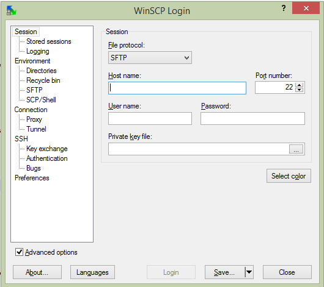

# Module 7 - File Transfer

!!! warning "Historical miniclass"
    This lesson was recovered from the former Sandia minimega site. It is preserved for reference and may describe obsolete software, operating systems, commands, or external resources. Consult the [current documentation](../../index.md) before applying it.

[View the archived source URL](https://www.sandia.gov/minimega/module-7-file-transfer/).

## Introduction

There are a number of ways to transfer files. Let's go over some of them

## SCP and Rsync

SCP stands for secure copy.

SCP uses SSH to transfer a file across a network.

While less secure you can speed up SCP transfers by changing encryption to RC4.

You can also limit bandwidth with the -l flag to kbit/s. Some platforms will ignore this flag.

```
scp -c arcfour -r files/ ubuntu@ubuntu:
```

Rsync uses ssh to transfer files, but is a little more complex and does a better job of merging folders.

It also has a flag that more reliably limits the bandwidth in kbps, which is great if you are on a VPN and don't want to hog the internet.

```
rsync -av --bwlimit=5000 --progress files/ ubuntu@ubuntu:
```

## Winscp

Winscp is a Windows port of SCP that provides a GUI. You can download it [here](https://winscp.net/eng/download.php)



You can also throttle the upload speed when transferring large files.

## Python

Python has an easy way of starting a http server in the local directory.

```
python -m SimpleHTTPServer 8080
```

If your distro has python twistd installed you can start a ftp server in one line too

```
apt-get install python-twistd
echo "a:a">pass.txt && twistd -n ftp -r . -p 2121 --password-file=pass.txt
```

On github you can find a small 294 line SimpleHTTPServer that allows for file upload

```
wget https://gist.githubusercontent.com/UniIsland/3346170/raw/059aca1d510c615df3d9fedafabac4d538ebe352/SimpleHTTPServerWithUpload.py
python SimpleHTTPServerWithUpload.py 8080
```

## Http(s) Server

Images can be referenced from http/https servers.

```
vm config disk http://1.1.1.1/myvm.qcow
```

Minimega will block until the file downloaded to the local base directory
