# Module 13 - Building a VM with virtualbox

!!! warning "Historical miniclass"
    This lesson was recovered from the former Sandia minimega site. It is preserved for reference and may describe obsolete software, operating systems, commands, or external resources. Consult the [current documentation](../../index.md) before applying it.

[View the archived source URL](https://www.sandia.gov/minimega/module-13-building-a-vm-with-virtualbox/).

## Introduction

In this guide we are going to build a VM using virtualbox. Virtualbox is able to create and use qcow images, but NOT qcow2. It is important to note virtualbox uses different virtual hardware than KVM. At boot you may notice drivers being reinstalled if your image was made using virtualbox. Booting with snapshot false once, should fix this.

## Downloading Virtualbox

You can get a copy of virtualbox from [www.virtualbox.org/wiki/Downloads](https://www.virtualbox.org/wiki/Downloads)

## Installing Virtualbox

The install is pretty straightforward. You just press next/install/finish. If it asks to install any drivers do so.

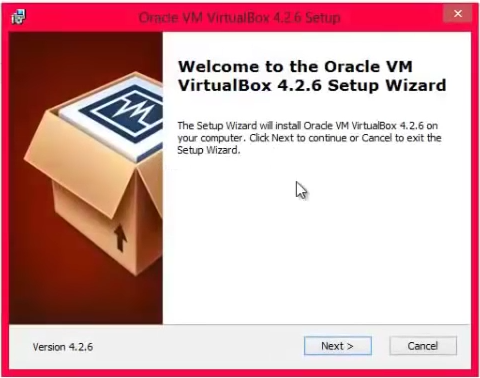
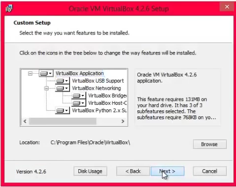
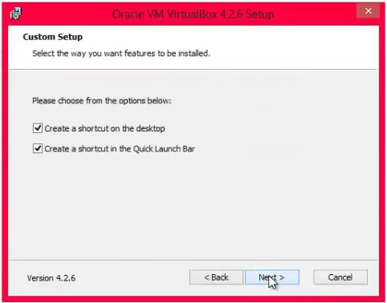
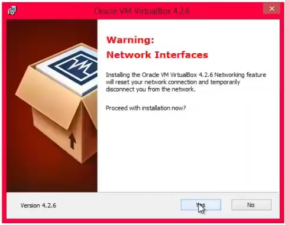
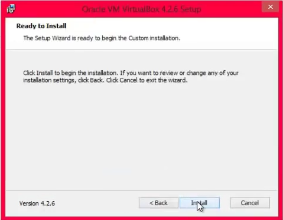
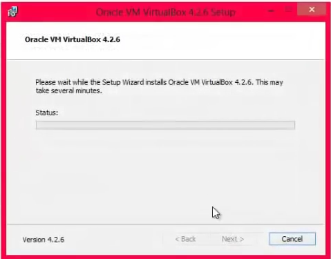

## Creating a VM

Note: When creating a VM in virtualbox you need to be sure to set certain settings. Otherwise you may have hardware issues when you move your virtualbox VM to KVM.

Here are all the steps layed out for you.

Open Virtualbox

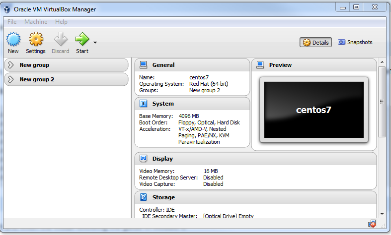

Click New

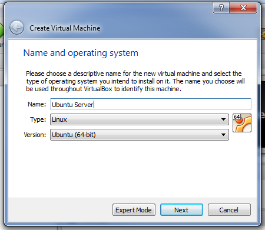

Type a Name

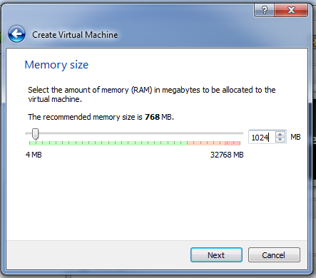

Give it 1024mB ram

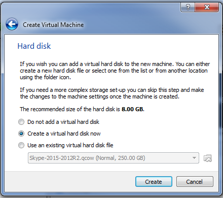

Create a virtual disk

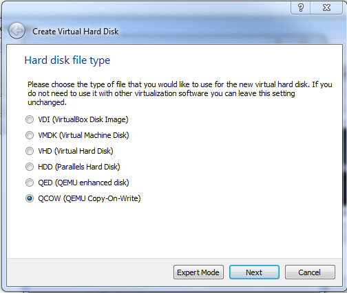

Click qcow, make sure you use qcow!

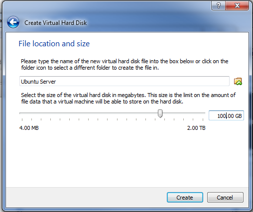

Give the disk 100GB max storage

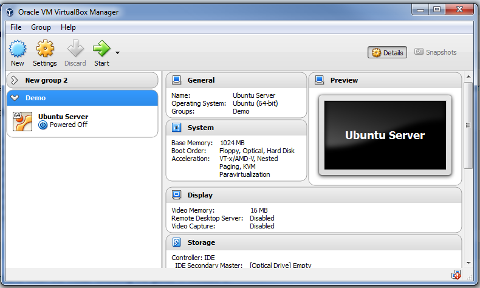

Click the VM and click settings

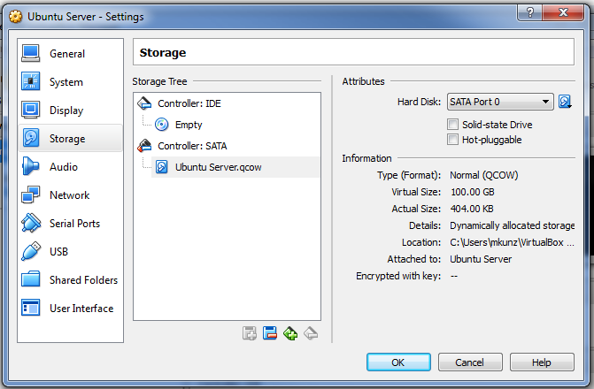

Click Storage and then on Ubuntu Server.qcow

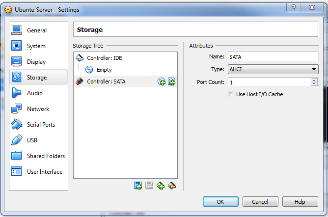

Click the blue floppy with a red dash

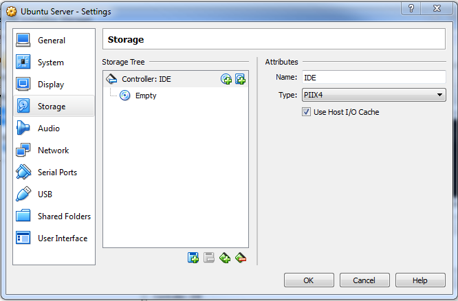

then click on the green icon with a red dash. This should delete the sata controller.

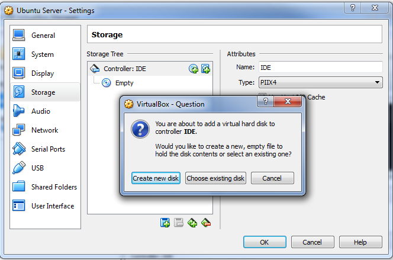

Click on Controller: IDE and then on the hdd with a plus

Click on Choose Existing Disk

Navigate to your Ubuntu Server.qcow, mine was in C:\Users\mkunz\VirtualBox VMs\Demo\Ubuntu Server\Ubuntu Server.qcow

The reason why we did this is because Minimega uses an IDE controller by default, with linux you likely wont run into issues, windows is a different story. If you see a BSOD with a stop 7b it's because of this.

Click on Empty and then the icon of a disk on the right and click choose virtual optical disk file and navigate to the ISO for Ubuntu Server.

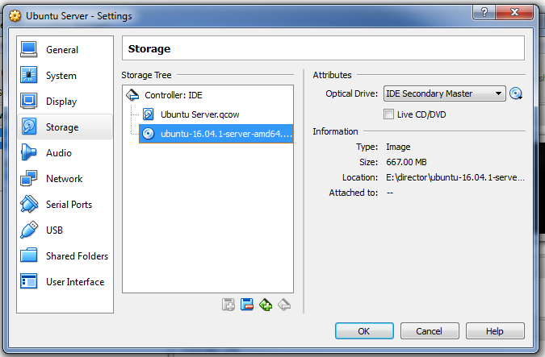

Now click ok and navigate to System->Motherboard and if installing Windows uncheck I/O APIC otherwise you will have to add additional flags when launching with minimega.

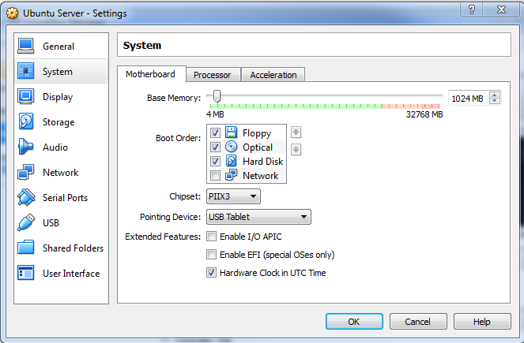

Click ok and you should be able to turn on your VM by clicking on its name then clicking start

Optionally you can configure things like networking or number of cpus.

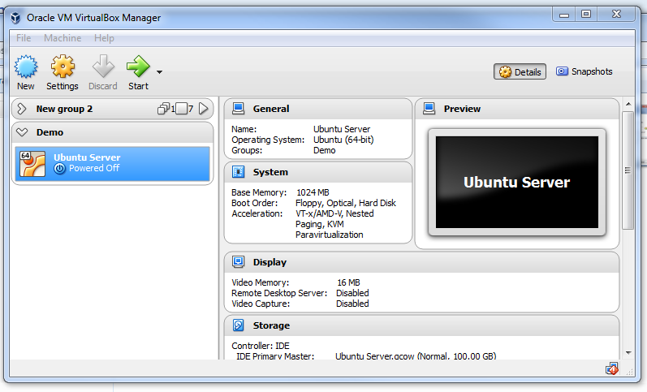
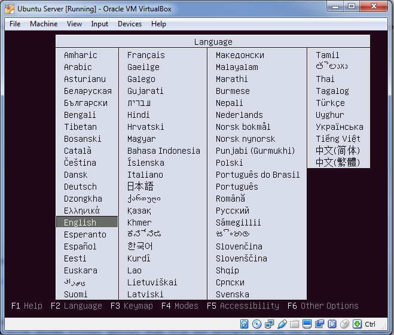

Follow the guide in [Module 1](module-01.md) to install Ubuntu Server

## Shutting Down

When finished make sure you shut down the VM, because the disk may have file system issues if just turned off. You can now copy this Qcow image to your minimega server.
