# Module 25 - Xvesa Issues

!!! warning "Historical miniclass"
    This lesson was recovered from the former Sandia minimega site. It is preserved for reference and may describe obsolete software, operating systems, commands, or external resources. Consult the [current documentation](../../index.md) before applying it.

[View the archived source URL](https://www.sandia.gov/minimega/module-25-xvesa-issues/).

## Introduction

The ISO image for TinyCore has a bug where you will see two mice. This is because the ISO has issues with the display adapter.

## Resolution

This can be resolved by installing TinyCore to a disk image and installing `xorg-7.7` from the repo.

As a workaround when using your mouse on these VMs you can move off the noVNC screen and continue your movement from the opposite side to control where you need to go.

## Step by Step

Download TinyCore Plus.

[distro.ibiblio.org/tinycorelinux/downloads.html](http://distro.ibiblio.org/tinycorelinux/downloads.html)

Start TinyCore with a bridged adapter and a disk in `snapshot false`

```
disk create qcow2 /home/ubuntu/tinycore.qcow2 100G
vm config disk /home/ubuntu/tinycore.qcow2
vm config cdrom /home/ubuntu/CorePlus-current.iso
vm config memory 256
vm config net 0
vm config snapshot false
vm launch kvm tiny
vm start tiny
```

When on the desktop, click on install.

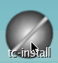

Select Whole Disk, Click on sda, and click on the next arrow.

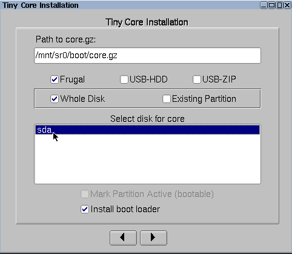

Click on the next arrow

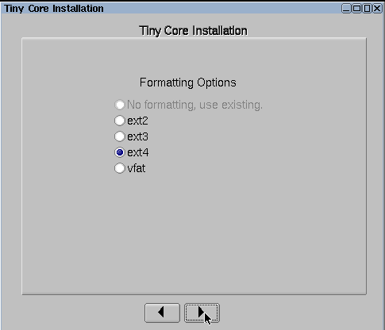

Click on the next arrow

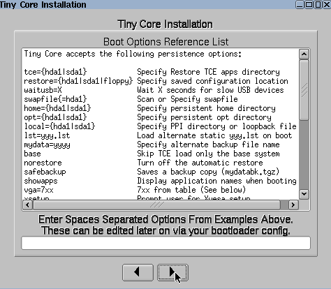

Click on the next arrow

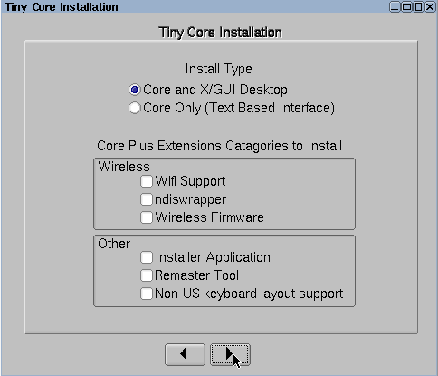

Click proceed

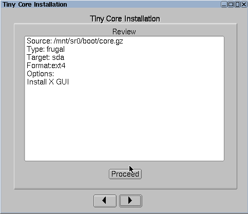

When finished close the window

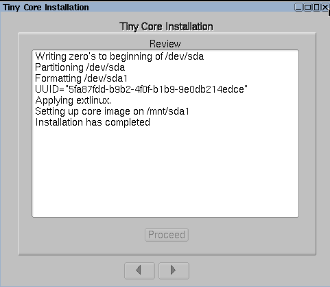

Click on the exit icon in the taskbar


Click OK to shutdown the VM.

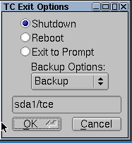

Remove the ISO from the VM.

```
vm flush
clear vm config cdrom /home/ubuntu/CorePlus-current.iso
vm launch kvm tiny
vm start tiny
```

Turn the VM on and when on the desktop Click on Apps

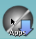

Click Yes

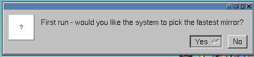

Click OK when the fastest mirror is selected.

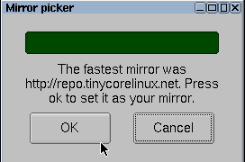

Click Apps->Cloud(Remote)->Browse

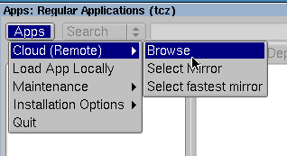

Search for xorg

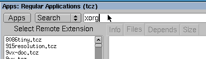

click on Xorg-7.7.tcz

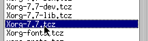

click Go

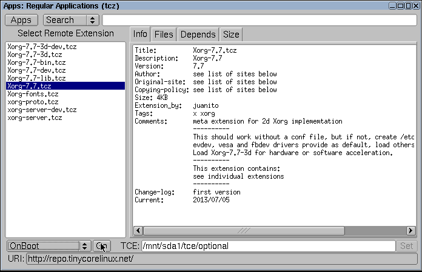

Wait for the download to finish and install

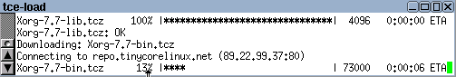

Click on the X to close the Apps window

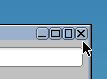

Click on exit


Click OK to turn off the machine


Copy this image to your minimega machine.

## Booting tinycore with Xorg

```
minimega -attach
clear vm config
vm config memory 128
vm config disk /home/ubuntu/tiny.qcow
vm launch kvm tiny
vm start tiny
```

Broken:

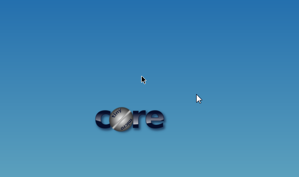

Fixed:

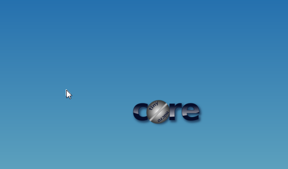

## Fixing the viewport

You may notice the mouse lines up, but the bottom half of the screen scrolls. You need to create a valid `xorg.conf` and set a vga resolution as a kernel append argument.

### To set a kernel append argument

```
sudo vi /mnt/sda1/tce/boot/extlinux/extlinux.conf
```

after quiet add

```
vga=791
```

### To set an xorg.conf

```
sudo vi /etc/X11/xorg.conf
```

And paste the following file

```
Section "ServerLayout"
   Identifier     "X.org Configured"
   Screen      0  "Screen0" 0 0
   InputDevice    "Mouse0" "CorePointer"
   InputDevice    "Keyboard0" "CoreKeyboard"
EndSection

Section "Files"
ModulePath   "/usr/local/lib/xorg/modules"
   FontPath     "/usr/local/lib/X11/fonts/misc/"
   FontPath     "/usr/local/lib/X11/fonts/TTF/"
   FontPath     "/usr/local/lib/X11/fonts/OTF/"
   FontPath     "/usr/local/lib/X11/fonts/Type1/"
   FontPath     "/usr/local/lib/X11/fonts/100dpi/"
   FontPath     "/usr/local/lib/X11/fonts/75dpi/"
EndSection

Section "Module"
   Load  "glx"
EndSection

Section "InputDevice"
   Identifier  "Keyboard0"
   Driver      "kbd"
EndSection

Section "InputDevice"
   Identifier  "Mouse0"
   Driver      "mouse"
   Option       "Protocol" "auto"
   Option       "Device" "/dev/input/mice"
   Option       "ZAxisMapping" "4 5 6 7"
EndSection

Section "Monitor"
   Identifier   "Monitor0"
   VendorName   "Monitor Vendor"
   ModelName    "Monitor Model"
EndSection

Section "Device"
   Identifier  "Card0"
   Driver       "vesa"
   BusID       "PCI:0:2:0"
EndSection

Section "Screen"
   Identifier "Screen0"
   Device     "Card0"
   Monitor    "Monitor0"
   DefaultDepth   16
   SubSection "Display"
      Virtual 1024 768
      Depth   16
      Modes   "1024x768"
   EndSubSection
EndSection
```

With TinyCore in order to save files between boots they need to be added to a list

```
sudo vi /opt/.filetool.lst
```

This list needs to be processed by the program `filetool.sh`

```
sudo filetool.sh -b
```

On reboot this should fix the view port issue.
