# I made the very model, but the model was too general

> Modeling every cyber vegetable, animal, and mineral

<a id="TOC_1."></a>

## Agenda

- Introduction / About Sandia
- Motivation
- Overview of Sandia Emulytics
- Research challenges
- Shameless recruiting plug

<a id="TOC_2."></a>

## About Sandia

- Nuclear weapons laboratory, began as the Z division of Los Alamos at the end of the Manhattan Project
- Ordnance design, testing, and assembly
- Gained expertise in red-teaming NW systems
- Carried that expertise into new domains as the lab grew, including cyber
- Lots of cyber focus areas, including modeling and simulation for critical infrastructure, etc.

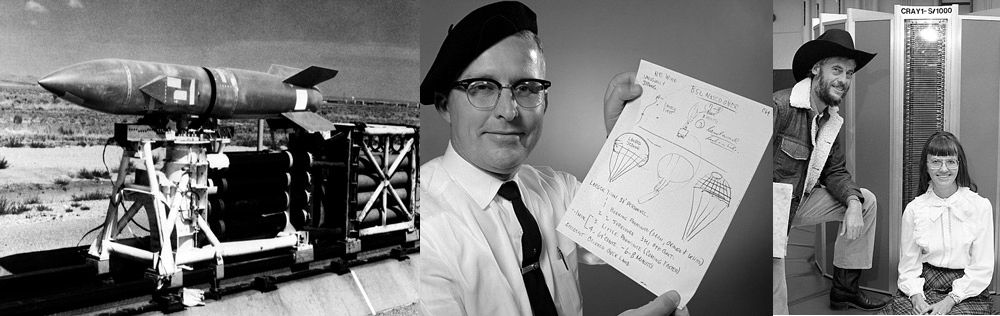{ width="900" }

<a id="TOC_3."></a>

##

{ width="500" }

<a id="TOC_4."></a>

## The idea

- We're working to boot millions of IT endpoints
- And couple that with millions of non-traditional endpoints

    -  Mobile devices
    -  IoT
    -  SCADA/ICS

- And couple **that** with behavioral models

    -  Sociology, cognitive science, ...

- Focus on national scale problems

    -  Interdependency studies of electric power, IT, OT, telephony, IoT...
    -  Cyber and cyber-physical domains are all fair game

<a id="TOC_5."></a>

## Emulytics

- Emulation + Analytics
- Blend hardware in the loop, simulation, and emulation
- Also support human in the loop

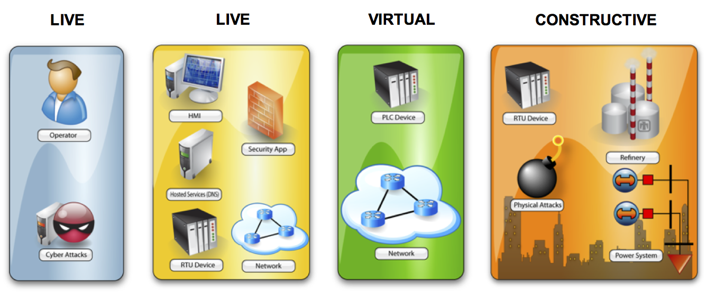{ width="900" }

<a id="TOC_6."></a>

## Why model?

**As a National Laboratory, we get to study lots of interesting problems**

- *DevOps*: Can we pre-flight new hardware, software, services, to ensure operation in high consequence environments? Can we conduct predictive analysis to detect malfunctions, misconfigurations, malicious consequences?
- *Malware*: Can we gain new understanding of malware through pseudo-in situ execution? How will these 1 million samples impact *my* network specifically?
- *ICS/SCADA*: What are the best countermeasures for my IT-connected ICS systems, despite not having certainty about the threat? Can I detect attacks on ICS systems from the IT-connected perspective? Can I prove resiliency solutions for IT-control over entire power grids?
- *Nuclear Weapons*: Can we ensure the President will always be able to communicate with a weapon regardless of network state and threat?

<a id="TOC_7."></a>

## Research and Development in Emulytics

- These are great research questions

    -  And we won't be looking at any of them today
    -  But they do prompt a number of R&D activities in Emulytics itself

<a id="TOC_8."></a>

## So where do we start

- A few interesting things happened in 2007

    -  Cyberattacks in Estonia
    -  KVM gets merged into Linux 2.6.20
    -  iPhone is released
    -  Worst European heat wave in a century (probably unrelated)

- Fast forward to 2008

    -  We boot 4 million KVM VMs on Jaguar at Oak Ridge National Laboratory
    -  Lessons learned: Switch forwarding tables are still very much vulnerable to MAC flooding

<a id="TOC_9."></a>

## VM-based sandboxes

Can we make use of VM-based sandboxes to model enough of a country to study national-scale attacks?

- Is my house on fire or is Atlanta on fire?
- How much detail needs to be in the model?

[miniweb](http://localhost:9001)

<a id="TOC_10."></a>

## A few notes on scale

- One possibility is to use HPC resources

    -  Titan - ~300k core / ~18k node AMD cluster
    -  Sequoia - ~1.5M core / 98k node PPC cluster
    -  And all those little 10k core systems out there

- They all run Linux
- We have access!

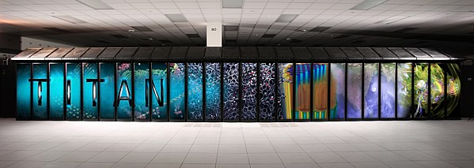

<a id="TOC_11."></a>

## 100 nodes

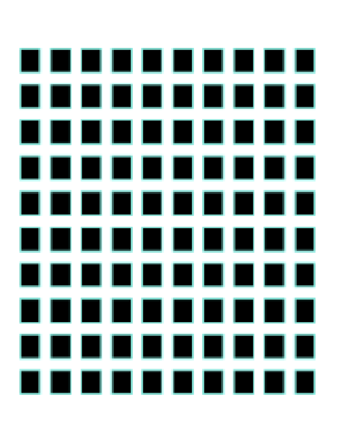{ height="500" }

<a id="TOC_12."></a>

## 10,000 nodes

A typical supercomputer

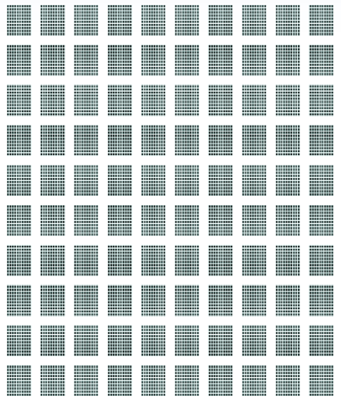{ height="500" }

<a id="TOC_13."></a>

## 1M nodes

We've run out of pixels

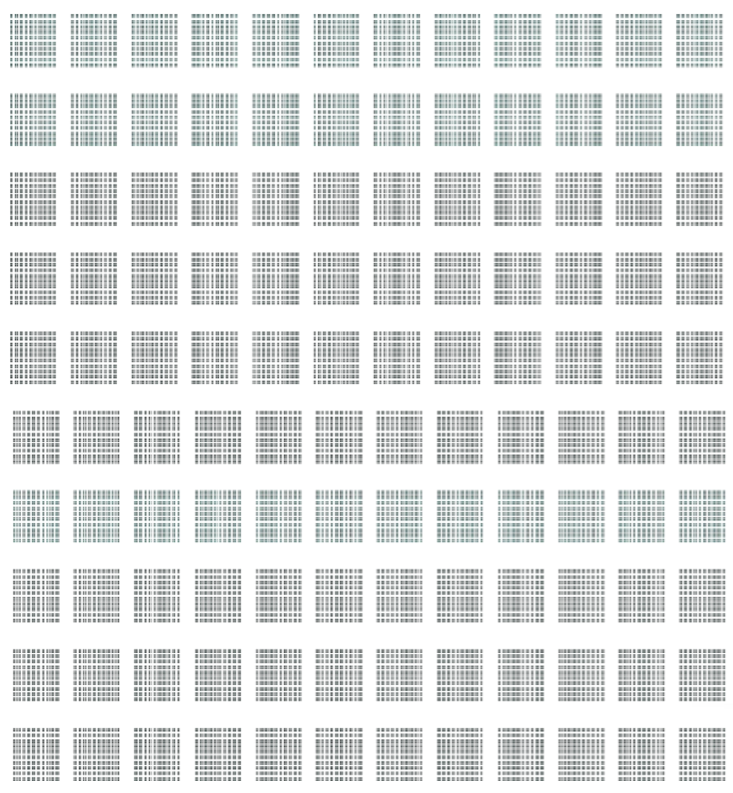{ height="500" }

<a id="TOC_14."></a>

## 10M nodes

Diffraction pattern

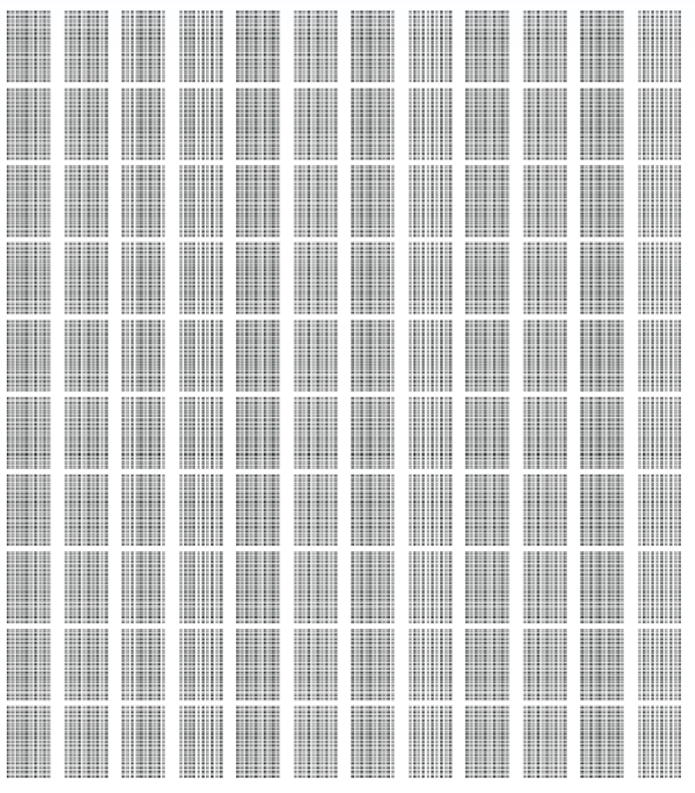{ height="500" }

<a id="TOC_15."></a>

## Why don't we use the public internet?

- That's the supercomputer
- The bad guys do
- The internet has hundreds (of millions) of nodes
- As a legal entity, Sandia would have some difficulty pursuing this approach :)

<a id="TOC_16."></a>

## Enter minimega

- [Open source](https://github.com/sandia-minimega/minimega), publicly available, active development
- Launch and manage VM-based experiments
- Setup complex network topologies
- Integrate real hardware with virtual experiments

    -  Or simulators
    -  Or humans

- Fast!
- Repeatable (for some definition of repeatable)
- One tool in the toolset; the substrate for a number of programs

    -  One of your grad students is responsible for the another major tool

<a id="TOC_17."></a>

## R&D in Emulytics

- The research questions from before inform all sorts of R&D in the platform
- And they're all important!

    -  Scale / density
    -  VM placement / scheduling
    -  Experiment description and discovery
    -  Behavioral/threat modeling
    -  Non-IT comms
    -  Measuring humans-in-the-loop
    -  **Verification & Validation**
    -  ...

- We can walk through a few of these

<a id="TOC_18."></a>

## Experiment description and discovery

**Can we automate the description (and generation) of models of large, real networks?**

- Map-to-model isn't a new problem
- But it's novel for getting to a *bootable* model
- Operators often don't know what is actually on their network
- Result is significant hand-tooling, human in the loop

    -  Humans don't scale when building national scale models...

<a id="TOC_19."></a>

## Map-to-Model

- Ingest router configs, PCAP, active scans, exotic datasets, ...
- And simply build a graph
- Allow operator-defined templating of "actions" on nodes in the graph
- Template system allows for multi-pass model generation
- Iterative workflow
- Infinite models from one intermediate representation

```text
{{ if .Node.D.name }}
    vm launch container {{ .Node.D.name }}
{{ else }}
    {{ $name := printf "discovery-node-%v" .Node.NID }}
    vm launch container {{ $name }}
    {{ setData .Node "name" $name }}
{{ end }}
```

<a id="TOC_20."></a>

## Example: SCinet

- High capacity network

    -  9x 100Gbps links

- Exists for 2 weeks a year
- Supports the SC conference

    -  10k+ attendees

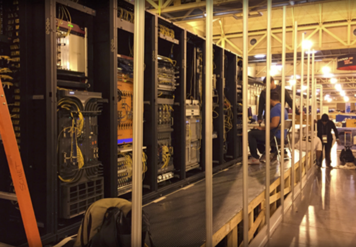{ height="300" }

<a id="TOC_21."></a>

## SC16

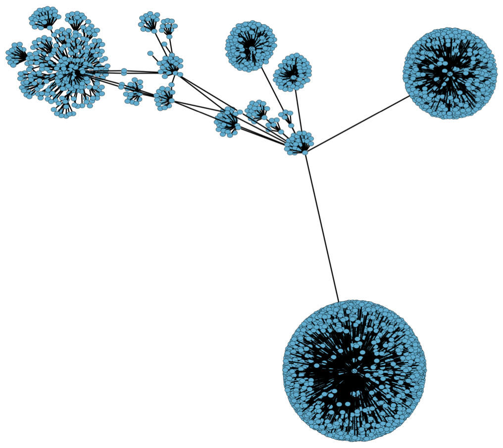{ height="500" }

<a id="TOC_22."></a>

## SC17

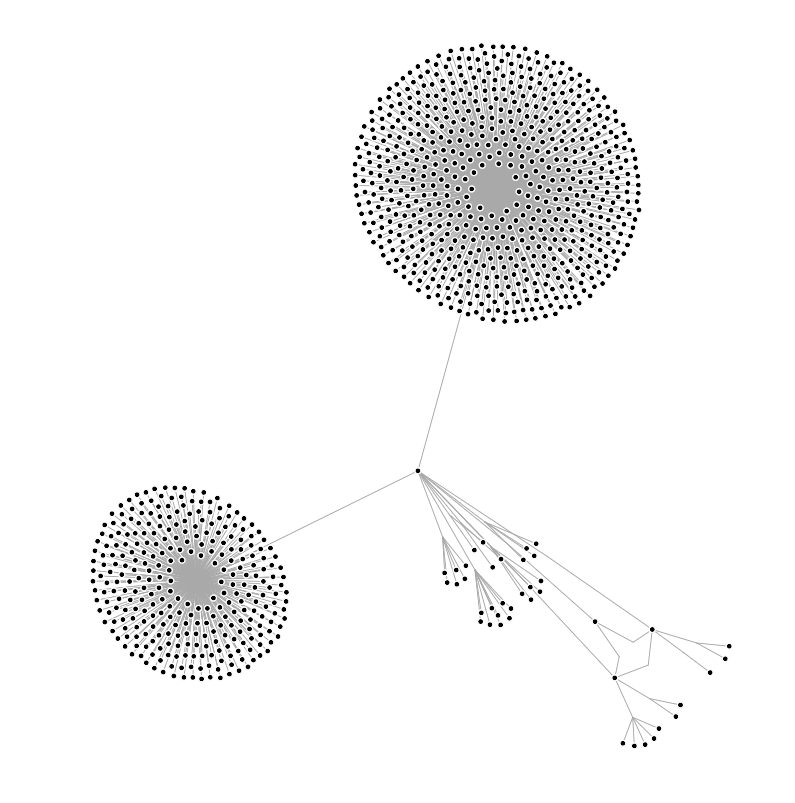{ height="500" }

[Animation!](gt_2018_content/sc17.mp4)

<a id="TOC_23."></a>

## Non-IT comms (representing IoT devices)

**How do we plumb non-network based connectivity?**

- Vehicle radars
- **physics** - sound, heat, light, rabid bunnies
- cyber-physical interactions of all kinds

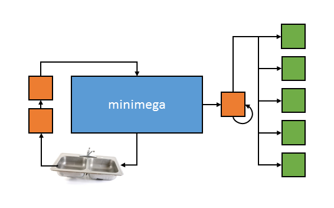{ width="500" }

<a id="TOC_24."></a>

## Plumbing

Enter *miniplumber*

- A networkless, out-of-band, inter-process communication layer
- Quick specification of communication pathways (pipelines)
- uni- or multi-cast experiment communication
- Supports any number of clients (scales along with the rest of minimega)
- Similar to unix pipelines (though not limited to linear pipelines)
- Borrows concepts from the plan 9 plumber
- Newline delimited messages (as opposed to unix byte streams)
- Works on host, in minimega, and any miniccc client (ARM, x86-64 / *bsd, linux, windows)

<a id="TOC_25."></a>

## Example: Setting fire to your datacenter

- Temperature sensors in datacenter
- More sensors outside of the room
- Thermal alerts at 80F, critical at 100F (shutdown)
- Room temperature simulated as a simple value injected by the user

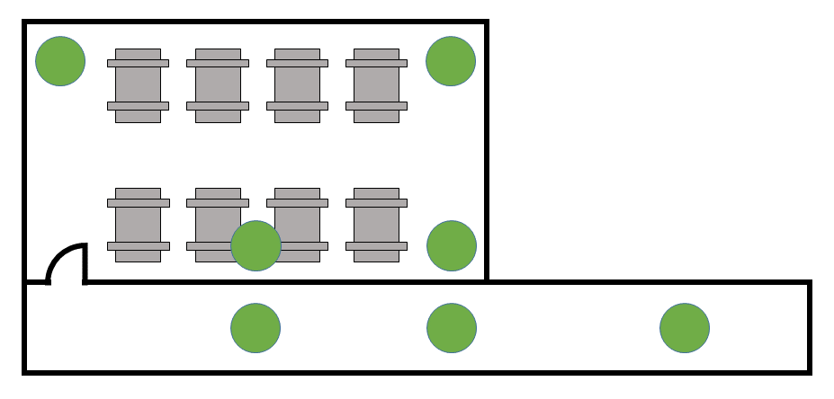{ width="700" }

<a id="TOC_26."></a>

## Plumbing

- In-room sensors see slightly different values (via)
- Out-of-room sensors see different distribution (truncated function of room temperature)
- Critical thermal event triggers shutdown of in-room machines
- in/out-of-room defined simply by pipe source (no need for geographic annotation)

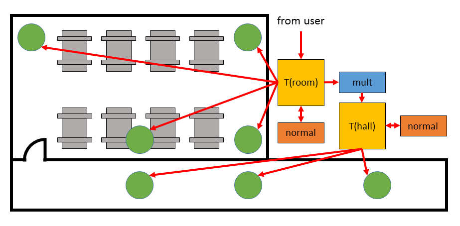{ width="700" }

<a id="TOC_27."></a>

## Plumbing

```minimega title="fire.mm"
--8<-- "presentations/gt_2018_content/fire.mm"
```

[Download this example](gt_2018_content/fire.mm){ download="fire.mm" }

<a id="TOC_28."></a>

## Plumbing

```minimega title="fire2.mm"
--8<-- "presentations/gt_2018_content/fire2.mm"
```

[Download this example](gt_2018_content/fire2.mm){ download="fire2.mm" }

<iframe src="http://localhost:4451" width="1000" height="450"></iframe>

<a id="TOC_29."></a>

## Example: Digital logic

- Not really a cyber-physical example, but it shows the power of the communication framework
- Use plumbing as nets in a circuit
- VMs as discrete logic components (and, or, not, xor provided)
- 5-bit unsigned array multiplier
- 145 gates (VMs)
- 166 nets (pipes)

<a id="TOC_30."></a>

## Plumbing

```minimega title="array.mm"
--8<-- "presentations/gt_2018_content/array.mm"
```

[Download this example](gt_2018_content/array.mm){ download="array.mm" }

<a id="TOC_31."></a>

## Multiplication

```minimega title="array2.mm"
--8<-- "presentations/gt_2018_content/array2.mm"
```

[Download this example](gt_2018_content/array2.mm){ download="array2.mm" }

<a id="TOC_32."></a>

## Verification and Validation

We don't know how much to trust the results from our emulation-based models

- Virtual machines, virtual networks, emulators, simulators...
- Real software, real network packets, real behavior

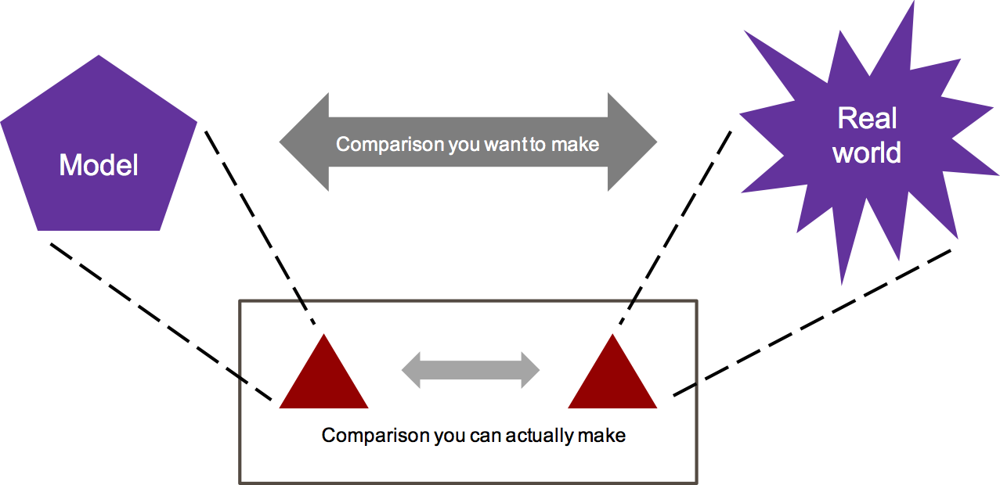{ width="700" }

<a id="TOC_33."></a>

## V&V

- Short answer: It depends
- Case study: DNS amplification attack modeling

    -  We know that disabling logging in DNS servers can exacerbate the effect of the attack
    -  Because DNSd is suddenly more performant

- Can we illustrate this in a model?

<a id="TOC_34."></a>

## DNS bare metal performance

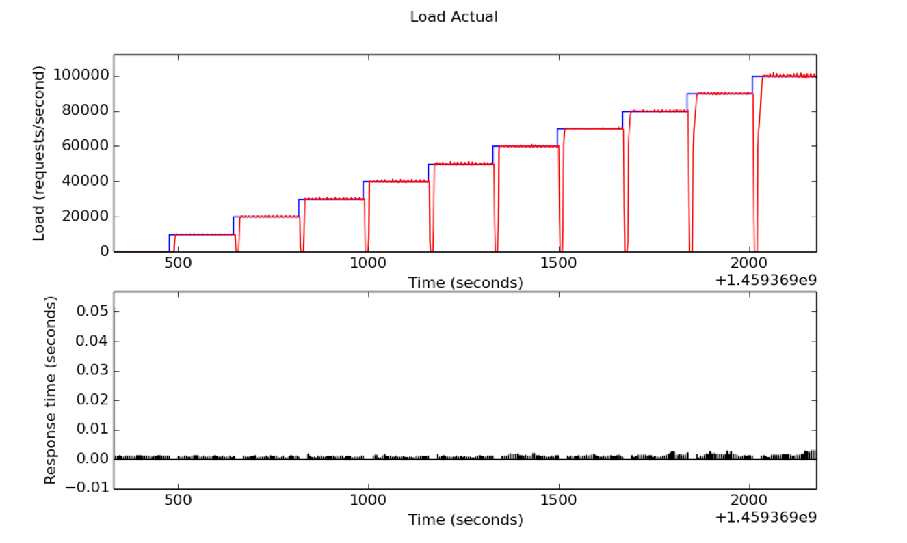{ height="500" }

<a id="TOC_35."></a>

## DNS emulated performance

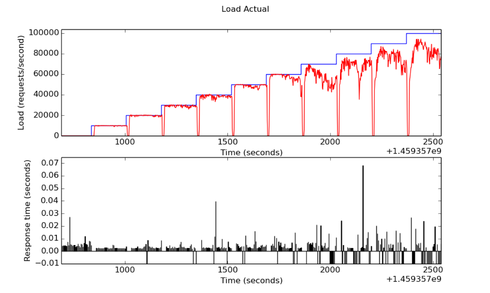{ height="500" }

<a id="TOC_36."></a>

## Virtual artifacts

- We're starting to make a 'cookbook' of virtual artifacts
- Goal is to provide the experiment designer with measurement boundaries

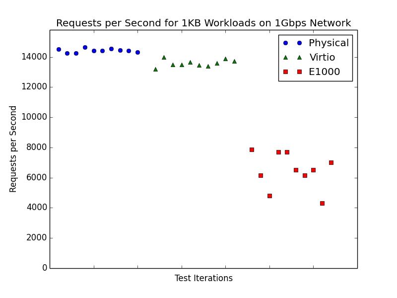{ height="500" }

<a id="TOC_37."></a>

## And why not...

In a talk about modeling everything, why not play out the [game of life?](http://localhost:5001/graph)

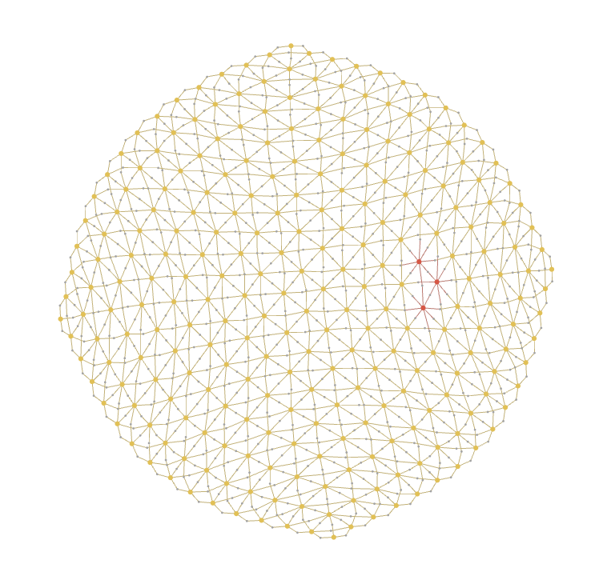{ height="500" }

<a id="TOC_38."></a>

## Ongoing research

<a id="TOC_39."></a>

## Threat modeling

*Cyber doesn't exist in the absence of an adversary*

- Or from a modeling perspective...
- The quality of our cybersecurity modeling is bound to the quality of the represented threat
- So how do we model threat in a holistic way?

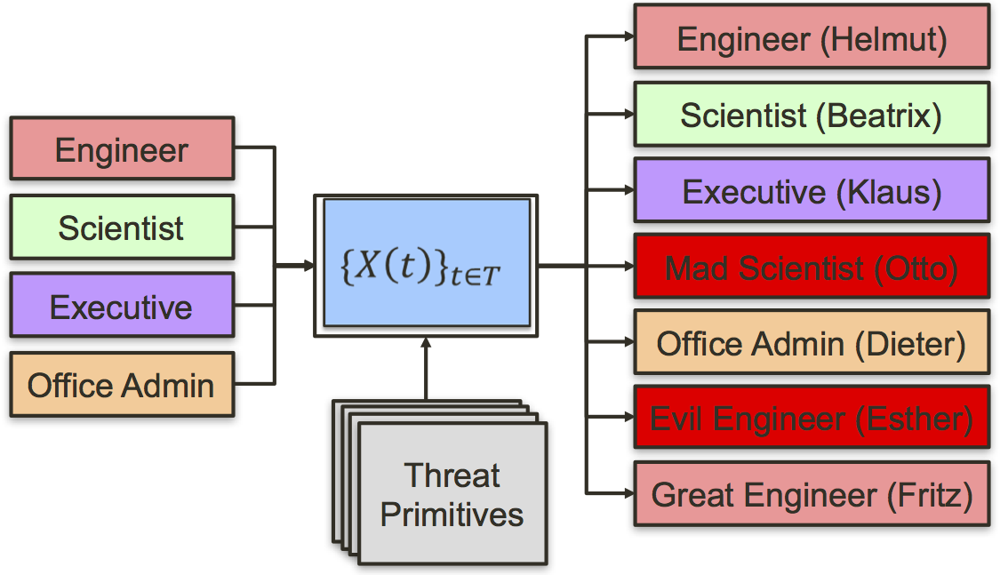{ height="300" }

<a id="TOC_40."></a>

## Threat modeling

- Two major pushes

    -  Threat parsing
    -  Threat/actor modeling

- The latter is a traffic generation problem

    -  Represent all the high-order things an attacker does
    -  Dropped files, timing, laziness...

- Academic alliance with Purdue, GT, NM Tech

    -  Dr. Manos Antonakakis

<a id="TOC_41."></a>

## A plug

We need help!

- Academic partnerships
- Internships

    -  Undergrad through post-doc

- Full-time R&D staff

    -  Masters and Ph.D.

{ height="40" }

{ height="40" }

{ height="40" }
