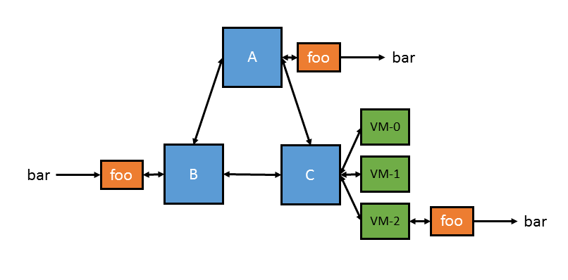

# Introducing miniplumber


<a id="TOC_1."></a>

## Introduction

miniplumber provides uni- and multi-cast experiment communication to VMs, minimega instances, and external programs anywhere in an experiment.


<a id="TOC_2."></a>

## Motivation

How do we plumb non-network based connectivity?

- Emulytics helps study many network-centric problems
- minimega builds networks easily
- Great support for describing machine-to-machine structure/behavior
- **Not great** support for describing machine-to-anything-else structure/behavior

<a id="TOC_3."></a>

## Plumbing the kitchen sink

- Buttons
- Serial connections
- Vehicle radars
- **physics** - sound, heat, light, rabid bunnies
- cyber-physical interactions of all kinds
- measurement data-planes

{ width="300" }

<a id="TOC_4."></a>

## Plumbing

Enter *miniplumber*

- A networkless, out-of-band, inter-process communication layer
- Quick specification of communication pathways (pipelines)
- uni- or multi-cast experiment communication
- Supports any number of clients (scales along with the rest of minimega)
- Similar to unix pipelines (though not limited to linear pipelines)
- Borrows concepts from the plan 9 plumber
- Newline delimited messages (as opposed to unix byte streams)
- Works on host, in minimega, and any miniccc client (ARM, x86-64 / *bsd, linux, windows)

<a id="TOC_5."></a>

## A quick example

```minimega title="example1.mm"
--8<-- "presentations/miniplumber_content/example1.mm"
```

[Download this example](miniplumber_content/example1.mm){ download="example1.mm" }

<a id="TOC_6."></a>

## Plumbing objects

- Simple standard I/O based communication
- Easily plumbed to existing unix tools
- Several minimega-supplied tools (minevent, distribution functions, etc.)
- Pipelines are plumbed locally, pipe data is forwarded everywhere

```minimega title="external.mm"
--8<-- "presentations/miniplumber_content/external.mm"
```

[Download this example](miniplumber_content/external.mm){ download="external.mm" }

<a id="TOC_7."></a>

## Plumbing with CC

```minimega title="cc.mm"
--8<-- "presentations/miniplumber_content/cc.mm"
```

[Download this example](miniplumber_content/cc.mm){ download="cc.mm" }

<a id="TOC_8."></a>

## minimega distribution

Fully distributed via meshage



<a id="TOC_9."></a>

## Out-of-band communication

- Works over meshage for node-to-node communication
- Uses miniccc/ron for node-to-VM communication
- Fully out-of-band when using miniccc networkless backchannels

<a id="TOC_10."></a>

## Message scheduling

- Support for most communication use cases
- one-to-many
- one-to-one (round robin, random)

```minimega title="scheduling.mm"
--8<-- "presentations/miniplumber_content/scheduling.mm"
```

[Download this example](miniplumber_content/scheduling.mm){ download="scheduling.mm" }

<a id="TOC_11."></a>

## vias

- Produce unique output for *every* reader on a pipe
- Call an external program N times
- Remote readers also get unique values

```minimega title="via.mm"
--8<-- "presentations/miniplumber_content/via.mm"
```

[Download this example](miniplumber_content/via.mm){ download="via.mm" }

<a id="TOC_12."></a>

## Use cases

- cyber-physical experiments
- training
- data forwarding

<a id="TOC_13."></a>

## Summary

- *miniplumber* - simple, out-of-band communication framework
- Growing library of communication primitives, support for any external program
- Bring cyber-physical / simulation layers to emulytics
