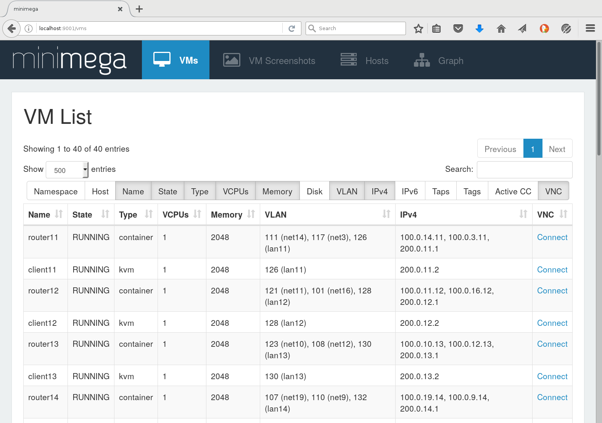
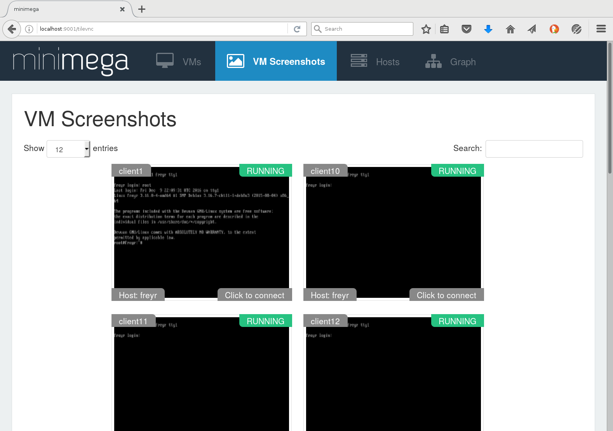
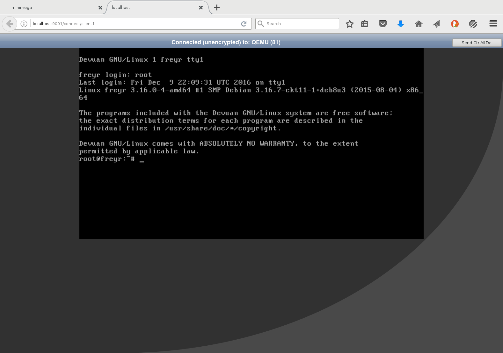
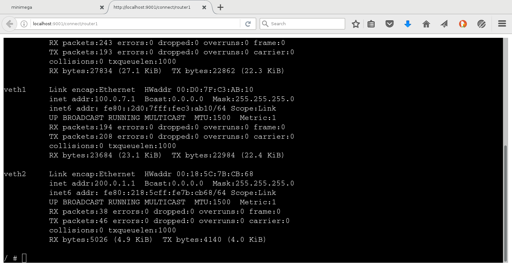
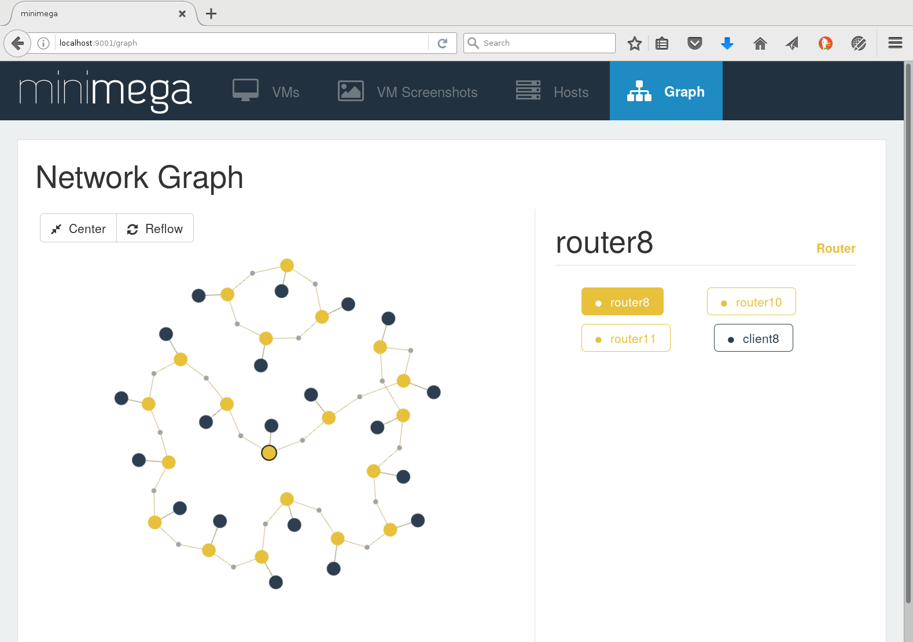

# Screenshots

Although minimega is primarily controlled through commands and scripts,
miniweb provides a browser interface for inspecting experiments.

## VM list

The default view displays running VMs and links to their consoles:

## VM screenshots

The VM Screenshots view gives an overview of guest displays:

## VNC console

KVM guests have an HTML5 VNC console:

## Container terminal

Container guests have a text terminal:

## Network graph

The graph view visualizes experiment networks and VMs:

