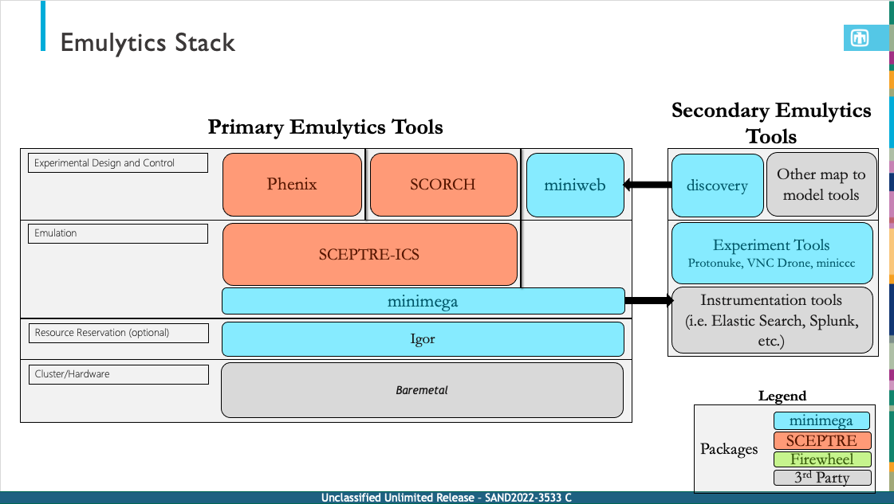

# Supporting tools

The minimega repository includes programs for building VM images, managing
clusters, generating traffic, and testing experiments.

## miniweb

miniweb is the browser-based interface for minimega. See the
[miniweb documentation](articles/miniweb.md).

## vmbetter

vmbetter creates minimega-bootable, Debian-based virtual machine images from a
configuration file. It can build initrd images, ISO images, and QEMU-compatible
disk images. See the [vmbetter tutorial](articles/tutorials/vmbetter.md).

## igor

igor manages cluster reservations and network booting. See the
[igor repository](https://github.com/sandia-minimega/igor2).

## powerbot

powerbot controls networked Power Distribution Unit outlets. See the
[powerbot documentation](articles/powerbot.md).

## rfbplay and vncdrone

rfbplay replays or transcodes VNC recordings made by minimega. vncdrone replays
recorded keyboard and mouse activity on matching virtual machines. See the
[VNC documentation](articles/vnc.md).

## nfcat

nfcat converts binary netflow records written by minimega's `capture` API to
text on standard output.

## minitest and minifuzzer

minitest runs command-based functional tests against minimega. See the
[minitest documentation](articles/minitest.md). minifuzzer generates random
minimega commands to identify crashes.

## passwordify

passwordify installs a root password or SSH keys into a ramdisk image. It can
also configure images for passwordless access between nodes booted from the
same image.

## rond

rond is a standalone command-and-control server for physical machines running
miniccc.

## vmconfiger

vmconfiger generates the `vm config` APIs from minimega's VM configuration
types. It runs automatically through `go generate`.
