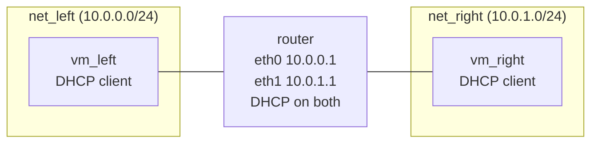

# Chapter 3: The router sandwich

This chapter builds the experiment the rest of the course extends: two Linux
VMs on separate networks, joined by a router that hands out addresses on
both. You launch the three VMs, configure the router from the minimega
prompt, start everything in the right order, and then prove it works by
pinging from one client to the other through the router, without ever
logging in to a guest. At the end you have the running *router sandwich* and
a script that rebuilds it in under a minute.

It assumes the images from [chapter 2](02-images.md) are in
`/tmp/minimega/files` and minimega is running as set up in
[chapter 1](01-install.md).



`net_left` and `net_right` are two VLANs on the host's Open vSwitch bridge.
The two clients cannot see each other directly; every packet between them
crosses the router.

## A namespace for the experiment

Every command in the course runs inside a namespace called `sandwich`.
A namespace is a container for an experiment: its VMs, its VLAN aliases, its
`vm config` template and its cc state are separate from those of every other
namespace, so two experiments on one host cannot collide, and destroying the
namespace tears the whole experiment down in one command.

```minimega
minimega$ namespace sandwich
```

`namespace <name>` creates the namespace if it does not exist and makes it
the active one for your prompt. An interactive prompt shows it,
`minimega[sandwich]$`; an attached prompt does not, so `namespace` with no
argument is how you check:

```minimega
minimega$ .annotate false namespace
namespace | vlans    | active
minimega  | 101-4096 | false
sandwich  |          | true
```

`minimega` is the default namespace, always present. If you come back to the
prompt later and `vm info` looks empty, the first thing to check is that you
are still in `sandwich`. [Chapter 16](16-namespaces.md) covers namespaces in
depth.

## Describe and launch the clients

`vm config` holds the description that the next `vm launch` will copy. Point
it at the client image, give the VM 2 GB of memory (the default, but the
course says so explicitly), and put its single interface on a network named
`net_left`:

```minimega
minimega$ vm config kernel miniccc.kernel
minimega$ vm config initrd miniccc.initrd
minimega$ vm config memory 2048
minimega$ vm config networks net_left
minimega$ vm launch kvm vm_left
```

`net_left` is a *VLAN alias*. minimega allocates a VLAN tag the first time it
sees a name, remembers the mapping for the namespace, and uses that tag for
every interface that names `net_left` from then on. You never pick tag
numbers yourself; [chapter 6](06-networking.md) explains the netspec and the
alias table.

`vm launch kvm vm_left` creates one KVM VM named `vm_left` from the current
description. It exists now, with its tap on the bridge and a QEMU process
waiting, but it is not running; that is the `BUILDING` state.

The description is still there after the launch, so the second client only
needs a different network:

```minimega
minimega$ vm config networks net_right
minimega$ vm launch kvm vm_right
```

## Describe and launch the router

The router boots the other image and has two interfaces, one on each
network. Interfaces are numbered by their position in `vm config networks`,
and that numbering is how the router configuration refers to them below:
interface 0 is on `net_left`, interface 1 on `net_right`.

```minimega
minimega$ vm config kernel minirouter.kernel
minimega$ vm config initrd minirouter.initrd
minimega$ vm config networks net_left net_right
minimega$ vm launch kvm router
```

Three VMs, all `BUILDING`:

```minimega
minimega$ .annotate false .columns name,state,vlan vm info
name     | state    | vlan
router   | BUILDING | [net_left (101), net_right (102)]
vm_left  | BUILDING | [net_left (101)]
vm_right | BUILDING | [net_right (102)]
```

The numbers in parentheses are the tags minimega allocated for the aliases,
starting at 101, the bottom of the default VLAN range.

## Configure the router

The router image runs minirouter, a small daemon that turns the VM into a
router you configure from the minimega prompt. Each `router <vm> ...` command
edits a description that minimega holds; nothing reaches the VM until you
commit. Give interface 0 an address and a DHCP server for its network, then
the same for interface 1:

```minimega
minimega$ router router interface 0 10.0.0.1/24
minimega$ router router dhcp 10.0.0.0 range 10.0.0.2 10.0.0.254
minimega$ router router dhcp 10.0.0.0 router 10.0.0.1
minimega$ router router interface 1 10.0.1.1/24
minimega$ router router dhcp 10.0.1.0 range 10.0.1.2 10.0.1.254
minimega$ router router dhcp 10.0.1.0 router 10.0.1.1
```

The first word after `router` is the VM's name, which happens to be
`router` too; `router r0 interface ...` would configure a VM named `r0`.
Then:

- `interface <index> <address/prefix>` puts a static address on the
  interface at that position in `vm config networks`.
- `dhcp <network> range <low> <high>` starts a DHCP server for the given
  network with that pool of leases. The network address is the key: every
  later `dhcp 10.0.0.0 ...` line adds to the same server.
- `dhcp <network> router <address>` is the default gateway the server hands
  out with each lease. Without it the clients get addresses but no route to
  the other side.

No DNS option is set, because this router serves no names; the clients only
need to reach each other by address. No routing protocol is needed either:
the router has an interface on both networks, so it knows where each one is,
and the default gateway in each lease sends the clients' traffic to it.

Now commit:

```minimega
minimega$ router router commit
```

`commit` writes the description to a file, `minirouter-router`, in the
namespace's part of the files directory, then queues three command and
control commands for the router VM: remove any older copy of the file from
`/tmp/miniccc/files/` in the guest, send the new file, and run
`minirouter -u` on it. Those commands wait in minimega's queue until the
miniccc agent inside the router connects, so it is fine to commit before the
VM is running; the configuration arrives a few seconds after boot. Every
commit sends the complete description, so changing a running router is just
another commit.

## Start, in order

Start the router first and give it ten seconds. Its `init` waits for devices
to settle before it starts miniccc, and minirouter needs the configuration
before it can serve leases; if the clients boot first, their DHCP client may
time out before anyone answers.

```minimega
minimega$ vm start router
minimega$ shell sleep 10
minimega$ vm start all
```

`shell` runs a program on the host and waits for it, which is how a command
file pauses. `vm start all` starts every VM that is `BUILDING` or `PAUSED`
and skips the one that is already running, so it is safe to call after
`vm start router`. Twenty seconds later the guests have booted and taken
their leases:

```minimega
minimega$ .annotate false .columns name,state,vlan,ip vm info
name     | state   | vlan                              | ip
router   | RUNNING | [net_left (101), net_right (102)] | [10.0.0.1, 10.0.1.1]
vm_left  | RUNNING | [net_left (101)]                  | [10.0.0.2]
vm_right | RUNNING | [net_right (102)]                 | [10.0.1.2]
```

The `ip` column is learned by watching traffic on each VM's tap, so it
trails the guest by a moment and stays empty for a VM that has not sent a
packet. If a client's address is missing after half a minute, the router did
not serve it; [chapter 10](10-troubleshooting.md) walks through why.

`vlans` shows the alias table the namespace built up:

```minimega
minimega$ .annotate false vlans
alias     | vlan
net_left  | 101
net_right | 102
```

## Ping through the router

Every VM in the sandwich runs miniccc, and `cc` alone reports how many
agents are connected. Three means the router and both clients:

```minimega
minimega$ .annotate false cc
clients
3
```

`cc exec` runs a command on every connected agent, and `cc filter` narrows
that to the VMs you name. Filter on `vm_left` and ping `vm_right` through
the router. The command is queued, delivered, and run; nothing is printed
until you ask for the response:

```minimega
minimega$ cc filter name=vm_left
minimega$ cc exec ping -c 3 10.0.1.2
minimega$ cc commands
```

`cc commands` lists every command minimega has issued in the namespace with
its id. The first three are the router commit; the ping is the fourth, and
the `responses` column turns to 1 once `vm_left` has reported back. Read it:

```minimega
minimega$ cc responses 4
4/<uuid of vm_left>/stdout:
PING 10.0.1.2 (10.0.1.2) 56(84) bytes of data.
64 bytes from 10.0.1.2: icmp_seq=1 ttl=63 time=1.4 ms
64 bytes from 10.0.1.2: icmp_seq=2 ttl=63 time=0.8 ms
64 bytes from 10.0.1.2: icmp_seq=3 ttl=63 time=0.7 ms

--- 10.0.1.2 ping statistics ---
3 packets transmitted, 3 received, 0% packet loss, time 2003ms
```

The `ttl=63` is the proof: the reply left `vm_right` with a TTL of 64 and
crossed one router. `cc exitcode 4 vm_left` prints `0`. Clear the filter
when you are done, or every later `cc` command in the chapter goes to
`vm_left` alone:

```minimega
minimega$ clear cc filter
```

`cc filter name=vm_left` matches on the `name` column of `vm info`; any
column or tag works the same way. [Chapter 8](08-cc.md) covers the rest of
the API.

## Inspect the router

`router <vm>` with no subcommand prints the description minimega holds for
that VM, and any log lines the router has sent back:

```minimega
minimega$ router router
IPs:
Network: 0: [10.0.0.1/24]
Network: 1: [10.0.1.1/24]

Listen address: 10.0.0.0
Low address:    10.0.0.2
High address:   10.0.0.254
Router:         10.0.0.1
DNS:
Static IPs:
Listen address: 10.0.1.0
Low address:    10.0.1.2
High address:   10.0.1.254
Router:         10.0.1.1
DNS:
Static IPs:
```

The `Network: 0` and `Network: 1` lines are the two interfaces by index,
and each DHCP server is listed under the network it serves. This is the
description, not the router's live state; `vm info` above, with the router's
two addresses in its `ip` column, is the confirmation that the description
landed. [Chapter 7](07-routers.md) adds static leases, DNS, static routes and
OSPF to it.

## Read the configuration back

The `vm config` template still holds the last description you set, the
router's. Print it and see what minimega actually recorded:

```minimega
minimega$ vm config
VM configuration:
Memory:           2048
VCPUs:            1
Networks:         [net_left net_right]
Bonds:            []
Snapshot:         true
UUID:
Schedule host:
Coschedule limit: -1
Colocate:
Backchannel:      true
Tags:             {}

KVM configuration:
State Path:
Disks:                     []
CDROM Path:
Kernel Path:               /tmp/minimega/files/minirouter.kernel
Initrd Path:               /tmp/minimega/files/minirouter.initrd
...
```

Three things are worth noticing:

- `Kernel Path` and `Initrd Path` are absolute. You typed
  `minirouter.kernel`; minimega resolved the relative name inside the files
  directory when you set it. A misspelled name is resolved the same way and
  only logs a warning at that point; the launch is what fails, with the
  reason in the VM's `error` tag.
- `Networks: [net_left net_right]` is the interface list in order, which is
  the order the guest sees them and the order the `router ... interface`
  indexes refer to.
- `Snapshot: true` and `Backchannel: true` are defaults you never set.
  Snapshot mode means a VM never writes to its image, which is what lets
  both clients share one; the backchannel is the virtio-serial port that
  miniccc talks over, and switching it off would leave the router with no
  way to receive its configuration.

The container and Android blocks below these are ignored for a KVM launch.
Each launched VM carries its own copy of this description, and
`vm config clone <vm>` copies a VM's description back into the template,
which is how [chapter 4](04-vms.md) launches spares.

## The script

Everything above, as one command file. It starts with
`clear namespace sandwich` so that it always builds from nothing; that line
destroys the namespace and everything in it, which is also how you tear the
sandwich down when you are finished. Run it with `read <path>` at the
prompt or `sudo minimega -e read <path>` from a shell.

```minimega title="03-router-sandwich.mm"
--8<-- "training/miniclass/scripts/03-router-sandwich.mm"
```

[Download this example](scripts/03-router-sandwich.mm){ download="03-router-sandwich.mm" }

## What you built

- Namespace `sandwich` with `vm_left` on `net_left`, `vm_right` on
  `net_right`, and `router` on both.
- A minirouter serving addresses and a default gateway on each network, and
  a ping from one client to the other through it, run over command and
  control without logging in.
- A script that rebuilds all of it from a clean minimega.

## Where to read more

- [VM lifecycle](../../articles/vm-lifecycle.md): the template, launching,
  and the states a VM moves through.
- [Host networking](../../articles/networking.md): VLAN aliases, the bridge,
  and what `vm info` reports per interface.
- [Routing with minirouter](../../articles/router.md): how a commit reaches
  the VM and the full `router` API.
- [Command and control](../../articles/cc.md): `cc exec`, filters and
  responses.
- Reference: [`namespace`](../../reference/minimega.md#namespace),
  [`clear namespace`](../../reference/minimega.md#clear-namespace),
  [`vm config networks`](../../reference/minimega.md#vm-config-networks),
  [`vm launch`](../../reference/minimega.md#vm-launch),
  [`router`](../../reference/minimega.md#router),
  [`cc`](../../reference/minimega.md#cc),
  [`vlans`](../../reference/minimega.md#vlans),
  [`shell`](../../reference/minimega.md#shell).

## Next

[Chapter 4: Configure, launch, and control VMs](04-vms.md) takes the sandwich
through every VM state and explains the machinery you just used.
