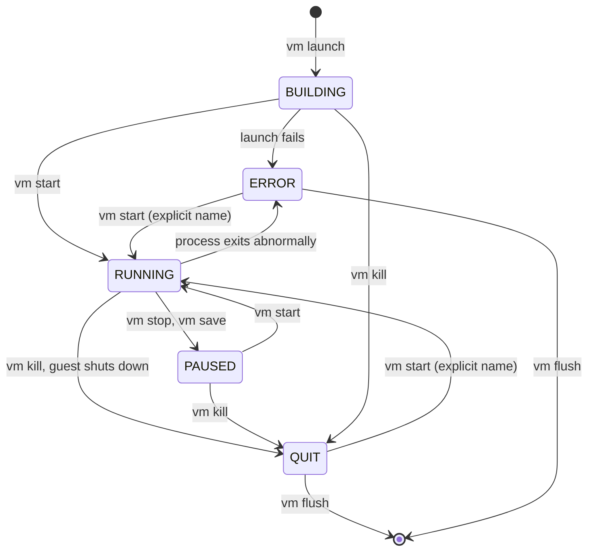

# Chapter 4: Configure, launch, and control VMs

[Chapter 3](03-router-sandwich.md) launched three VMs without stopping to
explain the machinery. This chapter does: the configuration template that
`vm launch` copies, the ways to name and count the VMs you launch, the five
states a VM moves through and which command moves it, saved configurations,
and the commands that inspect running VMs. You use the router sandwich as the
test bed: pausing, killing and restarting its VMs, and launching a couple of
spare clients from a saved configuration. At the end the sandwich is back
exactly as it was, and you know why `vm start all` sometimes does nothing.

Everything here applies to all three VM types. The last section says what
the other two are and points at the chapters that use them.

## The template

`vm config` is a template, not a VM. Every `vm config <field> <value>` edits
one field of the current configuration, `vm launch` copies the whole thing
into each new VM, and the template stays as it was for the next launch. That
is why chapter 3 could set the kernel once and launch two clients, changing
only `networks` in between, and why a change to the template after a launch
never affects a running VM.

Three habits make the template easy to work with:

- `vm config <field>` alone prints the field; `vm config` alone prints the
  whole template, grouped into a common block and one block per VM type.
- Any unambiguous prefix of a keyword works, so `vm config net` is accepted
  for `vm config networks` and `vm config disk` for `vm config disks`. The
  full names are the ones in the reference and in this course.
- `clear vm config <field>` puts one field back to its default, and
  `clear vm config` resets all of them. Do this between experiments so that
  a leftover `kernel` or `networks` does not surprise the next launch.

```minimega
minimega$ vm config memory
2048
minimega$ vm config memory 4096
minimega$ clear vm config memory
minimega$ vm config memory
2048
```

Fields that do not apply to the type you launch are ignored, so leaving
`disks` set does no harm when you launch a container. The
[VM configuration reference](../../articles/vm-config-reference.md) lists every
field with its default.

## Launching by name, count, and range

The second argument of `vm launch` is either a count or a name expression:

```minimega
minimega$ vm launch kvm 3                # three VMs named vm-<id>
minimega$ vm launch kvm web              # one VM named web
minimega$ vm launch kvm a,b,c            # three, named
minimega$ vm launch kvm node[1-10]       # ten, node1 through node10
minimega$ vm launch kvm web[1-3],db[1-2] # a mix
```

A count produces names built from the per-host VM ID, so they are
unpredictable across runs; the course always names its VMs. Names may contain
letters, digits, hyphens, underscores and dots, cannot be an integer or the
word `all`, and must be unique within the namespace across every host. The
same range syntax addresses VMs afterwards: `vm start node[1-5]` or
`vm kill web[1-3],db1`.

`vm launch` returns once the VMs exist. Each is created in `BUILDING`: its
instance directory, taps and QEMU process are there, but the guest is not
executing until `vm start`. A launch that fails, because an image is missing
or QEMU will not start, puts the VM in `ERROR` with the reason in its `error`
tag.

## States and the commands that move them

`vm info` reports one of five states per VM:



The four lifecycle commands take a *target*: a name or ID, a comma-separated
list, a range, or `all`. Each only acts on VMs in the states where it makes
sense, and `all` is more conservative than an explicit name:

| Command | Named target acts on | `all` acts on | Result |
|---|---|---|---|
| `vm start` | `BUILDING`, `PAUSED`, `QUIT`, `ERROR` | `BUILDING`, `PAUSED` | `RUNNING` |
| `vm stop` | `RUNNING` | `RUNNING` | `PAUSED` |
| `vm kill` | `BUILDING`, `RUNNING`, `PAUSED` | same | `QUIT` |
| `vm flush` | `QUIT`, `ERROR` | `QUIT`, `ERROR`; no target means `all` | removed |

The consequence that catches everyone once: `vm start all` never restarts a
VM that has quit or failed. It is meant for "start what I just launched", and
silently skipping `QUIT` and `ERROR` VMs is what stops a stray `vm start all`
from resurrecting the VM you deliberately killed. To restart one, name it,
and minimega relaunches it from its original configuration.

`vm stop` pauses the guest and keeps its memory; `vm start` resumes exactly
where it left off. `vm kill` is the power cord: it terminates the process and
blocks until it is gone. A guest that shuts itself down also ends in `QUIT`.
`vm flush` removes `QUIT` and `ERROR` VMs from `vm info`, deletes their
instance directories, and frees their names.

### Try it on the sandwich

With the sandwich running from chapter 3, pause `vm_left` and look:

```minimega
minimega$ vm stop vm_left
minimega$ .annotate false .columns name,state vm info
name     | state
router   | RUNNING
vm_left  | PAUSED
vm_right | RUNNING
minimega$ vm start vm_left
```

Now kill `vm_right` and watch `vm start all` leave it alone:

```minimega
minimega$ vm kill vm_right
minimega$ vm start all
minimega$ .annotate false .columns name,state vm info
name     | state
router   | RUNNING
vm_left  | RUNNING
vm_right | QUIT
minimega$ vm start vm_right
```

The relaunched `vm_right` boots from scratch, asks the router for a lease
again, and is back in `vm info` with an address a few seconds later. Its
`vm info` row keeps the same name and ID throughout; only `vm flush` would
have freed them.

## Saved configurations

A template holds one description at a time. To keep several, save them under
names and launch from them:

```minimega
minimega$ vm config kernel miniccc.kernel
minimega$ vm config initrd miniccc.initrd
minimega$ vm config memory 2048
minimega$ vm config networks net_left
minimega$ vm config save client
minimega$ vm config kernel minirouter.kernel
minimega$ vm config initrd minirouter.initrd
minimega$ vm config networks net_left net_right
minimega$ vm config save router
minimega$ vm config restore
```

- `vm config save <name>` stores a copy of the current template.
- `vm config restore <name>` replaces the current template with a saved copy;
  `vm config restore` with no name lists the saved names.
- `vm launch <type> <name or count> <config>` launches from a saved
  configuration directly, without touching the current template.
- `vm config clone <vm>` copies the configuration of an already-launched VM
  back into the template, which is the quickest way to launch "another one
  like that".

Two spare clients from the saved `client` description, on `net_left` with
the router serving them addresses:

```minimega
minimega$ vm launch kvm spare[1-2] client
minimega$ vm start spare[1-2]
```

Saved configurations live in memory, per namespace, and vanish with the
daemon. To keep one for good, put the `vm config` lines in a command file;
[chapter 9](09-save-replay-cleanup.md) shows how.

## Inspecting VMs

### `vm info`

`vm info` prints one row per VM from every host in the namespace. The full
table has more than forty columns, so the course always narrows it with the
`.columns` builtin and, where the host name is noise, `.annotate false`.
`vm info summary` prints only the most useful columns (`id`, `name`, `state`,
`type`, `uuid`, `cc_active`, `vlan`). The columns you will reach for most:

| Column | Meaning |
|---|---|
| `name`, `id`, `state`, `type` | identity and state; `id` is per host |
| `vlan`, `bridge`, `tap`, `mac`, `ip`, `ip6` | one entry per interface; addresses are learned from traffic on the tap |
| `cc_active` | whether a miniccc agent is connected |
| `memory`, `vcpus`, `snapshot` | resources and snapshot mode |
| `kernel`, `initrd`, `disks`, `cdrom` | the boot media of a KVM VM |
| `vnc_port` | the port a VNC client connects to (chapter 5) |
| `tags` | the VM's tags, as a JSON object |

The complete list is in the
[VM configuration reference](../../articles/vm-config-reference.md#vm-info-columns).

`.filter` keeps only matching rows. `=` and `!=` compare whole values, `~`
and `!~` match substrings, and a column whose value is a list or map is
matched by substring even with `=`. When you stack it with `.columns`, put
`.columns` first if the column you filter on is one you are dropping:

```minimega
minimega$ .annotate false .columns name,state .filter state!=running vm info
minimega$ .annotate false .columns name,vlan .filter vlan=net_left vm info
```

### Tags

Tags are free-form key/value pairs on a VM. minimega uses them for its own
bookkeeping (the `error` tag, and the status a minirouter reports), and you
can use them to mark groups that scripts and `cc filter` select on:

```minimega
minimega$ vm tag spare[1-2] role spare
minimega$ vm tag spare1
minimega$ .annotate false .columns name,state,tags .filter tags=spare vm info
name   | state   | tags
spare1 | RUNNING | {"role":"spare"}
spare2 | RUNNING | {"role":"spare"}
```

`vm tag <vm>` alone lists a VM's tags, `vm tag all <key>` shows one tag for
every VM, and `clear vm tag <vm> <key>` removes one. `vm config tags <key>
<value>` puts a tag in the template so every VM launched afterwards carries
it.

### `vm top`

`vm top [duration]` samples host-side resource use for each VM over the given
number of seconds (default one) and reports memory (`virt`, `res`, `shr` in
MB), host `cpu` and guest `vcpu` percentages, total CPU `time`, the number of
`procs` inspected, and `rx` and `tx` rates in MB/s. It is measured from the
host, so it can differ from what the guest reports. The sandwich is idle, so
the rates read zero until [chapter 11](11-traffic.md) puts traffic on it.

### Put the sandwich back

The spares are not part of the running example, so remove them:

```minimega
minimega$ vm kill spare[1-2]
minimega$ vm flush
```

The script for this chapter rebuilds the sandwich, saves the two
configurations, and runs every step above:

```minimega title="04-vms.mm"
--8<-- "training/miniclass/scripts/04-vms.mm"
```

[Download this example](scripts/04-vms.mm){ download="04-vms.mm" }

## The other VM types

`vm launch kvm` is one of three type keywords, and the same template,
lifecycle, networking, `cc` and capture commands apply to all of them.

**KVM** VMs are QEMU processes: a full machine with its own kernel, booted
from a kernel and initrd, a disk image, or a CD image, with virtual
hardware you choose (`cpu`, `machine`, `vga`, serial ports, USB). Everything
in Part I is a KVM VM. [Virtual machine types](../../articles/vmtypes.md#kvm-virtual-machines)
describes what happens at launch and how minimega drives QEMU through QMP.

**Containers** (`vm launch container`) share the host kernel. minimega builds
them itself from Linux namespaces and cgroups, so no container engine is
involved; all one needs is a root filesystem directory with an executable
`/init` (`vm config filesystem`, `vm config init`). They start instantly and
cost little memory, which makes hundreds on one host practical, and a
minirouter container routes far faster than an emulated NIC. The host must
provide cgroup v1 controllers, which current distributions do not by
default; [chapter 17](17-containers.md) covers the setup and builds one.

**Android** VMs (`vm launch android`) run the official Android emulator under
KVM from an AVD you name with `vm config android-avd`. miniweb gives them a
browser console with the display, input, GPS and orientation.
[Chapter 18](18-android.md) launches one.

**Bare-metal firmware guests** are KVM VMs with `vm config baremetal true`:
QEMU with the PC devices removed, for firmware and RTOS images built for
boards like the Arm MPS2. [Chapter 19](19-specialty-guests.md) boots one,
alongside TPM-backed and Windows guests.

## What you built

- The sandwich paused, killed, restarted and put back, and a clear picture of
  which command moves a VM between which states.
- Saved `client` and `router` configurations, and two spare clients launched
  from one of them.
- The `vm info`, `vm tag` and `vm top` views you will use in every later
  chapter.

## Where to read more

- [VM lifecycle](../../articles/vm-lifecycle.md): the full treatment of
  configure, launch, start, the state table, tags and the instance directory.
- [Virtual machine types](../../articles/vmtypes.md): KVM, containers,
  Android and bare metal in detail.
- [VM configuration reference](../../articles/vm-config-reference.md): every
  field, every `vm info` column.
- Reference: [`vm config`](../../reference/minimega.md#vm-config),
  [`clear vm config`](../../reference/minimega.md#clear-vm-config),
  [`vm launch`](../../reference/minimega.md#vm-launch),
  [`vm`](../../reference/minimega.md#vm) (start, stop, kill, flush),
  [`vm info`](../../reference/minimega.md#vm-info),
  [`vm tag`](../../reference/minimega.md#vm-tag),
  [`vm top`](../../reference/minimega.md#vm-top).

## Next

[Chapter 5: See the experiment](05-miniweb.md) opens the sandwich in a
browser.
