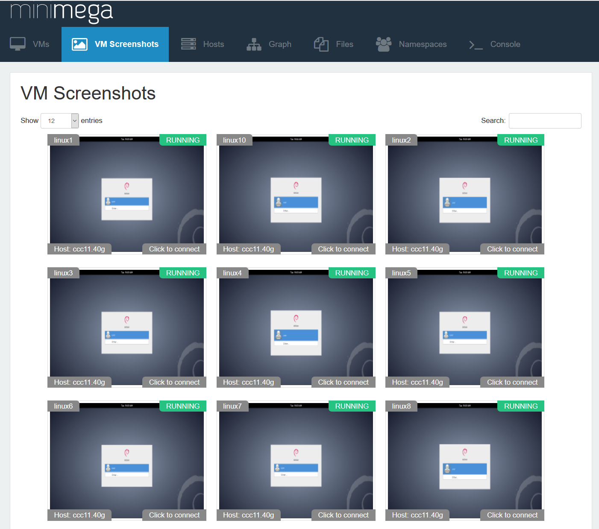

# Chapter 5: See the experiment: miniweb and VNC

So far you have watched the router sandwich through `vm info`. In this
chapter you start miniweb, minimega's web interface, and look at the same
experiment as a table, a screenshot grid, a network graph and a console in
the browser. You also take screenshots from the prompt and learn where
miniweb's controls end and the prompt takes over. At the end you can open any
VM's console from a browser tab and know which of miniweb's pages answer
which question.

This chapter assumes the sandwich from [chapter 3](03-router-sandwich.md) is
running. The [miniweb guide](../../articles/miniweb.md) documents every page,
URL and flag; this chapter is a tour.

## Start miniweb

miniweb is a separate program that talks to minimega over the command socket
in the base directory, so it runs on the same host as the daemon. It serves
on port 9001 by default.

**Package**

```bash
sudo miniweb -root /opt/minimega/web
```

**Docker**

Nothing to do: the container's entry point starts miniweb before minimega,
and `-p 9001:9001` from chapter 1 publishes it.

**Source**

```bash
sudo ./bin/miniweb -root web        # from the repository root
```

`-root` names the directory of templates and static files (`web/` in the
repository, `/opt/minimega/web` from the packages). The other flag you may
need now is `-base`, which must match the daemon's `-base` if you changed it.
Leave miniweb running in its own terminal and open <http://localhost:9001/>.
It redirects to `/vms`.

## The pages

The navigation bar lists them; each is a plain URL you can bookmark.

| Page | URL | What it shows |
|---|---|---|
| VMs | `/vms` | The `vm info` table for the namespace: the three sandwich VMs with state, VLANs and addresses. `/vms#top` switches to a live `vm top` view. |
| VM Screenshots | `/tilevnc` | A grid of live screenshots, one tile per VM; click a tile to open its console. |
| Hosts | `/hosts` | The output of `host`: resources and load for each node in the namespace. |
| VLANs | `/vlans` | The alias table from `vlans`: `net_left` and `net_right` with their tags. |
| Graph | `/graph` | An interactive graph of the VMs and the VLANs that join them; the sandwich appears as two networks with the router between them. |
| Files | `/files/` | A listing of the files directory, so the images from chapter 2 are downloadable here. There is no upload. |
| Namespaces | `/namespaces` | Every namespace with links to its VM and VLAN pages. |
| Console | `/console` | A minimega prompt in the browser. Only with `-console`; see below. |

Each table is fed by a JSON endpoint you can also call from a script:
`/vms/info.json`, `/vms/top.json`, `/hosts.json`, `/vlans.json`,
`/namespaces.json` and `/files.json?path=<dir>`.

### The VM table

The State column carries the controls: a play icon starts a `BUILDING` or
`PAUSED` VM, a pause icon stops a `RUNNING` one, and an X kills it. They run
the same `vm start`, `vm stop` and `vm kill` as [chapter 4](04-vms.md), so
the same rules apply. One difference from the prompt: VMs in the `QUIT` or
`ERROR` state are hidden from the table. A VM you kill here drops out of the
page but still exists until you `vm flush` at the prompt, and you restart it
from the prompt by name.

Several columns are hidden by default (uptime, type, disks, IPv6, taps, tags,
active CC). `/vms/new` is a form that launches
one VM from a name, a type and one of the configurations you saved with
`vm config save`, which is a convenient way to add a VM during a
demonstration.


The screenshot above comes from a larger experiment than the sandwich, and
from an earlier release, so the navigation bar has no Builder entry; the
layout is otherwise what you see. Your table has three rows, `router`,
`vm_left` and `vm_right`, with the addresses the router handed out in
[chapter 3](03-router-sandwich.md).

The VM Screenshots page is the one to keep open during a demonstration: one
live tile per VM, and a click connects you to that VM.



## A console in the browser

The VNC column of the VM table, and every screenshot tile, links to
`/vm/<name>/connect/`. For a KVM VM that page loads noVNC and opens a
WebSocket that miniweb proxies to the VM's VNC port, so keyboard, mouse and
display all work in the tab. Open `vm_left`. The client image runs a root
shell on its console, so there is nothing to log in to; you land at a prompt
and can type `ip addr` to see the address the router handed out, or
`ping 10.0.1.2` to reach `vm_right` the way `cc exec` did in chapter 3.

Open `router` the same way. Its console is another root shell, and
`ip addr` shows both interfaces, `10.0.0.1` and `10.0.1.1`, while
`ps ax | grep -e minirouter -e dnsmasq -e bird` shows the daemons that
chapter 3 configured.

Containers get an xterm.js terminal on the same URL instead of noVNC, and
minimega keeps a scrollback buffer so a newly opened terminal shows recent
output. Android VMs get a console that streams the emulator's display.

Under the hood every KVM VM has a VNC listener on the host at the port in the
`vnc_port` column of `vm info`, and any VNC client can connect to it
directly:

```minimega
minimega$ .annotate false .columns name,vnc_port vm info
```

miniweb connects to those ports itself, so in a cluster the miniweb host must
be able to reach them on every node. [Chapter 13](13-vnc.md) uses the same
ports to record and replay what happens on a console.

## Screenshots from the prompt

`vm screenshot` grabs a VM's framebuffer as a PNG. Without a destination it
writes `screenshot.png` into the VM's instance directory
(`/tmp/minimega/<id>/`); with `file` it writes wherever you say, and a
trailing number caps the larger dimension in pixels:

```minimega
minimega$ vm screenshot vm_left
minimega$ vm screenshot vm_right file /tmp/minimega/files/vm_right.png 400
```

The second form drops the image into the files directory, so it appears on
miniweb's Files page and, on a cluster, can be fetched with `file get`. The
VM Screenshots page and the URL `/vm/<name>/screenshot.png` take the same
kind of picture on every refresh; `?size=<pixels>` scales it and
`&base64=1` returns a `data:` URI, which is how the tile grid embeds them.
Containers have no framebuffer and answer 404.

The script for this chapter rebuilds the sandwich and takes both
screenshots:

```minimega title="05-miniweb.mm"
--8<-- "training/miniclass/scripts/05-miniweb.mm"
```

[Download this example](scripts/05-miniweb.mm){ download="05-miniweb.mm" }

## Namespaces in the URL

Unprefixed pages show whatever namespace the head node is currently in. If
your prompt is in `sandwich`, so is `/vms`; if it has gone back to the
default namespace, the VM table is empty. Two ways to be explicit:

- Prefix any path with the namespace: `/sandwich/vms`, `/sandwich/vlans`,
  `/sandwich/vm/vm_left/connect/`. The Namespaces page links to each.
- Start miniweb with `-namespace sandwich`. Every command it sends is then
  pinned to that namespace, the URL prefix is disabled, and `/namespaces`
  answers 501.

The second is the right choice for a class or a kiosk, where the browser
should only ever see one experiment.

## The console page and the command API

Passing `-console` with the path to the minimega binary enables three more
routes: `/console`, a browser terminal that runs `minimega -attach` for each
visitor, and `/command` and `/commands`, a JSON API that runs any minimega
command from a POST:

```bash
sudo miniweb -root /opt/minimega/web -console /usr/bin/minimega
```

```bash
curl http://localhost:9001/command -d '{"command": "vm info", "columns": ["name", "state"]}'
```

These are the full CLI, including `shell`, for anyone who can reach the port.
Without `-console` all three answer 501, which is the safe default.

!!! warning "miniweb has no login by default"
    miniweb listens on every address of the host, and without `-passwords`
    anyone who can reach port 9001 can start, stop and kill VMs, download
    every file in the files directory, and type into every console.
    Restrict `-addr` to a trusted interface (`-addr 127.0.0.1:9001`), or add
    authentication before you expose it.

## Authentication and TLS

miniweb supports HTTP basic authentication with rules scoped to URL path
prefixes, so a user can be limited to one namespace or one VM. `-bootstrap`
writes the password file interactively, then you start miniweb with
`-passwords` alone:

```bash
sudo miniweb -bootstrap -passwords /etc/minimega/miniweb.passwd
sudo miniweb -root /opt/minimega/web -passwords /etc/minimega/miniweb.passwd
```

A rule for `/` covers the whole site; a rule for `/sandwich/` covers that
namespace's pages; a rule for `/vm/vm_left` covers one VM. Basic
authentication sends the password with every request, so pair it with TLS:
`-cert` and `-key` take a PEM certificate and key, and both are required.
The [miniweb guide](../../articles/miniweb.md#authentication) shows the file
format and a self-signed certificate;
[Security considerations](../../articles/security.md#miniweb) explains what
each miniweb route exposes and how the VNC ports behave.

## What you built

- miniweb running against the sandwich, with the VMs, screenshot, graph and
  namespace pages showing the three VMs and two networks.
- A console on `vm_left` and on `router` in the browser, and the `vnc_port`
  behind it.
- Screenshots of both clients taken from the prompt, one of them served by
  miniweb's Files page.

## Where to read more

- [miniweb](../../articles/miniweb.md): every page, per-VM route, flag, the
  console and command API, authentication and TLS.
- [Security considerations](../../articles/security.md): what miniweb, the
  VNC ports and the command socket expose.
- [VNC](../../articles/vnc.md): recording and replaying consoles.
- Reference: [`vm screenshot`](../../reference/minimega.md#vm-screenshot),
  [`vm info`](../../reference/minimega.md#vm-info).

## Next

[Chapter 6: Networking basics](06-networking.md) opens the sandwich up to the
host with a tap and a DHCP server of your own.
