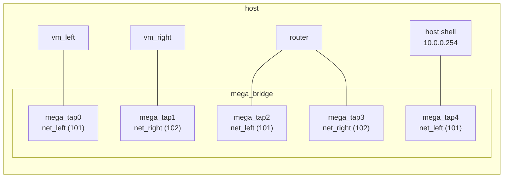

# Chapter 6: Networking basics

In [chapter 3](03-router-sandwich.md) you gave each VM a network with one
`vm config networks` line and let minimega do the rest. This chapter opens
that up. You look at how the sandwich's three VMs are wired together on the
host, what a netspec and a VLAN alias really are, and then extend the
experiment: the host gets its own tap into `net_left` so you can reach
`vm_left` from a host shell, you unplug and replug a running VM, and you
shape the traffic a VM receives. At the end the sandwich is running as
before, with the host attached to its left network.

It assumes the sandwich from [chapter 3](03-router-sandwich.md) is running
and that you know `vm info` and the `.columns` builtin from
[chapter 4](04-vms.md). One step runs a command inside a VM with `cc exec`,
which chapter 3 introduced and [chapter 8](08-cc.md) covers in full.
[Host networking](../../articles/networking.md) is the guide behind this
chapter; read it afterwards for bridges, trunks, tunnels and NAT.

## How the sandwich is wired

Every VM interface is a tap device on the host, added as a port on an Open
vSwitch bridge called `mega_bridge`, and each port carries an 802.1q VLAN
tag. Two ports with the same tag share a layer-2 network; ports with
different tags cannot see each other. That tag is the whole mechanism. On a
freshly started daemon the sandwich has four VM ports on two tags, and after
this chapter a fifth port that ends in the host's own network stack:



`vm info` has one column per interface property. Ask for the ones that
matter here (the tables in this chapter omit the leading `host` column that
`.annotate` adds by default):

```minimega
minimega$ .columns name,vlan,tap,ip vm info
name     | vlan                              | tap                   | ip
router   | [net_left (101), net_right (102)] | [mega_tap2, mega_tap3] | [10.0.0.1, 10.0.1.1]
vm_left  | [net_left (101)]                  | [mega_tap0]           | [10.0.0.37]
vm_right | [net_right (102)]                 | [mega_tap1]           | [10.0.1.112]
```

The router's two entries in each column are its two interfaces, in the order
you listed them. Your client addresses will differ: the router's DHCP server
does not hand out leases in order. The `ip` column is filled in by watching
traffic on the tap, which is why it can lag a moment behind the guest.

Open vSwitch shows the same thing from the host side, with the tag on every
port:

```bash
$ sudo ovs-vsctl show
```

```text
    Bridge mega_bridge
        Port mega_tap0
            tag: 101
            Interface mega_tap0
        Port mega_tap2
            tag: 101
            Interface mega_tap2
        Port mega_tap3
            tag: 102
            Interface mega_tap3
        ...
```

## The netspec

`vm config networks` takes one *netspec* per interface, in the order the
guest will see them:

```text
[bridge,]vlan[,mac][,driver][,qinq]
```

Only the VLAN is required; the sandwich never used anything else. The
router's `net_left net_right` produced interface 0 on `net_left` and
interface 1 on `net_right`, which is the order the guest names them (`eth0`,
`eth1`) and the index that `router router interface 0` and
`vm net disconnect vm_right 0` refer to. The other fields are recognised by
what they look like: a MAC address is a MAC, the name of a QEMU network
device is the driver, the literal `qinq` is a flag, and anything else in
front of the VLAN is a bridge name. The defaults are `mega_bridge`, a random
MAC and the `e1000` driver.

```minimega
# a fixed MAC, so a DHCP server can give the VM a static lease (chapter 7)
vm config networks net_right,00:00:00:00:02:01

# a paravirtual NIC instead of the emulated e1000
vm config networks net_left,virtio-net-pci
```

Two things you will not need in this course exist in the same place.
`vm config bonds` bonds two or more of a VM's interfaces into one Open
vSwitch bond, and the `qinq` flag puts a port in dot1q-tunnel mode so that
the guest's own 802.1q tags travel inside the minimega VLAN. Both are
described in
[Host networking](../../articles/networking.md#configuring-vm-interfaces).

## VLAN aliases

`net_left` and `net_right` are not VLAN numbers, they are aliases. The first
time minimega sees an alias it allocates the next free tag from its VLAN
range and remembers the mapping; `vlans` lists the mappings of the current
namespace:

```minimega
minimega$ vlans
alias     | vlan
net_left  | 101
net_right | 102
```

The range is `101-4096` unless the daemon was started with another
`-vlanrange`, so aliases start at 101 and tags 1 through 100 are yours to
use directly. A plain number in a netspec is used as the tag itself and is
then blacklisted so no alias is ever given that number;
`vlans add <alias> <vlan>` pins an alias to a specific tag when something on
the other side of a trunk expects it.

Aliases belong to the namespace. `net_left` in `sandwich` and `net_left` in
another namespace are different VLANs, which is what lets
[chapter 16](16-namespaces.md) run a second copy of the sandwich next to
this one without the two touching. `clear vlans` forgets the mappings of the
current namespace; kill the VMs first, because a VM keeps its tag even after
the alias that produced it is gone.

## A tap for the host

So far nothing on the host can talk to the experiment. A *host tap* is a
port on the bridge that ends in the host's network stack instead of in a VM.
Put one on `net_left` with an address in that subnet and the host is on the
left network, exactly as if it were a fourth VM there.

One preparation first. The router serves leases from `10.0.0.2` to
`10.0.0.254`, so any static address you choose for the tap could also be
handed to a client. Narrow the range and commit; a commit sends the router
its whole description again, so changing a running router is just another
commit:

```minimega
minimega$ router router dhcp 10.0.0.0 range 10.0.0.2 10.0.0.200
minimega$ router router commit
```

Now create the tap. `tap create` prints the name of the interface it made,
and `tap` lists the host taps of the namespace:

```minimega
minimega$ tap create net_left ip 10.0.0.254/24
mega_tap4
minimega$ tap
bridge      | tap       | vlan
mega_bridge | mega_tap4 | net_left (101)
```

The host now has `10.0.0.254` on `mega_tap4` and a route to `10.0.0.0/24`
through it. `shell` runs a program on the host and returns its output, so
you can prove it without leaving the prompt:

```minimega
minimega$ shell ping -c 3 10.0.0.1
```

From a host shell, ping `vm_left` at the address `vm info` showed, or log in:
the stock miniccc image allows root to log in over SSH with no password.

```bash
$ ping -c 3 10.0.0.37
$ ssh root@10.0.0.37
```

To reach `net_right` as well, give the host a route through the router. The
router forwards it, and the reply finds its way back because the router is
directly connected to `10.0.0.0/24`:

```bash
$ sudo ip route add 10.0.1.0/24 via 10.0.0.1
$ ping -c 3 10.0.1.112
```

Two other forms are worth knowing.
`tap create net_left ip 10.0.0.254/24 left0` names the tap instead of
taking the next `mega_tapN`, and `tap create net_left dhcp` runs `dhclient`
on the new tap so the router leases it an address. Be careful with the
second one on a host you administer over the network: `dhclient` may
rewrite the host's resolver configuration and add a default route, exactly
as it would for any other interface.

!!! warning "A host tap joins the host to the experiment"
    Everything on `net_left` can now reach the host at `10.0.0.254`, and the
    host's services are exposed to it. Taps are ideal for bootstrapping and
    debugging; delete them when you are done with `tap delete mega_tap4`, or
    `tap delete all` for every tap in the namespace.
    `clear namespace sandwich` deletes them too.
    [Security considerations](../../articles/security.md) has the longer
    discussion.

## DHCP and DNS from the host

The sandwich gets its addresses from the router, which is the right place for
them: the whole configuration lives inside the experiment. On a VLAN with no
router, minimega can serve DHCP and DNS from the host instead. The pattern is
a tap with an address, then `dnsmasq start <address> <low> <high>`:

```minimega
minimega$ tap create scratch ip 10.0.9.1/24
minimega$ dnsmasq start 10.0.9.1 10.0.9.2 10.0.9.254
minimega$ dnsmasq
minimega$ dnsmasq kill all
```

Do not start one on `net_left`; two DHCP servers on one network give
unpredictable results. `dnsmasq configure` adds static leases, names and
DHCP options to a running instance, and the full walk-through is in
[DHCP and DNS from the host](../../articles/networking.md#dhcp-and-dns-from-the-host).
If `dnsmasq start` appears to succeed and the instance is gone a moment
later, another DNS server on the host owns port 53;
[chapter 10](10-troubleshooting.md) shows how to find it.

## Unplugging a running VM

`vm net` changes the interfaces of a running VM, addressed by their index.
Unplug `vm_right` and look at the `vlan` column:

```minimega
minimega$ vm net disconnect vm_right 0
minimega$ .columns name,vlan vm info
name     | vlan
router   | [net_left (101), net_right (102)]
vm_left  | [net_left (101)]
vm_right | [disconnected]
```

The interface still exists inside the guest and still has its address; only
the port on the bridge is gone. A ping from `vm_left` to `vm_right`'s
address now fails where it worked in chapter 3:

```minimega
minimega$ cc filter name=vm_left
minimega$ cc exec ping -c 3 10.0.1.112
```

Plug it back into `net_right` and the next ping succeeds. `vm net connect`
takes a VLAN and, optionally, a bridge, so the same command moves an
interface to a different network:

```minimega
minimega$ vm net connect vm_right 0 net_right
minimega$ clear cc filter
```

`vm net add <vm> <netspec>` adds a whole new interface to a running VM. The
guest sees a new NIC that nothing has configured, so you would follow it with
`cc exec dhclient eth1` or a static address. Do not do it to a sandwich
client now: a client on both networks would bypass the router.
[Chapter 14](14-runtime-changes.md) does this deliberately, on the router.

## Quality of service

`qos add` shapes traffic on one VM interface with `tc` on the host side of
the tap. `loss` is a percentage, so this drops one packet in four of what
`vm_left` receives; `delay` adds latency and combines with loss; `rate` caps
bandwidth and replaces both, because the two are implemented with different
queueing disciplines:

```minimega
minimega$ qos add vm_left 0 loss 25
minimega$ qos add vm_left 0 delay 100ms
minimega$ .columns name,qos vm info
minimega$ qos add vm_left 0 rate 10 mbit
minimega$ clear qos vm_left all
```

The constraint applies to traffic the VM *receives*, not what it sends. With
loss in place, `ping vm_left` from the host through the tap loses about a
quarter of its requests, while a ping from `vm_left` outward loses nothing
on the way out. To shape a link in both directions, shape the interface at
each end. Whatever is in force shows in the `qos` column.
[Chapter 14](14-runtime-changes.md) uses qos with real traffic on the
sandwich.

## The script

The script rebuilds the sandwich with the narrower `net_left` range and then
does everything in this chapter, leaving the host tap in place:

```minimega title="06-networking.mm"
--8<-- "training/miniclass/scripts/06-networking.mm"
```

[Download this example](scripts/06-networking.mm){ download="06-networking.mm" }

## What you built

- The sandwich as in chapter 3, with the router's `net_left` range narrowed
  to `10.0.0.2`–`10.0.0.200` by a second commit.
- A host tap at `10.0.0.254` on `net_left`, and a host shell that can ping
  and log in to `vm_left`.
- A working knowledge of what the `vlan`, `tap` and `ip` columns of
  `vm info` and the `vlans` and `tap` tables are telling you.

## Where to read more

- [Host networking](../../articles/networking.md): the netspec in full,
  bonds and QinQ, VLAN ranges and blacklists, dnsmasq, trunks and tunnels,
  and NAT to the outside world.
- [Capture and instrumentation](../../articles/capture.md): mirroring a
  VM's traffic to another VM, which [chapter 12](12-capture.md) does on the
  sandwich.
- Reference: [`vm config networks`](../../reference/minimega.md#vm-config-networks),
  [`vm config bonds`](../../reference/minimega.md#vm-config-bonds),
  [`vlans`](../../reference/minimega.md#vlans),
  [`tap`](../../reference/minimega.md#tap),
  [`clear tap`](../../reference/minimega.md#clear-tap),
  [`dnsmasq`](../../reference/minimega.md#dnsmasq),
  [`vm net`](../../reference/minimega.md#vm-net),
  [`qos`](../../reference/minimega.md#qos),
  [`bridge`](../../reference/minimega.md#bridge),
  [`shell`](../../reference/minimega.md#shell).

## Next

[Chapter 7: Routers and services](07-routers.md) puts the rest of the
`router` API to work: static leases, DNS, static routes, and a second router
running OSPF.
