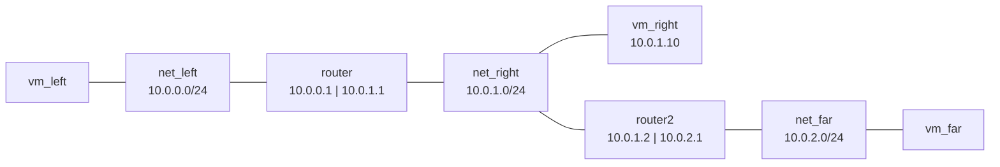

# Chapter 7: Routers and services

The sandwich router has done one job so far: hand out addresses and a
default gateway on each side. In this chapter you use the rest of the
`router` API on it. You give `vm_right` a fixed address and a name that
`vm_left` can resolve, then grow the experiment: a second router, `router2`,
joins `net_right` to a third network, `net_far`, with a client `vm_far` on
it. You connect the two routers first with static routes and then with
OSPF, look at what the routers report back, and see where firewall rules
fit. At the end the sandwich is a three-network topology with two routers
exchanging routes.

It assumes the running sandwich from [chapter 3](03-router-sandwich.md),
which also showed how `router <vm>` prints a router's description, and the
`vm net` and `vlans` material from [chapter 6](06-networking.md). The guide
behind this chapter is [Routing with minirouter](../../articles/router.md).

## What a router command does

`router router ...` commands never touch the VM. Each one edits a
description that minimega keeps for that VM, and `router router commit`
writes the description to a file named `minirouter-router` in the
namespace's subdirectory of the files directory (`files/sandwich/` here)
and queues three `cc` commands for the VM: remove any earlier copy
under `/tmp/miniccc/files/`, send the new file, and run `minirouter -u` on
it. Inside the guest, minirouter rewrites the configuration of the programs
it drives (`dnsmasq` for DHCP and DNS, `bird` for routing, `ip` for
addresses) and restarts them, then reports its log lines back through a VM
tag. That is why the `cc_active` column of `vm info` has to be `true` for
the router before a commit does anything, and why a change takes a few
seconds to land.

Every commit sends the complete description, so there is no difference
between configuring a router the first time and changing it later: describe,
commit, and if you change your mind, describe and commit again.

## A static lease and a name

DHCP leases are identified by MAC address, so a static lease needs a VM with
a known MAC. `vm_right` was launched with a random one; relaunch it with a
fixed MAC in its netspec. The template still holds the router's kernel and
initrd from chapter 3, so point it back at the client image first:

```minimega
minimega$ vm kill vm_right
minimega$ vm flush vm_right
minimega$ vm config kernel miniccc.kernel
minimega$ vm config initrd miniccc.initrd
minimega$ vm config networks net_right,00:00:00:00:02:01
minimega$ vm launch kvm vm_right
```

Before starting it, describe the lease, a DNS record for the address, and
tell both DHCP servers to advertise the router as the DNS server.
`dhcp <network> static <mac> <ip>` adds the lease to the server for that
network; `dns <ip> <hostname>` adds a record to the router's own resolver;
`dhcp <network> dns <address>` sets the DHCP option that clients write into
their resolver configuration:

```minimega
minimega$ router router dhcp 10.0.1.0 static 00:00:00:00:02:01 10.0.1.10
minimega$ router router dns 10.0.1.10 right.sandwich
minimega$ router router dhcp 10.0.0.0 dns 10.0.0.1
minimega$ router router dhcp 10.0.1.0 dns 10.0.1.1
minimega$ router router commit
minimega$ vm start vm_right
```

Give the commit a few seconds before the client boots, so that its first
DHCP request already hits the new configuration. `vm_right` now comes up at
`10.0.1.10`, and the description shows the lease and the record under the
network they belong to:

```minimega
minimega$ router router
...
Listen address: 10.0.1.0
Low address:    10.0.1.2
High address:   10.0.1.254
Router:         10.0.1.1
DNS:            10.0.1.1
Static IPs:
     00:00:00:00:02:01 10.0.1.10
DNS:
10.0.1.10       right.sandwich
...
```

`vm_left` took its lease at boot, before the DNS option existed, and a lease
is only refreshed at renewal time, so its resolver still points wherever it
did before. Rather than wait, ask it by address for now and by name after its
next boot; the script at the end of the chapter builds everything in the
right order so the name works immediately:

```minimega
minimega$ cc filter name=vm_left
minimega$ cc exec ping -c 3 10.0.1.10
minimega$ cc exec ping -c 3 right.sandwich
```

The router's resolver only knows the records you add and forwards nothing
else, so a name it has never heard of fails. `router router upstream <ip>`
names a server to forward everything else to, which is useful once the
experiment has a path to the outside world
([Host networking](../../articles/networking.md#reaching-the-outside-world)).

## A second router and a third network

Now extend the topology. `router2` has one interface on `net_right`, which
becomes the transit link between the two routers, and one on the new
`net_far`, where it serves DHCP to `vm_far`:



Launch the client first while the template still describes a client, then
switch to the router image for `router2`. Its interface 0 is on `net_right`
and interface 1 on `net_far`, in the order of the netspec:

```minimega
minimega$ vm config networks net_far
minimega$ vm launch kvm vm_far
minimega$ vm config kernel minirouter.kernel
minimega$ vm config initrd minirouter.initrd
minimega$ vm config networks net_right net_far
minimega$ vm launch kvm router2
minimega$ router router2 interface 0 10.0.1.2/24
minimega$ router router2 interface 1 10.0.2.1/24
minimega$ router router2 dhcp 10.0.2.0 range 10.0.2.2 10.0.2.254
minimega$ router router2 dhcp 10.0.2.0 router 10.0.2.1
minimega$ router router2 commit
minimega$ vm start router2
minimega$ vm start vm_far
```

`router2` takes a static address on `net_right` and ignores the leases the
sandwich router offers there; a minirouter only asks for DHCP on an
interface you configure with `interface <n> dhcp`. Once `vm_far` has its
lease, try to reach `router2`'s far side from `vm_left`:

```minimega
minimega$ cc exec ping -c 3 10.0.2.1
```

It fails, and the response says why: the sandwich router replies that the
network is unreachable. `vm_left` sent the packet to its default gateway,
`10.0.0.1`, and that router knows its two connected networks and nothing
else. Routing between the two routers is the missing piece.

## Static routes first

The simplest fix is to tell each router where the other's network is. A
static route is a destination and a next hop, and the next hop must be on a
network the router is connected to:

```minimega
minimega$ router router route static 10.0.2.0/24 10.0.1.2
minimega$ router router commit
minimega$ router router2 route static 10.0.0.0/24 10.0.1.1
minimega$ router router2 commit
```

`router2` needs the second route as much as the sandwich router needs the
first: without it, `vm_left`'s ping arrives and the reply has nowhere to go.
After both commits the ping succeeds, and `traceroute` shows the path:

```minimega
minimega$ cc exec traceroute -n 10.0.2.1
minimega$ cc responses 19
19/<uuid of vm_left>/stdout:
traceroute to 10.0.2.1 (10.0.2.1), 30 hops max, 60 byte packets
 1  10.0.0.1  0.412 ms  0.388 ms  0.371 ms
 2  10.0.2.1  0.913 ms  0.878 ms  0.860 ms
```

The command id depends on how many `cc` commands came before; `cc commands`
lists them. Under the description, minirouter turns each static route into a
`route ... via ...` line in a `protocol static` block of its BIRD
configuration, and BIRD installs it in the router's kernel routing table.

## OSPF instead

Static routes stop scaling as soon as a third router appears, and they do not
adapt when a link goes down. Remove them and let the routers exchange routes
with OSPF. `route ospf <area> <interface>` puts an interface, and every
network on it, into an OSPF area; put both interfaces of both routers into
area 0:

```minimega
minimega$ clear router router route static 10.0.2.0/24
minimega$ router router route ospf 0 0
minimega$ router router route ospf 0 1
minimega$ router router commit
minimega$ clear router router2 route static 10.0.0.0/24
minimega$ router router2 route ospf 0 0
minimega$ router router2 route ospf 0 1
minimega$ router router2 commit
```

The two routers now hear each other's hello packets on `net_right`, form an
adjacency, and each learns the other's client network. That takes a little
while, a few tens of seconds with BIRD's default timers, after which the
same ping and traceroute work again with no static route anywhere. The
description shows the area and its interfaces:

```minimega
minimega$ router router2
...
OSPF Area:      0
Interfaces:
        0
        1
...
```

To see what the routing daemon itself thinks, ask it through `cc`. BIRD's
control socket in the minirouter image is `/bird.sock`:

```minimega
minimega$ cc filter name=router2
minimega$ cc exec birdc -s /bird.sock show protocols
minimega$ cc exec birdc -s /bird.sock show route
minimega$ clear cc filter
```

`show protocols` lists the OSPF protocol as `up`, and `show route` includes
`10.0.0.0/24` learned via `10.0.1.1`. When a route you expect is missing,
these two commands and the `Log:` section of `router router2` are where to
look. OSPF picks paths by summed interface cost, 10 per interface unless you
say otherwise; `router router2 route ospf 0 1 cost 20` sets one, and
[OSPF and link cost](../../articles/router.md#ospf-and-link-cost) walks
through a triangle of routers where changing a cost moves the path. The
[appendix](../../articles/router.md#appendix-a-larger-ospf-network) of the
same guide scales the idea to six routers and nine links.

## Firewall rules

A minirouter can also filter the traffic it forwards, with iptables rules
generated from `fw` subcommands. `in` and `out` are relative to the
interface at the given index, so a rule for traffic *toward* `vm_right` is
an `out` rule on interface 1 of the sandwich router. This one drops ICMP
addressed to `vm_right` and leaves everything else alone:

```minimega
minimega$ router router fw drop out 1 10.0.1.10 icmp
minimega$ router router commit
```

After the commit a ping from `vm_left` to `10.0.1.10` gets no replies and
`cc exitcode` reports `1`, while `10.0.2.1` still answers. `fw default drop`
turns the policy around so that only what you `accept` is forwarded, and
chains group rules that apply to more than one interface.
`clear router router fw` followed by a commit removes every rule again. The
syntax is in [Firewall](../../articles/router.md#firewall).

!!! warning "The stock router image has no iptables"
    `fw` rules only work on KVM routers, and only when the guest has
    `iptables`. The `minirouter.conf` you built from in
    [chapter 2](02-images.md) installs `dnsmasq` and `bird` but not
    `iptables`, so on that image the rules are silently not applied and the
    router's `Log:` section shows the failure. Add `iptables` to the
    `packages` line of `misc/vmbetter_configs/minirouter.conf` and rebuild
    the pair before trying this section. The script below leaves the
    firewall out for that reason.

## Removing configuration

Every subcommand has a `clear router <vm> ...` form that removes that part
of the description, down to a single entry:
`clear router router dns 10.0.1.10`,
`clear router router dhcp 10.0.1.0 static 00:00:00:00:02:01`,
`clear router router2 route ospf 0`. `clear router router2` empties one
router's description and `clear router` forgets every router in the
namespace. Clearing edits the description only; commit to make the router
match, or, as the next chapter shows, tear the namespace down and rebuild
from a script.

## The script

The script builds the whole topology from a clean minimega, with the static
lease, the DNS record and OSPF from the start, and then pings across it in
both directions:

```minimega title="07-routers.mm"
--8<-- "training/miniclass/scripts/07-routers.mm"
```

[Download this example](scripts/07-routers.mm){ download="07-routers.mm" }

## What you built

- `vm_right` at a fixed `10.0.1.10`, resolvable as `right.sandwich` from
  the other clients, with both DHCP servers advertising the router as
  resolver.
- A third network, `net_far`, behind a second router, with `vm_far` on it.
- Two routers exchanging routes over OSPF on `net_right`, and the tools to
  see what they learned: the description, its `Log:` section, and `birdc`
  over `cc`.

## Where to read more

- [Routing with minirouter](../../articles/router.md): the full `router`
  API, IPv6 and router advertisements, BGP, link costs, and the six-router
  OSPF appendix.
- [Command and control](../../articles/cc.md): the channel every commit
  travels over.
- [Building images with vmbetter](../../articles/vmbetter.md): adding
  packages such as `iptables` to the router image.
- Reference: [`router`](../../reference/minimega.md#router),
  [`clear router`](../../reference/minimega.md#clear-router),
  [`vm net`](../../reference/minimega.md#vm-net), and the
  [minirouter API](../../reference/minirouter.md), which is what a committed
  description file contains.

## Next

[Chapter 8: Command and control](08-cc.md) takes the `cc` commands you have
been using on faith and explains the whole API: clients, filters, files,
mounts and tunnels.
