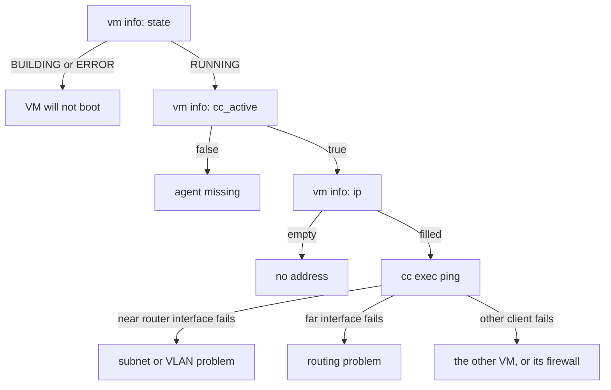

# Chapter 10: Troubleshooting walk

Part I ends with the sandwich failing on purpose. This chapter is a guided
diagnosis: for each of the ways the experiment most often goes wrong, a VM
that will not boot, a client with no address, a ping that never returns, an
agent that never connects, you learn which command shows the symptom, what
the usual causes are on this topology, and how to confirm each one before
changing anything. It closes with the logs and with what to do when minimega
itself has died.

It assumes Part I so far, in particular the network layout from
[chapter 6](06-networking.md), the router from [chapter 7](07-routers.md)
and `cc` from [chapter 8](08-cc.md). The guide behind it is
[Troubleshooting](../../articles/troubleshooting.md), which has the longer
list of symptoms. This chapter is conceptual and has no script; break your
own sandwich as you read.

## Two habits first

Raise the log level and read the log. `log level debug` at the prompt shows
the QEMU, dnsmasq and Open vSwitch commands minimega runs and their output,
which is where most answers are. Under systemd the file is
`/var/log/minimega.log`; `log file <path>` sends it elsewhere, and
`log ring` keeps recent messages in memory for a daemon with no file. Turn
it back down with `log level error` when you are done, because debug output
on a busy host fills disks.

Run `check`. It confirms that the kernel, QEMU, dnsmasq and Open vSwitch
minimega depends on are present and new enough, that Open vSwitch is
running, and warns when no `kvm` module is loaded. It prints nothing when
all is well and an error naming the first problem otherwise.

The walk below works from the VM outward, one layer at a time:



## A VM will not boot

The `state` column of `vm info` tells you which kind of failure you have.
`ERROR` means launch failed or the process died, and the reason is in the
VM's `error` tag:

```minimega
minimega$ .columns name,state vm info
minimega$ vm tag router error
```

The commonest message is QEMU exiting before minimega could reach its
control socket, and everything after `qemu output:` is QEMU's own
explanation:

```text
unable to connect to qmp socket: dial unix /tmp/minimega/2/qmp: connect:
connection refused. qemu output: Could not access KVM kernel module: No such
file or directory
```

That one is the `kvm` module: `lsmod | grep kvm` on the host, then
`modprobe kvm_intel` or `kvm_amd`. If the modprobe itself fails, hardware
virtualization is off in the firmware, or the host is a VM without nested
virtualization, which [chapter 1](01-install.md) checked for. Other frequent
`qemu output` lines name an image that does not exist, because a relative
path in `vm config kernel` was resolved against the files directory and the
file is not there (`file list` shows what is), or a `-cpu` or `-machine`
option the installed QEMU does not know. Fix the cause, then `vm flush` the
failed VM and launch it again; a failed VM keeps its name until it is
flushed.

A VM that sits in `BUILDING` has simply not been started. Recall from
[chapter 4](04-vms.md) that `vm start all` skips VMs in `QUIT` and `ERROR`;
name them explicitly to relaunch.

## A client has no address

`vm_left` is `RUNNING` but its `ip` column stays empty. The column is
learned from traffic, so give the guest a moment; if it stays empty, work
through the three things that have to be true for a lease to arrive.

**Did the router get its configuration?** `router router` prints the
description and, at the end, the `Log:` lines the router sent back. An empty
log means the commit never reached the VM: either you never ran
`router router commit`, or the router's `cc_active` is `false` and the
commit is still queued in `cc commands` waiting for an agent. Fix the agent
(next section) and the queued commit is delivered on its own.

**Is the client on the same VLAN as the router?** Compare the `vlan` column
of `vm info` for both. A typo such as `net_lef` is a new alias with its own
tag, and `vlans` shows it as a third entry. `ovs-vsctl show` on the host
confirms the `tag:` on each port, which is the ground truth.

**Is anything else answering, or blocking?** Inside the router,
`cc filter name=router` and `cc exec ps` should show one `dnsmasq`; the
`Log:` section reports if it failed to start. On the host, a tap plus
`dnsmasq start` on the same VLAN as the router means two DHCP servers, and
whichever answers first wins. The host-side failure mode from chapter 1
also belongs here: a system dnsmasq or the one NetworkManager spawns holds
port 53, minimega's `dnsmasq start` exits at once, and
`ss -ulpn 'sport = :53'` names the owner. Finally, ask the guest itself:
`cc exec dhclient -v eth0` prints the exchange as it happens, and
`cc exec ip addr` shows what it ended up with.

## A ping does not return

Ping in steps, because each step rules out a layer. From `vm_left`:

1. Its own gateway, `10.0.0.1`. Failure here is a subnet problem: wrong
   VLAN, an address in the wrong subnet, or a duplicate address.
   `cc exec ip neighbor` shows whether ARP resolved the router at all; an
   entry marked `FAILED` or none at all is layer 2, and `ovs-vsctl show` is
   the next stop.
2. The router's far interface, `10.0.1.1`. Failure here, with step 1
   working, is routing or forwarding on the router. A minirouter image
   turns `net.ipv4.ip_forward` on at boot;
   `cc exec sysctl net.ipv4.ip_forward` on the router confirms it. Check
   every address and mask in `router router`; a wrong mask hides a whole
   subnet.
3. The other client, `10.0.1.10`. Failure here, with steps 1 and 2 working,
   is on the far side: the client has no address (previous section), no
   default route back (`cc exec ip route` on `vm_right` should show
   `default via 10.0.1.1`), or a firewall. A reply that has nowhere to go
   looks exactly like a request that never arrived;
   `cc exec tcpdump -c 5 -n icmp` on the target settles which.

With OSPF between two routers, as in chapter 7, add a step between 2 and 3:
does the router know the far network?
`cc exec birdc -s /bird.sock show route` on either router lists what BIRD
learned, and `show protocols` should list OSPF as `up`. Adjacencies take
tens of seconds to form, and a router whose interface is not in the area
advertises nothing. `traceroute -n` from the client shows where packets
stop.

## The agent is missing

`cc_active` is `false` for a VM that is running. In order of likelihood:

- The image does not start miniccc, or the VM was launched from the wrong
  image. Chapter 2's stock images start it from their init script; a guest
  you built yourself must do the same (see
  [Creating VMs from install media](../../articles/newvm.md)).
- The agent and the daemon are from different releases. The log says
  `mismatched miniccc version on <hostname>: <revision>`, or refuses the
  agent with `miniccc client too old`. Rebuild the images.
- The backchannel is off (`vm config backchannel false`), or a
  `vm config virtio-ports` port named `cc` took its place; `vm info`'s
  `virtio-ports` column shows the latter.
- The agent connected and then lost the daemon, for instance after a
  restart. It retries for up to two hours, and minimega redials the port
  as long as the VM exists, so give it a minute.

The guest keeps its own account in `/miniccc.log` in the stock images.
Without an agent you cannot `cc recv` it, but you can read it on the
console through miniweb ([chapter 5](05-miniweb.md)), or, with a host tap
from chapter 6, over SSH.

## Reading the log

With `log level debug` set, the lines worth knowing on the sandwich are the
QEMU command line minimega built for each VM, printed at launch, which
shows exactly which kernel, initrd and interfaces it was given; the
`ovs-vsctl` calls that add each tap with its tag; the `dnsmasq` command line
and any error dnsmasq printed; and the `cc` messages as agents connect,
heartbeat and pick up commands. `log filter <text>` drops lines containing
a string when one subsystem drowns out the rest, and `clear log filter`
restores them. Under systemd, output to stderr also reaches
`journalctl -u minimega`.

## When minimega itself dies

A daemon that crashed leaves its QEMU processes running and its socket
behind. `minimega appears to already be running, override with -force` at
the next start means the socket is there. Start with `-recover` to remove it
and adopt the VMs that are still running, reattaching their taps; or with
`-force` to remove it and start clean, ignoring the old state. Under
systemd, set `MM_RECOVER=true` in `/etc/minimega/minimega.conf` for one
restart and turn it off again, because a recovery that finds inconsistent
state fails the start. Only KVM VMs are recovered. When neither leaves a
usable host, `nuke` as described in [chapter 9](09-save-replay-cleanup.md)
kills what is left and deletes the base directory. Report a reproducible
crash as an issue with the version, the command file and the log; `-panic`
at startup makes minimega dump goroutine stacks when it exits, which is
what a report needs.

## What you built

- A diagnosis order for the sandwich: state, agent, address, then ping one
  hop at a time.
- The three commands that answer most questions: `vm info` with the right
  columns, `router <vm>` for the log lines, and `log level debug`.
- A checklist of what `-recover`, `-force` and `nuke` each do.

## Where to read more

- [Troubleshooting](../../articles/troubleshooting.md): the full symptom
  list, the Open vSwitch cheat sheet, and the network walk on a
  three-VM topology.
- [Running minimega](../../articles/running.md#recovering-from-a-previous-instance):
  recovery, logging and the base directory.
- [Routing with minirouter](../../articles/router.md#when-the-router-does-not-respond)
  and [Command and control](../../articles/cc.md): what each expects of the
  guest.
- Reference: [`check`](../../reference/minimega.md#check),
  [`log level`](../../reference/minimega.md#log-level),
  [`log file`](../../reference/minimega.md#log-file),
  [`log filter`](../../reference/minimega.md#log-filter),
  [`vm tag`](../../reference/minimega.md#vm-tag),
  [`router`](../../reference/minimega.md#router),
  [`nuke`](../../reference/minimega.md#nuke).

## Next

That is the end of Part I. Part II starts with
[Chapter 11: Background traffic with protonuke](11-traffic.md), which puts
real traffic on the sandwich; its labs can be read in any order.
