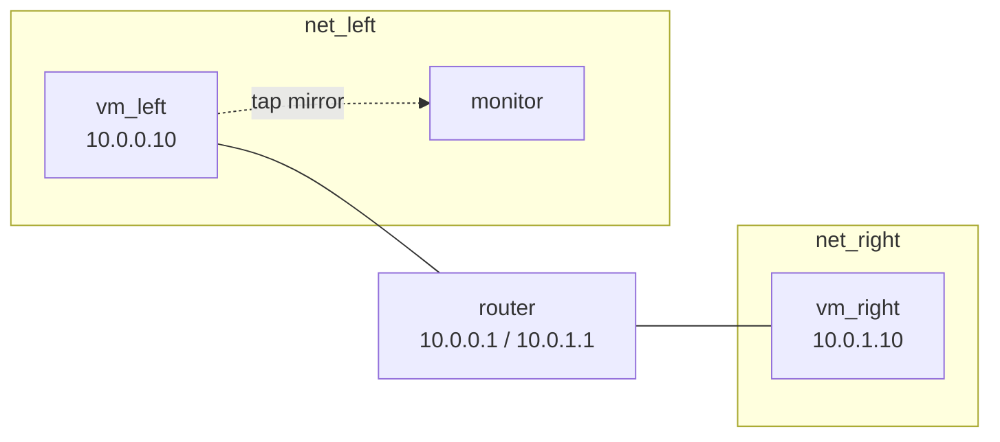

# Chapter 12: Capture and mirrors

In this lab you record what crosses the sandwich, three ways: a PCAP of one
VM interface, a PCAP of the whole bridge, and netflow summaries of the
bridge, written as text and as compressed binary that you convert with
`nfcat`. Then you add a fourth VM, `monitor`, and use `tap mirror` to feed it
a copy of everything `vm_left` sends and receives, so a tool inside a guest
can watch the traffic live. All of it happens on the host side of the taps;
the guests cannot tell.

Prerequisites: Part I, in particular [Chapter 3](03-router-sandwich.md),
[Chapter 6](06-networking.md) for taps, bridges and VLANs, and
[Chapter 8](08-cc.md) for `cc`. [Chapter 11](11-traffic.md) is a good source
of traffic to capture but is not required; the lab uses `ping`.

## Rebuild the sandwich

Start from the sandwich with fixed client addresses, exactly as in
[chapter 11](11-traffic.md#rebuild-the-sandwich-with-fixed-addresses):
`vm_left` is `10.0.0.10`, `vm_right` is `10.0.1.10`, and the script at the
end of the chapter rebuilds it. The topology, with the monitor you add later:



## PCAP from one interface

`capture pcap vm` captures a single VM interface, named by VM and zero-based
interface index, into a file. A relative file name lands in the files
directory, `/tmp/minimega/files`, of the host that runs the VM:

```minimega
minimega[sandwich]$ capture pcap vm vm_left 0 vm_left.pcap
minimega[sandwich]$ .annotate false capture
bridge      | type | interface | mode | compress | path
mega_bridge | pcap | vm_left:0 |      |          | /tmp/minimega/files/vm_left.pcap
```

Make some traffic that crosses that interface. A ping from `vm_left` to
`vm_right` goes out through the router and the replies come back the same
way:

```minimega
minimega[sandwich]$ cc filter name=vm_left
minimega[sandwich]$ cc exec ping -c 5 10.0.1.10
minimega[sandwich]$ shell sleep 10
minimega[sandwich]$ capture pcap delete vm vm_left
```

`capture pcap delete vm <name>` stops every capture on that VM; add the
interface index to stop just one. The file is an ordinary PCAP, readable
with `tcpdump -n -r /tmp/minimega/files/vm_left.pcap` or Wireshark on the
host. It contains the ten ICMP packets, five requests and five replies, plus
any ARP, and nothing from `net_right`, because the tap only ever sees
`vm_left`'s frames.

Two settings apply to captures you start afterwards: `capture pcap snaplen`
limits the bytes kept per packet (1600 by default), and
`capture pcap filter "icmp"` applies a BPF expression. Either without an
argument shows the current value.

## PCAP from the bridge

`capture pcap bridge` captures everything crossing a bridge, every VLAN
included, so one capture on `mega_bridge` holds both sides of the sandwich.
Run the same ping and compare:

```minimega
minimega[sandwich]$ capture pcap bridge mega_bridge sandwich.pcap
minimega[sandwich]$ cc exec ping -c 5 10.0.1.10
minimega[sandwich]$ shell sleep 10
minimega[sandwich]$ capture pcap delete bridge mega_bridge
```

This time each ping appears twice, once on `net_left` between `vm_left` and
the router and once on `net_right` between the router and `vm_right`. Bridge
captures run only on the host you are attached to, and a bridge carries every
namespace that uses it, so on a shared host a bridge capture contains other
people's experiments as well. Prefer per-VM captures when hosts are shared;
[Captures and namespaces](../../articles/capture.md#captures-and-namespaces)
has the details.

## Netflow

Netflow keeps one record per conversation, with endpoints, ports, protocol,
byte and packet counts and timing, instead of every packet. It is attached
to a bridge, and two settings are read when a writer starts: `mode` chooses
`ascii` or `raw` (binary, the default) and `gzip` compresses file output.
Start a text writer first:

```minimega
minimega[sandwich]$ capture netflow mode ascii
minimega[sandwich]$ capture netflow bridge mega_bridge sandwich.nf
minimega[sandwich]$ cc exec ping -c 5 10.0.1.10
minimega[sandwich]$ shell sleep 15
minimega[sandwich]$ capture netflow delete bridge mega_bridge
```

The wait matters: a flow is written out when it has been idle or has been
active for the timeout, 10 seconds by default (`capture netflow timeout`).
`sandwich.nf` is now a text file with one line per flow. Raw mode is the
compact form for long runs; combine it with gzip and convert afterwards with
`nfcat`, which the packages install as `/opt/minimega/bin/nfcat` (`bin/nfcat`
in a source build):

```minimega
minimega[sandwich]$ capture netflow mode raw
minimega[sandwich]$ capture netflow gzip true
minimega[sandwich]$ capture netflow bridge mega_bridge sandwich.nf.gz
minimega[sandwich]$ cc exec ping -c 5 10.0.1.10
minimega[sandwich]$ shell sleep 15
minimega[sandwich]$ capture netflow delete bridge mega_bridge
minimega[sandwich]$ shell /opt/minimega/bin/nfcat -gunzip /tmp/minimega/files/sandwich.nf.gz
```

`capture` lists netflow writers with their `mode` and `compress` columns, and
a writer can also send to a collector: `capture netflow bridge mega_bridge
udp collector.example.org:2055`. Open vSwitch keeps a single netflow object
per bridge, so the timeout is shared by every writer on it.

## A monitor VM on a mirror

Host-side captures answer "what was sent". When you want a tool to see the
traffic as it happens, and that tool is easier to run in a guest than on the
host, mirror the traffic into a VM. Launch a third client-image VM on
`net_left`, let it boot and take a lease, and only then create the mirror:

```minimega
minimega[sandwich]$ vm config networks net_left
minimega[sandwich]$ vm launch kvm monitor
minimega[sandwich]$ vm start monitor
minimega[sandwich]$ shell sleep 30
minimega[sandwich]$ tap mirror vm_left 0 monitor 0
```

`tap mirror <vm> <index> <vm> <index>` tells Open vSwitch to copy every frame
that enters or leaves the first port to the second. Both VMs must be on the
same bridge, and therefore on the same host. The other form names taps
directly, as `vm info` shows them, so a host tap can be either end:

```minimega
minimega[sandwich]$ .annotate false .columns name,tap vm info
name     | tap
monitor  | [mega_tap4]
router   | [mega_tap2, mega_tap3]
vm_left  | [mega_tap0]
vm_right | [mega_tap1]
minimega[sandwich]$ tap mirror mega_tap0 mega_tap4
```

The order of the mirror is why the monitor boots first: while a port is a
mirror destination, Open vSwitch reserves it for mirrored frames and drops
anything the VM itself sends, so the monitor cannot be reached over the
network. That is no obstacle, because you drive it over cc. The client image
includes tcpdump; write what arrives to a file, ping across the sandwich from
the other client, then stop tcpdump and read the file back:

```minimega
minimega[sandwich]$ cc filter name=monitor
minimega[sandwich]$ cc prefix monitor
minimega[sandwich]$ cc background tcpdump -U -n -i eth0 -w /tmp/mirror.pcap
minimega[sandwich]$ cc filter name=vm_right
minimega[sandwich]$ cc exec ping -c 3 10.0.0.10
minimega[sandwich]$ shell sleep 10
minimega[sandwich]$ cc filter name=monitor
minimega[sandwich]$ cc process killall tcpdump
minimega[sandwich]$ cc exec tcpdump -n -r /tmp/mirror.pcap
minimega[sandwich]$ shell sleep 5
minimega[sandwich]$ cc responses monitor
```

`-U` makes tcpdump flush each packet to the file, so nothing is lost when
`cc process killall` stops it. The response shows the six ICMP packets
between `10.0.1.10` and `10.0.0.10` as they crossed `vm_left`'s interface,
plus whatever ARP and DHCP traffic that interface saw. Replace tcpdump with
Zeek, Suricata or Snort in your own image and the same mirror feeds a real
sensor; the [capture guide](../../articles/capture.md#a-zeek-sensor-on-the-mirror)
walks through a Zeek VM with a persistent log disk.

Mirrors are keyed by their destination, since one source can feed several
monitors. Remove this one by VM and interface, or by tap name:

```minimega
minimega[sandwich]$ clear tap mirror monitor 0
```

`clear tap mirror` with no name removes every mirror in the namespace, and
`clear tap` removes them along with the host taps.

## Clean up

`clear capture` stops every capture of every kind in the namespace;
`clear capture pcap` and `clear capture netflow` stop one kind. The files
stay in `/tmp/minimega/files` until you delete them, and on a cluster
`file get` fetches them from the host that wrote them.

## What you built

- PCAPs of one interface (`vm_left.pcap`) and of the whole bridge
  (`sandwich.pcap`), and the difference between them.
- Netflow of the bridge as text (`sandwich.nf`) and as gzipped raw records
  converted with `nfcat`.
- A `monitor` VM on `net_left` that receives a mirror of `vm_left`'s
  interface and runs tcpdump on it, driven entirely over cc.

## Where to read more

- [Capture and instrumentation](../../articles/capture.md): choosing a
  method, [PCAP](../../articles/capture.md#pcap),
  [netflow](../../articles/capture.md#netflow), and
  [mirroring](../../articles/capture.md#mirroring-traffic-to-a-monitor-vm).
- [Host networking](../../articles/networking.md) for taps and bridges.
- [File management](../../articles/file.md) for fetching capture files
  from other hosts.
- Reference: [`capture`](../../reference/minimega.md#capture),
  [`clear capture`](../../reference/minimega.md#clear-capture),
  [`tap`](../../reference/minimega.md#tap),
  [`clear tap`](../../reference/minimega.md#clear-tap).

## Script

```minimega title="12-capture.mm"
--8<-- "training/miniclass/scripts/12-capture.mm"
```

[Download this example](scripts/12-capture.mm){ download="12-capture.mm" }
