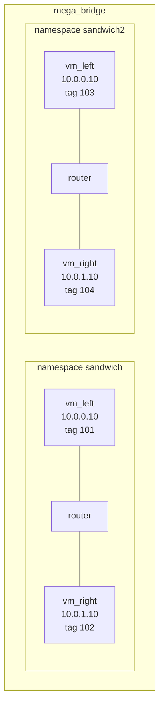

# Chapter 16: Namespaces

The sandwich has lived in a namespace called `sandwich` since chapter 3
without you having to think about it. In this lab you look at what that
bought you, then launch a second, identical sandwich in a namespace called
`sandwich2` on the same host, with the same VM names, the same VLAN aliases
and the same IP addresses, and watch the two never touch. On the way you use
the `ns` API to queue VMs, ask the scheduler where it would put them, and
tear the copy down with one command.

Prerequisites: Part I, in particular [Chapter 3](03-router-sandwich.md) and
[Chapter 9](09-save-replay-cleanup.md), where `clear namespace` first
appeared. [Chapter 20](20-clusters.md) puts the same commands to work across
several hosts.

## Rebuild the sandwich and look around

Start from the sandwich with fixed client addresses, as in
[chapter 11](11-traffic.md#rebuild-the-sandwich-with-fixed-addresses); the
script at the end rebuilds it. `namespace` with no argument lists the
namespaces, and the prompt shows which one is active:

```minimega
minimega[sandwich]$ .annotate false namespace
namespace | vlans    | active
minimega  | 101-4096 | false
sandwich  |          | true
minimega[sandwich]$ .annotate false vlans
alias     | vlan
net_left  | 101
net_right | 102
```

`minimega` is the default namespace, the one you are in when no other is
active. Everything you have created so far, VMs, VLAN aliases, host taps,
captures, the `vm config` template, cc commands and responses, belongs to
`sandwich`, and every `vm`, `cc`, `capture` and `vnc` command you have typed
applied to `sandwich` only. The `vlans` column is empty because the namespace
has not set its own range with `vlans range`; aliases are allocated from the
global range in the default namespace.

## A second sandwich, queued and scheduled

Create the second namespace and switch to it. It starts empty, with its own
template, so the description is repeated in full. This time turn on queueing
first: `vm launch` then only records the VMs, and nothing is created until
the scheduler runs:

```minimega
minimega[sandwich]$ clear namespace sandwich2
minimega[sandwich]$ namespace sandwich2
minimega[sandwich2]$ ns hosts
minimega[sandwich2]$ ns queueing true
minimega[sandwich2]$ vm config kernel miniccc.kernel
minimega[sandwich2]$ vm config initrd miniccc.initrd
minimega[sandwich2]$ vm config memory 2048
minimega[sandwich2]$ vm config networks net_left,00:00:00:00:01:01
minimega[sandwich2]$ vm launch kvm vm_left
minimega[sandwich2]$ vm config networks net_right,00:00:00:00:02:01
minimega[sandwich2]$ vm launch kvm vm_right
minimega[sandwich2]$ vm config kernel minirouter.kernel
minimega[sandwich2]$ vm config initrd minirouter.initrd
minimega[sandwich2]$ vm config networks net_left net_right
minimega[sandwich2]$ vm launch kvm router
minimega[sandwich2]$ vm info
```

`ns hosts` prints the hosts the namespace spans, here just this one, and
`vm info` is empty: the three VMs are in the queue, which `ns queue` prints
with each one's configuration. Ask the scheduler for a placement without
launching anything:

```minimega
minimega[sandwich2]$ .annotate false ns schedule dry-run
vm       | dst
router   | mm1
vm_left  | mm1
vm_right | mm1
```

With one host there is only one answer. On a cluster the scheduler picks the
least loaded host for each VM, `ns schedule mv <vm> <host>` edits the plan,
and `ns schedule dump` shows it again. Then launch:

```minimega
minimega[sandwich2]$ ns schedule
minimega[sandwich2]$ .annotate false ns schedule status
start               | end                 | state     | launched | failures | total | hosts
17 Sep 26 10:02 UTC | 17 Sep 26 10:02 UTC | completed | 3        | 0        | 3     | 1
minimega[sandwich2]$ .annotate false .columns name,state,vlan vm info
name     | state    | vlan
router   | BUILDING | [net_left (103), net_right (104)]
vm_left  | BUILDING | [net_left (103)]
vm_right | BUILDING | [net_right (104)]
```

`ns schedule` and a bare `vm launch` are the same thing. The VMs exist now
and the aliases have been resolved: `net_left` in `sandwich2` is VLAN 103,
not 101, because aliases are looked up per namespace and each namespace gets
its own tags from the shared range. Two VMs called `vm_left` exist on the
host, one per namespace; names only have to be unique within a namespace.

Configure and start the router, then the clients, exactly as before, in this
namespace:

```minimega
minimega[sandwich2]$ router router interface 0 10.0.0.1/24
minimega[sandwich2]$ router router dhcp 10.0.0.0 range 10.0.0.2 10.0.0.254
minimega[sandwich2]$ router router dhcp 10.0.0.0 router 10.0.0.1
minimega[sandwich2]$ router router dhcp 10.0.0.0 static 00:00:00:00:01:01 10.0.0.10
minimega[sandwich2]$ router router interface 1 10.0.1.1/24
minimega[sandwich2]$ router router dhcp 10.0.1.0 range 10.0.1.2 10.0.1.254
minimega[sandwich2]$ router router dhcp 10.0.1.0 router 10.0.1.1
minimega[sandwich2]$ router router dhcp 10.0.1.0 static 00:00:00:00:02:01 10.0.1.10
minimega[sandwich2]$ router router commit
minimega[sandwich2]$ vm start router
minimega[sandwich2]$ shell sleep 10
minimega[sandwich2]$ vm start all
```

## Two experiments, same addresses

Both sandwiches now have a `10.0.0.1` router, a `10.0.0.10` and a
`10.0.1.10`, and the same MAC addresses on the clients. On one bridge that
would be a mess; on four VLANs it is two separate networks:



Prove it. `cc` is scoped too: each namespace runs its own cc server, so
`cc filter name=vm_left` in `sandwich2` matches only the second `vm_left`,
and the ping reaches only the second `vm_right`:

```minimega
minimega[sandwich2]$ cc filter name=vm_left
minimega[sandwich2]$ cc exec ping -c 3 10.0.1.10
minimega[sandwich2]$ shell sleep 10
minimega[sandwich2]$ cc responses 4
minimega[sandwich2]$ clear cc filter
```

Command ids restart at 1 because this is a different cc server; the router
commit used 1 to 3, so the ping is 4. Its responses are written under
`/tmp/minimega/files/sandwich2/miniccc_responses/`.
To look at the other namespace without leaving this one, prefix a command
with its name:

```minimega
minimega[sandwich2]$ .annotate false namespace sandwich .columns name,state,vlan vm info
name     | state   | vlan
router   | RUNNING | [net_left (101), net_right (102)]
vm_left  | RUNNING | [net_left (101)]
vm_right | RUNNING | [net_right (102)]
```

Pipes follow the same rule, as `sandwich//pings` in chapter 15 showed, and
a pipe in another namespace is reachable as `<namespace>//<pipe>`. Host taps
belong to the namespace that created them; bridges do not, which is why the
diagram has one `mega_bridge`.

## What the scheduler can do

On a single host the scheduler has no decisions to make; the machinery is
the same on a cluster, where a new namespace contains every host in the
mesh except the one you are attached to. `ns load` chooses how load is
measured (`cpucommit`, the default, `memcommit` or `netcommit`), and three
`vm config` fields override its choice per VM: `schedule <host>` pins a VM,
`coschedule <n>` limits how many other VMs may share its host, and
`colocate <vm>` puts it next to another. `ns run <command>` runs a command
on every host in the namespace. Chapter 20 spreads the sandwich over two
hosts with exactly these commands.

`ns save <name>` pauses every VM in the active namespace and writes a
`launch.mm` under `/tmp/minimega/files/saved/<name>/` that relaunches the
experiment; chapter 9 and the [save and restore guide](../../articles/save-restore.md)
describe what it captures for each VM type.

## Tear it down

Destroying a namespace kills its VMs, stops its captures, deletes its VLAN
aliases and host taps, removes any `ns bridge` it created, and does the same
on every host in the cluster. It also leaves you in the default namespace if
the one you destroyed was active:

```minimega
minimega[sandwich2]$ clear namespace sandwich2
minimega$ .annotate false namespace
namespace | vlans    | active
minimega  | 101-4096 | true
sandwich  |          | false
```

The first sandwich is untouched. `clear namespace` with no name only
switches back to the default namespace; `clear namespace all` destroys every
namespace, and the default one is recreated empty. Because everything an
experiment creates is tied to its namespace, `clear namespace <name>` is the
cleanup you should reach for first, before `vm kill all` or `nuke`.

## What you built

- A second copy of the sandwich in `sandwich2`, launched through the queue
  and the scheduler, with the same names and addresses as the first.
- Evidence that VLAN aliases, VMs, cc and pipes are all scoped to their
  namespace, and the `namespace <name> <command>` form for peeking across.
- One command, `clear namespace sandwich2`, that removed all of it.

## Where to read more

- [Namespaces](../../articles/namespaces.md): the
  [`namespace` command](../../articles/namespaces.md#the-namespace-command),
  [queueing and the scheduler](../../articles/namespaces.md#queueing-and-the-scheduler),
  [placement hints](../../articles/namespaces.md#placement-hints), and how
  the other commands behave inside a namespace.
- [Host networking](../../articles/networking.md#vlan-aliases-and-ranges)
  for per-namespace VLAN ranges.
- [Cluster setup](../../articles/cluster.md) for the mesh the scheduler
  places VMs on.
- Reference: [`namespace`](../../reference/minimega.md#namespace),
  [`ns`](../../reference/minimega.md#ns),
  [`clear namespace`](../../reference/minimega.md#clear-namespace),
  [`vm config schedule`](../../reference/minimega.md#vm-config-schedule),
  [`vm config coschedule`](../../reference/minimega.md#vm-config-coschedule),
  [`vm config colocate`](../../reference/minimega.md#vm-config-colocate).

## Script

```minimega title="16-namespaces.mm"
--8<-- "training/miniclass/scripts/16-namespaces.mm"
```

[Download this example](scripts/16-namespaces.mm){ download="16-namespaces.mm" }
