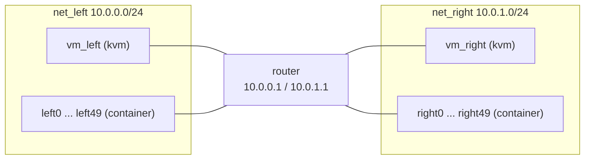

# Chapter 17: Containers

In this chapter you build a container root filesystem, launch it as a
`container` VM next to the KVM guests of the router sandwich, learn the
handful of `vm config` fields that only containers use, and then launch one
hundred containers at once to see why they exist. At the end the sandwich
router is serving DHCP to two KVM clients and a hundred containers, fifty on
each network, all reachable through `cc`.

It assumes the images from [Chapter 2](02-images.md), the running example
from [Chapter 3](03-router-sandwich.md), and the `cc` commands from
[Chapter 8](08-cc.md). Unlike the other chapters, it also needs a host that
boots with cgroup v1, which is explained first.

## What a container VM is

A `container` VM is a full-system Linux container that minimega builds
itself: no Docker, LXC, or other runtime is involved. Each one gets its own
PID, network, mount, and IPC namespaces, is chrooted into a root filesystem,
is limited by cgroups, and runs with a reduced set of root capabilities.
Because containers share the host kernel there is no boot: `vm start` execs
the container's `init` program and it is running a fraction of a second
later, using a few tens of megabytes of memory.

Everything you already know applies. Containers are described with
`vm config`, launched with `vm launch container`, and appear in `vm info`
with `type` set to `container`. They get the same VLAN aliases, taps on the
same bridges, the same `cc` commands, and the same web console (a terminal
instead of a VNC session). The differences are what they boot from and how
they talk to the host, which is what the rest of this chapter is about.

## What the host needs

minimega drives containers with the cgroup **v1** controllers `freezer`,
`memory`, `devices`, and `cpu`, each mounted as its own hierarchy under
`/sys/fs/cgroup` (or the path given by `-cgroup`, `MM_CGROUP` in the packaged
service). Current Debian, Ubuntu, and RHEL-family releases boot with the
unified cgroup v2 hierarchy instead, and the first `vm launch container`
then fails with `cgroups are not initialized, cannot continue`. Check before
you start:

```bash
$ ls /sys/fs/cgroup
```

If you see `memory`, `freezer`, `devices`, and `cpu` directories you are
set. If you see `cgroup.controllers` and no such directories, boot the host
with `systemd.unified_cgroup_hierarchy=0` on the kernel command line, and on
Debian-family kernels also `cgroup_enable=memory`; put them in
`GRUB_CMDLINE_LINUX_DEFAULT` in `/etc/default/grub`, run `update-grub`, and
reboot. [Installation](../../articles/installing.md#containers-need-cgroup-v1)
has the RHEL-family form. KVM VMs do not care either way.

Two more host details matter once you launch many containers. Snapshot mode
uses overlayfs, which every kernel since 3.18 has. And every container is a
process tree on the host, so the limits on open files and processes are
reached long before memory is. The packaged systemd unit raises them
(`LimitNOFILE=1024000`, `LimitNPROC=4096000`); if you started minimega by
hand, run `ulimit -n 1024000 -u 4096000` in that shell first.

## Build a container filesystem

A container needs a directory that looks like the root of a Linux system,
with `/dev`, `/proc`, and `/sys` for minimega to mount over, and an
executable `init` for minimega to run as PID 1. The repository ships a
vmbetter configuration that builds one with miniccc inside,
`misc/vmbetter_configs/miniccc_container.conf`. Its `init` brings up `veth0`
with DHCP, starts `sshd`, and starts `miniccc -family unix -parent /cc`,
because a container reaches minimega over a UNIX socket that minimega
creates at `/cc` in the container's root rather than over the virtio-serial
port a KVM guest uses.

Build it the way you built the KVM images in Chapter 2, from a source tree
with a built `bin/miniccc` (the overlay links to it):

```bash
$ cd ~/minimega
$ sudo bash misc/vmbetter.bash minicccfs
```

The wrapper runs `vmbetter -O minicccfs -rootfs` on the configuration and
then packs the resulting `minicccfs/` directory into `minicccfs.tar.gz`. Put
the tarball in the files directory and let minimega unpack it with the `tar:`
prefix:

```bash
$ sudo cp minicccfs.tar.gz /tmp/minimega/files/
```

```minimega
minimega$ vm config filesystem tar:minicccfs.tar.gz
minimega$ vm config filesystem
/tmp/minimega/files/minicccfs
```

`tar:` fetches the tarball from any node in the mesh if necessary, unpacks
it next to itself, and substitutes the directory it contained. The rest of
this chapter uses that directory path directly.

You do not have to use vmbetter. Any root filesystem with a working `init`
script does, and
[Building images with vmbetter](../../articles/vmbetter.md#container-root-filesystems-from-docker-or-lxc)
shows how to export one from a Docker image or an LXC template and what the
`init` script has to do.

## Launch one container

Start from the sandwich of Chapter 3 running in namespace `sandwich`. Point
the template at the filesystem and launch:

```minimega
minimega$ namespace sandwich
minimega$ vm config filesystem /tmp/minimega/files/minicccfs
minimega$ vm config memory 256
minimega$ vm config networks net_left
minimega$ vm launch container ctr0
minimega$ vm start ctr0
```

The template still holds `kernel`, `initrd`, and the other KVM fields from
Chapter 3. That is fine: fields that do not apply to the type named in
`vm launch` are ignored. `memory` and `vcpus` do apply, as cgroup limits
rather than allocations, so 256 MB is plenty here. The netspec is the same
as for a KVM guest except that the device driver field is ignored; the
container sees each network as `veth0`, `veth1`, and so on.

A few seconds later the container has a lease from the router and miniccc
has connected:

```minimega
minimega$ .columns name,type,state,vlan,ip,cc_active vm info
host  | name     | type      | state   | vlan                              | ip                   | cc_active
node1 | ctr0     | container | RUNNING | [net_left (101)]                  | [10.0.0.4]           | true
node1 | router   | kvm       | RUNNING | [net_left (101), net_right (102)] | [10.0.0.1, 10.0.1.1] | true
node1 | vm_left  | kvm       | RUNNING | [net_left (101)]                  | [10.0.0.2]           | true
node1 | vm_right | kvm       | RUNNING | [net_right (102)]                 | [10.0.1.2]           | true
```

`cc` treats it like any other client:

```minimega
minimega$ cc filter name=ctr0
minimega$ cc exec ping -c 3 10.0.1.1
minimega$ cc responses all
```

In miniweb the container's connect page is a terminal on its console rather
than a VNC session; several people can share it, and it replays recent
output when opened. The port is in the `console_port` column of `vm info`.

## The container fields

Six `vm config` fields are container specific. You have used `filesystem`;
the others adjust what happens around `init`.

- `init` names the program, with arguments, that minimega execs as PID 1,
  relative to the filesystem root. The default is `/init`. It must not exit:
  when it does, the container is gone.
- `preinit` names a program run as root *before* the container is isolated,
  after the namespaces and mounts exist but before cgroups, capabilities,
  and the chroot are applied. It is for one-off privileged setup that cannot
  be done from inside, such as enabling IP forwarding; the minirouter
  container configuration uses it for exactly that. It must finish before
  the container can start.
- `hostname` sets the container's hostname before `init` runs. It defaults
  to the VM name, which is why `ctr0` above reports itself as `ctr0`.
- `fifos <n>` creates named pipes shared with the host: `fifo0`, `fifo1`,
  and so on in the VM's instance directory, and `/dev/fifos/fifo0`, ...
  inside the container.
- `volume <target> <source>` bind-mounts a host directory into the
  container. Repeat it for more volumes; the same target replaces an earlier
  one, and `vm config volume` alone lists them.
- `snapshot`, shared with KVM, decides whether writes are kept. With the
  default `true` the filesystem is mounted through an overlay and changes
  vanish on `vm flush`; with `false` the container writes into the directory
  itself, and no other container may use that directory.

Volumes are the easy way to hand data to a container or collect results from
it:

```minimega
minimega$ shell mkdir -p /tmp/minimega/scratch
minimega$ vm config volume /scratch /tmp/minimega/scratch
minimega$ vm config volume
/scratch -> /tmp/minimega/scratch
minimega$ vm launch container ctr1
minimega$ vm start ctr1
minimega$ cc filter name=ctr1
minimega$ cc exec ls /scratch
```

The complete list, with types and defaults, is in the
[VM configuration reference](../../articles/vm-config-reference.md#container).

## One hundred containers

The point of containers is scale. Launch fifty on each side of the router
with a range name and start them all:

```minimega
minimega$ vm config networks net_left
minimega$ vm launch container left[0-49]
minimega$ vm config networks net_right
minimega$ vm launch container right[0-49]
minimega$ vm start all
```

Give the DHCP leases half a minute, then look at the result. `.filter` keeps
the table to the containers and `.columns` to the columns that matter:

```minimega
minimega$ .columns name,state,ip,cc_active .filter type=container vm info
```

Every container has an address in its network and a live `cc` connection.
`host` shows what it cost, and it is a fraction of what a hundred KVM guests
would take:

```minimega
minimega$ .columns vms,memused,memtotal,cpucommit host
```

`cc` works across all of them at once. Clear the filter and the next
`cc exec` runs in every client in the namespace, KVM and container alike:

```minimega
minimega$ clear cc filter
minimega$ cc exec hostname
```

Chapter 3's diagram now looks like this:



## Clean up

Containers stop and go away exactly like KVM guests: `vm kill` sends them to
`QUIT`, `vm flush` removes them, and `clear namespace sandwich` does both for
everything in the namespace and unmounts the overlays. If a container's
`init` exits on its own, the VM shows `QUIT` in `vm info` without you doing
anything.

## The script

The script rebuilds the sandwich from scratch and adds the hundred
containers and the volume. It expects the container filesystem to be
unpacked at `/tmp/minimega/files/minicccfs`, as above.

```minimega title="17-containers.mm"
--8<-- "training/miniclass/scripts/17-containers.mm"
```

[Download this example](scripts/17-containers.mm){ download="17-containers.mm" }

## What you built

- A container root filesystem with miniccc inside, built with vmbetter and
  distributed through the files directory.
- One hundred containers on the sandwich networks, each with a DHCP lease
  from the router and a `cc` connection, started in seconds.
- A bind-mounted volume shared between a container and the host.

## Where to read more

- [Virtual machine types](../../articles/vmtypes.md#containers) explains
  what minimega does at each step of a container launch and the host limits
  that matter at scale.
- [Building images with vmbetter](../../articles/vmbetter.md) covers
  `-rootfs` builds and turning Docker or LXC filesystems into container
  images.
- [File management](../../articles/file.md#tar) for the `tar:` prefix.
- [Command and control](../../articles/cc.md#unix-socket-containers) for
  how miniccc connects from inside a container.
- Reference: [`vm launch`](../../reference/minimega.md#vm-launch),
  [`vm config filesystem`](../../reference/minimega.md#vm-config-filesystem),
  [`vm config init`](../../reference/minimega.md#vm-config-init),
  [`vm config preinit`](../../reference/minimega.md#vm-config-preinit),
  [`vm config hostname`](../../reference/minimega.md#vm-config-hostname),
  [`vm config fifos`](../../reference/minimega.md#vm-config-fifos),
  [`vm config volume`](../../reference/minimega.md#vm-config-volume).
