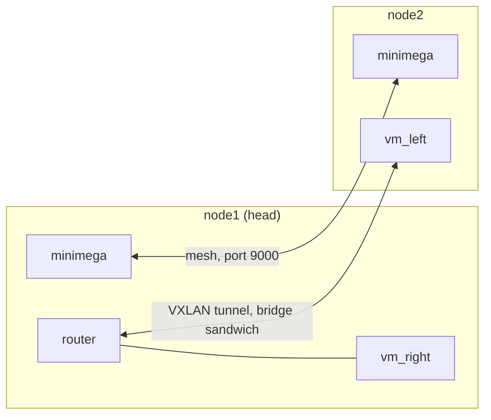

# Chapter 20: Clusters

In this chapter you join two minimega hosts into a mesh, spread the router
sandwich across them so that a client on one host gets its DHCP lease from
the router on the other, and watch the images, the VLANs, and the results
follow the VMs from host to host. At the end `router` and `vm_right` run on
`node1`, `vm_left` runs on `node2`, and the three talk through a VXLAN
tunnel that minimega built for the namespace.

It assumes the installation from [Chapter 1](01-install.md), the sandwich
from [Chapter 3](03-router-sandwich.md), and namespaces from
[Chapter 16](16-namespaces.md).

!!! warning "This chapter needs two hosts"
    Everything before this point runs on one machine. A mesh needs at least
    two minimega instances on two hosts with unique hostnames and a network
    between them, and there is no way to fake that on a single machine. Two
    VMs with nested virtualization enabled, each running minimega, will do
    for learning; the [syllabus](syllabus.md) lists what a classroom needs.
    The chapter names the hosts `node1` (where you type) and `node2`.

## The lab



The two hosts talk to each other on a management network; the sandwich's
`net_left` VLAN is carried between them by a tunnel over that same network.
In a production cluster the experiment traffic normally rides a second NIC
trunked to a VLAN-capable switch instead, which is covered below.

## Prepare both hosts

Install the same minimega release, with QEMU, Open vSwitch, and dnsmasq, on
both hosts as in Chapter 1; commands sent over the mesh are ordinary
minimega commands, so version skew shows up as unknown commands. Then make
sure of three things:

1. Each host has a unique hostname and both names resolve on both hosts to
   their management addresses. Without DNS, put them in `/etc/hosts`, and
   remove any `127.0.1.1 node1` line that Debian-family installers add,
   because `ns bridge` looks a host's tunnel endpoint up by name and skips
   loopback addresses.
2. TCP and UDP port 9000 are open between the hosts. Discovery uses UDP
   broadcast; peers connect over TCP.
3. For `deploy`, `node1` can SSH to `node2` without a password as a user
   that can run minimega. `ssh-copy-id` handles the key.

Copy the Chapter 2 images into `node1`'s files directory only. `node2` will
fetch what it needs.

## Start the mesh

Three flags define a mesh, and they must agree on every host: `-context`,
a label that keeps unrelated clusters on the same network apart; `-degree`,
the number of peers each instance tries to connect to (`0`, the default,
disables discovery); and `-port`. With the packaged service, set them in
`/etc/minimega/minimega.conf` on both hosts and restart:

```text
MM_CONTEXT="miniclass"
MM_DEGREE=2
MM_PORT=9000
```

```bash
$ sudo systemctl restart minimega
```

The instances find each other by broadcast as they come up; nothing has to
run first on the head node. The context is the value to get identical
everywhere, and a mesh of two only needs a degree of one, but a higher
value costs nothing.

The other way is `deploy`, which copies the running minimega binary to other
hosts with `scp` and starts it there with `ssh`, using the flags this
instance was started with plus `-nostdin=true` and `-headnode=node1`. It is
made for a head node started by hand with the mesh flags:

```bash
$ sudo minimega -nostdin -context miniclass -degree 2 &
$ sudo minimega -attach
```

```minimega
minimega$ deploy flags
minimega$ deploy launch node2
minimega$ deploy launch node2 admin sudo
```

`deploy flags` prints what the remote instance will be started with, and
`deploy flags <flags>` replaces it. The second `launch` form logs in as
`admin` and prefixes the remote command with `sudo`, for hosts where root
cannot log in directly. The remote process output goes to `/dev/null`
unless you set `deploy stdout` and `deploy stderr`.

## Check the mesh

Give discovery a few seconds, then ask either host:

```minimega
minimega$ mesh status
host  | size | degree | peers | context   | port
node1 | 2    | 2      | 1     | miniclass | 9000
minimega$ mesh list
node1
 |--node2
node2
 |--node1
```

`size` is the number to watch: when it equals the number of hosts, everyone
is in. `mesh send` runs a command on other hosts and prints their answers
here, which is how you administer the cluster without logging in
everywhere:

```minimega
minimega$ mesh send node2 host
minimega$ mesh send all version
```

If `size` stays at 1, compare `mesh status` on both hosts: `context` and
`port` must match exactly. If they do, the broadcast is not getting through,
and `mesh dial node2` from `node1` joins the hosts over TCP directly.
[Cluster setup](../../articles/cluster.md#when-hosts-do-not-join) has the
rest of the checklist.

## Images travel by themselves

Every minimega serves its files directory to the mesh through iomeshage.
When a VM is launched on `node2` with `vm config kernel miniccc.kernel`, a
relative path that `node2` does not have, `node2` asks the mesh for the file
and receives it before launching. `file list` shows what a node has, `file
status` shows transfers in flight, and `file get` fetches something by hand:

```minimega
minimega$ mesh send node2 file list
minimega$ mesh send node2 file get miniccc.kernel
minimega$ mesh send node2 file status
```

Transfers are always pulls, so to push a file you tell the other node to
fetch it, as above. Two files with the same name but different content on
different nodes are a problem: iomeshage identifies files by path alone.
Start every instance with `-hashfiles`, and with `-headnode node1` so that
the head node's copy always wins; `deploy` sets `-headnode` for you.
[File management](../../articles/file.md#same-name-different-content) has
the details.

## A namespace that spans both hosts

In a mesh, a new namespace contains every host **except** the one you
create it on, on the assumption that the head node should stay free. For a
two-host lab you want both:

```minimega
minimega$ namespace sandwich
minimega$ ns hosts
node2
minimega$ ns add-hosts localhost
minimega$ ns hosts
node[1-2]
```

`localhost` is resolved to this host's name; `ns del-hosts` takes hosts
back out. From here on `vm launch` places each VM on the least loaded host
in that list, and every `vm`, `cc`, and `router` command finds the VM
wherever it is.

## Carrying VLANs between hosts

`net_left` on `node1` and `net_left` on `node2` are the same VLAN, because
alias assignments are broadcast across the mesh, but frames only cross
between the hosts if their bridges are connected. There are two ways.

The production way is a trunk: a dedicated NIC on each host, cabled to a
switch that accepts 802.1q tags, added to the bridge on every host:

```minimega
minimega$ mesh send all bridge trunk mega_bridge eth1
minimega$ bridge trunk mega_bridge eth1
```

The switch does the rest, and the sandwich script from Chapter 3 then runs
unchanged on the cluster. Without a second NIC and a trunking switch, tunnel
instead. `bridge tunnel vxlan <bridge> <remote ip>` connects one bridge to
one remote host; `ns bridge` builds the whole thing for a namespace, a
bridge of the given name on every host plus a full mesh of tunnels between
them, keyed so that it stays separate from other namespaces' bridges:

```minimega
minimega$ ns bridge sandwich vxlan
```

The bridge is named after the namespace by convention, because bridge names
are not namespaced. VMs join it through the bridge field of the netspec,
which is why the chapter script writes `sandwich,net_left` instead of
`net_left`. Tunnels cost MTU: if large transfers between the hosts stall
while pings work, lower the MTU in the guests.

## Placing the VMs

By default `vm launch` places each VM immediately. Turn on queueing so the
scheduler sees the whole experiment first, and pin the router to the head
node with `vm config schedule`:

```minimega
minimega$ ns queueing true
minimega$ vm config kernel minirouter.kernel
minimega$ vm config initrd minirouter.initrd
minimega$ vm config networks sandwich,net_left sandwich,net_right
minimega$ vm config schedule node1
minimega$ vm launch kvm router
minimega$ clear vm config schedule
minimega$ vm config kernel miniccc.kernel
minimega$ vm config initrd miniccc.initrd
minimega$ vm config memory 2048
minimega$ vm config networks sandwich,net_left
minimega$ vm launch kvm vm_left
minimega$ vm config networks sandwich,net_right
minimega$ vm launch kvm vm_right
```

Nothing has launched yet; `ns queue` lists the three waiting VMs. A dry run
shows where the scheduler would put them, `ns schedule mv` overrides it,
`ns schedule dump` prints the result, and `ns schedule` (the same as a bare
`vm launch`) carries it out:

```minimega
minimega$ ns schedule dry-run
minimega$ ns schedule mv vm_left node2
minimega$ ns schedule mv vm_right node1
minimega$ ns schedule dump
vm       | dst
router   | node1
vm_left  | node2
vm_right | node1
minimega$ ns schedule
minimega$ .columns name,state,vlan vm info
host  | name     | state    | vlan
node1 | router   | BUILDING | [net_left (101), net_right (102)]
node2 | vm_left  | BUILDING | [net_left (101)]
node1 | vm_right | BUILDING | [net_right (102)]
```

The placement the dry run proposes depends on the load of the hosts; the
two `mv` commands make the outcome the same every time and put a client on
the far side of the tunnel from the router. `host` (or `ns run host`, which
runs a command on every host in the namespace) shows the load the
scheduler looked at, and `ns load` changes how it is measured. Note that
queueing stays on for the namespace: a later `vm launch kvm x` queues
until the next bare `vm launch`.

The `host` column, which minicli adds to every table while `.annotate` is
on, is now the interesting one: `vm_left` is on `node2`.

## Bring up the sandwich

The router is configured and started exactly as in Chapter 3; `router`
commands are namespace-aware and would work just as well if the router had
landed on `node2`:

```minimega
minimega$ router router interface 0 10.0.0.1/24
minimega$ router router dhcp 10.0.0.0 range 10.0.0.2 10.0.0.254
minimega$ router router dhcp 10.0.0.0 router 10.0.0.1
minimega$ router router interface 1 10.0.1.1/24
minimega$ router router dhcp 10.0.1.0 range 10.0.1.2 10.0.1.254
minimega$ router router dhcp 10.0.1.0 router 10.0.1.1
minimega$ router router commit
minimega$ vm start router
minimega$ vm start all
```

Twenty seconds later, `vm_left` on `node2` has a lease from the router on
`node1`. Its DHCP request crossed the tunnel and the answer came back the
same way:

```minimega
minimega$ .columns name,state,vlan,ip vm info
host  | name     | state   | vlan                              | ip
node1 | router   | RUNNING | [net_left (101), net_right (102)] | [10.0.0.1, 10.0.1.1]
node2 | vm_left  | RUNNING | [net_left (101)]                  | [10.0.0.2]
node1 | vm_right | RUNNING | [net_right (102)]                 | [10.0.1.2]
minimega$ cc filter name=vm_left
minimega$ cc exec ping -c 3 10.0.0.1
minimega$ cc responses all
minimega$ clear cc filter
```

`cc` did not care which host `vm_left` is on: every namespace runs its own
`cc` server on every host, and commands and responses are collected on the
node you typed at. The same holds for `vm screenshot`, VNC through miniweb,
and captures: a `capture pcap vm vm_left 0 left.pcap` writes the file on
`node2`, and `file get left.pcap` brings it to `node1` when it is done.

Finally, look at what iomeshage did while you were not watching:

```minimega
minimega$ mesh send node2 file list
host  | dir | name           | size      | modified
node2 |     | miniccc.initrd | 141852672 | 2026-09-17T14:02:11Z
node2 |     | miniccc.kernel | 7815424   | 2026-09-17T14:02:09Z
```

`node2` fetched the two files it needed for `vm_left` and nothing else.

## Clean up

`clear namespace sandwich` kills the VMs on both hosts, deletes the VLAN
aliases, and tears down the `sandwich` bridge and its tunnels everywhere.
The mesh itself stays up until the instances stop.

## The script

Run the script on `node1` once `mesh status` reports a size of 2. It adds
`node1` to the namespace, builds the tunnelled bridge, queues and places the
VMs as above, brings up the sandwich, and shows what `node2` fetched.

```minimega title="20-clusters.mm"
--8<-- "training/miniclass/scripts/20-clusters.mm"
```

[Download this example](scripts/20-clusters.mm){ download="20-clusters.mm" }

## What you built

- A two-host mesh, started from the service configuration or with `deploy`,
  and checked with `mesh status`.
- The router sandwich spread across both hosts by the namespace scheduler,
  with placement inspected and adjusted before launch.
- A VXLAN-tunnelled bridge carrying `net_left` between the hosts, and images
  fetched to `node2` by iomeshage without any copying by hand.

## Where to read more

- [Cluster setup](../../articles/cluster.md): host preparation, trunks and
  tunnels, `deploy`, the service and Docker variants, and what to do when
  hosts do not join.
- [Namespaces](../../articles/namespaces.md): hosts, queueing, the
  scheduler, placement hints, `ns bridge`, and `ns run`.
- [File management](../../articles/file.md): the `file` API, `-hashfiles`,
  `-headnode`, and the `file:` prefix.
- [Host networking](../../articles/networking.md#bridges-trunks-and-tunnels)
- Reference: [`mesh status`](../../reference/minimega.md#mesh-status),
  [`mesh send`](../../reference/minimega.md#mesh-send),
  [`mesh dial`](../../reference/minimega.md#mesh-dial),
  [`deploy`](../../reference/minimega.md#deploy),
  [`ns`](../../reference/minimega.md#ns),
  [`file`](../../reference/minimega.md#file),
  [`bridge`](../../reference/minimega.md#bridge),
  [`vm config schedule`](../../reference/minimega.md#vm-config-schedule).
