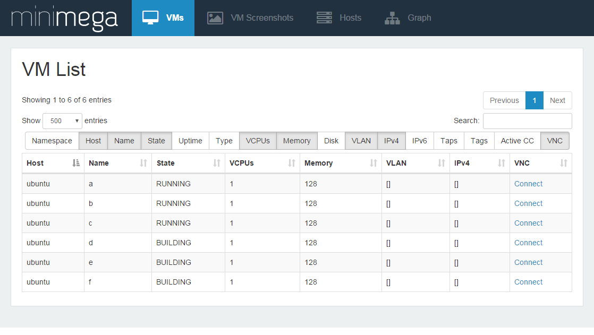
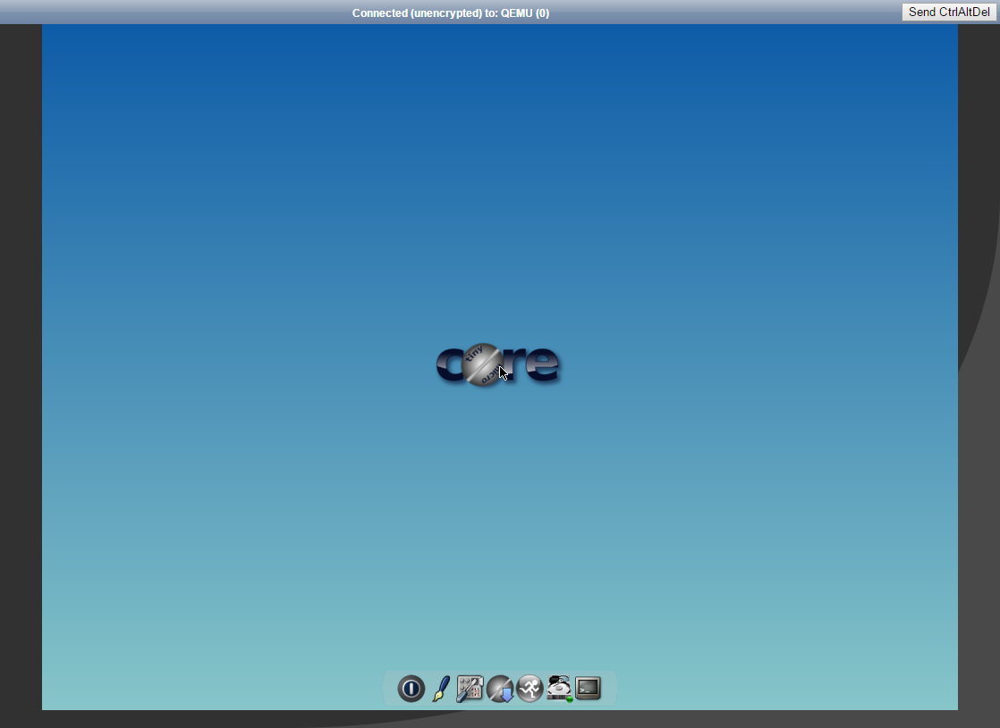
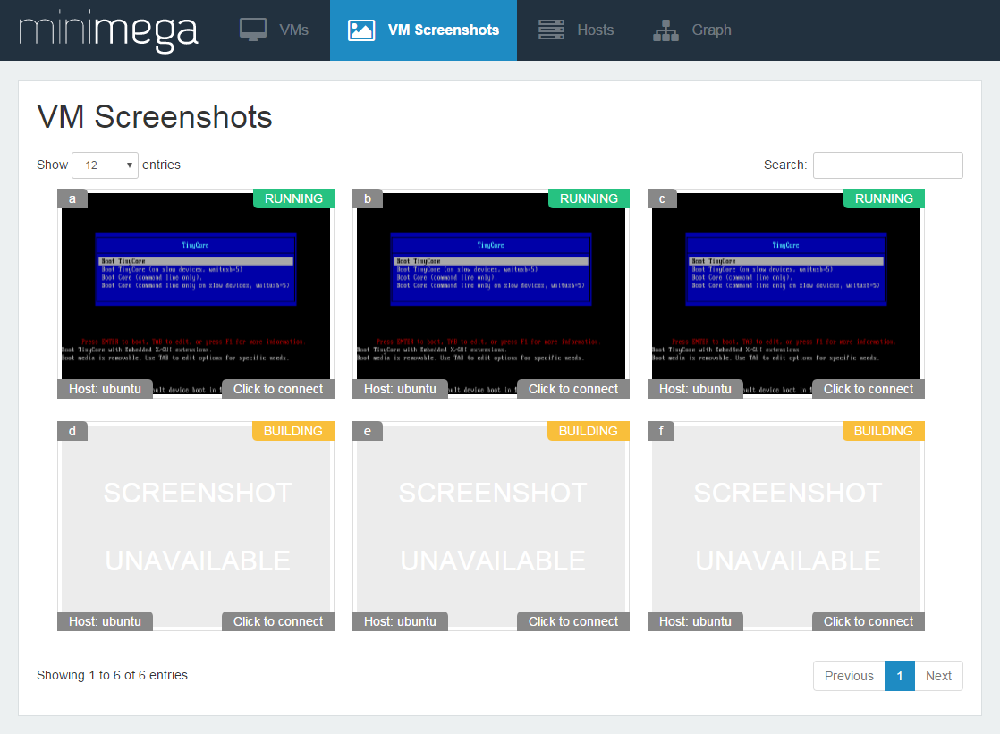
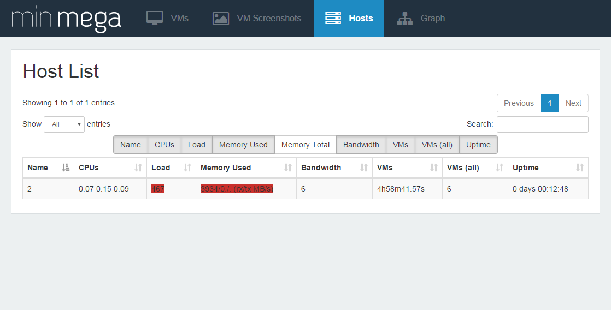
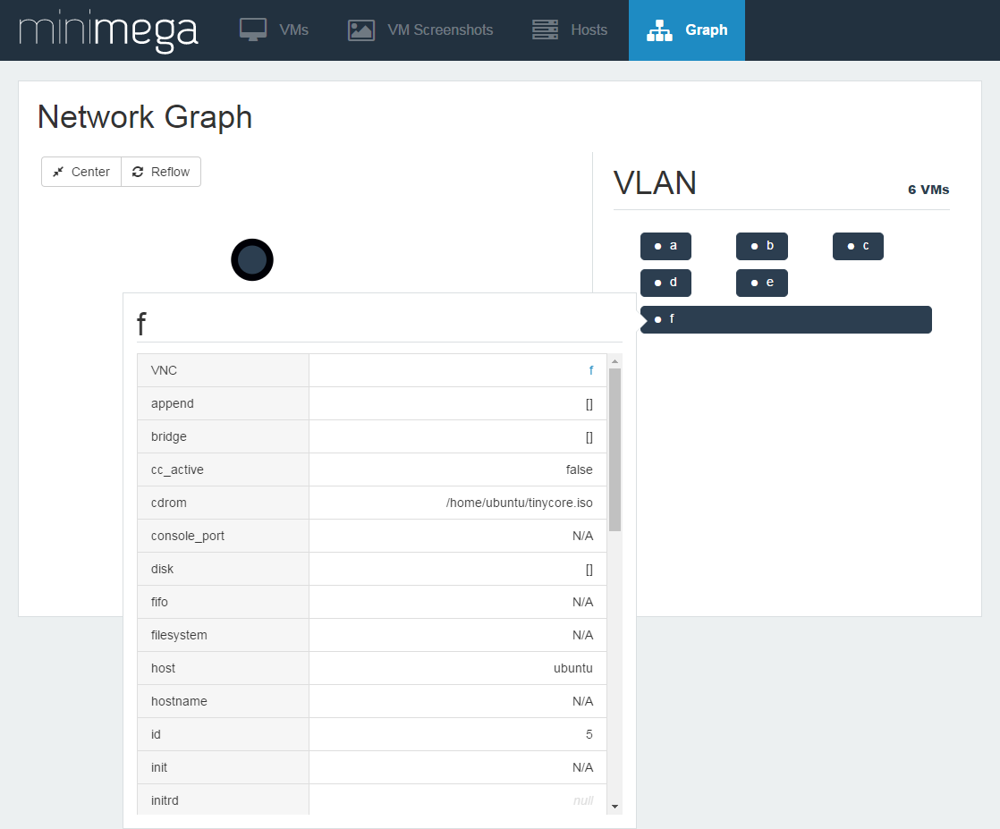
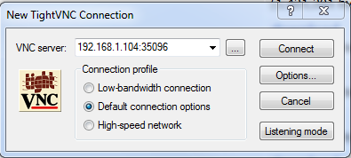
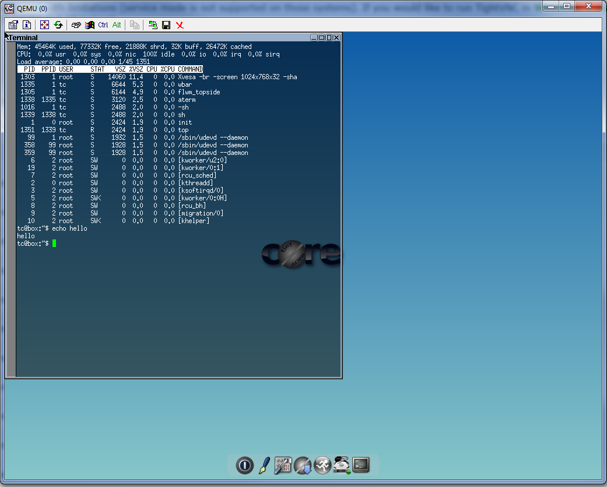

# Module 10 - Web Interface and VNC

!!! warning "Historical miniclass"
    This lesson was recovered from the former Sandia minimega site. It is preserved for reference and may describe obsolete software, operating systems, commands, or external resources. Consult the [current documentation](../../index.md) before applying it.

[View the archived source URL](https://www.sandia.gov/minimega/module-10-web-interface-and-connecting-to-a-virtual-machine-with-vnc/).

## Introduction

Now we have some virtual machines running, you are probably wondering "How do we connect to them?"

`miniweb` is a standalone webserver for minimega. It replaces the `web` API that existed until the 2.3 release. We split `miniweb` out to improve maintainability and ease feature development. As such, `miniweb` has many more features than the old `web` API.

## Starting and Stopping the Web Interface

`miniweb` talks to minimega using the domain socket in minimega's `-base` directory. For this reason, it must be run on a node that runs minimega, preferably the head node.

If you started minimega using `launchme.sh` (see
[Module 5](module-05.md), "Bash Script") then this will be handled for you, but
if not run:

```
# tmux kill-session -t miniweb 2>/dev/null
# tmux new -s miniweb -d
# tmux send-keys -t miniweb "cd /home/ubuntu/minimega && sleep 5" C-m
# tmux send-keys -t miniweb "bin/miniweb" C-m
```

You can customize `launchme.sh` to run miniweb with different flags:

```
root@ubuntu:~/new/minimega# bin/miniweb -h
miniweb, Copyright (2017) Sandia Corporation.
Under the terms of Contract DE-AC04-94AL85000 with Sandia Corporation,
the U.S. Government retains certain rights in this software.
usage: miniweb [option]...
  -addr string
        listen address (default ":9001")
  -base string
        base path for minimega (default "/tmp/minimega")
  -bootstrap
        create password file for auth
  -cert string
        cert file for TLS in PEM format
  -console string
        path to minimega to enable console (e.g. bin/minimega)
  -key string
        key file for TLS in PEM format
  -level value
        set log level: [debug, info, warn, error, fatal] (default error)
  -logfile string
        specify file to log to
  -namespace string
        limit miniweb to a namespace
  -passwords string
        password file for auth
  -root string
        base path for web files (default "misc/web")
  -v    log on stderr (default true)
  -verbose
        log on stderr (default true)
```

Some important flags are `-addr` which accepts a `host:port` tuple to listen on, `-base` to match minimega's `-base` flag, and `-root` to specify the location of the web files (`misc/web/` in the repo).

Logging is controlled with `-level`, `-logfile`, and `-v` / `-verbose`.

For example on port 8080:

```
# tmux kill-session -t miniweb 2>/dev/null
# tmux new -s miniweb -d
# tmux send-keys -t miniweb "cd /home/ubuntu/minimega && sleep 5" C-m
# tmux send-keys -t miniweb "bin/miniweb -addr ':8080'" C-m
```

You can stop the web server with:

```
tmux kill-session -t miniweb
```

The remaining flags will be described below.

### Authentication (-bootstrap, -passwords, -key, -cert)

`miniweb` supports per-path authentication so that users can be limited to specific namespaces or VMs. The authentication is configured using the `-bootstrap` and `-passwords` flags:

```
$ bin/miniweb -bootstrap -passwords minimega.passwd\
Configure /\
Username: jon\
Password:\
Confirm Password:\
\
Add additional users (Ctrl-D when finished):\
Path: /vm/fritz\
Username: fritz\
Password:\
Confirm Password:\
\
Add additional users (Ctrl-D when finished):\
Path: /vm/john\
Username: john\
Password:\
Confirm Password:\
\
Add additional users (Ctrl-D when finished):\
Path:
```

This generates a password file with bcrypt hashed passwords:

```
$ cat minimega.passwd\
[\
    {\
        "path": "/",\
        "username": "jon",\
        "password": "JDJhJDEwJFZzSjNIRjFVbjc5Z2ZReUpxVmRZMS5WU2thaUNHS3RIczk5eExFMS5kdy5VUEQuY1pub1FT"\
    },\
    {\
        "path": "/vm/fritz",\
        "username": "fritz",\
        "password": "JDJhJDEwJGc0VC93YkNtWVZjMWlteXF1dldrRy5zRkZWVm5GSzMxSjdNZFgwdGp6eklnZmtVaHVuUmhh"\
    },\
    {\
        "path": "/vm/john",\
        "username": "john",\
        "password": "JDJhJDEwJGRLME5jVVM0bW1LNzBYOWQ2YmNPZ09LLk92NlVPZEJTdTdUT0tYSm84RzA1akZjRWxsbGwu"\
    }\
]
```

To run `miniweb` with this password file, simply drop the `-bootstrap` flag:

```
$ bin/miniweb -passwords minimega.passwd
```

Access to a resource is recursive - if there are rules for jon with `/` and fritz with `/vm/fritz`, then both jon and fritz can access `/vm/fritz`. To limit access to a namespace, `foo`, the path should be `/foo/`.

The password file format is intentionally simple so that external scripts can generate it when there are dozens or hundreds of individual path rules.

`miniweb` also supports TLS to protect the usernames and passwords. It accepts a PEM encoded key and certificate. To generate a key and self-signed certificate, you can use:

```
$ openssl req -x509 -newkey rsa:4096 -keyout key.pem -out cert.pem -days 365
```

And then start `miniweb` with:

```
$ bin/miniweb -key key.pem -cert cert.pem
```

### Namespaces (-namespace)

`miniweb` interacts with namespaces in two ways: the `-namespace` flag and via URL paths.

When `-namespace` is set, `miniweb` only interacts with the specified namespace. This disables the URL path-based method.

The URL path-method allows you to prefix URLs with the desired namespace, for example, `/foo/vms` shows the VMs page for the `foo` namespace. `/vms` shows VMs for whatever namespace the head node is currently in. The `/namespaces` page displays a list of the available namespaces with links to the VMs and VLAN pages.

#### VLANs

`/vlans` shows the active VLAN aliases. It may be prefixed with a namespace to see aliases for that namespace.

#### Files

`/files/` shows a directory listing for hosts in the active namespace. It may be prefixed with a namespace to see listings for hosts in that namespace. Additional subdirectories can be appended to the path such as `/files/foo/`.

In a later version, `miniweb` will support uploading and downloading files through this interface.

#### VMs

The `/vms` page shows VMs in the active namespace and can be prefixed with a namespace. There are two views - the view from the `vm info` API and the view from the `vm top` API. In the VM info table, there are buttons to update the state of VMs. You may start, pause, or kill VMs through this interface. Once a VM is killed, it is no longer shown in the list but can be restarted via the CLI.

##### Connecting to VMs

`miniweb` supports VNC for KVM VMs and `xterm.js` for containers. These are both accessed via the `/vm/<name>/<connect>` path.

The container's web console allows multiple users to view the same console at the same time. minimega stores some "scrollback" from the container's console, so when a new console connects it can re-play recent output rather than present a blank screen.

Note that miniweb assumes that it can directly connect to the VM using the host and port from `vm info`. This can cause issues if your machine has a firewall that blocks external connections. If you see errors in miniweb's log that it cannot connect, you may need to modify your firewall rules to allow the connections.

##### Screenshots

Each KVM VM can returns its current screenshot to `miniweb` via the `/vm/<name>/screenshot.png` path

### Console (-console)

`miniweb` includes a minimega console via `/console`. It is disabled by default but can be enabled with the `-console` flag:

```
$ miniweb -console bin/minimega
```

The `-console` flag takes as an argument the path to an associated minimega binary executable.

## Navigating the Web Interface

[Pictures need to be updated to minimega 2.4+. There is a new tab whose functionality is enabled via the `-console` flag that is used to issue minimega commands from the web interface; a minibuilder tab has also been added for high-level topology creation. For now this is what it used to look like.]

With miniweb running open your browser to http://ip:9001 and you will be presented with the web interface.



You can click on "Connect" to start a noVNC session with the virtual machine in your browser giving you control of the keyboard and mouse.

Multiple people can connect and share the same keyboard and mouse using the web interface.



VM Screenshots gives you a tiled view of each VM.



Hosts tells you about servers in the mesh.



Graph prints a d3 graph of the network, each node in the graph can be clicked on to learn more about it.



## Connecting with a VNC Client

You can print the port used for VNC with vm info

```
minimega:/tmp/minimega/minimega$ .columns name,vnc_port vm info
host   | name      | vnc_port
ubuntu | vm-1      | 35096
ubuntu | vm-2      | 34695
ubuntu | vm-3      | 34878
```

And connect directly with any VNC client.

Note if you use this method the VNC session is not shared and web clients will not be able to access the VM until you disconnect.

Here are some example VNC clients:

Windows - TightVnc 1.3.10, OSX - Chicken, Linux - VNCViewer

TightVNC is pretty straightforward your provide the IP:Port and it will log you in without a password.




### Authors

The minimega authors

Created: 30 May 2017

Last updated: 22 April 2022
