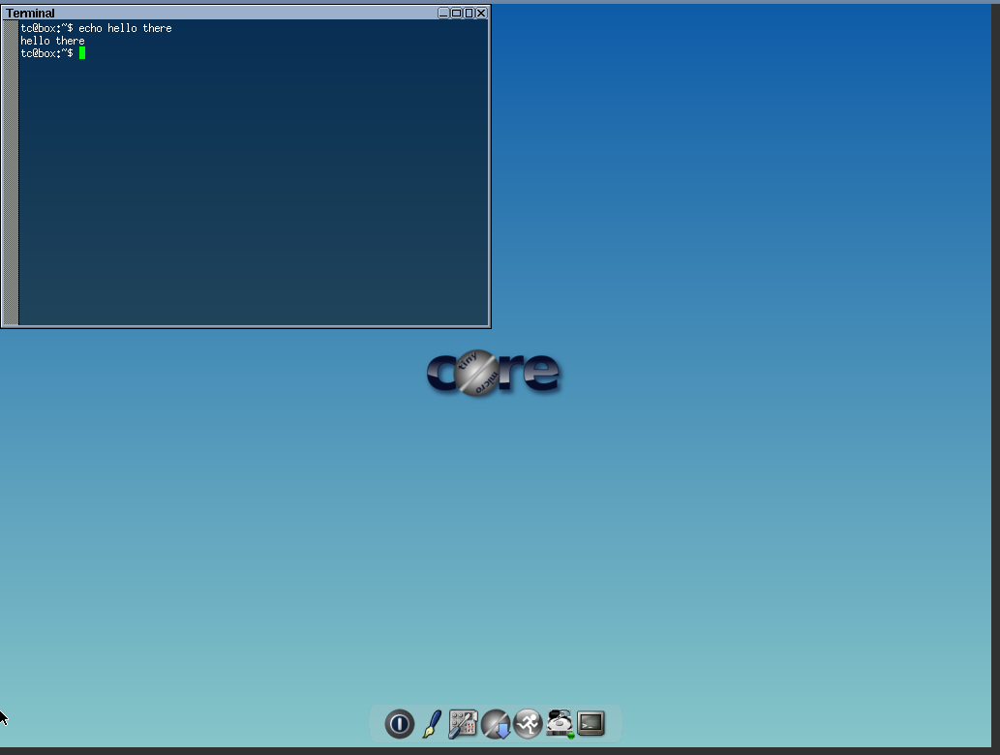
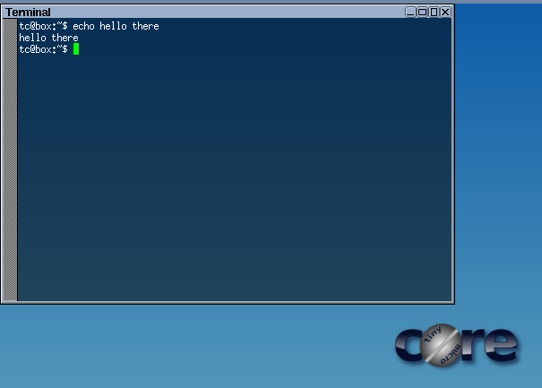

# Module 11 - Pausing VMs

!!! warning "Historical miniclass"
    This lesson was recovered from the former Sandia minimega site. It is preserved for reference and may describe obsolete software, operating systems, commands, or external resources. Consult the [current documentation](../../index.md) before applying it.

[View the archived source URL](https://www.sandia.gov/minimega/module-11-pausing-vms/).

## Introduction

Now we have some virtual machines running, you are probably wondering "How do we connect to them?"

## Pausing and Starting a VM

Let's first start some VMs

```
minimega:/tmp/minimega/minimega$ vm kill all
minimega:/tmp/minimega/minimega$ vm flush
minimega:/tmp/minimega/minimega$ vm launch kvm test[1-3]
minimega:/tmp/minimega/minimega$ vm start all
```

Now let's stop one of those VMs

```
minimega:/tmp/minimega/minimega$ vm stop test1
minimega:/tmp/minimega/minimega$ .columns id,name,state,memory vm info
host   | id | name        | state   | memory
ubuntu | 0  | test1       | PAUSED  | 128
ubuntu | 1  | test2       | RUNNING | 128
ubuntu | 1  | test2       | RUNNING | 128
```

And let's start it back up

```
minimega:/tmp/minimega/minimega$ vm start test1
minimega:/tmp/minimega/minimega$ .columns id,name,state,memory vm info
host   | id | name        | state   | memory
ubuntu | 0  | test1       | RUNNING | 128
ubuntu | 1  | test2       | RUNNING | 128
ubuntu | 1  | test2       | RUNNING | 128
```

## Migrating a VM

You can tell minimega where to save that paused state file using the `vm migrate` command. And then at a later time boot from it.

First, let's connect to the VNC from the website and do something to the VM so we know it wasn't just rebooted. Such as opening a window.



Now let's save the state to a file

```
minimega:/tmp/minimega/minimega$ vm migrate test2 thisisatest
```

Now let's go ahead and kill everything

```
minimega:/tmp/minimega/minimega$ vm kill all
minimega:/tmp/minimega/minimega$ vm flush
minimega:/tmp/minimega/minimega$ .columns id,name,state,memory vm info
```

Now lets restore the state of that vm we captured from earlier

```
minimega:/tmp/minimega/minimega$ clear vm config
minimega:/tmp/minimega/minimega$ vm config migrate /tmp/minimega/files/thisisatest
minimega:/tmp/minimega/minimega$ vm config memory 128
minimega:/tmp/minimega/minimega$ vm config cdrom /home/ubuntu/tinycore.iso
minimega:/tmp/minimega/minimega$ vm launch kvm thisisatest
minimega:/tmp/minimega/minimega$ vm start thisisatest
```


