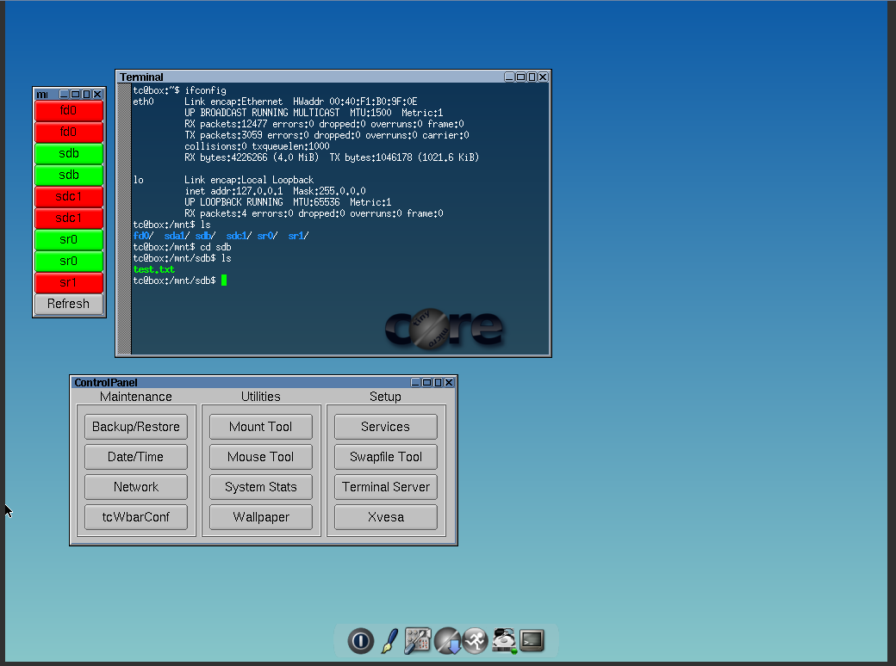
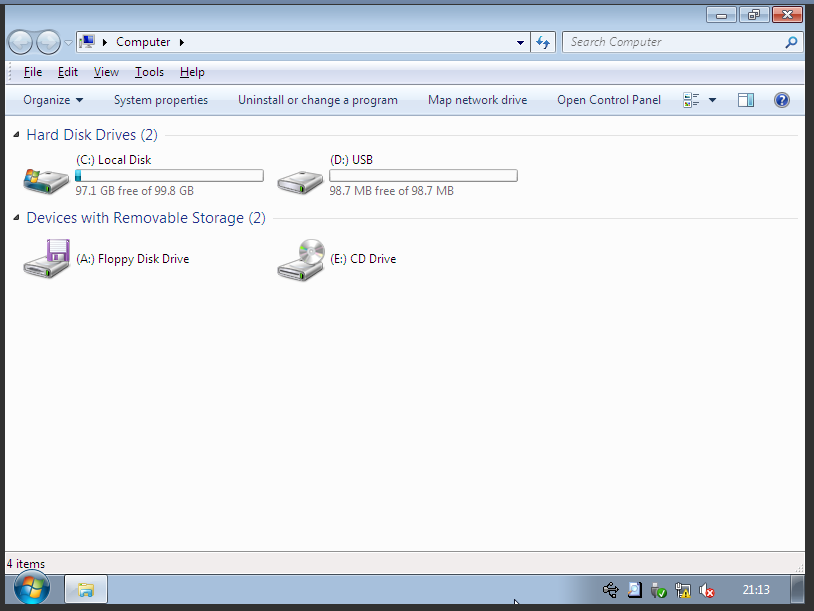
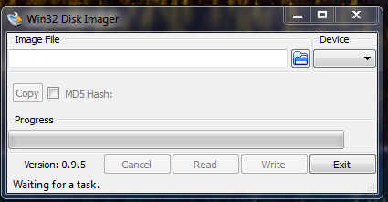

# Module 17 - Hotplugging USB Drives

!!! warning "Historical miniclass"
    This lesson was recovered from the former Sandia minimega site. It is preserved for reference and may describe obsolete software, operating systems, commands, or external resources. Consult the [current documentation](../../index.md) before applying it.

[View the archived source URL](https://www.sandia.gov/minimega/module-17-hotplugging-usb-drives/).

## Introduction

minimega has an API to insert and remove virtual disk image usb drives.

## Linux

Drive images are easier to create for Linux guests, because you don't have to worry about partitioning.

```
dd if=/dev/zero of=mydrive.img bs=1M count=1024
mkfs.fat mydrive.img
mkdir -p /mnt/mydrive
mount mydrive.img /mnt/mydrive
echo "This is a test" > /mnt/mydrive/test.txt
umount /mnt/mydrive
minimega -attach
vm hotplug add tiny /home/ubuntu/mydrive.img 2.0
```



You can view connected usb drives

```
$ vm hotplug
namespace | name  | id | file                     | version
foo       | tiny  | 0  | /home/ubuntu/mydrive.img | 1.1
```

You can disconnect USB drives with remove

```
minimega:/tmp/minimega/minimega$ vm hotplug remove MYVM
```

## Windows

With windows you need to create a valid partition table before formatting.

```
apt-get install kpartx
cd /home/ubuntu/
dd if=/dev/zero of=100.img bs=1M count=100
echo -e "n\np\n\n\n\nt\n7\nw\n" | fdisk 100.img
kpartx -av 100.img
mkfs.fat /dev/mapper/loop0p1
mkdir -p /mnt/mydrive
mount /dev/mapper/loop0p1 /mnt/mydrive
echo "This is a test" > /mnt/mydrive/test.txt
umount /mnt/mydrive
kpartx -dv 100.img
```

```
minimega -attach
vm hotplug add w7 /home/ubuntu/100.img 2.0
```



You can also create images from a flash drive

```
dd if=/dev/sdb of=myusb.img
```

Or with win32diskimager



## Non-Disk Images

Using qemu-append you can also pass through devices. Let's use `lsusb` to print the USB devices on my server

```
root@ubuntu:~# lsusb
Bus 002 Device 003: ID 1234:5678 Brain Actuated Technologies
Bus 002 Device 002: ID 8087:0024 Intel Corp. Integrated Rate Matching Hub
Bus 002 Device 001: ID 1d6b:0002 Linux Foundation 2.0 root hub
Bus 004 Device 001: ID 1d6b:0003 Linux Foundation 3.0 root hub
Bus 003 Device 001: ID 1d6b:0002 Linux Foundation 2.0 root hub
Bus 001 Device 004: ID 05ca:18c0 Ricoh Co., Ltd
Bus 001 Device 003: ID 8086:0189 Intel Corp.
Bus 001 Device 002: ID 8087:0024 Intel Corp. Integrated Rate Matching Hub
Bus 001 Device 001: ID 1d6b:0002 Linux Foundation 2.0 root hub
```

Let's connect my USB flash drive and find out what bus and device number is assigned. In my particular case my flash drive is named Verbatim.

```
root@ubuntu:~# lsusb
Bus 002 Device 003: ID 1234:5678 Brain Actuated Technologies
Bus 002 Device 004: ID 18a5:4123 Verbatim, Ltd
Bus 002 Device 002: ID 8087:0024 Intel Corp. Integrated Rate Matching Hub
Bus 002 Device 001: ID 1d6b:0002 Linux Foundation 2.0 root hub
Bus 004 Device 001: ID 1d6b:0003 Linux Foundation 3.0 root hub
Bus 003 Device 001: ID 1d6b:0002 Linux Foundation 2.0 root hub
Bus 001 Device 004: ID 05ca:18c0 Ricoh Co., Ltd
Bus 001 Device 003: ID 8086:0189 Intel Corp.
Bus 001 Device 002: ID 8087:0024 Intel Corp. Integrated Rate Matching Hub
Bus 001 Device 001: ID 1d6b:0002 Linux Foundation 2.0 root hub
```

Now let's create an append

```
clear vm config qemu-append
vm config qemu-append -usb -device usb-host,hostbus=2,hostaddr=4 -M q35
```

Depending on your hardware you may need to add the -M q35 flag. This changes the qemu usb host bus chipset from I440FX to ICH9.

There a number of ways you can attach usb devices for instance you can reference the ID as well.

```
vm config qemu-append -usb -usbdevice host:18a5:4123 -M q35
```
