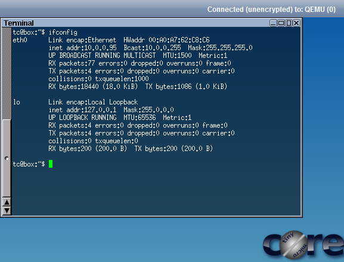
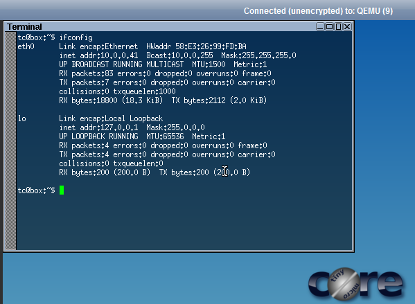

# Module 19 - Networking - Static Addressing

!!! warning "Historical miniclass"
    This lesson was recovered from the former Sandia minimega site. It is preserved for reference and may describe obsolete software, operating systems, commands, or external resources. Consult the [current documentation](../../index.md) before applying it.

[View the archived source URL](https://www.sandia.gov/minimega/module-19-networking-static-addressing/).

## Introduction

You can statically link multiple machines together with ease by assigning them to a VLAN.

## Clean up

```
minimega:/tmp/minimega/minimega$ nuke
# /home/ubuntu/launchme.sh new
```

## Example

`vm config net` command defines an adapter

```
# minimega -attach
minimega:/tmp/minimega/minimega$ vm config disk /home/ubuntu/tinycore.qcow
minimega:/tmp/minimega/minimega$ vm config memory 128
minimega:/tmp/minimega/minimega$ vm config net 100
minimega:/tmp/minimega/minimega$ vm launch kvm a,b
minimega:/tmp/minimega/minimega$ vm start all
```




## Explanation

We created an adapter and assigned VLAN 100. Adapters on the same vlan are on the same bridged network allowing you to network between them.

- The VLAN must be between 1-4096
- If your server can be connected to two networks it is recommended to segment them into a management and experiment network.

that is to use a management network to connect to your servers and an experiment network for the VMs to communicate on. This is done for performance reasons and so local traffic doesn't skew your experiment. When this is done your experiment adapter will need to be added to the bridge.

```
ovs-vsctl add-port mega_bridge eth1
```

You can change what adapter the network gets assigned on with the net command

```
vm config net mega_bridge,100
```

You will notice I didn't use the term `eth0` or `eth1`

```
minimega:/tmp/minimega/minimega$ shell ifconfig
ubuntu: enp5s0    Link encap:Ethernet  HWaddr f0:bf:97:dc:5c:5a
          inet addr:192.168.1.104  Bcast:192.168.1.255  Mask:255.255.255.0
          inet6 addr: fe80::f2bf:97ff:fedc:5c5a/64 Scope:Link
          UP BROADCAST RUNNING MULTICAST  MTU:1500  Metric:1
          RX packets:2089852 errors:0 dropped:0 overruns:0 frame:0
          TX packets:805751 errors:0 dropped:0 overruns:0 carrier:0
          collisions:0 txqueuelen:1000
          RX bytes:2834086488 (2.8 GB)  TX bytes:221754413 (221.7 MB)

lo        Link encap:Local Loopback
          inet addr:127.0.0.1  Mask:255.0.0.0
          inet6 addr: ::1/128 Scope:Host
          UP LOOPBACK RUNNING  MTU:65536  Metric:1
          RX packets:89190 errors:0 dropped:0 overruns:0 frame:0
          TX packets:89190 errors:0 dropped:0 overruns:0 carrier:0
          collisions:0 txqueuelen:1
          RX bytes:18039166 (18.0 MB)  TX bytes:18039166 (18.0 MB)

mega_bridge Link encap:Ethernet  HWaddr 6e:41:a3:fc:36:41
          inet6 addr: fe80::6c41:a3ff:fefc:3641/64 Scope:Link
          UP BROADCAST RUNNING MULTICAST  MTU:1500  Metric:1
          RX packets:252 errors:0 dropped:0 overruns:0 frame:0
          TX packets:8 errors:0 dropped:0 overruns:0 carrier:0
          collisions:0 txqueuelen:1
          RX bytes:80682 (80.6 KB)  TX bytes:648 (648.0 B)

mega_tap0 Link encap:Ethernet  HWaddr 52:4f:a8:65:83:a3
          inet6 addr: fe80::504f:a8ff:fe65:83a3/64 Scope:Link
          UP BROADCAST RUNNING MULTICAST  MTU:1500  Metric:1
          RX packets:139 errors:0 dropped:0 overruns:0 frame:0
          TX packets:146 errors:0 dropped:0 overruns:0 carrier:0
          collisions:0 txqueuelen:1000
          RX bytes:43520 (43.5 KB)  TX bytes:43826 (43.8 KB)

mega_tap1 Link encap:Ethernet  HWaddr c2:81:2b:97:d7:a9
          inet6 addr: fe80::c081:2bff:fe97:d7a9/64 Scope:Link
          UP BROADCAST RUNNING MULTICAST  MTU:1500  Metric:1
          RX packets:138 errors:0 dropped:0 overruns:0 frame:0
          TX packets:147 errors:0 dropped:0 overruns:0 carrier:0
          collisions:0 txqueuelen:1000
          RX bytes:43178 (43.1 KB)  TX bytes:44168 (44.1 KB)
```

In the background when we said `vm config net 100`, minimega went off and used OpenVSwitch to create a bridge to place the VMs on and a tap for each VM. This will be explained in depth in later modules; for now, just accept the magic.
