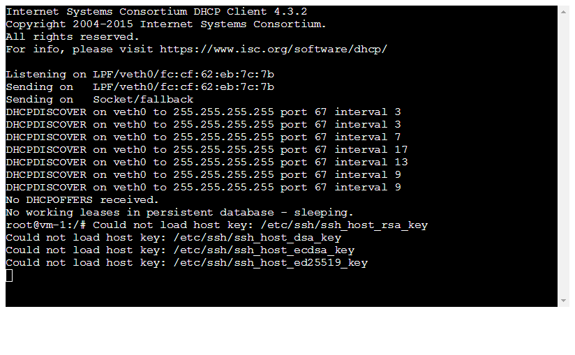
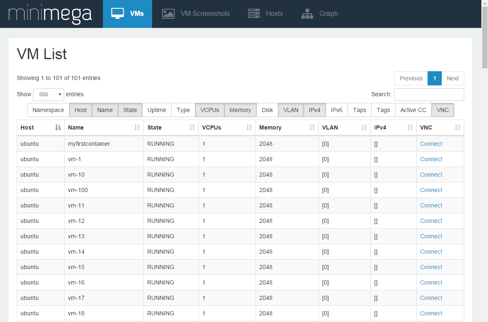
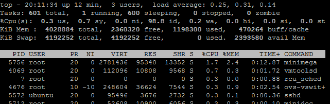

# Module 26 - Containers

!!! warning "Historical miniclass"
    This lesson was recovered from the former Sandia minimega site. It is preserved for reference and may describe obsolete software, operating systems, commands, or external resources. Consult the [current documentation](../../index.md) before applying it.

[View the archived source URL](https://www.sandia.gov/minimega/module-26-containers/).

## Introduction

Containers allow for the reuse of host Operating System components in isolated guests reducing resource usage.

minimega's container-type VMs are custom built with a focus on minimizing resource usage even further than LXC and Docker. A container requires at minimum a root filesystem (rootfs) and an executable to be run at `init` (PID 1) within the rootfs. The `init` program can be a shell script. minimega's container implementation supports full-system containers only. This means that every container obtains a PID, network, mount, and IPC namespace. The rootfs must have certain directories populated in order to function correctly. The minimega distribution includes scripts to build busybox-based rootfs (see `misc/uminiccc/build.bash` and `misc/uminirouter/build.bash`) and vmbetter-based rootfs (see `misc/vmbetter_configs/miniccc_container.conf` and `misc/vmbetter_configs/minirouter_container.conf`).

For those curious about the implementation specifics you can read about them in the Additional Technical Information section.

## Requirements

### OverlayFS

This feature is enabled by default with a Linux kernel >3.18. Phrased differently, containers will not be supported if your host OS uses an older kernel than this, so first verify that your OS can support this feature before proceeding.

### Memory Cgroups

```
nano /etc/default/grub
[use arrow keys to navigate]
[change GRUB_CMDLINE_LINUX="" to GRUB_CMDLINE_LINUX="cgroups_enabled=memory"]
[control + x] [control + y] [Enter] to save
update-grub
reboot
```

### minimega after Oct 2016

Prior versions of minimega did not support `systemd` and were still in their infancy.

### Increased ulimits

Containers run as a process in the host operating system and often times reach process resource usage limits. Increasing those limits allows for more containers.

```
sysctl -w fs.inotify.max_user_instances=8192
ulimit -n 999999
```

### Containerfs

minimega requires a custom filesystem for the container. You can download a prebuilt filesystem that has an `init` file that runs `sshd`. Future modules will cover building container filesystems. [storage.googleapis.com/minimega-files/minimega-2.2-containerfs.tar.bz2](https://storage.googleapis.com/minimega-files/minimega-2.2-containerfs.tar.bz2)

## Example

### Download a container filesystem

```
cd ~
wget https://storage.googleapis.com/minimega-files/minimega-2.2-containerfs.tar.bz2
tar xf minimega-2.2-containerfs.tar.bz2
```

### Start minimega

```
minimega/bin/minimega -nostdin &
minimega/bin/minimega -attach
```

### Launch a container

```
vm config filesystem /home/ubuntu/containerfs/
vm config fifo 1
vm config net 0
vm launch container myfirstcontainer
vm start myfirstcontainer
```



### Launch more containers

```
# Launch 100 containers
vm launch container 100
vm start all
```



Low resource usage:



### Killing containers

Containers are killed the same way as KVM machines

```
vm kill all
vm flush
```

## Container Config Options

Most `vm config` parameters are common to all VM types, though some are specific to `KVM` and `container` instances. See the [minimega API](https://www.sandia.gov/minimega/minimega-api/) for documentation on specific configuration parameters.

### vm config hostname

The `hostname` parameter defines a hostname for the VM

### vm config init

The `init` script in the prebuilt containerfs is a simple bash script that runs `ssh` and then `bash`

Note: Do not use the full path to `init`. Use the path relative from the root of the defined filesystem.

### vm config preinit

A script you want run before you run `init` (`preinit` runs with elevated privileges)

```
root@ubuntu:~# cat minimega/misc/minirouter/preinit
#!/bin/sh

sysctl -w net.ipv6.conf.all.forwarding=1
sysctl -w net.ipv4.ip_forward=1
```

### vm config fifo

Set the number of named pipes to include in the container for container-host communication. `1` will work for most cases.

### vm config net

You can define OpenVSwitch network adapters for each container. The default containerfs filesystem provides an `sshd` server to connect to.

### vm config filesystem

This is the path to the filesystem that will be used to launch a container.

### vm config snapshot false

You can make it so changes are saved to the container file system.

## Web Interface

minimega uses `term.js` on the web interface to allow you to issues commands to interact with the container CLI from your browser.

It is important to note that the web interface to a container is blocking, meaning that if you connect to a container no one else will be able to connect until you close the window.

minimega developers are working on a scripting interface similar to VNC scripting to control containers. For now `miniccc` can be used, as well as custom SSH scripts.

## Additional Technical Information

minimega uses a custom container implementation to boot `container` type VMs. minimega requires that cgroups be enabled (see notes below for special constraints), and that the linux host support `overlayfs`. `overlayfs` is enabled by default in linux 3.18+.

When launching `container` type VMs, the following occurs, in order:

- A new VM handler is created within minimega, which is populated with a copy of the VM configuration
- If this is the first container to be launched, minimega cgroup subtrees will be created for the freezer, memory, and devices cgroup subsystems.
- If this is a new container, checks are performed to ensure there are no networking or disk conflicts
- An instance directory and container configuration are written to disk (by default /tmp/minimega/N, where N is the VM ID)
- If the VM is in snapshot mode, an `overlayfs` mountpoint is created within the instance directory
- pipes are created as stdio for the container, as well as container communication that occurs before the container enters the init process
- A container shim (a copy of minimega with special arguments) is launched under a new set of namespaces
- minimega creates `veth` network pairs in the new network namespace of the shim, and connects the host-side device to openvswitch
- minimega synchronizes with the shim, puts the shim into a paused state (FREEZER in linux cgroup terms), and puts the VM in the building state

When the container shim is launched in a new set of namespaces, the following occurs:

- Logging is enabled on a special pipe cloned into the process. Logging appears on the parent's log infrastructure (see the `log` API)
- stdio is updated with the pipes provided to the shim
- Specific launch arguments (memory, instance path, etc.) are parsed from the shim command line
- The hostname is set
- The rootfs is setup, including default mountpoints (dev, pts, sysfs, proc)
- /dev is populated and pseudoterminals are created
- Various symlinks and file masks are applied to prevent the container from having root access to the host
- The UUID is applied via a special bind mount in sysfs
- cgroups are setup within the new mount namespace, applying memory and other provided restrictions
- The container chroots into the rootfs (or overlayfs mount if snapshot mode is enabled)
- root capabilities are applied to prevent the container from having root access to the host
- The shim synchronizes with the parent (see above), and the parent minimega puts the container in the FREEZER state
- When the container is "thawed", the provided init process is started with exec()

### Notes

Many linux distributions explicitly disable the `memory` cgroup, which is required for minimega to boot `container` type VMs. On debian based linux hosts (including ubuntu), add

```
cgroup_enable=memory
```

to the kernel boot parameters (in GRUB or otherwise) to enable the `memory` cgroup. To enable this in GRUB on Debian, open /etc/default/grub and edit the `GRUB_CMDLINE_LINUX_DEFAULT` line to include the cgroup parameter. Then run `update-grub` to update the GRUB config. When you reboot, the cgroup will be enabled.

To better work with systemd-based systems, minimega requires the cgroup hierarchy be mounted as individual mounts (as opposed to one large cgroup mount with all enabled subsystems). If you don't already have a cgroup hierarchy mounted, the following will create a minimal one for minimega:

```
mount -t tmpfs cgroup /sys/fs/cgroup
mkdir /sys/fs/cgroup/memory
mkdir /sys/fs/cgroup/freezer
mkdir /sys/fs/cgroup/devices
mount -t cgroup cgroup -o memory /sys/fs/cgroup/memory
mount -t cgroup cgroup -o freezer /sys/fs/cgroup/freezer
mount -t cgroup cgroup -o devices /sys/fs/cgroup/devices
```

### Authors

The minimega authors

Created: 30 May 2017

Last updated: 3 June 2022
