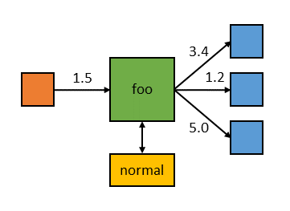

# Module 29 - Miniplumber

!!! warning "Historical miniclass"
    This lesson was recovered from the former Sandia minimega site. It is preserved for reference and may describe obsolete software, operating systems, commands, or external resources. Consult the [current documentation](../../index.md) before applying it.

[View the archived source URL](https://www.sandia.gov/minimega/module-29-miniplumber/).

## Introduction

Non-networked things exist in the real world. Buttons, temperature readings, locked doors, and etc. As a way to emulate these in a virtual world, miniplumber was created.

Plumbing is a facility in minimega to enable communication between VMs, processes on guests or hosts, and instances of minimega. In short, it allows "plumbing" communication pathways for any element of a minimega ecosystem. Plumbing in minimega is similar in concept to unix pipes and the myriad other IPC mechanisms available in many programming languages and operating systems.

minimega's plumber is designed to interact with unix command line tools and provides a number of additional capabilities over unix pipes. The plumber allows for uni- and multi-cast pipelines, supports fan-in (multiple pipe inputs), message delivery modes for each pipe (broadcast, round-robin, random), and *per-reader* pipelines called vias. The plumber is fully distributed, and works seamlessly across instances of minimega and VMs. This means a VM on node X can, without additional configuration, attach to a pipeline on node Y. VMs and minimega instances can even read or write to pipes from other VMs.

You can use miniplumber to send a message over miniccc in a manner very similar to netcat.

You can find a presentation on miniplumber here: [github.com/sandia-minimega/minimega/blob/master/doc/content/presentations/miniplumber.slide](https://github.com/sandia-minimega/minimega/blob/master/doc/content/presentations/miniplumber.slide)

## Environment Build

Follow the miniccc module and build an Ubuntu image that starts miniccc over serial.

### Cleanup

```
$ nuke
# /home/ubuntu/launchme.sh new
```

### Boot

```
vm config disk /home/ubuntu/u1604.qcow2
vm config memory 1024
vm launch kvm u1,u2,u3
vm start all
```

### CC

Make sure miniccc is phoning home on both `u1` and `u2`

```
cc clients
```

## Pipes

The minimega plumber provides two plumbing primitives - *pipes* (which we will discuss now) and *pipelines* (which we'll discuss in the section on Plumbing). Pipes are I/O points, and support a number of delivery and read/write options. Pipelines are compositions of pipes and external programs.

Pipes are simply named I/O points, similar to a named pipe on a Unix system. minimega pipes exchange newline-delimited messages as opposed to a byte stream like Unix pipes. By using messages, minimega pipes allow for any number of readers and writers to a single named pipe. Messages are written and are delivered to any attached readers according to that pipe's current mode. Message writes are non-blocking, and if no readers are present on the pipe, the message is discarded. No buffering of messages takes place; that is, unlike miniccc, messages sent are not cached and listeners that show up later will only receive messages from that moment on.

Named pipes are also unique to the namespace they were created in, so it's safe to reuse pipe names between experiments.

Named pipes are created on the first read, write, or mode selection on that pipe. To list current pipes, use the `pipe` API:

```
minimega$ pipe
name | mode        | readers | writers | via | last message
bar  | all         | 1       | 1       |     |
foo  | round-robin | 2       | 2       |     | a message!
```

Using the `pipe` API, you can set the delivery mode (explained in the next section), write to a pipe, set vias (explained later), and delete pipes. When deleting a pipe, all attached readers will be closed (and receive an EOF).

### Messaging

Pipes can be written to or read from on the minimega CLI, the host command line, attached to miniccc processes via the `cc` API, and from the VM command line via a miniccc switch. For example, we can read from a minimega pipe `foo` on the command line:

```
$ minimega -pipe foo
```

Invoking a pipe this way will block until standard in is closed. Let's write to the pipe now using the command line as well as the minimega CLI in a separate shell session:

```
$ echo hello | minimega -pipe foo
```

And from the minimega CLI:

```
minimega$ pipe foo world
```

Meanwhile, back at our reader:

```
$ minimega -pipe foo
hello
world
```

This exact same method can be used across distributed instances of minimega - simply attach to a named pipe as you would locally. You can even use pipes from connected miniccc clients running on VMs: From `u1`, start a listener on the `foo` pipe, using the existing miniccc connection.

```
/miniccc -pipe foo
```

From minimega send a message to the pipe

```
$ pipe foo hello
```

From `u2` send a message to `u1`

```
echo hello | /miniccc -pipe foo
```

### File Transfer

From `u1`

```
<control + c>
/miniccc -pipe foo > test.img
```

From `u2`

```
dd if=/dev/zero of=test.img bs=1024 count=63
cat test.img | /miniccc -pipe foo
```

Each message can be up to 64kB in size.

### Vias

You can modify data as it runs through a pipe with vias. For example, we can perform some simple text manipulations over pipe transmissions.

From minimega

```
$ pipe foo via sed -u 's/test/woot/'
```

From `u1`

```
<control + c>
/miniccc -pipe foo
```

From minimega:

```
$ pipe foo test
```

The above example demonstrates one application of vias; however, vias can offer more flexible control over outputs to readers. Vias are single-stage, external programs that are invoked for **every** read that takes place on a named pipe. They are used in places where a value that is written to a pipe needs to be transformed in some way for every reader that message will be forwarded to. For example, say you want readers on pipe `foo` to have a unique, normally distributed floating point value based on a mean written to the pipe:



One approach would be to have the writer count the number of readers and generate N unique values based on the mean to a pipe with round-robin delivery. This is problematic as it requires the agent to check reader and pipe state at every potential write. Instead, we can have the pipe use a via to generate unique values for every reader automatically when a write occurs:

```
minimega$ pipe foo via "normal -stddev 5.0"
```

In the above example, "normal" is a program that takes, on standard input, a floating point value as a mean, and generates a single value on a normal distribution with the given mean and standard deviation. When a value is written to `foo`, minimega will invoke the "normal" program for every reader on the pipe, sending unique values to each:

```
# write a value to foo
echo "1.5" | minimega -pipe foo

# on node A
$ minimega -pipe foo
2.35

# on node B
$ minimega -pipe foo
3.44
```

### Clearing Pipes

You can close individual pipes with clear as long as the listeners are closed (`control + c`)

```
clear pipe foo
```

You can clear vias with

```
clear pipe foo via
```

## Plumbing

minimega provides the `plumb` API for creating pipelines of external processes and named pipes. Pipelines are constructed similar to unix pipelines, and follow the same basic semantics such as cascading standard I/O and signaling pipeline stages with EOF. However, minimega pipes are message-based and consume and emit newline delimited messages. Additionally, pipes support multiple readers and writers and delivery modes, so it's possible to construct arbitrary topologies of pipelines using multiple linear pipelines with the `plumb` API.

For example, let's construct a simple, linear pipeline with the Unix program `sed`:

```
minimega$ plumb foo "sed -u s/foo/moo/" bar
minimega$ plumb
pipeline
foo sed -u s/foo/moo/ bar

minimega$ pipe foo "the cow says foo"

minimega$ pipe
name | mode | readers | writers | via | last message
bar  | all  | 0       | 1       |     | the cow says moo
foo  | all  | 1       | 0       |     | the cow says foo
```

In this example, we created a pipeline starting with a named pipe `foo`, then to an external process "sed -u s/foo/moo", and finally back to a named pipe `bar`. The plumber creates the pipeline, and starts any external processes. We can then write to the named pipe `foo` and see the result with the `pipe` API. In this example, all readers on `foo` would see the original message, and all readers on `bar` will see the message as modified by "sed".

Also in this example, the pipeline stays running until one of the pipeline stages is closed. We can shutdown the entire pipeline using the minimega CLI either by clearing the plumber, or by simply closing the first pipe in the pipeline, `foo`:

```
minimega$ plumb foo "sed s/foo/moo/" bar

minimega$ plumb
pipeline
foo sed s/foo/moo/ bar

minimega$ clear pipe foo
minimega$ plumb
minimega$
```

Named pipes in pipelines are distributed as usual, but external programs are invoked on the machine where the command is issued. This means that if you start a pipeline that uses `sed` and writes to pipeline `foo` on node X, the `sed` process will be launched only on node X, but readers anywhere in the experiment can read the value written to `foo`.

Another example to demonstrate plumbing across VMs: From `u1`

```
<control + c>
/miniccc -pipe foo
```

From `u2`

```
/miniccc -pipe bar
```

From minimega

```
$ plumb foo bar
$ pipe foo "hello u1 and u2"
```

Messages sent to `foo` will be sent to `bar`, but messages sent to `bar` will not be sent to `foo`

### Plumbing tree

From `u3`

```
/miniccc -pipe bar2
```

From minimega

```
$ plumb foo bar2
$ pipe foo "hello everyone"
```

### Plumbing modifiers (non working)

From `u1`

```
<control + c>
/miniccc -pipe a
```

From `u2`

```
<control + c>
/miniccc -pipe b
```

From minimega

```
$ plumb a "sed -u s/a test/fun/" b
$ pipe a "This is a test"
```

This will modify what is printed on `u1` and `u2` to

```
This is fun
```

### Clearing plumbing

You can clear plumbing with `clear`

```
clear plumb foo bar
```

### Stacking modifiers (non working)

From minimega

```
$ plumb a "sed -u s/a test/fun/" "sed -u s/fun/lots of fun/" b
$ pipe a "This is a test"
```

### Plumbing loops

There are no checks to prevent plumbing loops

The following lines will create a loop, until a clear is issued.

```
$ plumb foo bar
$ plumb bar foo
$ pipe foo loop
$ clear plumb foo bar
```

### Throttling

Keeping it simple, there is no throttling logic.

## miniccc

It's also possible to directly attach named pipes to standard input, output, or error streams on processes launched by the `cc` API, by specifying key/value pairs on the `exec` and `background` commands:

```
cc exec stdin=foo myprogram
cc background stdin=foo stdout=bar myprogram
```

## Other pipe options

### Polling

By default, messages written to a pipe will be delivered to all readers. There are cases however, where you may want messages to be delivered to only one reader, similar to a load balancer. minimega pipes support three message delivery modes: all (the default one-to-many mode), round-robin, and random. In round-robin and random modes, messages written to a pipe will be delivered to exactly one reader (including distributed readers).

To change the mode on a named pipe, use the `pipe` API:

```
minimega$ pipe foo mode all
minimega$ pipe foo mode round-robin
minimega$ pipe foo mode random
```

You can modify the polling method to be `all`, `round-robin`, or `random`.

### Logging

Logging can be enabled with `true`

```
pipe foo log true
```

or disabled with `false`

```
pipe foo log false
```
