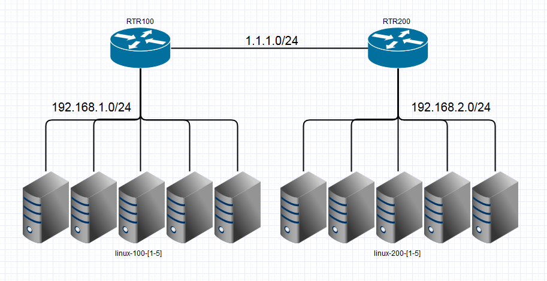
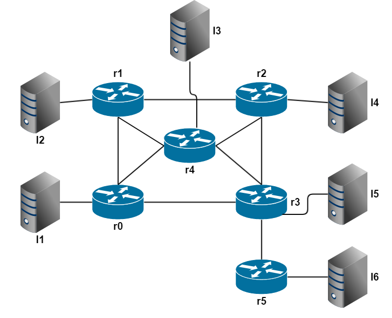
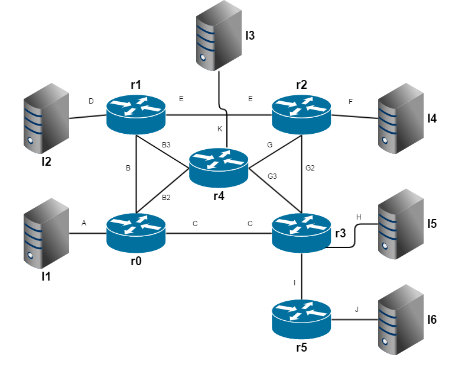
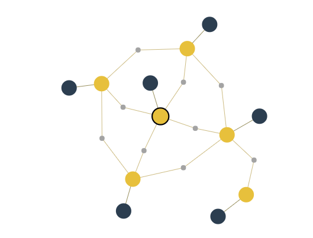

# Module 30 - Networking - Minirouter

!!! warning "Historical miniclass"
    This lesson was recovered from the former Sandia minimega site. It is preserved for reference and may describe obsolete software, operating systems, commands, or external resources. Consult the [current documentation](../../index.md) before applying it.

[View the archived source URL](https://www.sandia.gov/minimega/module-30-networking-minirouter/).

## Introduction

This article may need to be fixed ever since minirouter got renamed to uminirouter

The network speed of a VyOS router is bound by the speed of which the driver can be emulated in the virtual machine, typically 1gbps. minirouter was designed to handle this case and has been tested against faster 40/100 gbit networks.

## Version requirements

- `bird` 1.5.0
- `dnsmasq` 2.73
- `ovs-vsctl` 1.11

## Bare Metal

minirouter could run on bare metal, but there is no way to currently configure it using miniccc since minimega issues configuration commands referencing the VM name.

## Container

There is a prebuilt minirouter busybox container you can use to get running with minirouter.

The container can be rebuilt by running: [github.com/sandia-minimega/minimega/blob/master/misc/uminirouter/build.bash](https://github.com/sandia-minimega/minimega/blob/master/misc/uminirouter/build.bash)

### Cleanup

```
$ nuke
# /home/ubuntu/launchme.sh new
```

### Boot

```
tar xf minimega-2.3-minirouter.tar.bz2
vm config filesystem /home/ubuntu/minirouterfs/
vm config fifo 1
vm config net 0
vm config init /init
vm config preinit /home/ubuntu/minirouterfs/preinit
vm launch container r1
vm start r1
```

## KVM

### Prebuild

```
apt-get install squashfs-tools syslinux debootstrap genisoimage extlinux
cd /home/ubuntu/minimega
cp bin/miniccc misc/vmbetter_configs/minirouter_overlay/
cp bin/minirouter misc/vmbetter_configs/minirouter_overlay/
```

### Qcow

minirouter when built as a qcow with `vmbetter` ignores the custom init script.

Using `vmbetter` build a qcow2; this will take a while.

```
./bin/vmbetter -branch unstable -qcow -level debug -mbr /usr/lib/syslinux/mbr/mbr.bin misc/vmbetter_configs/minirouter.conf
```

Mount the built qcow

```
qemu-nbd --connect /dev/nbd0 minirouter.qcow2\

mkdir -p /mnt/kvm\

mount /dev/nbd0p1 /mnt/kvm
```

Create a new init script

```
cat > /mnt/kvm/init << EOF
#!/bin/sh

export PATH=/usr/local/sbin:/usr/local/bin:/usr/sbin:/usr/bin:/sbin:/bin:/

mount -t proc proc /proc
mount -t sysfs sysfs /sys
mount -t devtmpfs udev /dev
mkdir /dev/pts
mount -n -t devpts -o newinstance,ptmxmode=666,gid=5,mode=620 none /dev/pts
rm /dev/ptmx
ln -s /dev/pts/ptmx /dev/ptmx
mount -t cgroup cgroup /sys/fs/cgroup
chmod a+rx /

modprobe loop
modprobe tun
modprobe virtio_console
modprobe virtio_pci
modprobe e1000
modprobe e1000e
modprobe virtio_net
modprobe vmxnet3

echo 32768 > /proc/sys/net/ipv4/neigh/default/gc_thresh1
echo 32768 > /proc/sys/net/ipv4/neigh/default/gc_thresh2
echo 65536 > /proc/sys/net/ipv4/neigh/default/gc_thresh3
echo 32768 > /proc/sys/net/ipv6/neigh/default/gc_thresh1
echo 32768 > /proc/sys/net/ipv6/neigh/default/gc_thresh2
echo 65536 > /proc/sys/net/ipv6/neigh/default/gc_thresh3

sysctl -w net.ipv6.conf.all.forwarding=1
sysctl -w net.ipv4.ip_forward=1
service dnsmasq stop
sleep 10
/miniccc -v=false -serial /dev/virtio-ports/cc -logfile /miniccc.log &
/minirouter -v=false -logfile /minirouter.log &
sysctl -w net.ipv6.conf.all.forwarding=1
sysctl -w net.ipv4.ip_forward=1
EOF
```

Launch init after boot

```
sed -i '$i/init &' /mnt/kvm/etc/rc.local
```

Unmount the qcow2

```
umount /mnt/kvm
qemu-nbd --disconnect /dev/nbd0
```

Launch the qcow2

```
clear vm config
vm config memory 2048
vm config net 0
vm config disk /home/ubuntu/minimega/minirouter.qcow2
vm launch kvm r2
vm start r2
```

### Initrd and Kernel

`vmbetter` can build minirouter to an initrd and kernel pairing while keeping the custom init.

The build process does take a while.

```
apt-get install squashfs-tools syslinux debootstrap genisoimage extlinux
cd /home/ubuntu/minimega
cp bin/miniccc misc/vmbetter_configs/minirouter_overlay/
cp bin/minirouter misc/vmbetter_configs/minirouter_overlay/
```

Unlike building a qcow, the init does not need to be customized beyond enabling forwarding.

Add these two lines if you haven't already

```
echo "sysctl -w net.ipv6.conf.all.forwarding=1" >> misc/vmbetter_configs/minirouter_overlay/init
echo "sysctl -w net.ipv4.ip_forward=1" >> misc/vmbetter_configs/minirouter_overlay/init
```

And build

```
./bin/vmbetter -branch unstable -level debug misc/vmbetter_configs/minirouter.conf
```

In your local directory you will find a `minirouter.kernel` and a `minirouter.initrd`, which you can then use to boot the router as a KVM image.

Be sure to give the image 2048MB of RAM or more

```
clear vm config
vm config memory 2048
vm config net 0
vm config kernel minirouter.kernel
vm config initrd minirouter.initrd
vm launch kvm r3
vm start r3
```

## Network Example



### Cleanup

```
$ nuke
# /home/ubuntu/launchme.sh new
```

### Boot with Static Routes

```
# cd /home/ubuntu/
# tar xf minimega-2.3-minirouter.tar.bz2
```

```
vm config filesystem /home/ubuntu/minirouterfs/
vm config fifo 1
vm config net 1 2
vm config init /init
vm config preinit /home/ubuntu/minirouterfs/preinit
vm launch container r0
vm start r0
vm config net 1 3
vm launch container r1
vm start r1
```

```
clear vm config
vm config disk /home/ubuntu/tinycore.qcow
vm config net 2
vm config memory 128
vm launch kvm linux-100-[1-5]
vm config net 3
vm launch kvm linux-200-[1-5]
vm start all
```

```
router r0 interface 0 1.0.0.1/24
router r0 interface 1 192.168.1.1/24
router r0 dhcp 192.168.1.1 range 192.168.1.2 192.168.1.254
router r1 interface 0 1.0.0.2/24
router r1 interface 1 192.168.2.1/24
router r1 dhcp 192.168.2.1 range 192.168.2.2 192.168.2.254
router r0 route static 192.168.2.0/24 1.0.0.2
router r1 route static 192.168.1.0/24 1.0.0.1
router r0 commit
router r1 commit
```

### OSPF Networking - Basic

#### Cleanup

```
vm kill all
vm flush
```

#### Launch

```
vm config filesystem /home/ubuntu/minirouterfs/
vm config fifo 1
vm config net 1 2
vm config init /init
vm config preinit /home/ubuntu/minirouterfs/preinit
vm launch container r0
vm start r0
vm config net 1 3
vm launch container r1
vm start r1
router r0 route ospf 0 0
router r1 route ospf 0 0
router r0 route ospf 0 1
router r1 route ospf 0 1
router r0 commit
router r1 commit
```

### OSPF Networking - Cost

OSPF exposes many options that you can tweak with minirouter. This section covers the `cost` metric.

#### Cleanup

```
vm kill all
vm flush
```

#### Topology

We will use the following simple topology:

```
vm config filesystem /root/uminirouterfs
vm config preinit /root/uminirouterfs/preinit
vm config networks a b
vm launch container routerA
vm config networks a c
vm launch container routerB
vm config networks b c
vm launch container routerC
router routerA interface 0 10.0.0.1/24
router routerA interface 1 10.0.1.1/24
router routerA route ospf 0 0
router routerA route ospf 0 1
router routerA commit
router routerB interface 0 10.0.0.2/24
router routerB interface 1 10.0.2.1/24
router routerB route ospf 0 0
router routerB route ospf 0 1
router routerB commit
router routerC interface 0 10.0.1.2/24
router routerC interface 1 10.0.2.2/24
router routerC route ospf 0 0
router routerC route ospf 0 1
router routerC commit
vm start all
```

#### OSPF Costs

OSPF uses cost to determine which paths to route through. These costs are typically set using the inverse of the speed but can be overridden. We will change the cost to force different routes through the network.

Once the environment has launched, you can use `traceroute` through miniweb to see the path through the network:

```
// Connect to routerA via miniweb
/ # traceroute 10.0.2.1
traceroute to 10.0.2.1 (10.0.2.1), 30 hops max, 46 byte packets
 1  10.0.1.2 (10.0.1.2)  0.009 ms  0.005 ms  0.005 ms
 2  10.0.2.1 (10.0.2.1)  0.005 ms  0.005 ms  0.005 ms
```

In this environment, the path is A-C-B.

We can tweak the cost on the A-C edge for routerA using the following commands:

```
router routerA route ospf 0 1 cost 20
router routerA commit
```

The default cost is 10 so a cost of 20 changes the chosen route. After a few seconds, we can verify the new route:

```
// Connect to routerA via miniweb
/ # traceroute 10.0.2.1
traceroute to 10.0.2.1 (10.0.2.1), 30 hops max, 46 byte packets
 1  10.0.2.1 (10.0.2.1)  0.009 ms  0.005 ms  0.006 ms
```

### Other OSPF Options

There are many other interface options for OSPF which are primarily used to control properties of the OSPF communication between the routers. See the interface section [here](https://bird.network.cz/?get_doc&v=20&f=bird-6.html#ss6.8) for more details.

## miniccc

minimega is able to configure minirouter without networking by utilizing `miniccc`.

When a virtual machine or container is started with minimega a serial port is added.

This serial port is used as a command and control network when the `miniccc` agent is running on the virtual machine.

The minimega `router` command is able to issue the configuration changes over this serial back channel.

## Bigger Network Example

Now that we have the basics out of the way let's make a bigger network topology



Let's assign some aliases to each link



Now let's assign some IP ranges for each link

```
A:  1.0.0.0/24
B:  2.1.0.0/24
B2: 2.2.0.0/24
B3: 2.3.0.0/24
C:  3.0.0.0/24
D:  4.0.0.0/24
E:  5.0.0.0/24
F:  6.0.0.0/24
G:  7.1.0.0/24
G2: 7.2.0.0/24
G3: 7.3.0.0/24
H:  8.0.0.0/24
I:  9.0.0.0/24
J:  10.0.0.0/24
K:  11.0.0.0/24
```

### Cleanup

```
$ nuke
# /home/ubuntu/launchme.sh new
```

### Boot routers and virtual machines

```
vlans range 1500 1600
vm config memory 2048
vm config filesystem /home/ubuntu/minirouterfs/
vm config fifo 1
vm config init /init
vm config preinit /home/ubuntu/minirouterfs/preinit
vm config net A B B2 C
vm launch container r0
vm config net D B B3 E
vm launch container r1
vm config net E G G2 F
vm launch container r2
vm config net C G3 G2 H I
vm launch container r3
vm config net B3 K G G3 B2
vm launch container r4
vm config net I J
vm launch container r5
vm start all

clear vm config
vm config net A
vm config memory 128
vm config disk /home/ubuntu/tinycore.qcow
vm launch kvm l1
vm config net D
vm launch kvm l2
vm config net K
vm launch kvm l3
vm config net F
vm launch kvm l4
vm config net H
vm launch kvm l5
vm config net J
vm launch kvm l6
vm start all
```

### Configure networking

```
router r0 interface 0 1.0.0.1/24
router r0 interface 1 2.1.0.1/24
router r0 interface 2 2.2.0.1/24
router r0 interface 3 3.0.0.1/24
router r0 dhcp 1.0.0.1 range 1.0.0.1 1.0.0.254
router r0 route ospf 0 0
router r0 route ospf 0 1
router r0 route ospf 0 2
router r0 route ospf 0 3
router r0 commit

router r1 interface 0 4.0.0.1/24
router r1 interface 1 2.1.0.2/24
router r1 interface 2 2.3.0.1/24
router r1 interface 3 5.0.0.1/24
router r1 dhcp 4.0.0.1 range 4.0.0.1 4.0.0.254
router r1 route ospf 0 0
router r1 route ospf 0 1
router r1 route ospf 0 2
router r1 route ospf 0 3
router r1 commit

router r2 interface 0 5.0.0.2/24
router r2 interface 1 7.1.0.1/24
router r2 interface 2 7.2.0.1/24
router r2 interface 3 6.0.0.1/24
router r2 dhcp 6.0.0.1 range 6.0.0.1 6.0.0.254
router r2 route ospf 0 0
router r2 route ospf 0 1
router r2 route ospf 0 2
router r2 route ospf 0 3
router r2 commit

router r3 interface 0 3.0.0.2/24
router r3 interface 1 7.3.0.1/24
router r3 interface 2 7.2.0.2/24
router r3 interface 3 8.0.0.1/24
router r3 interface 4 9.0.0.1/24
router r3 dhcp 8.0.0.1 range 8.0.0.1 8.0.0.254
router r3 route ospf 0 0
router r3 route ospf 0 1
router r3 route ospf 0 2
router r3 route ospf 0 3
router r3 route ospf 0 4
router r3 commit

router r4 interface 0 2.3.0.2/24
router r4 interface 1 11.0.0.1/24
router r4 interface 2 7.1.0.2/24
router r4 interface 3 7.3.0.2/24
router r4 interface 4 2.2.0.2/24
router r4 dhcp 11.0.0.1 range 11.0.0.1 11.0.0.254
router r4 route ospf 0 0
router r4 route ospf 0 1
router r4 route ospf 0 2
router r4 route ospf 0 3
router r4 route ospf 0 4
router r4 commit

router r5 interface 0 9.0.0.2/24
router r5 interface 1 10.0.0.1/24
router r5 dhcp 10.0.0.1 range 10.0.0.1 10.0.0.254
router r5 route ospf 0 0
router r5 route ospf 0 1
router r5 commit
```

Everything is on Area 0 and through the magic of OSPF routing should be established between all the machines.

If a router or route goes down the routes should automatically update.

```
Name    Memory    VLAN                                                        IPv4
l5        128    [H (1511)]                                                [8.0.0.179]
l6        128    [J (1514)]                                                [10.0.0.95]
l1        128    [A (1500)]                                                [1.0.0.141]
l2        128    [D (1504)]                                                [4.0.0.220]
l3        128    [K (1513)]                                                [11.0.0.185]
l4        128    [F (1509)]                                                [6.0.0.239]
r0        2048    [A (1500), B (1501), B2 (1502), C (1503)]                [1.0.0.1, 2.1.0.1, 2.2.0.1, 3.0.0.1]
r1        2048    [D (1504), B (1501), B3 (1505), E (1506)]                [4.0.0.1, 2.1.0.2, 2.3.0.1, 5.0.0.1]
r2        2048    [E (1506), G (1507), G2 (1508), F (1509)]                [5.0.0.2, 7.1.0.1, 7.2.0.1, 6.0.0.1]
r3        2048    [C (1503), G3 (1510), G2 (1508), H (1511), I (1512)]     [3.0.0.2, 7.3.0.1, 7.2.0.2, 8.0.0.1, 9.0.0.1]
r4        2048    [B3 (1505), K (1513), G (1507), G3 (1510), B2 (1502)]    [2.3.0.2, 11.0.0.1, 7.1.0.2, 7.3.0.2, 2.2.0.2]
r5        2048    [I (1512), J (1514)]                                     [9.0.0.2, 10.0.0.1]
```



### Authors

The minimega authors

Created: 30 May 2017

Last updated: 26 May 2022
