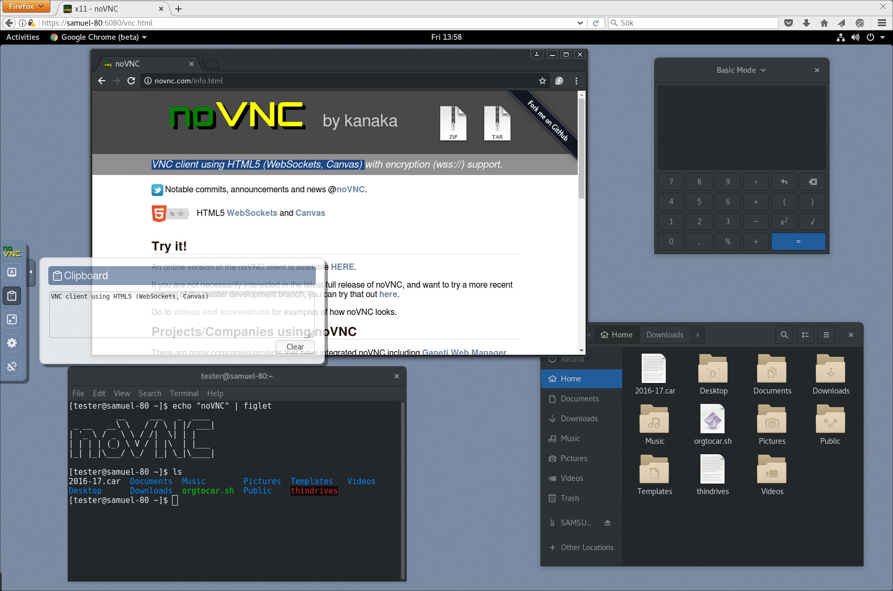

# Module 46 - Copy & Paste

!!! warning "Historical miniclass"
    This lesson was recovered from the former Sandia minimega site. It is preserved for reference and may describe obsolete software, operating systems, commands, or external resources. Consult the [current documentation](../../index.md) before applying it.

[View the archived source URL](https://www.sandia.gov/minimega/module-45-copy-paste/).

Minimega supports two modes for copy and paste. By default, all VMs support primitive pasting into the VM. With a config enabled and the necessary packages installed on the host and VM, full bidirectional copy and paste can be used.

In both cases, minimega utilizes VNC for copy and paste. With noVNC, the copy/paste buffer can be found in the menu. Text is sent on focus loss of the text area after a change.



Example showing noVNC clipboard. From: https://novnc.com/screenshots.html

## Primitive Paste

By default a VM will have primitive pasting enabled. In this mode, text stored in the VNC clipboard will be immediately typed out on the VM using miniccc. There is no support for retrieving text from the VM.

This mode is useful when the VM does not have a GUI, or the necessary guest tools outlined in the following section are not installed.

## Bidirectional Copy & Paste

Bidirectional copy and paste allows full clipboard syncing between the VNC host and guest. Unlike primitive paste, sending text to the VM puts the text into the VM's clipboard, which can then be pasted like normal. Additionally, copying in the VM will update the noVNC clipboard text.

Bidirectional copy and paste can be enabled on a per-vm basis using:

```
vm config bidirectional-copy-paste true
```

### Required Setup

There are two requirements for using bidirectional copy and paste.

**1. Using QEMU 6.1+ with `qemu-vdagent`**

Copy and paste support in QEMU was added in version 6.1+. In addition, QEMU must have the `qemu-vdagent` chardev. To verify, run `kvm -chardev help` and you should see the vdagent listed.

If these requirements are not met and `bidirectional-copy-paste` is enabled, minimega will provide an error at vm launch.

Ubuntu 22 should already have the proper version of QEMU installed. If the vdagent is not installed or you need a newer version of QEMU, you may have to compile manually. In testing, we have successfully compile QEMU 6.2 on Ubuntu 18.04.

When compiling QEMU, you'll need to install `spice-protocol` and configure QEMU with `./configure --enable-spice`. See here for more instructions: https://askubuntu.com/a/231396

**2. Spice Guest Agent Installed on VM**

Next, the spice vdagent will need to be installed within the VM for handling clipboard interaction.

On linux, install `spice-vdagent`. This is already installed on some distros.

On windows, download and install the latest vdagent here: <https://spice-space.org/download/windows/vdagent/>. Note that the agent requires the same virtio-serial setup as miniccc. If you have not already set up miniccc, see [Module 28: miniccc and the cc API](module-28.md)

### Troubleshooting

- QEMU 6.1/6.2 has a [bug](https://github.com/qemu/qemu/commit/1dbbe6f172810026c51dc84ed927a3cc23017949) which may cause a deadlock if you use copy and paste and then reload the VNC connection (e.g., close/reopen browser tab). This was fixed in QEMU 7+
- To utilize primitive paste with newer versions of QEMU, the VNC client must have support for [Extended Clipboard Pseudo-Encoding](https://github.com/rfbproto/rfbproto/blob/master/rfbproto.rst#extended-clipboard-pseudo-encoding) disabled. This is already done in the built-in noVNC client used by miniweb
