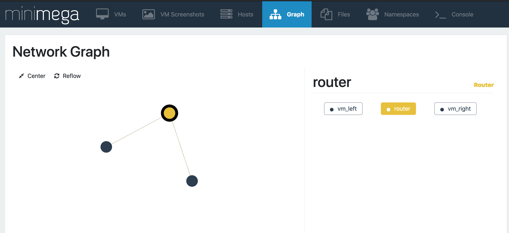
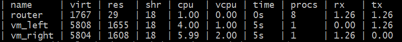

# minimega: The Essentials

> How to create and deploy a cyber experiment in minimega
>

<a id="TOC_1."></a>

## Welcome to minimega!

We are confident you will find minimega and its suite of tools to be incredibly powerful and highly flexible.

As with all tools that can offer so much, it can be overwhelming to learn and master, so why should you take the time to do so?

One of the primary reasons is the ability to quickly and repeatedly deploy experiment environments that you define, whether notional or representing a real network.

If you have questions about how specific networks behave under specific conditions, but cannot use real systems to experiment, minimega is for you.

<a id="TOC_2."></a>

## Why use minimega?

minimega has tools that will help you

- define virtual endpoints, and create an experiment network of endpoints at scale
- create multiple copies of those experiment networks, segregated by namespace, to facilitate iterative experimentation
- instruments and capture data from your experiment, so you can analyze what you see
- generate background network traffic, modify the quality of service of your network
- and much much more...

<a id="TOC_3."></a>

## What this guide is

In this module, you will find a top-to-bottom overview of:

- The basics for using minimega
- How to create and modify virtual machines to deploy
- How to define and compose a virtual experiment
- How to instrument the virtual experiment
- How to modify your experiment, traffic files, data, and resources in real time
- How to learn more about every aspect of this process

We will walk through an experiment step by step to give you the basics you will need to get an experiment up and running in minimega.

<a id="TOC_4."></a>

## What this guide is NOT

While this module (module 01) can get you up, running, and using minimega to launch simple experiments quickly, it is NOT a deep-dive into everything minimega can do.

If you want a better understanding of how to use minimega and all of the tools it has to offer, we recommend starting with module 02 and working your way through the remaining modules.

<a id="TOC_5."></a>

## Let's start with the final product - the router sandwich!

{ width="700" }

*...oops, wrong sandwich...*

<a id="TOC_6."></a>

## The Router Sandwich!

{ width="900" }

*...with VM bread!*

<a id="TOC_7."></a>

## Router Sandwich (explained)

This is a very simple experiment comprised of 2 VMs and a router between them.

Each VM is in a different network, while the router is part of both networks.

In Software Defined Networking (SDN), this network is a virtual one (VLAN).

We will go through, step by step, all the minimega commands and supporting files required, to launch this environment.

We will then run a simple experiment on this network, and capture data from that experiment.

<a id="TOC_8."></a>

## Breaking it down pt. 1 - Describing a VM

The first part we will talk about is defining the 2 Virtual Machines that will be launched.

```minimega title="vm_sandwich_p1.mm"
--8<-- "training/module01_content/vm_sandwich_p1.mm"
```

[Download this example](module01_content/vm_sandwich_p1.mm){ download="vm_sandwich_p1.mm" }

*The first commands we will run in minimega*

<a id="TOC_9."></a>

## Step 1 - Namespaces

minimega supports namespaces, so it is a good practice to declare a namespace before anyhing else.

That's why the first command is a namespace command.

<a id="TOC_10."></a>

## Step 2 - Describing the VM

The most important command in minimega for defining a VM is `vm config`. Go ahead and run the command by itself to see what happens:

```minimega title="vmconfig.mm"
--8<-- "training/module01_content/vmconfig.mm"
```

[Download this example](module01_content/vmconfig.mm){ download="vmconfig.mm" }

You will notice many parameters, but for now we will only consider the following:

memory: while not necessary, we will increase the memory footprint to 5096 from the default 2048.

network: We'll add a nic to this VM and attach it to a VLAN using the alias `net_left`. Under the hood, minimega will take the next available vlan in range (e.g. 100) and use this alias to reference that VLAN.

VM image: more on that next.

<a id="TOC_11."></a>

## Step 2 - Describing the VM - VM image

A Virtual Machine requires an image from which to boot. For minimega this can be 1 of 2 flavors: KVM or Container. (For details on the difference, see [module 2.5](module02_5.md))

For our purposes, we will use a KVM.

minimega supports a number of different KVM image types, but for this experiment we will use a kernel and initrd pair.

To learn how to build your own image to use for launching VMs, please see [module 2.5](module02_5.md)

If this is a guided class, we have provided you the kernel and initrd pair to launch this experiment.

<a id="TOC_12."></a>

## Breaking it down pt. 2 - Networking

```minimega title="vm_sandwich_p2.mm"
--8<-- "training/module01_content/vm_sandwich_p2.mm"
```

[Download this example](module01_content/vm_sandwich_p2.mm){ download="vm_sandwich_p2.mm" }

<a id="TOC_13."></a>

## Step 3 - Defining the Router

In order to allow network traffic to flow between VMs, we will need to ensure that the VMs are configured for the same network.

We can do this many different ways, but here we will demonstrate using minirouter to accomplish this task.

First, we change the kernel and initrd pair to use an image that is pre-loaded with the minirouter binary.

Note: it is possible to load all the software required to a single VM image, and use that image for every virtual machine, but that can be impractical. Sometimes, it's best to use the right image for the right VM.

Next, we add the router VM to both networks: the network vm_left is in, and the network vm_right is in.

<a id="TOC_14."></a>

## Step 3 - Configure the Router

After we launch the router, you will notice we issue several router commands to set up the network. Let's go through them one at a time.

```text
router router interface 0 10.0.0.1/24
```

This command assigns a new interface to the router VM and sets the IP address and mask.

```text
router router dhcp 10.0.0.0 range 10.0.0.2 10.0.0.2
```

This command instructs the router to act as DHCP, listening on 10.0.0.0 for requests.

The range of IP address to be given out has been restricted to a single address in this case, starting at 10.0.0.2, and ending at the same.

Then, a second interface is added to the router VM, and again, the router will act as DHCP, listening on and distributing a separate range of IP addresses.

<a id="TOC_15."></a>

## Step 3 - Configure the Router

Then, we set the router as the default gateway for each network, using the `router` option of the `router dhcp` command:

```text
router router dhcp 10.0.0.0 router 10.0.0.1
router router dhcp 20.0.0.0 router 20.0.0.1
```

We don't need a routing protocol like OSPF here. Because the router VM is a member of both networks, and DHCP has already told each VM to use the router as its default gateway, the router already knows how to get traffic everywhere it needs to go.

Finally, after any router commands are defined, the user must commit the commands using the commit command:

```text
router router commit
```

This will apply the changes defined in your commands.

<a id="TOC_16."></a>

## Breaking it down pt. 3 - Launching the Environment

```minimega title="vm_sandwich_p3.mm"
--8<-- "training/module01_content/vm_sandwich_p3.mm"
```

[Download this example](module01_content/vm_sandwich_p3.mm){ download="vm_sandwich_p3.mm" }

<a id="TOC_17."></a>

## Step 4 - Launching does not mean we are done!

The next command launches the router VM, however you should know that the VM is not yet useable!

Launching means it is in a ready state, and waiting to be started.

You will notice in the script we sleep for a number of seconds to allow the router configurations to process before proceding.

Then, we start all of the VMs. This puts everything in the `RUNNING` state, ready for our experiment.

We give the VMs time to launch, POST, and obtain network IPs via DHCP. Then the last line:

```text
.columns id,name,state,vlan,ip,qos vm info
```

asks minimega to display the specified information for all existing VMs. We are ready to run our experiment.

<a id="TOC_18."></a>

## Breaking it down pt. 4 - Launching the Experiment

```minimega title="vm_sandwich_p4.mm"
--8<-- "training/module01_content/vm_sandwich_p4.mm"
```

[Download this example](module01_content/vm_sandwich_p4.mm){ download="vm_sandwich_p4.mm" }

<a id="TOC_19."></a>

## Step 5 - Conducting an Experiment

minimega has a built-in `vm top` command that is similar to the `top` command found in typical Linux distributions.

Specifically, we can use it to get a broad snapshot of traffic flowing in an out of each VM.

However, there is no traffic flow over our network, so there are no values.

There is a tool in the minimega suite that we can use to send generic background traffic over the network.

This is called `protonuke` and we can send it out to our VMs using minimega's command and control API.

This API, miniccc, can allow us to accomplish a number of tasks including file i/o, command execution, and post-boot VM configuration.

For more details on Command and Control, see [module 07](module07.md)

<a id="TOC_20."></a>

## Step 6 - Command and Control

The following command copies the protonuke binary to all VMs:

```text
cc send file:protonuke
```

By default, minimega looks in /tmp/minimega/files for any file indicated in commands that do not have an explicit path.

The next commands run the protonuke binary in the background with specific options for specific traffic:

```text
cc background /tmp/miniccc/files/protonuke -serve -http
cc background /tmp/miniccc/files/protonuke -serve -https
```

<a id="TOC_21."></a>

## miniccc mastery

miniccc allows you to filter on specific VMs so you can isolate which VMs the command is for:

```text
cc filter name=vm_right
```

allows us to specify the VM we want to target. You can filter on any property of a VM, including tags.

Finally, we run protonuke in the background on vm_right to request http/https traffic, which we told vm_left to serve.

We ask it to request from 10.0.0.2 (vm_left) and we set the log to allow info-level detail and print to a file

```text
cc background /tmp/miniccc/files/protonuke -level info -logfile proto.log -http -https 10.0.0.2
```

<a id="TOC_22."></a>

## Breaking it down pt. 5 - Data

```minimega title="vm_sandwich_p5.mm"
--8<-- "training/module01_content/vm_sandwich_p5.mm"
```

[Download this example](module01_content/vm_sandwich_p5.mm){ download="vm_sandwich_p5.mm" }

<a id="TOC_23."></a>

## Step the last: Getting data

Checking `vm top` again, we see that traffic is flowing across the network

{ width="1000" }

as indicated by the rx and tx values in the table.

<a id="TOC_24."></a>

## Modifying the Experiment

What would happen if our network experienced a drop in Quality of Service?

With minimega, there is a built-in QOS API that allows you to ask these questions.

The next commands we run will introduce packet loss to the network:

```text
qos add vm_left 0 loss 0.5
```

We need to give the network some time to allows the QOS API to take effect.

Checking `vm top` one last time, we can see what the packet loss does to the throughput values we see

<a id="TOC_25."></a>

## Wrapping it all up

And that's it!

You now have a great deal of knowledge in running minimega.

Enough so that you can start to create your own experiments and start exploring the countless ways to configure your environment to suit an experiment of your choice.

Or build on this experiment and start accumulating data. The choice is yours.

<a id="TOC_26."></a>

## Next...

We recommend going through all of the training modules available to you.

There is an extraordinary amount of ways to build and deploy your environment with minimega.

There are dozens of tools available to you to learn and use.

For more information, or to contribute to the open-source minimega project, visit the [minimega repository](https://github.com/sandia-minimega/minimega).

next up: [module 02: Getting Running](module02.md)
