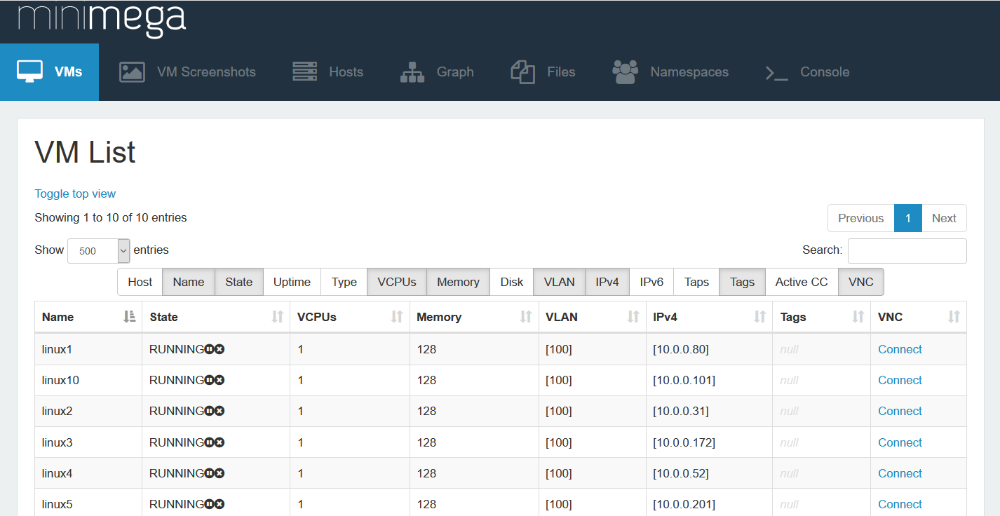
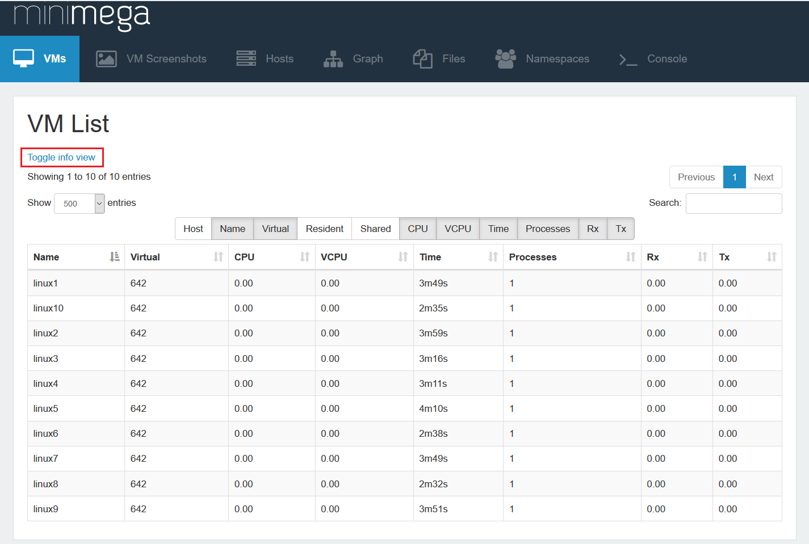
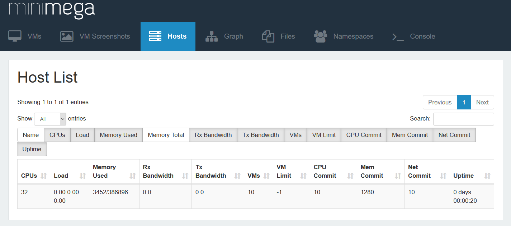
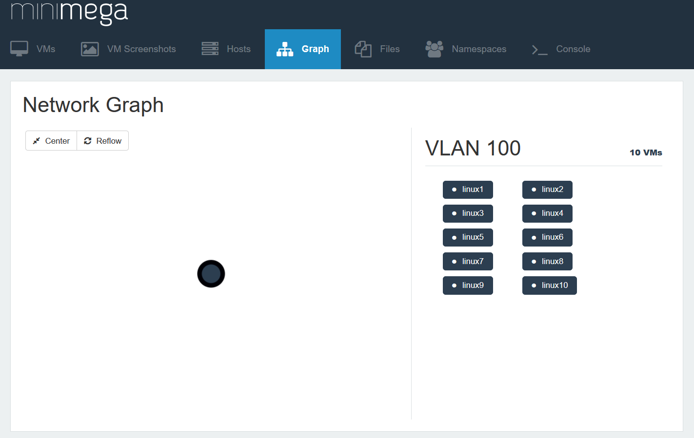
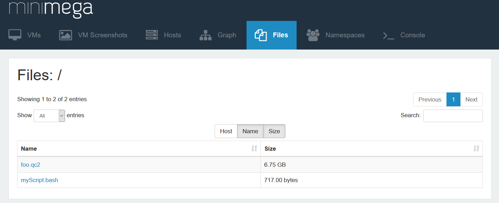
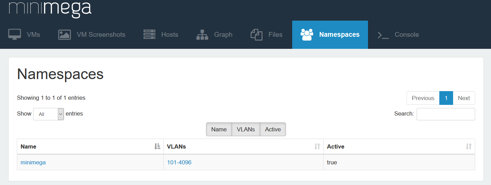
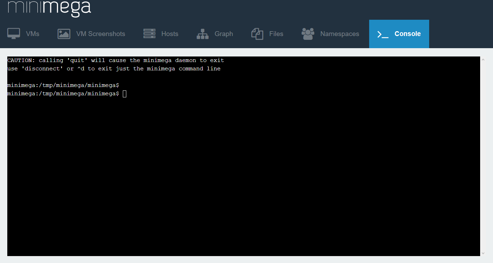
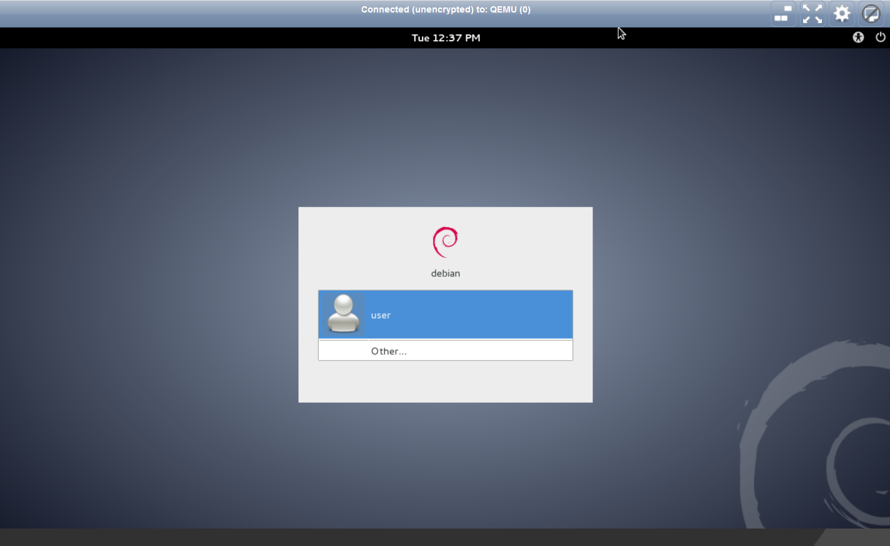

# Experiment Visualization

> How to use miniweb - minimega's web-based visualization tool

<a id="TOC_1."></a>

## miniweb - a standalone webserver for minimega

miniweb is a powerful, web-based portal into your emulated environment
miniweb talks to minimega using the domain socket in minimega's -base directory. For this reason, it must be run on a node that runs minimega, preferably the head node.

miniweb allows you to:

```text
* View VMs
* View Host information
* Connect to, and interact with, VMs
* Record/play back those interactions with VMs
* Display a graph view of your environment
* Interact with minimega via web console
```

We will cover each of these topics in this module, including some of the launch options you'll find. Please use the -h flag when running to see a complete list of launch options.

```text
$ bin/miniweb -h
```

This will print the available options for miniweb

<a id="TOC_2."></a>

## options

```minimega title="mw_help.mm"
--8<-- "training/module04_content/mw_help.mm"
```

[Download this example](module04_content/mw_help.mm){ download="mw_help.mm" }

<a id="TOC_3."></a>

## of note...

- -addr accepts a host:port tuple to listen on

- By default, miniweb looks for the web files in misc/web relative to the current directory

    -  if you are running miniweb from somewhere other than the minimega root directory, you will need to specify the path to the web files

```text
$ ./miniweb -root /path/to/web/
```

- If you get a 404 error or similar, ensure the files are located where miniweb expects them.

- Logging is controlled with -level, -logfile, and -verbose.

<a id="TOC_4."></a>

##

- If you like the minimega console to be available in the web application

    -  use the -console flag
    -  ensure minimega is located in a bin directory, specify with -base

Assuming minimega is located in /opt/bin/minimega, use:

```text
$ ./miniweb -root /opt/web -console -base /opt &
```

- miniweb supports per-path authentication so that users can be limited to specific namespaces or VMs.

<a id="TOC_5."></a>

## VMs

{ width="900" }

<a id="TOC_6."></a>

## VMs Info View

There are a variety of views into your experiment that miniweb provides.

The /vms page shows VMs in the active namespace and can be prefixed with a namespace.

The table can be customized to show all the VMs, or only a subset broken across pages.

A search feature is also provided, and VMs can be located by any table property, whether or not it is visible in the table.

There are numerous table properties that can be toggled to show information about the VMs.

In particular, the VNC column includes a link that will launch an interactive console into the VM. More on this later in the module.

In the VM info table (State), there are buttons to update the state of VMs. You may start, pause, or kill VMs through this interface. Once a VM is killed, it is no longer shown in the list but can be restarted via the CLI.

<a id="TOC_7."></a>

## VM Top view

The 'Toggle top view' link will show a set of information similar to the 'top' command in linux:

{ width="900" }

<a id="TOC_8."></a>

## VM Screenshots

{ width="900" }

<a id="TOC_9."></a>

## VM Screenshots

- This section is a live feed of the current state of VMs.

- Each KVM VM can return its current screenshot to miniweb via the `/vm/<name>/screenshot.png` path

- You can click connect to interact with a NoVNC session which lets you control the keyboard, mouse, and see the video in your browser.

- You can also search and control the number of screen shots to display at once.

<a id="TOC_10."></a>

## Host

Information about the host can be found in the Hosts tab. Example:

{ width="900" }

<a id="TOC_11."></a>

## Graph

{ width="900" }

<a id="TOC_12."></a>

## Graph

- The Network Graph builds a visualization of the network.
- The graph is "vlan-centric", meaning nodes represent vlans in the experiment.
- Edges show network connections between VLANs.
- You can click on individual nodes to see which VMs are connected to that VLAN, listed in the sidebar.
- Click on a VM in the sidebar to see more information about that VM, including a link to open an interactive vnc console
- Click and hold a node to drag to another location.
- The 'center' button centers the graph.
- You can zoom in and out with your mouse scroll wheel.
- 'Reflow' will attempt to redraw the graph in an even distribution use force direction.

<a id="TOC_13."></a>

## Files

This tab displays a list of the files in the minimega directory.
By default, this directory is located in /tmp/minimega/files
From this tab, you can download each file by clicking on the filename link.

{ width="900" }

<a id="TOC_14."></a>

## Namespaces

This tab shows information about the namespaces in your experiment:

{ width="900" }

<a id="TOC_15."></a>

## Namespaces in miniweb

miniweb interacts with namespaces in two ways: the -namespace flag and via URL paths.

When -namespace is set, miniweb only interacts with the specified namespace. This disables the URL path-based method.

The URL path-method allows you to prefix URLs with the desired namespace, for example, /foo/vms shows the VMs page for the foo namespace. /vms shows VMs for whatever namespace the head node is currently in. The /namespaces page displays a list of the available namespaces with links to the VMs and VLAN pages.

/vlans shows the active VLAN aliases. It may be prefixed with a namespace to see aliases for that namespace.

/files/ shows a directory listing for hosts in the active namespace. It may be prefixed with a namespace to see listings for hosts in that namespace. Additional subdirectories can be appended to the path such as /files/foo/.

For more information on namespaces see [module 13](module13.md)

<a id="TOC_16."></a>

## Console

- Activate with the -console flag when launching miniweb
- Allows you to use minimega as if you were attached to the daemon.

{ width="900" }

<a id="TOC_17."></a>

## VNC Console

{ width="900" }

<a id="TOC_18."></a>

## VNC Console

The VNC console is a NoVNC session which lets you control the keyboard, mouse, and see the video in your browser.

miniweb supports VNC for KVM VMs and xterm.js for containers. These are both accessed via the `/vm/<name>/<connect>` path.

The container's web console allows multiple users to view the same console at the same time. minimega stores some "scrollback" from the container's console, so when a new console connects it can re-play recent output rather than present a blank screen.

minimega allows a user to record and playback mouse and keyboard actions in the VNC console.

For more information on leveraging these features, please see [Module 10](module10.md)

<a id="TOC_19."></a>

##

Authentication is configured using the -bootstrap and -passwords flags:

```text title="auth01"
$ bin/miniweb -bootstrap -passwords minimega.passwd
Configure /
Username: jon
Password:
Confirm Password:

Add additional users (Ctrl-D when finished):
Path: /vm/fritz
Username: fritz
Password:
Confirm Password:

Add additional users (Ctrl-D when finished):
Path: /vm/john
Username: john
Password:
Confirm Password:

Add additional users (Ctrl-D when finished):
Path:
```

<a id="TOC_20."></a>

##

This generates a password file with bcrypt hashed passwords:

```text title="auth02"
$ cat minimega.passwd
[
    {
        "path": "/",
        "username": "jon",
        "password": "<password_hash>"
    },
    {
        "path": "/vm/fritz",
        "username": "fritz",
        "password": "<password_hash>"
    },
    {
        "path": "/vm/john",
        "username": "john",
        "password": "<password_hash>"
    }
]
```

<a id="TOC_21."></a>

##

To run miniweb with this password file, simply drop the -bootstrap flag:

```text
$ bin/miniweb -passwords minimega.passwd
```

miniweb also supports TLS to protect the usernames and passwords. It accepts a PEM encoded key and certificate. To generate a key and self-signed certificate, you can use:

```text
$ openssl req -x509 -newkey rsa:4096 -keyout key.pem -out cert.pem -days 365
```

And then start miniweb with:

```text
$ bin/miniweb -key key.pem -cert cert.pem
```

<a id="TOC_22."></a>

## Next up…

[Module 05: VM Networking](module05.md)
