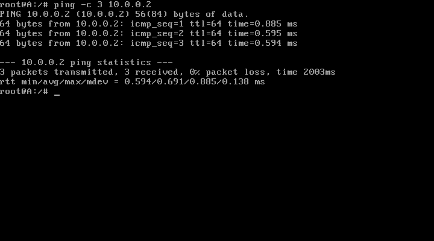
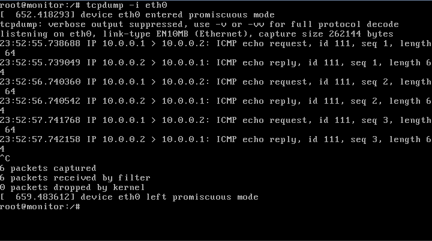

# Experiment Instrumentation

> How to instrument your experiment to capture and collect data

<a id="TOC_1."></a>

## Instrumentation

Now that we have covered a lot of details about how to create a virtualized network in minimega, it is helpful to take a step back and remind ourselves of why we want to do this in the first place.

Typically, we are trying to answer a question about that network. That question may be about the security of the network, or the dependability of some component of the system, or perhaps the system as a whole. Perhaps we want to test a new program in a safe way. Whatever it is, we need to be able to have a good degree of insight into our virtual testbed in order to make sound determinations about the system.

To do that, we need to easily deploy instrumentation to detect and gather data about our system. This module is about doing just that.

<a id="TOC_2."></a>

## Instrumentation Options

minimega has a number of built-in mechanisms for capturing and gathering data. There are also ways to deploy your own tools. We will cover some of the approaches in this module.

These include:

- Capture API
- Tap mirror API and associated analyses
- Other tools
- Command and control

Let's start with some of the built-in tools.

<a id="TOC_3."></a>

## Capture API - PCAP and Netflow

minimega includes a capture API that allows the user to capture both PCAP and Netflow across the network.

PCAPs contain a recording of every byte sent across the wire.

The syntax for PCAP capture is as follows:

```text
capture
capture <pcap,>
capture <pcap,> bridge <bridge> <filename>
capture <pcap,> vm <vm id or name> <interface index> <filename>
capture <pcap,> <delete,> <id or all>
```

To capture pcap on bridge 'foo' to file 'foo.pcap':

```text
capture pcap bridge foo foo.pcap
```

<a id="TOC_4."></a>

## PCAP

To capture pcap on VM 'foo' to file 'foo.pcap', using the 2nd interface on that VM:

```text
capture pcap vm foo 0 foo.pcap
```

When run without arguments, capture prints all running captures. To stop a capture, use the delete commands:

```text
capture pcap delete <id>
```

To stop all captures of a particular kind, replace id with "all". To stop all capture of all types, use "clear capture".

You can clear the capture state using

```text
clear capture pcap
```

<a id="TOC_5."></a>

## Netflow

Netflow summarizes the network traffic by ip address and quantity of traffic.
It can be:

- written to a socket or file
- compressed with gzip
- saved as a binary file or ascii

```text
capture
capture <netflow,>
capture <netflow,> <timeout,> [timeout]
capture <netflow,> <bridge,> <bridge>
capture <netflow,> <bridge,> <bridge> <file,> <filename>
capture <netflow,> <bridge,> <bridge> <file,> <filename> <raw,ascii> [gzip]
capture <netflow,> <bridge,> <bridge> <socket,> <tcp,udp> <hostname:port> <raw,ascii>
capture <netflow,> <delete,> <id or all>
```

<a id="TOC_6."></a>

## Netflow - Examples

To capture netflow data on bridge `mega_bridge` to a file in ascii mode and with gzip compression:

```text
capture netflow mega_bridge file foo.netflow ascii gzip
```

You can change the active flow timeout with:

```text
capture netflow mega_bridge timeout <timeout>
```

With `<timeout>` in seconds.

You can stop netflow captures with delete

```text
capture netflow delete <id>
```

You can clear the capture state using

```text
clear capture netflow
```

<a id="TOC_7."></a>

## Netflow Conversion

Minimega netflow when saved as a binary format can be converted to ascii using nfcat.

Binary

```text
$ bin/nfcat foo.nf > foo.ascii
```

Gzip

```text
$ bin/nfcat -gunzip foo.nf.gz > foo.ascii
```

<a id="TOC_8."></a>

## Tap Mirror API

Tap mirror mirrors packets that traverse the source tap to the destination tap.

This is useful in situations where you want to capture a lot of PCAP/Netflow data,
but do not want to coduct the capture on the same node as your experiment. Using
`tap mirror` you can allow VMs to passively inspect traffic from other VMs to
perform network monitoring.

Both taps should already exist. You can use taps for VMs from "vm info" or host
taps.

To mirror traffic that traverse mega_tapX to mega_tapY on the default bridge:

```text
tap mirror mega_tapX mega_tapY
```

<a id="TOC_9."></a>

##

Mirroring is also supported via vm names/interface indices. The VM interfaces
should already be on the same bridge. VMs must be colocated.

To delete a host tap, use the delete command and tap name from the tap list:

```text
tap delete <id>
```

To delete all host taps, use id all, or 'clear tap':

```text
tap delete all
```

Note: taps created while a namespace is active belong to that namespace and
will only be listed when that namespace is active (or no namespace is active).

Similarly, delete only applies to the taps in the active namespace. Unlike the
"vlans" API, taps with the same name cannot exist in different namespaces.

<a id="TOC_10."></a>

## Tap Mirror Example

We will use a simple environment to test the tap mirroring capability:

```minimega title="mirror_01.mm"
--8<-- "training/module11_content/mirror_01.mm"
```

[Download this example](module11_content/mirror_01.mm){ download="mirror_01.mm" }

<a id="TOC_11."></a>

## Tap Mirror Example (cont.)

```minimega title="mirror_02.mm"
--8<-- "training/module11_content/mirror_02.mm"
```

[Download this example](module11_content/mirror_02.mm){ download="mirror_02.mm" }

<a id="TOC_12."></a>

## Creating the mirror

The `tap mirror` API allows you to create a mirror between two existing taps.
In this case, we wish to mirror either A's or B's tap to monitor's tap:

```text
minimega$ .columns name,tap vm info
name    | tap
A       | [mega_tap0]
B       | [mega_tap1]
monitor | [mega_tap2]
```

The command to create the mirror is then:

```text
minimega$ tap mirror mega_tap0 mega_tap2
```

<a id="TOC_13."></a>

## Using the mirror

`eth0` on the monitor VM should now see all the traffic that traverses `mega_tap0`.



<a id="TOC_14."></a>

## Mirror results

We can confirm this by running `tcpdump -i eth0` on the monitor VM while pinging VM B from VM A:



<a id="TOC_15."></a>

## Third-party tools

One option for instrumention is to use a third-party tool that suits your needs.

For example, we can install tools like [Zeek](https://www.zeek.org/), either while our experiment is running, or we can 'bake in' the tool during the process of building the image.

minimega includes a tool called vmbetter that allows you to install programs in a number of ways (apt, dpkg, compiling directly, etc.) during the image creation process so that the vm is ready to go at launch.

See [module 2.5: better vmbetter](module02_5.md) for more details.

Once we have an image (kernel/initrd, for example) built with Zeek installed, we can launch the Zeek VM using the following minimega commands
(in place of the previous commands to launch the monitor):

```text
# create Zeek VM to monitor the network
disk create zeek.qcow2 10G
vm config net 0
vm config uuid 33333333-3333-3333-3333-333333333333
vm config kernel $images/zeek.kernel
vm config initrd $images/zeek.initrd
vm config snapshot false
vm config disk zeek.qcow2
vm launch kvm monitor
```

<a id="TOC_16."></a>

##

The Zeek VM will format and mount any provided disk to `/zeek` allowing users to extract the data after the experiment completes.

The VM must run with snapshot set to false so that any logs written to disk persist after the VM exits.

Each VM must have its own disk image. If a disk is not provided, `/zeek` is stored in memory and may cause the VM to run out of memory if there are too many log messages.

To extract files from the QCOW2 after the VM exits, users can run the following bash commands as root:

```text
$ modprobe nbd # if not already loaded
$ qemu-nbd -c /dev/nbd0 /path/to/zeek.qcow2
$ mount /dev/nbd0 /mnt
$ cp -a /mnt /path/to/dst/
$ umount /mnt
$ qemu-nbd -d /dev/nbd0
```

<a id="TOC_17."></a>

## Command and Control (cc)

minimega's command and control (cc) API provides a convenient way to deploy and run tools for capturing data.

It can also be leveraged for gathering the data produced.

The API provides ways to push and pull binaries and documents to any VM, regardless of which host it is running on.

Binaries can be blocking or run in the background.

For detail on using cc, please see [Module 07](module07.md)

<a id="TOC_18."></a>

## Next up…

[Module 12: VM Physics](module12.md)
